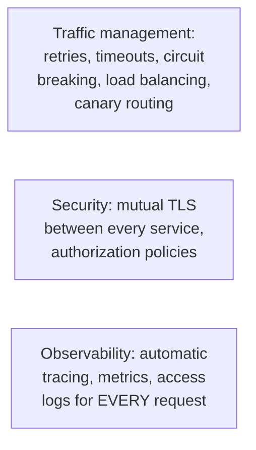
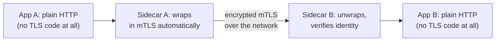

# Service Mesh — Middle

<!-- level-focus -->
At middle level, focus on this question:

> What specific categories of concerns does a mesh actually handle, and how
> do they map onto patterns covered elsewhere in this tree?

Prerequisite: [`junior.md`](junior.md).

---

## Three broad categories

| Category | What the mesh provides | Maps to |
|---|---|---|
| **Traffic management** | Retries with backoff, circuit breaking, timeouts, weighted traffic splitting for canary deploys | [Retry](../20-reliability-patterns/03-retry/README.md), [Circuit Breaker](../20-reliability-patterns/01-circuit-breaker/README.md) |
| **Security** | Automatic mutual TLS (mTLS) between every service-to-service call, without any application code managing certificates | Every service gets encrypted, authenticated communication by default, not opt-in per team |
| **Observability** | Every request automatically generates a trace span, latency metric, and access log, consistently formatted across every service | [Distributed Tracing](../distributed-tracing/README.md) |

## mTLS: automatic, application-transparent encryption

The mesh's control plane (covered in `professional.md`) automatically
issues and rotates short-lived certificates for every service identity,
and every sidecar-to-sidecar connection is automatically encrypted and
mutually authenticated — application code never touches a certificate or
a TLS library at all, yet every internal service-to-service call is
encrypted and identity-verified by default.

> 🎓 **Takeaway:** a service mesh isn't one feature — it's a bundle of
> traffic-management, security, and observability capabilities, all
> implemented once in the shared sidecar layer, giving every service the
> same baseline capabilities without per-team implementation effort.

## Test yourself

1. Why does mTLS provided by the mesh not require any TLS-related code in
   the application itself?
2. How does the mesh's traffic-management capability relate to the
   Circuit Breaker pattern covered elsewhere in this tree?
3. Why would automatic, consistent tracing across every service (via the
   mesh) be more reliable than each team manually instrumenting their own
   tracing calls?

Continue to [`senior.md`](senior.md).
