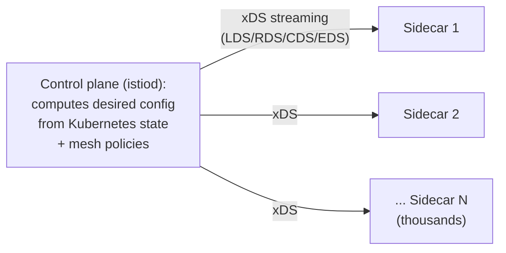
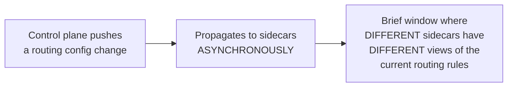

# Service Mesh — Professional

<!-- level-focus -->
At professional level, focus on this question:

> How does Envoy's xDS protocol let a control plane push configuration to
> thousands of sidecar proxies consistently, and what are the real
> operational limits of this design?

Prerequisite: [`senior.md`](senior.md).

---

## xDS: the discovery service protocol family

Envoy (the proxy implementation underlying Istio and most production
service meshes) doesn't read static configuration files — it continuously
**subscribes** to a set of discovery services collectively called
**xDS** (the "x" stands for the various specific types): **LDS** (Listener
Discovery Service — what ports/protocols to listen on), **RDS** (Route
Discovery Service — how to route requests), **CDS** (Cluster Discovery
Service — what upstream services exist), **EDS** (Endpoint Discovery
Service — which specific pod IPs currently back each service). The control
plane (Istio's `istiod`, most commonly) computes this configuration
centrally and **streams updates** to every subscribed Envoy proxy in
near-real-time — this is the mechanism that makes `middle.md`'s "every
sidecar consistently configured" property actually work at scale, rather
than requiring manual configuration file distribution.



## The eventual-consistency reality of xDS propagation

Because xDS updates propagate **asynchronously** to potentially thousands
of proxies, there's an inherent, real window where different sidecars
have **different** views of the current routing/endpoint configuration —
this is the same eventual-consistency trade-off from the BASE & Eventual
Consistency professional page, applied to mesh configuration specifically.
In practice: a newly-scaled-up pod might not receive traffic for a few
seconds until its IP propagates via EDS to every relevant sidecar, and a
canary traffic-split change might apply inconsistently across the fleet
for a brief window during rollout — production mesh operators must
understand this propagation lag as a real, bounded (but non-zero) delay,
not an instantaneous, atomic configuration change.



## Control plane scaling: the same coordination-service pattern

Istio's `istiod` itself must scale to serve xDS streams to every sidecar
in a large cluster — at sufficient scale, `istiod` instance count,
resource allocation, and xDS push batching/debouncing become real,
documented tuning concerns (Istio's own performance documentation covers
this explicitly), echoing the exact same "the coordination layer itself
needs capacity planning" lesson from the Coordination Services
professional page, just applied to mesh configuration distribution
instead of leader election/locking.

## Production checklist (staff-level)

1. **Understand xDS propagation lag as a real, bounded delay** for any
   mesh-dependent operation (canary rollouts, endpoint scaling) — design
   rollout procedures and monitoring with this lag explicitly in mind,
   rather than assuming instantaneous consistency.
2. **Monitor control-plane (istiod) health and xDS push latency as a
   first-class mesh metric**, treating it with the same operational rigor
   as a coordination service (etcd/ZooKeeper) — it's a comparable
   single-point-of-failure risk for the entire fleet's traffic behavior.
3. **Tune xDS push batching/debouncing settings for large clusters**
   rather than leaving defaults unexamined — this is a documented,
   real scaling concern for control planes serving thousands of sidecars.
4. **Weigh mesh adoption's cost/benefit explicitly per `senior.md`'s
   analysis**, revisiting the decision as the service fleet grows —
   the calculus can shift from "not worth it" to "clearly worth it" as
   organizational scale increases.
5. **In an incident review for mesh-related traffic anomalies, check for
   xDS propagation lag or control-plane health issues first**, before
   assuming an application-level bug — a surprising number of
   mesh-adjacent incidents trace back to control-plane/propagation issues
   rather than application misconfiguration.

## Cheat Sheet

```text
+------------------------------------------------------------------+
|                 SERVICE MESH — INTERNALS & SCALE                     |
+------------------------------------------------------------------+
| xDS protocol family (LDS/RDS/CDS/EDS): control plane (istiod)          |
| computes desired proxy config and STREAMS it to every sidecar in       |
| near-real-time - this is what makes consistent sidecar configuration  |
| work at scale, without manual file distribution                       |
+------------------------------------------------------------------+
| xDS propagation is ASYNCHRONOUS/eventually consistent - a real,        |
| bounded window exists where different sidecars have different          |
| views of routing/endpoint config (new pod scale-up delay, canary        |
| rollout inconsistency window) - design around this explicitly          |
+------------------------------------------------------------------+
| Control plane (istiod) itself needs capacity planning at scale -       |
| same "coordination layer needs its own scaling story" lesson as        |
| etcd/ZooKeeper, applied to mesh config distribution                    |
+------------------------------------------------------------------+
```

## Test yourself

1. Explain what LDS, RDS, CDS, and EDS each configure on an Envoy sidecar,
   and why splitting configuration into these separate discovery services
   (rather than one monolithic config push) is useful.
2. Why can a newly-scaled-up pod experience a brief delay before receiving
   traffic, even though it's already running and healthy?
3. Design the monitoring you'd put in place to detect xDS propagation lag
   becoming abnormally high in a large mesh deployment.

## Further Reading

- Envoy Proxy documentation — "xDS REST and gRPC protocol" (the full
  discovery service protocol specification).
- Istio documentation — "Istio Performance and Scalability" (istiod
  scaling, push batching/debouncing configuration).
- See also: [Coordination Services — professional](../18-concurrency-coordination/coordination-services/professional.md),
  [BASE & Eventual Consistency — professional](../../databases/transaction/base-and-eventual-consistency/professional.md).
