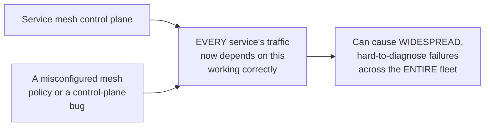
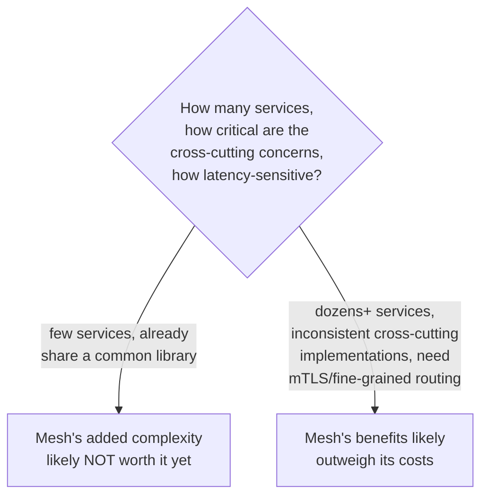

# Service Mesh — Senior

<!-- level-focus -->
At senior level, focus on this question:

> What does a service mesh actually cost every request, and when does that
> cost outweigh its benefits?

Prerequisite: [`middle.md`](middle.md).

---

## Every request now hops through two extra proxies

Without a mesh: `App A → Network → App B`. With a mesh:
`App A → Sidecar A → Network → Sidecar B → App B` — **two additional
network hops** (technically loopback/localhost hops to the sidecar, so
much cheaper than a real network hop, but not free) added to **every
single request** in the system. At high request volume or for
latency-sensitive workloads, this added latency (typically single-digit
milliseconds, but real and cumulative) and the additional CPU/memory
overhead of running a sidecar process per pod are genuine costs that must
be weighed against the mesh's benefits.

## Operational complexity: a new, critical piece of infrastructure

A service mesh becomes **critical, shared infrastructure** that every
service's traffic depends on — a misconfigured mTLS policy, a bad traffic-
routing rule pushed cluster-wide, or a control-plane bug can cause
widespread outages across services that otherwise have nothing to do with
each other, echoing the "shared coordination service as a single point of
failure" risk from the Coordination Services professional page, just for
network traffic instead of leader election/locking.

## When the cost isn't worth it

> 🎯 **Senior takeaway:** a service mesh is a genuine trade — real,
> quantifiable per-request latency/resource cost and real operational
> complexity, in exchange for consistency and capability across a large,
> heterogeneous service fleet. For a small number of services, or ones
> already sharing common libraries effectively, the mesh's overhead may
> exceed its benefit — this is a scale-dependent decision, not a
> universal best practice.

## Test yourself

1. Why is the added latency from sidecar hops usually small per-request
   but still a real, cumulative cost at high request volume?
2. Why does a service mesh's control plane become a critical single point
   of failure risk for the entire fleet, similar to a coordination
   service?
3. For an organization with 5 services that already share a common Java
   library for retries/circuit-breaking, would you recommend adopting a
   service mesh? Why or why not?

Continue to [`professional.md`](professional.md) to see how Envoy's xDS
protocol and control plane actually distribute configuration at scale.
