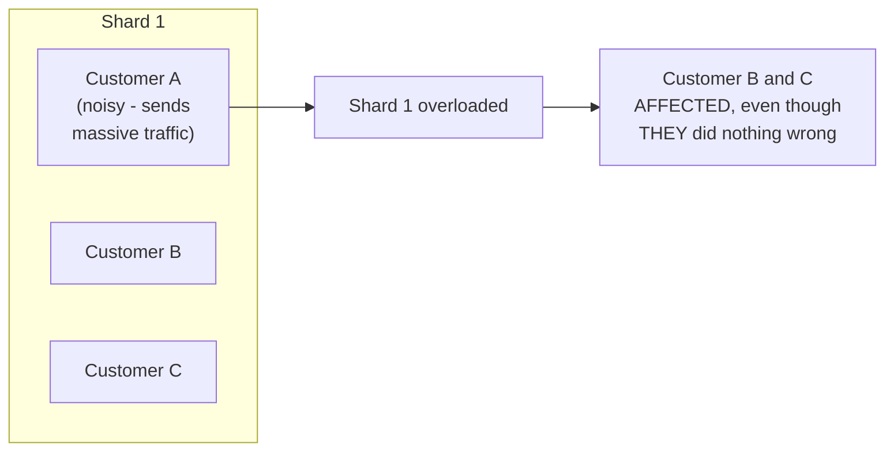
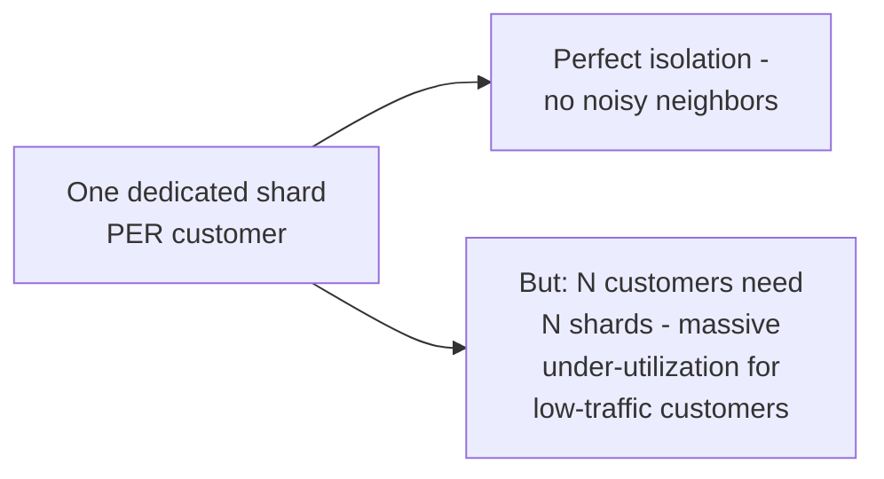

# Shuffle Sharding — Junior

<!-- level-focus -->
At junior level, focus on this question:

> Why does plain sharding still let one noisy customer affect other
> customers, even though the whole point of sharding was isolation?

---

## Plain sharding: many customers per shard

Recall from [Partitioning & Sharding](../../../databases/scaling/partitioning-and-sharding/README.md):
sharding distributes load across nodes, but **multiple customers still
share each individual shard**. If Customer A on Shard 1 sends
disproportionate traffic (a bug, a traffic spike, malicious behavior),
every **other** customer sharing that same shard suffers the consequences —
the classic **noisy neighbor** problem.

## The naive fix and its cost

The most obvious fix — give every customer their own **dedicated** shard —
provides perfect isolation but is wildly wasteful: most customers don't
generate enough traffic to justify an entire dedicated shard's capacity,
so you'd be paying for mostly-idle infrastructure at massive scale.

> 🎓 **Takeaway:** there's a real tension between "share shards for
> efficiency" (which reintroduces noisy neighbors) and "dedicate a shard
> per customer" (which is safe but wasteful). Shuffle sharding, covered
> next, is a clever middle ground that gets most of the isolation benefit
> without the dedicated-shard cost.

## Test yourself

1. Why does plain sharding fail to isolate customers from each other,
   even though it does distribute load across multiple physical nodes?
2. Why is "one dedicated shard per customer" wasteful for most real
   customer traffic distributions?
3. What would you want from a solution that avoids both plain sharding's
   noisy-neighbor risk and dedicated-sharding's waste?

Continue to [`middle.md`](middle.md).
