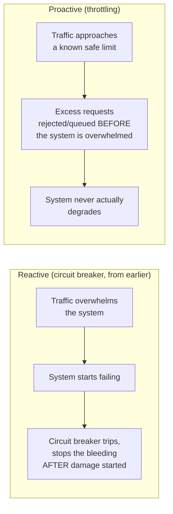

# Throttling — Junior

<!-- level-focus -->
At junior level, focus on this question:

> Why does limiting traffic proactively beat waiting for overload and
> reacting to it?

---

## Reactive vs. proactive protection



A [Circuit Breaker](../circuit-breaker/README.md) reacts once failures
are already happening. **Throttling** (rate limiting) prevents the
overload from occurring in the first place, by rejecting or queuing
requests once traffic exceeds a known-safe threshold — before the system
is ever pushed past its actual capacity.

## A simple example: an API rate limit

```http
HTTP/1.1 429 Too Many Requests
Retry-After: 60
X-RateLimit-Limit: 100
X-RateLimit-Remaining: 0
```

"100 requests per minute per API key" is a throttling policy — the server
enforces this **before** allowing a request through, rather than accepting
every request and only reacting once the backend is struggling.

> 🎓 **Takeaway:** throttling and circuit breaking are complementary, not
> competing — throttling tries to prevent overload from ever happening;
> circuit breaking is the safety net for when it happens anyway (a
> throttling misconfiguration, an unanticipated traffic pattern, a
> downstream dependency that's slow for unrelated reasons).

## Test yourself

1. Why is throttling considered "proactive" while a circuit breaker is
   "reactive" — what specifically differs about when each one acts?
2. Why would a system want both throttling AND circuit breakers, rather
   than just one?
3. What's the downside of throttling too aggressively — what happens to
   legitimate traffic that gets rejected unnecessarily?

Continue to [`middle.md`](middle.md).
