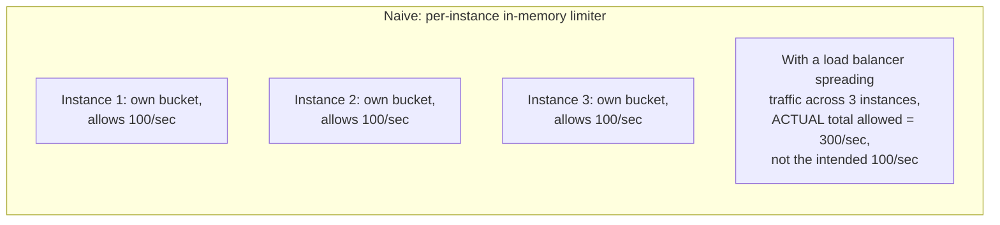
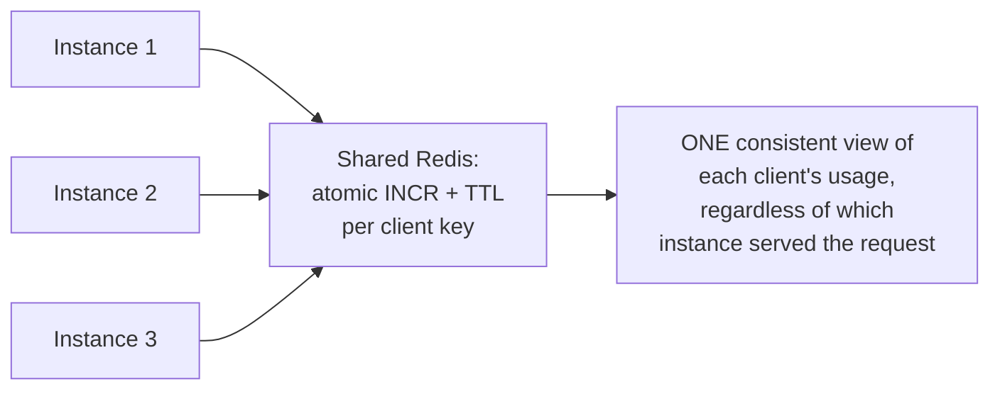
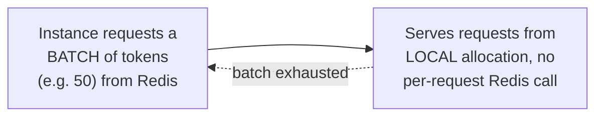

# Throttling — Professional

<!-- level-focus -->
At professional level, focus on this question:

> How do you enforce a consistent rate limit across many stateless service
> instances, when each instance's own in-memory token bucket has no idea
> what the others are doing?

Prerequisite: [`senior.md`](senior.md).

---

## The distributed rate-limiting problem



If each service instance enforces `middle.md`'s token bucket purely
in-memory, the **effective** system-wide rate limit becomes
`per-instance limit × number of instances` — not the intended limit at
all, and it silently changes every time you scale the instance count up or
down, which defeats the entire purpose of a stable, predictable rate limit.

## Centralized counting via a shared, fast store



```python
def is_allowed(client_id, limit=100, window_seconds=1):
    key = f"ratelimit:{client_id}:{int(time.time())}"
    count = redis.incr(key)
    redis.expire(key, window_seconds)
    return count <= limit
```

Every instance checks against a **shared** counter (Redis's atomic `INCR`,
which never races under concurrent increments — the same atomicity
guarantee from the Cache-Aside professional page's Redis internals
discussion) rather than its own local state — this restores the intended
global limit regardless of how many instances are serving traffic, at the
cost of an additional network round trip to Redis per request (or per
batch, with local pre-approval optimizations covered next).

## Reducing the per-request Redis round trip: local token pre-allocation

At very high request rates, a Redis round trip **per request** becomes a
meaningful latency and load cost. A common optimization: each instance
periodically requests a **batch** of tokens from the shared store (e.g.
"give me 50 tokens for the next second") and serves requests from this
local pre-allocation until it runs out, then requests another batch — this
trades a small amount of rate-limiting precision (the system can briefly,
slightly exceed the exact global limit if many instances' local batches
happen to still have unused tokens when traffic drops) for a dramatic
reduction in round trips to the shared counting store, echoing the same
batching-for-throughput principle from the Write-Behind professional page.



## Production checklist (staff-level)

1. **Never rely on per-instance in-memory rate limiting for a system-wide
   guarantee** — the effective limit silently scales with instance count,
   which is almost never the intended behavior.
2. **Use an atomic, shared counting mechanism (Redis `INCR` with TTL, or
   equivalent) as the source of truth** for any rate limit that must hold
   regardless of instance count or which instance serves a given request.
3. **Adopt local batch pre-allocation for high-request-rate systems** where
   a per-request round trip to the shared store would itself become a
   bottleneck — explicitly accept the resulting small precision trade-off
   as a deliberate choice, not an unconsidered side effect.
4. **Design per-client/per-tenant rate-limiting keys (`senior.md`) with the
   distributed counting mechanism in mind** — the shared store's key
   design directly determines the granularity and correctness of fairness
   enforcement across the whole fleet.
5. **In a design review for a new rate-limited API, require an explicit
   answer for "does this limit hold correctly regardless of how many
   instances are running,"** before approving — this is the single most
   common gap between a rate limit that looks correct in a single-instance
   test and one that actually works in production.

## Cheat Sheet

```text
+------------------------------------------------------------------+
|                   THROTTLING — INTERNALS & SCALE                    |
+------------------------------------------------------------------+
| Per-instance in-memory rate limiting is WRONG at scale: effective       |
| system-wide limit = per-instance limit x instance count, silently       |
| changing as you scale instances up/down                               |
+------------------------------------------------------------------+
| Fix: SHARED atomic counter (Redis INCR + TTL) - one consistent          |
| view of usage regardless of which instance serves each request         |
+------------------------------------------------------------------+
| High-request-rate optimization: LOCAL BATCH PRE-ALLOCATION - each       |
| instance requests a batch of tokens from the shared store, serves       |
| locally until exhausted - trades small precision loss for              |
| dramatically fewer round trips, same principle as write batching        |
+------------------------------------------------------------------+
```

## Test yourself

1. Why does a per-instance in-memory token bucket produce an effective
   rate limit that scales with instance count, rather than the intended
   fixed limit?
2. Why does Redis's atomic `INCR` avoid the race condition that a naive
   "read count, check, increment" sequence would have under concurrent
   requests from multiple instances?
3. Design the batch pre-allocation parameters (batch size, refresh
   frequency) for a system serving 50,000 requests/second across 100
   instances, with an intended global limit of 45,000 requests/second.

## Further Reading

- Redis documentation — "INCR" (atomicity guarantees) and rate-limiting
  patterns using Redis.
- Stripe Engineering Blog — "Scaling your API with rate limiters" (a
  detailed, real production discussion of token bucket, distributed
  counting, and fairness).
- See also: [Cache-Aside — professional](../../../databases/operation/caching/cache-aside/professional.md)
  (Redis internals), [Write-Behind — professional](../../17-background-jobs/returning-results/professional.md).
