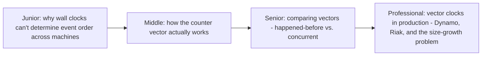
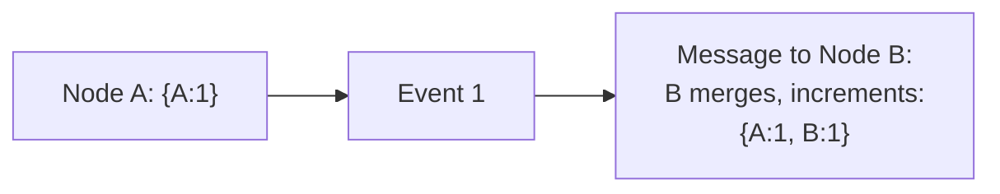

# Vector Clock

> Wall clocks can't reliably tell you which of two events on different
> machines happened first — a vector clock uses per-node counters to
> determine causal order (or detect true concurrency) without needing
> synchronized clocks at all.

## Choose a level

| Level | Guide | You are done when |
|---|---|---|
| Junior | [Why wall clocks fail across machines](junior.md) | You can explain why comparing timestamps from two different machines can't reliably determine event order. |
| Middle | [The counter vector mechanism](middle.md) | You can trace a vector clock being incremented and merged across a message exchange. |
| Senior | [Happened-before vs. concurrent](senior.md) | You can compare two vector clocks and determine their causal relationship. |
| Professional | [Vector clocks in production](professional.md) | You can explain the size-growth problem in real systems (Dynamo/Riak) and how production systems mitigate it. |

## Practice rule

For any distributed system tracking "which write happened first" across
multiple nodes, ask: "am I comparing wall-clock timestamps from different
machines to make this decision?" If yes, you're relying on an assumption
(synchronized clocks) that's often wrong in practice — a vector clock (or
its production variants) is the alternative that doesn't need it.

## Related

- [BASE & Eventual Consistency](../../databases/transaction/base-and-eventual-consistency/README.md)
- [NoSQL Modeling](../../databases/data-modeling/nosql-modeling/README.md)
