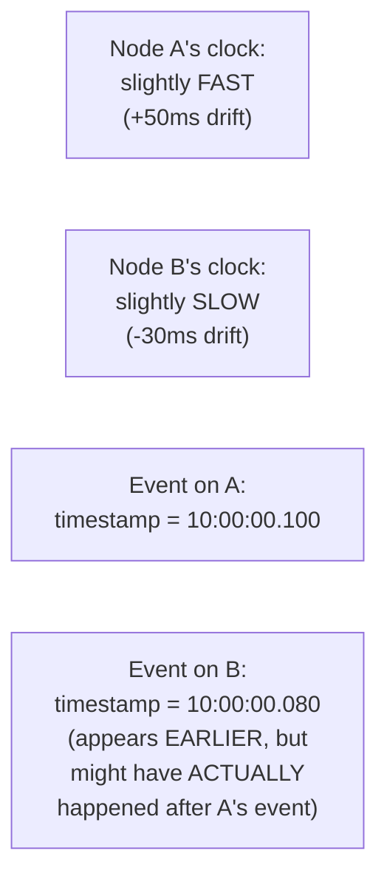
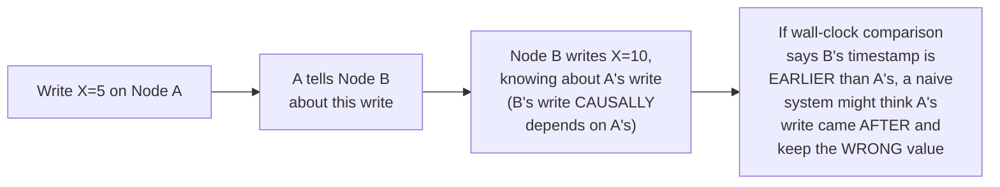

# Vector Clock — Junior

<!-- level-focus -->
At junior level, focus on this question:

> Why can't you reliably determine which of two events happened first by
> comparing timestamps from two different machines?

---

## Clock skew: every machine's clock is slightly wrong

Every machine's clock drifts from "true" time by some small, variable
amount — even with NTP (Network Time Protocol) synchronization, clocks
across different machines are never perfectly aligned, and drift can be
tens of milliseconds or more under normal conditions, worse during network
issues. If Event A's real-world happening was **caused by** (came after)
Event B, but A's clock happens to be running fast and B's happens to be
running slow, comparing their timestamps can give you the **wrong**
answer about which actually happened first.

## Why this matters for causality, not just ordering

The stakes aren't just "which happened first" in an abstract sense — it's
determining **causal dependency**: did one write happen *because of*
information from another, such that getting the order wrong means
discarding the causally-later, more-informed write in favor of an earlier
one. A **vector clock** solves this without needing synchronized wall
clocks at all — it tracks causality using nothing but per-node counters
exchanged during communication.

> 🎓 **Takeaway:** wall-clock timestamps compare **when** something
> happened according to potentially-inaccurate local clocks. A vector
> clock instead tracks **what each node knew about, and when it learned
> it** — a fundamentally different, clock-independent basis for
> determining causal order.

## Test yourself

1. Why doesn't NTP synchronization fully eliminate the clock-skew problem
   for this use case?
2. Walk through the "wrong order" scenario above — why does relying on
   wall-clock comparison risk keeping the wrong write?
3. What does "causal dependency" mean in this context, and why is it a
   different (and more useful) question than "which happened at an
   earlier wall-clock time"?

Continue to [`middle.md`](middle.md).
