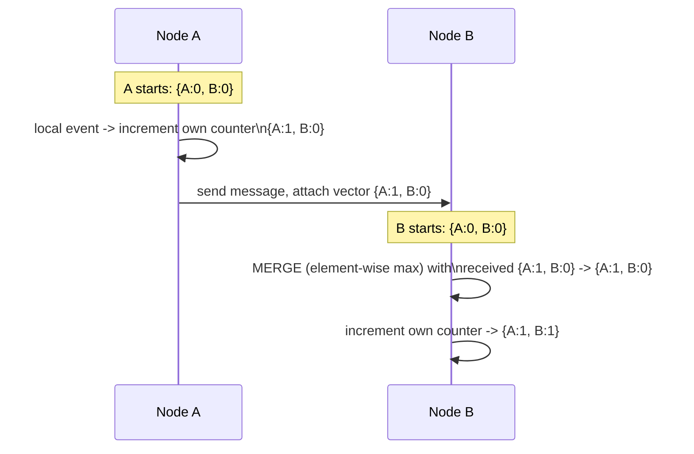
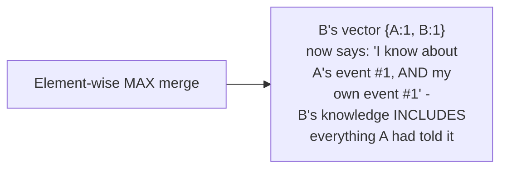

# Vector Clock — Middle

<!-- level-focus -->
At middle level, focus on this question:

> How does the counter-per-node mechanism actually track causality as
> messages are exchanged?

Prerequisite: [`junior.md`](junior.md).

---

## The mechanism: one counter per node, incremented and merged

Every node maintains a **vector** — one counter per node in the system
(including itself). Two rules:

1. **On any local event**, a node increments **its own** counter in the
   vector.
2. **On receiving a message**, a node merges the sender's vector into its
   own by taking the **element-wise maximum**, then increments its own
   counter.



## Why the merge step matters



The element-wise maximum merge means a node's vector clock always
reflects the **union of everything it has directly or transitively
learned about** — B's vector `{A:1, B:1}` records that B's current state
causally **depends on** A having reached its own counter value of 1,
because that information was explicitly passed to B in the message.

```python
class VectorClock:
    def __init__(self, node_id, all_nodes):
        self.node_id = node_id
        self.counters = {n: 0 for n in all_nodes}

    def local_event(self):
        self.counters[self.node_id] += 1

    def merge_and_increment(self, received_vector):
        for node, count in received_vector.items():
            self.counters[node] = max(self.counters[node], count)
        self.counters[self.node_id] += 1
```

> 🎓 **Takeaway:** a vector clock's counters aren't measuring time at
> all — they're measuring "how much of each node's history do I know
> about, directly or through chains of messages." This is exactly the
> information needed to reconstruct causal dependency without any clock
> synchronization whatsoever.

## Test yourself

1. Why does the merge step use the element-wise **maximum**, rather than
   simply adding the two vectors together?
2. Trace what happens if Node C receives a message from Node B (which
   already merged from A) — what does C's resulting vector tell you about
   what C now knows?
3. Why does a node still increment its own counter even after merging in
   a received vector, rather than just adopting the merged result as-is?

Continue to [`senior.md`](senior.md).
