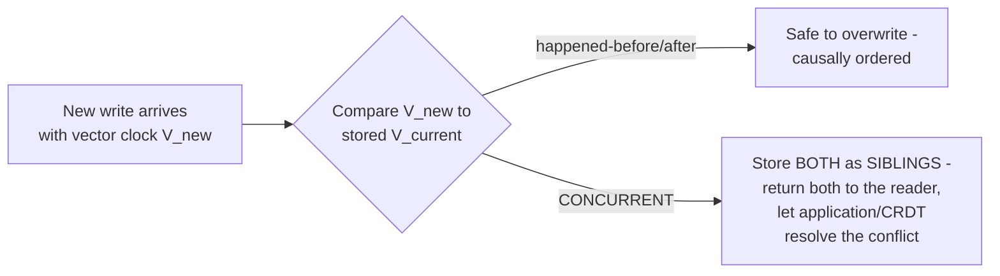
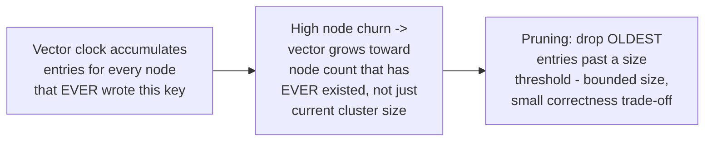

# Vector Clock — Professional

<!-- level-focus -->
At professional level, focus on this question:

> How do production systems (Dynamo, Riak) actually use vector clocks for
> conflict detection, and how do they manage the documented vector-size-
> growth problem at scale?

Prerequisite: [`senior.md`](senior.md).

---

## Dynamo's use: siblings, not silent overwrites

Amazon's Dynamo (referenced throughout the NoSQL Modeling and BASE &
Eventual Consistency professional pages) attaches a vector clock to every
stored value. On a write, if the incoming vector clock's causal
relationship to the currently stored value is "happened-before"
(`senior.md`'s first case), Dynamo can safely overwrite — the new write
is causally newer. But if the comparison yields **"concurrent"**, Dynamo
does **not** silently pick a winner — it stores **both** versions as
**sibling** values and returns both to the next reader, explicitly pushing
the conflict-resolution decision to the application (or, in later systems,
to CRDT-based merge logic) rather than making an arbitrary, potentially
data-losing choice itself.



## The documented size-growth problem

Dynamo's own paper explicitly identifies a real, acknowledged limitation:
a vector clock's size grows with the number of **distinct nodes that have
ever written** to a given key — in a system with high node churn
(frequent scaling events, node replacement), a heavily-written key's
vector clock can accumulate entries for many long-departed nodes,
growing unboundedly and adding real metadata overhead to every stored
value. The paper's own proposed mitigation: a **pruning** strategy —
periodically drop the **oldest** vector-clock entries (by timestamp,
attached to each entry specifically for this purpose) once the vector
exceeds a configured size threshold, trading a small, bounded risk of
incorrectly treating a very old write as "not causally related" for
bounded, predictable metadata size.



## Riak's dotted version vectors: a refinement avoiding sibling explosion

Riak (a Dynamo-inspired production database) identified a further, more
subtle problem: naive vector-clock-based conflict detection combined with
Dynamo-style sibling storage can produce **sibling explosion** — repeated
concurrent writes to the same key can accumulate an ever-growing number of
unreconciled sibling versions if clients don't promptly read-and-resolve
them. Riak's **dotted version vectors** (a refinement developed
specifically for this production system) attach a more precise
per-write "dot" (a `{node, counter}` pair unique to each individual write)
alongside the vector clock, letting the system more precisely determine
which siblings are truly still-unresolved concurrent writes versus which
have already been superseded — directly reducing unnecessary sibling
accumulation compared to plain vector clocks, a concrete, documented
production refinement built specifically to solve a real operational pain
point.

## Production checklist (staff-level)

1. **Never silently pick a winner for concurrent writes detected via
   vector clock comparison** — surface both (or all) concurrent versions
   to the application or a well-defined CRDT merge function, per Dynamo's
   documented approach, rather than an arbitrary, potentially data-losing
   choice.
2. **Configure and monitor vector-clock pruning explicitly** for any
   system exposed to meaningful node churn — understand and accept the
   correctness trade-off (very old writes may be incorrectly treated as
   unrelated) rather than leaving it as an unconsidered default.
3. **Prefer a dotted-version-vector-based implementation (or an
   equivalent refinement) over naive vector clocks** if your system is
   exposed to high write concurrency on the same keys — plain vector
   clocks are documented to risk sibling explosion under this pattern.
4. **Ensure clients/application code promptly resolve returned siblings**
   rather than re-writing without resolving — an application that ignores
   siblings and blindly writes a new value on top compounds the
   sibling-explosion risk rather than reducing it.
5. **In a design review for a new distributed data store's conflict-
   resolution strategy, require an explicit answer for vector-clock (or
   equivalent) size management** — this is a documented, real operational
   concern (per Dynamo's own paper), not a theoretical edge case to defer
   indefinitely.

## Cheat Sheet

```text
+------------------------------------------------------------------+
|                VECTOR CLOCK — INTERNALS & SCALE                     |
+------------------------------------------------------------------+
| Dynamo: vector clock comparison determines overwrite-safe vs.          |
| CONCURRENT. Concurrent writes are stored as SIBLINGS, returned to       |
| the reader/application for resolution - NEVER silently overwritten     |
+------------------------------------------------------------------+
| Documented size-growth problem: vector size grows with the number      |
| of DISTINCT NODES THAT EVER WROTE a key, not current cluster size -    |
| high node churn -> unbounded growth. Dynamo's mitigation: PRUNING       |
| (drop oldest entries past a threshold, bounded correctness trade-off) |
+------------------------------------------------------------------+
| Riak's DOTTED VERSION VECTORS: per-write "dot" ({node, counter})        |
| alongside the vector clock - more precisely distinguishes truly-        |
| unresolved concurrent siblings from superseded ones, reducing           |
| SIBLING EXPLOSION under high write concurrency - a real production     |
| refinement built to solve a documented operational pain point          |
+------------------------------------------------------------------+
```

## Test yourself

1. Why does Dynamo store both versions as siblings instead of picking a
   winner when vector clock comparison returns "concurrent"?
2. Explain the vector-clock pruning trade-off — what correctness property
   is given up, and why is it considered acceptable in practice?
3. Why do dotted version vectors specifically address sibling explosion,
   in a way that plain vector clocks with pruning alone do not?

## Further Reading

- DeCandia et al. — "Dynamo: Amazon's Highly Available Key-value Store"
  (the original paper, including the documented pruning strategy for
  vector clock size).
- Preguiça, Baquero, Shapiro — "Dotted Version Vectors: Logical Clocks
  for Optimistic Replication" (the Riak-adopted refinement).
- Fidge / Mattern — the original independent papers introducing vector
  clocks (1988).
- See also: [BASE & Eventual Consistency — senior/professional](../../databases/transaction/base-and-eventual-consistency/senior.md),
  [NoSQL Modeling — professional](../../databases/data-modeling/nosql-modeling/professional.md).
