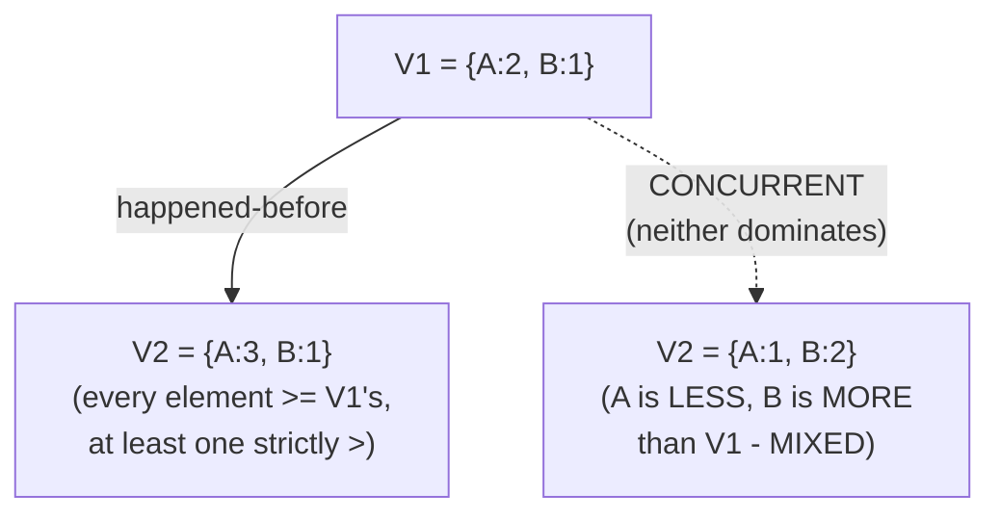
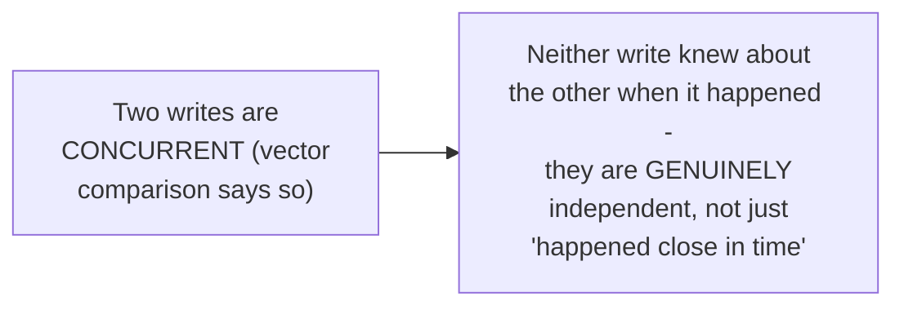

# Vector Clock — Senior

<!-- level-focus -->
At senior level, focus on this question:

> Given two vector clocks, how do you determine whether one happened
> strictly before the other, or whether they're truly concurrent?

Prerequisite: [`middle.md`](middle.md).

---

## The comparison rules

Given two vectors `V1` and `V2`:

- **`V1` happened-before `V2`** if every element of `V1` is `≤` the
  corresponding element of `V2`, **and** at least one element is strictly
  `<`.
- **`V1` and `V2` are concurrent** if neither happened-before the other —
  meaning some elements of `V1` are greater and some are less than the
  corresponding elements of `V2`.



```python
def compare(v1, v2):
    less_or_equal = all(v1[n] <= v2[n] for n in v1)
    strictly_less_somewhere = any(v1[n] < v2[n] for n in v1)
    if less_or_equal and strictly_less_somewhere:
        return "v1 happened-before v2"

    v1_greater_or_equal = all(v1[n] >= v2[n] for n in v1)
    strictly_greater_somewhere = any(v1[n] > v2[n] for n in v1)
    if v1_greater_or_equal and strictly_greater_somewhere:
        return "v2 happened-before v1"

    return "concurrent"  # neither dominates the other
```

## Why "concurrent" is a real, meaningful third answer



Unlike wall-clock comparison (which always produces *some* answer, even a
meaningless one for events that had no causal relationship), vector clock
comparison can correctly say **"these two events are concurrent"** — a
precise, meaningful statement that neither event's originator had any
knowledge of the other when it acted. This is exactly the signal a
distributed data store needs to detect a genuine **write conflict**
(see [BASE & Eventual Consistency — senior](../../databases/transaction/11-base-and-eventual-consistency/senior.md)):
two concurrent writes to the same key must be reconciled (LWW, application-
level merge, or a CRDT), because neither can claim to have "come after"
the other in any meaningful sense.

> 🎯 **Senior takeaway:** vector clocks don't just fix wall-clock
> comparison's *accuracy* problem — they add a genuinely new capability:
> correctly identifying when two events have **no causal relationship at
> all**, which a total-ordering mechanism (any clock, logical or physical)
> cannot express, because a total order always puts one event "before"
> the other even when that's not a meaningful or true statement about
> their relationship.

## Test yourself

1. Given `V1 = {A:2, B:3, C:1}` and `V2 = {A:2, B:3, C:2}`, is one
   happened-before the other, and if so which? Justify it using the
   comparison rule.
2. Given `V1 = {A:2, B:1}` and `V2 = {A:1, B:2}`, why are these
   concurrent, and what does that concretely mean about the two events
   they represent?
3. Why is "concurrent" a capability that a single logical counter
   (a Lamport clock, which produces a total order) cannot express, while
   a vector clock can?

Continue to [`professional.md`](professional.md) to see how production
systems (Dynamo, Riak) use vector clocks and manage their size-growth
problem.
