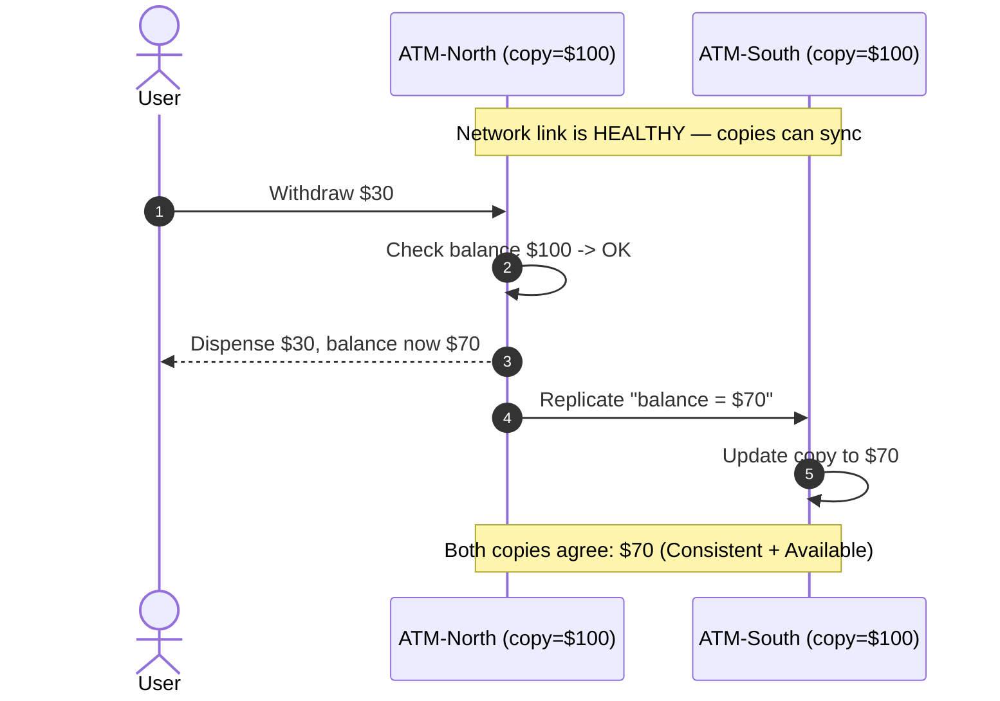
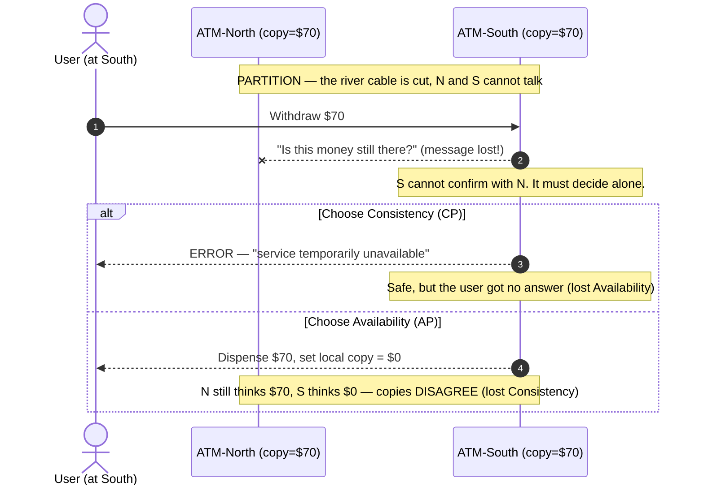

# CAP Theorem — Junior

<!-- level-focus -->
At junior level, focus on this question:

> How can I apply **CAP Theorem** in one small example and prove the result?

Use the smallest realistic scenario that exposes the decision and its failure behavior.
The CAP theorem is one of the first "laws of nature" you meet when you stop building one
program on one computer and start building a **system spread across many computers**. It does
not tell you how to write code. Instead, it tells you which guarantees are *impossible to keep
at the same time* once the network between your machines misbehaves — which, in the real world,
it always eventually does.

This page builds correct intuition with concrete stories. No proofs, no heavy math. By the end
you should be able to look at a feature ("a bank balance", "a like counter") and say, in plain
words, *which guarantee that feature should give up first* when the network breaks.

## 1. Why a single computer hides the whole problem

When your whole application runs on **one machine** — one process, one database, one disk — most
of CAP simply does not apply, and that is exactly why it feels surprising the first time you hit
it. On a single machine:

- There is only **one copy** of each piece of data, so there is no "which copy is right?"
  question. Whatever the database last wrote is *the* truth.
- A read happens after a write in a single, clear order. If you save `balance = 100` and then
  read `balance`, you get `100`. Always.
- There is no "network between nodes" to break, because there are no other nodes.

The moment you add a **second machine** that also holds a copy of the data — a read replica, a
second region for users on the other side of the world, a backup that must stay in sync — you
have introduced a network *inside* your system. Now every fact lives in more than one place, and
those places talk to each other over wires, switches, and routers that can be slow, can drop
messages, or can be cut entirely.

CAP is the set of rules about what happens to your guarantees the instant that internal network
stops being perfect. So before anything else, hold this picture in your head:

> CAP is only interesting because **data is replicated across machines that communicate over an
> unreliable network.** Remove the replication or remove the network, and CAP relaxes.

We replicate data on purpose, for very good reasons:

| Reason to replicate | What it buys you | The CAP cost it introduces |
|---|---|---|
| Survive a machine dying | If one node burns, another still has the data | Copies can disagree |
| Serve users closer to them | Lower latency for a global audience | Updates take time to travel between regions |
| Handle more read traffic | Many replicas answer reads in parallel | A replica might answer with stale data |
| Maintenance without downtime | Take one node offline, others keep serving | The offline node misses updates |

Every one of those benefits is real, and every one of them creates the possibility that two
copies of the same data temporarily disagree. CAP is the language we use to reason about that.

---

## 2. The three letters: C, A, and P

CAP stands for three properties a distributed system might try to provide. Read each definition
slowly — the precise wording is where the whole topic lives.

### C — Consistency

**Every read sees the latest write.**

If a write of `balance = 90` has completed, then *any* read that happens afterward — no matter
which node answers it — must return `90`, never the old `100`. The system behaves as if there
were a single, up-to-date copy of the data, even though physically there are many copies.

A quick mental test for consistency: *"If I write a value and then immediately read it from a
different node, am I guaranteed to see what I just wrote?"* If yes, the system is consistent in
the CAP sense.

> Note: the "C" in CAP is **not** the "C" (Consistency) in a database's ACID transactions. ACID's
> C is about not breaking your own rules and constraints. CAP's C is specifically about *all
> copies agreeing on the most recent value*. People confuse these constantly; keep them separate.

### A — Availability

**Every request gets a non-error response — without waiting forever.**

If a node is up and you send it a request, it answers. It does not reply with "sorry, try again
later," and it does not hang indefinitely. The answer it gives might be slightly out of date, but
it *gives an answer*. Availability is about the system always being willing to respond.

A quick mental test for availability: *"If I send a request to any working node, will I always
get a real answer back (not an error, not an infinite wait)?"* If yes, the system is available.

### P — Partition tolerance

**The system keeps working even when messages between nodes are dropped or delayed.**

A **network partition** is when the link between groups of nodes breaks: messages sent from one
side to the other are lost or arrive far too late. The two sides are still alive and still
receiving user requests — they just cannot talk to *each other*. Partition tolerance means the
system as a whole does not simply collapse when this happens; each side continues to function in
some way.

A quick mental test for partition tolerance: *"If the cable between two halves of my system is
cut, does the system keep running at all?"* If it can keep running, it is partition tolerant.

### Putting the three side by side

| Property | One-line meaning | The promise it makes | The question it answers |
|---|---|---|---|
| **Consistency (C)** | Reads always reflect the latest write | "You will never see stale data" | *Is what I read the truth right now?* |
| **Availability (A)** | Every request gets a non-error response | "You will always get an answer" | *Will the system respond to me?* |
| **Partition tolerance (P)** | Works despite dropped/delayed inter-node messages | "A broken network won't kill us" | *Do we survive a network split?* |

Notice these are three *different kinds* of promise. Consistency is about the **correctness** of
the answer. Availability is about **getting** an answer. Partition tolerance is about **surviving
a broken network**. CAP is the claim that you cannot fully keep all three promises at the same
moment.

---

## 3. The famous "pick 2 of 3" framing

The classic, catchy version of CAP says:

> "Consistency, Availability, Partition tolerance — **pick any two.**"

This framing made the idea memorable, and you will hear it in interviews and blog posts forever.
The intuition behind it is real: there is genuine tension between these three, and you cannot
have all three perfectly. So far, so good.

But "pick two" suggests a *menu* where all three combinations are equally reasonable choices:

- C + A (consistent and available, give up partition tolerance)
- C + P (consistent and partition tolerant, give up availability)
- A + P (available and partition tolerant, give up consistency)

The problem is that the first option, **C + A**, is a trap. It sounds fine on the menu, but in a
real distributed system you do not actually get to choose it. To see why, we need the correction
that every experienced engineer applies to CAP.

---

## 4. The correction every senior engineer makes

Here is the single most important sentence on this page:

> **In any real distributed system, network partitions WILL happen. So P is not something you
> choose — it is something reality forces on you.**

Networks are built from physical things: cables get unplugged, switches reboot, a fiber line gets
cut by a construction crew, a cloud region briefly loses connectivity, a router drops packets
under load. Over a long enough time, the link between your nodes *will* fail at least
momentarily. You cannot buy your way out of this; you can only make it rarer.

If partitions are a fact of life, then "give up P" is not a real strategy. A system that "gives
up P" does not magically prevent partitions — it just has no plan for them, and when one happens,
it breaks in an uncontrolled, ugly way.

So the menu collapses. Since you must keep **P**, the only real decision is what to do **during**
a partition, and that decision is:

> **When the network splits, do you sacrifice Consistency or do you sacrifice Availability?**

That is the entire practical heart of CAP. Everything else is detail. CAP is not "pick 2 of 3";
it is **"when a partition happens, pick C or A."**

When everything is healthy (no partition), you can have *both* strong consistency and high
availability at once — there is no conflict, because all nodes can talk and agree quickly. The
trade-off only *bites* during a partition. That is why people say CAP is "a choice you make for
the bad day, not the good day."

---

## 5. A partition story: two ATMs on a cut network

Abstract definitions slide off the brain. Let's make CAP physical with a story you can picture.

Imagine a small bank with one customer account: **Account #42, balance $100.** The bank runs two
ATMs:

- **ATM-North**, in the city center.
- **ATM-South**, across the river in the suburbs.

Both ATMs need to know the balance, so each keeps a copy and they normally sync over a network
link that runs under the river. As long as that link works, the two ATMs always agree.

### Before: the network is healthy

The customer walks up to ATM-North and withdraws $30.

1. ATM-North checks: balance is $100, plenty.
2. It dispenses $30 and sets the balance to $70.
3. It tells ATM-South over the link: "balance is now $70."
4. ATM-South updates its copy to $70.

Now both ATMs agree: $70. The system is **consistent** (both copies match the latest write) and
**available** (both machines answer requests). Easy. This is the "good day."

### During: the river cable is cut

A construction crew slices the fiber under the river. ATM-North and ATM-South are both still
powered on, both still serving customers — but they **cannot talk to each other.** This is a
network partition. The two ATMs now each have their own copy showing $70, with no way to
coordinate.

Now the customer — or a sneaky second person who shares the account — walks up to **ATM-South**
and tries to withdraw the remaining $70. ATM-South faces a dilemma it cannot escape, because it
cannot reach ATM-North to confirm whether that money is still there:

- **Option C (favor Consistency):** ATM-South *refuses* the withdrawal. "I can't reach the rest
  of the bank right now, so I won't risk handing out money that might already be gone." The
  balance stays correct everywhere, but the customer got an **error / no service**. The system
  chose to be **consistent but not available**.

- **Option A (favor Availability):** ATM-South *allows* the withdrawal. It dispenses $70 and sets
  *its own copy* to $0. The customer got served, but now ATM-North still thinks the balance is
  $70 while ATM-South thinks it is $0. The copies **disagree**. The system chose to be
  **available but not consistent.**

There is no third door. While the cable is cut, ATM-South must either say "no" (lose A) or say
"yes" and risk being wrong (lose C). That is CAP, in your hands, in cash.

### After: the cable is repaired

Eventually the fiber is fixed and the link comes back. What happens next depends on which option
the bank chose during the partition:

- If it chose **Option C**, there is nothing to clean up. No risky action was taken, so both
  copies are still in agreement. The bank simply resumes normal service. The cost was paid as
  *refused withdrawals* during the outage.

- If it chose **Option A**, there is now a **conflict to reconcile.** ATM-North says $70,
  ATM-South says $0, and the bank must decide what really happened. Maybe the customer
  legitimately withdrew the money — or maybe the same $70 was also handed out by ATM-North to
  *another* withdrawal during the split, meaning the account went $70 into the red and the bank
  *lost real money*. The cost was paid as *cleanup, possible overdraft, and possible loss* after
  the outage.

This is why banks lean toward **C** for money: a refused, retryable transaction is annoying but
safe; a double-spend is a real financial loss. We will return to this in section 8.

---

## 6. Staged diagrams: before, during, and after a partition

The ATM story as a sequence, staged across the three phases. Read the autonumbered steps in
order.

### Stage 1 — Before: healthy, both consistent and available



### Stage 2 — During: the partition forces a choice



### Stage 3 — After: heal and (maybe) reconcile

```mermaid
sequenceDiagram
    autonumber
    participant N as ATM-North
    participant S as ATM-South
    Note over N,S: Cable repaired — link is back
    alt If we chose Consistency earlier
        N->>S: Resume normal sync
        Note over N,S: Nothing to fix — copies were never allowed to diverge
    else If we chose Availability earlier
        S->>N: "I dispensed $70, my copy is $0"
        N->>N: Detect conflict ($70 vs $0)
        N->>S: Reconcile — merge / resolve / possibly flag overdraft
        Note over N,S: Cleanup needed; in the worst case real money was lost
    end
```

Three takeaways from the staged view:

1. The trade-off is **invisible during Stage 1.** A healthy system looks like it has C *and* A.
   Beginners often demo their system on a good network, see both, and wrongly conclude CAP
   doesn't apply to them.
2. The trade-off **appears only in Stage 2**, the partition. That is the moment the system
   designer's earlier decision (CP or AP) actually executes.
3. The **bill for an AP choice arrives in Stage 3**, as reconciliation work. AP doesn't make the
   problem disappear; it *defers* it from "refuse now" to "fix up later."

---

## 7. CP vs AP: choosing a side during a partition

Because P is mandatory, real distributed systems are usually described as **CP** or **AP** — what
they preserve when a partition strikes.

### CP — Consistency over Availability

A **CP** system, during a partition, would rather **return an error or block** than risk handing
out a wrong (stale or conflicting) answer. It keeps every copy in agreement at the cost of
sometimes saying "I can't serve you right now."

- *During a partition:* the side that cannot confirm it has the latest data **stops answering**
  (for the affected data).
- *You get:* answers that are always correct, but not always *available*.
- *Good for:* money, inventory counts, unique-username signup, anything where a wrong answer is
  worse than no answer.

### AP — Availability over Consistency

An **AP** system, during a partition, would rather **always answer** — even if its copy might be
slightly out of date or might later conflict with another node. It stays up everywhere at the
cost of letting copies temporarily disagree.

- *During a partition:* every side keeps answering from its own local copy.
- *You get:* an answer every time, but it might be stale, and copies must be reconciled later.
- *Good for:* like counts, view counts, social feeds, shopping-cart contents, anything where a
  slightly-off-then-corrected answer is perfectly acceptable.

### Side by side

| Question | CP system | AP system |
|---|---|---|
| During a partition, a node that's unsure... | refuses / blocks the request | answers from its local copy anyway |
| Can two copies temporarily disagree? | No | Yes |
| What does the user experience on the bad day? | errors or timeouts (for some data) | always an answer, maybe stale |
| Cleanup needed after healing? | none | yes — reconcile divergent copies |
| Worst-case failure mode | unavailable when you needed it | served wrong/old data |
| Natural fit | money, bookings, counters that must be exact | feeds, likes, presence, caches |

A useful slogan: **CP would rather be *silent* than *wrong*. AP would rather be *wrong* than
*silent*.** Neither is "better" — it depends entirely on what your feature can tolerate.

---

## 8. A bank vs a like counter

The clearest way to feel CP vs AP is to put two very different features next to each other and
ask: *on the bad day, which guarantee would this feature rather keep?*

### The bank account — favor C (CP)

A bank balance is money. The cost of being *wrong* is severe and concrete: a double-spend, an
overdraft, a regulatory problem, an angry customer who got cash that wasn't really there.

Compare the two failure modes during a partition:

- **Refuse the withdrawal (lose A):** the customer is annoyed, tries again in a minute, walks to
  another branch, or waits for the network to recover. No money is lost. The mistake is
  *recoverable and cheap.*
- **Allow the withdrawal (lose C):** the bank may hand out the same dollars twice. Money walks out
  the door and may never come back. The mistake is *unrecoverable and expensive.*

For money, "no answer for a minute" beats "a wrong answer forever." So a bank leans **CP**: it
would rather temporarily refuse service than risk an inconsistent balance.

### The social like counter — favor A (AP)

A "likes" count on a post is the opposite. The cost of being *slightly wrong for a few seconds*
is essentially zero. Nobody is harmed if a post shows **1,000 likes** on one server and **1,001**
on another for a moment, and then settles to the correct number once the network heals.

Compare the failure modes during a partition:

- **Refuse to show the count (lose A):** the page shows an error or a spinner where a number
  should be. Users think the app is broken. This is a *terrible* experience for something so
  trivial.
- **Show a slightly stale count (lose C):** the user sees `1,000` instead of `1,001` for a few
  seconds, then it catches up. Almost nobody notices, and nothing bad happens.

For a like counter, "an instant, slightly-off answer" beats "no answer." So it leans **AP**: it
would rather always show *a* number than risk showing *nothing.*

### The two features compared

| Aspect | Bank balance | Like counter |
|---|---|---|
| Cost of a wrong answer | High (real money lost) | Near zero (cosmetic) |
| Cost of no answer | Tolerable (retry later) | Bad (looks broken) |
| Preferred trade-off | **CP** — refuse rather than risk wrong | **AP** — answer rather than go dark |
| Behavior during partition | Block the risky write | Serve local copy, sync later |
| After healing | Nothing to fix | Merge counts, converge to truth |

The big lesson: **CAP is decided per-feature, not per-company.** The *same* application — say, a
social network that also has a payments wallet — will run its wallet **CP** and its like counter
**AP**, on purpose. "Should we be CP or AP?" is a question you answer about a specific piece of
data, not about your whole product.

---

## 9. Why "CA" is not a real option

Back in section 3 the menu offered **C + A** ("give up partition tolerance"). Let's bury that
option properly, because beginners cling to it.

A "CA" system means: consistent and available, but **only as long as there is no partition.** The
catch is that *you cannot promise there will never be a partition* in a distributed system. The
network is not under your control. So "CA" really means:

> "We are consistent and available — right up until the network splits, at which point we have no
> defined behavior and may corrupt data, hang, or split-brain."

That is not a *choice* you make; it is the *absence* of a plan. A truly distributed system that
calls itself "CA" is just a CP or AP system that hasn't admitted what it does when the cable
gets cut.

The only place "CA" is genuinely accurate is a system that is **not distributed at all** — a
single database on a single machine, where there is no inter-node network to partition. Such a
system can be consistent and available because the third property, partition tolerance, is
*meaningless* for it (there are no nodes to partition). The instant you replicate that database
across machines for resilience or scale, you are back to choosing **CP or AP.**

So whenever someone says their distributed system is "CA," translate it in your head to: *"they
haven't thought about what happens during a partition."* The real, honest options for a
distributed system are exactly two: **CP** or **AP.**

---

## 10. Real systems and where they land

You do not need to memorize this table, but seeing named systems makes CAP concrete. Most real
databases are *configurable* and tune their behavior, so treat this as "the side they lean toward
by default."

| System | Leans | What it does during a partition (default intuition) |
|---|---|---|
| **PostgreSQL / MySQL (single primary)** | CP-ish | The primary accepts writes; if a replica can't reach the primary it serves stale reads or stops — it won't let two primaries diverge |
| **etcd / ZooKeeper / Consul** | CP | Used for coordination and config; a node not in the majority **refuses** to serve writes rather than risk disagreement |
| **HBase / MongoDB (default)** | CP | The side without a primary/majority stops accepting writes until it can rejoin |
| **Cassandra** | AP | Every replica keeps answering from its local copy; conflicts are resolved later (e.g. last-write-wins) |
| **DynamoDB / Riak** | AP | Stays available across partitions; offers "eventual consistency," with stronger modes available on request |
| **DNS** | AP | Resolvers keep answering from cached records even if the authoritative server is unreachable; updates propagate slowly |

Two things to notice:

1. **Coordination systems are CP.** Tools whose whole job is "everyone must agree" (etcd,
   ZooKeeper) choose consistency without hesitation. If they served conflicting answers, they'd be
   useless at their one job.
2. **High-scale, always-on data stores are often AP.** Systems designed to never go down for a
   global audience (Cassandra, DynamoDB, DNS) accept temporary staleness as the price of always
   answering.

And again: many of these are *tunable per request*. Cassandra and DynamoDB can be asked for
stronger consistency on a specific operation; the "lean" above is just their comfortable default.
This reinforces the theme — **CAP is a knob you turn per use case, not a permanent label.**

---

## 11. Common misunderstandings

A short list of traps that catch almost everyone learning CAP. Internalize these and you'll be
ahead of most.

**"CAP says you can only ever have two of the three, always."**
No. During *normal* operation (no partition) you can enjoy both strong consistency and high
availability. CAP's trade-off only forces a choice **during a partition.** The "lose one" applies
to the bad day, not every day.

**"CAP's Consistency is the same as ACID's Consistency."**
No. ACID's C = "don't violate your database constraints/invariants." CAP's C = "every read
returns the most recent write across all copies." Same word, different idea. CAP's C is closest
to what databases call *linearizability* or *strong consistency.*

**"I picked AP, so I'll just get wrong data forever."**
No. AP systems are usually **eventually consistent**: while partitioned they may serve stale
data, but once the network heals, the copies sync up and converge to a single correct value. "AP"
means "available during the split, reconciled afterward," not "permanently broken."

**"I'll just choose CA to avoid the trade-off."**
No — see section 9. For a distributed system, "CA" is not a third option; it's a CP or AP system
without a plan for partitions. Only a single, non-replicated machine is genuinely "CA."

**"More servers means more availability, so big systems are automatically AP."**
No. Adding servers can *increase* the chance of a partition (more links to break) and says
nothing about whether you chose C or A when one happens. CP systems can run on thousands of
machines (etcd clusters do).

**"A slow response is the same as unavailable."**
Be careful. In CAP, availability means *eventually getting a non-error response.* A response
that's just slow is still a response. But in practice, "so slow it might as well be down" is how
many real CP systems *feel* during a partition — they block — which is why latency and
availability are cousins.

**"Partition tolerance means partitions won't happen."**
No — it means the system *keeps functioning* when they happen. You can't prevent partitions; you
can only design how you react to them.

---

## 12. What to remember

If you forget everything else, keep these:

1. **CAP only matters when data is replicated across machines that talk over an unreliable
   network.** One machine, one copy — no CAP problem.

2. **The three properties:** Consistency (every read sees the latest write), Availability (every
   request gets a non-error response), Partition tolerance (the system keeps working despite
   dropped/delayed inter-node messages).

3. **"Pick 2 of 3" is the catchy version, but it's misleading.** Partitions are unavoidable in a
   distributed system, so **P is mandatory.**

4. **The real choice is C vs A — and only during a partition.** On the good day you can have both.
   On the bad day you must pick: refuse the request (stay consistent, **CP**) or answer anyway
   (stay available, **AP**).

5. **CP would rather be silent than wrong. AP would rather be wrong than silent.** Banks lean CP
   (a refused withdrawal beats a double-spend). Like counters lean AP (a slightly stale number
   beats a broken page).

6. **"CA" is not a real option for a distributed system** — it just means "no plan for a
   partition." The honest options are CP and AP.

7. **CAP is decided per-feature.** The same app runs its wallet CP and its like counter AP, on
   purpose.

Carry the ATM picture with you: a cut cable, a customer at one machine, and one unavoidable
question — *say "no" and stay correct, or say "yes" and risk being wrong?* That single moment is
the whole CAP theorem.

---

*Next step:* [Middle level](middle.md)

---

## Apply it

1. Choose one small, known input for **CAP Theorem**.
2. Predict the output or observable behavior.
3. Run the smallest example or probe that exercises the concept.
4. Change one input to trigger a failure or boundary case.
5. Explain the evidence using the guide's vocabulary.

## Verify your work

- Record the exact input, command or code path, and output.
- Repeat the probe and confirm the result is consistent.
- Show one expected success and one expected failure.
- Resolve any difference between the prediction and the evidence.

## Review questions

- What problem does CAP Theorem solve in the example?
- Which input changes the observed result, and why?
- What is the smallest useful success check?
- Which beginner mistake would your evidence catch?
