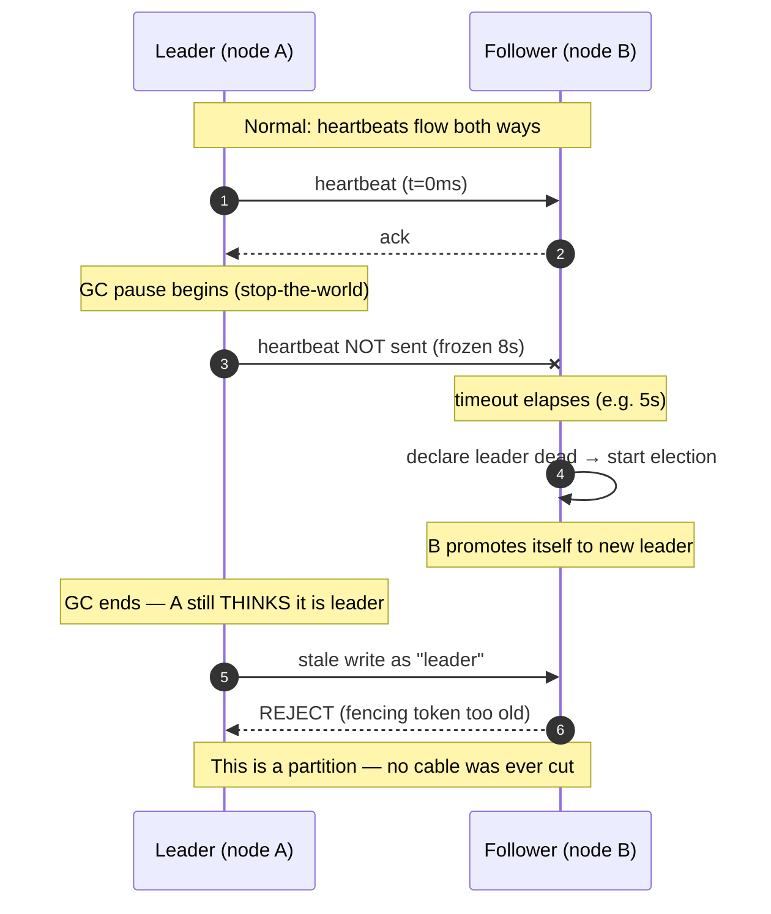

# CAP Theorem — Middle

<!-- level-focus -->
At middle level, focus on this question:

> Where does **CAP Theorem** belong in a maintainable component, and which trade-off selects the design?

Use the smallest realistic scenario that exposes the decision and its failure behavior.
A practitioner's view of CAP: what a partition actually looks like in production, how a **CP** system and an **AP** system behave differently when one strikes, what the "C" in CAP really means (linearizability — *not* ACID's C), and how to classify real datastores with a defensible reason. We finish with a worked partition walkthrough for a leader-based store so you can predict, request by request, who succeeds, who errors, and who serves stale data.

## 1. From the picture to the practice

At the junior level CAP is a slogan: "pick two of three." That framing is misleading and you should drop it now. The honest statement is Eric Brewer's own refinement and the Gilbert–Lynch proof:

> When a network **partition** occurs, a distributed system must choose between **consistency (linearizability)** and **availability**. When there is *no* partition, you can have both.

So CAP is not a steady-state menu. It is a description of behavior **during a fault**. The partition `P` is not something you trade away — partitions happen *to* you, whether you planned for them or not. The only choice you actually make is what your system does *when* one happens:

- **CP** — Consistency over Availability: when partitioned, **refuse to serve** requests that it cannot serve correctly. The minority side returns errors or blocks. The price of correctness is downtime on part of the cluster.
- **AP** — Availability over Consistency: when partitioned, **keep serving** on every reachable node, accepting that some responses are stale or that concurrent writes will conflict. The price of uptime is temporary disagreement, reconciled later.

Both are legitimate. A bank ledger leans CP. A shopping cart, a "last seen" timestamp, a DNS-like directory leans AP. The middle-level skill is to predict, per request, which one your chosen store gives you — and to name the mechanism that produces that behavior.

A useful mental reframe:

| Slogan (wrong) | Reality (right) |
|---|---|
| "Pick 2 of C, A, P" | P is forced on you; you only choose C-vs-A *during* P |
| "CA systems exist" | A single-node DB isn't CA — it's just not distributed; a partition simply has no other side |
| "CAP is about the whole system" | CAP is per-operation; one store can be CP for writes and AP for some reads |
| "Consistency = data isn't corrupted" | Consistency = **linearizability**, a specific real-time ordering guarantee |

---

## 2. What "consistency" means in CAP — linearizability

The C in CAP has a precise, narrow meaning: **linearizability** (also called atomic consistency or strong consistency). It is *not* "the data is valid" or "no corruption."

Linearizability says: the system behaves as if there were a **single copy** of the data, and **every operation takes effect at one instant** between its invocation and its response. Two consequences follow that you can test against:

1. **Recency.** Once a write completes (the client got an ack), every subsequent read — from *any* client, on *any* node — must return that value or a later one. There is no "I read from a replica that hadn't caught up yet."
2. **Real-time order.** If operation A finishes before operation B begins (in wall-clock time), then every observer must order A before B. The system cannot reorder operations that don't overlap in time.

A concrete failing example. Alice posts a comment; the write returns success. One millisecond later Bob refreshes and his read hits a lagging replica that returns the *old* page without Alice's comment. That violates linearizability: a completed write was invisible to a later read. Under a linearizable store this is impossible; under an eventually-consistent store it is normal and expected.

Linearizability is a **recency guarantee about single objects**. Note what it is *not*:

- It is not **serializability** (that's a transaction-isolation property about multiple objects and the equivalence to *some* serial order, with no real-time requirement).
- It is not **causal consistency** (weaker; preserves cause→effect order but allows concurrent operations to be seen in different orders).
- Combine linearizability + serializability and you get **strict serializability** — the gold standard that systems like Spanner and FoundationDB target.

Why does the proof force a choice? Because linearizability requires that a write be reflected *everywhere* before the next read can see anything older. If the network is cut, the write cannot reach the other side, so either: (a) you block/reject until it can — sacrificing availability, or (b) you answer anyway from a stale copy — sacrificing linearizability. There is no third option. That is the Gilbert–Lynch result in one sentence.

---

## 3. CAP's C is not ACID's C

This collision of vocabulary trips up almost everyone, so make it explicit.

- **ACID's C (Consistency)** means: a transaction moves the database from one **valid state to another valid state**, respecting all declared invariants (constraints, foreign keys, triggers, your `CHECK (balance >= 0)`). It is a property the *application + schema* maintain. It says nothing about replicas or network partitions.
- **CAP's C (Consistency)** means: **linearizability** — a single up-to-date logical copy across the cluster, a real-time ordering guarantee about distributed reads and writes.

They are unrelated axes:

| Aspect | ACID "C" | CAP "C" |
|---|---|---|
| Domain | Single logical database / transaction | Distributed replicas |
| Guarantees | Invariants hold (constraints satisfied) | Reads see the latest acknowledged write, real-time order |
| Who enforces it | Schema rules + application logic | Replication + coordination protocol |
| Failure it prevents | Transaction leaving DB in invalid state | A read returning stale data after a completed write |
| Relevant during partition? | Not directly | This is the entire question |

A system can have one without the other. Cassandra with a single node enforces no cross-replica linearizability (no CAP-C) but each write can still respect a uniqueness constraint via lightweight transactions (a kind of validity). Conversely, a perfectly linearizable key-value store gives you CAP-C but has no notion of ACID invariants at all — it'll happily store a negative balance because it has no `CHECK`. When a vendor says "strongly consistent," ask *which* consistency: they almost always mean linearizability (CAP-C), but the word is overloaded on purpose in marketing.

---

## 4. What a partition actually is

The cartoon partition is a cut undersea cable splitting the cluster into two clean halves. Real partitions are messier, and recognizing the messy ones is what separates a practitioner from a textbook reader. A "partition," from the system's point of view, is **any situation where node A cannot exchange messages with node B within the timeout the protocol uses to decide liveness.** The cause is irrelevant to the algorithm; only the symptom matters.

Things that manifest as partitions even when no cable is cut:

- **GC pauses / stop-the-world.** A JVM node freezes for 8 seconds doing a full GC. To its peers it is dead — it sends no heartbeats, answers no requests. When it wakes up it may believe it is still the leader and try to act on stale state (the classic "zombie leader"). This is why fencing tokens exist.
- **Slow nodes / overload.** A node thrashing on disk or swapping responds, but past the heartbeat timeout. Indistinguishable from "gone."
- **Asymmetric network.** A can send to B but B's replies to A are dropped (a one-way firewall rule, an MTU blackhole, a flaky NIC). A thinks B is dead; B thinks A is fine. Each side has a *different* view of the membership — the nastiest case, because it can produce two leaders.
- **Process pauses from the platform.** VM live-migration, container CPU throttling (cgroup quota exhausted), kernel scheduling stalls, even a laptop lid closing — all freeze a node arbitrarily.
- **Clock skew + timeouts.** If a node's clock jumps, lease-based protocols can mis-decide who still holds a valid lease.



The practical lesson: **you cannot avoid partitions by buying better hardware.** A single 99.99%-reliable network link still leaves you exposed to GC, overload, and process pauses. So you must decide your partition behavior *in advance*, because the partition is coming. Designing as if `P` won't happen is the most common production-grade mistake in this whole topic.

---

## 5. CP under partition: behavior

A **CP** system, when partitioned, preserves linearizability by **refusing to serve any request it cannot serve correctly.** Concretely, in a leader/majority design:

- The system uses **quorums**: a write must be acknowledged by a majority of replicas before it returns success. With `N` replicas, a majority is `⌊N/2⌋ + 1`.
- A partition splits the cluster into a **majority side** (has more than half the replicas) and a **minority side** (has fewer).
- **Majority side:** can still form a quorum, so it elects/retains a leader and **keeps accepting reads and writes**. It remains both available *and* linearizable.
- **Minority side:** cannot form a quorum. It **cannot commit writes** (no majority to ack) and, to stay linearizable, **must not serve reads from its possibly-stale copy.** So it returns errors, redirects, or blocks until the partition heals.

The defining property: **at most one side ever makes progress on writes**, which is exactly what guarantees there's never divergence to reconcile. There is no merge step on heal because there was never a fork. The cost is paid as unavailability on the minority side. If your cluster is `N=3` across two datacenters (2 + 1) and the link between them dies, the single-node DC goes read-only-erroring until the link returns; the two-node DC sails on.

A subtlety: even the majority side will *briefly* pause during the failure-detection-and-election window (typically hundreds of milliseconds to a few seconds for Raft) before it confirms it still holds quorum. So "CP" doesn't mean "majority never blinks" — it means majority resumes, minority does not.

Etcd, ZooKeeper, and Consul all behave exactly this way. Lose quorum entirely (e.g., a 3-node cluster where 2 nodes die) and the *whole* cluster goes unavailable for writes — by design. They would rather stop than risk two truths.

---

## 6. AP under partition: behavior

An **AP** system, when partitioned, preserves availability by **letting every reachable node keep answering**, accepting that answers may be stale and that concurrent writes on different sides will conflict.

- There is typically **no single leader** (or leadership is per-key and not strictly enforced across a partition). Any replica can accept reads and writes.
- **Both sides keep serving.** A client talking to the minority side gets answers — but those answers may not reflect writes that happened on the majority side, and vice versa.
- Writes on both sides are accepted and stored locally, then propagated when the partition heals. This means **the same key can be written to different values on each side simultaneously** — a conflict.
- On heal, the system **reconciles**. Strategies: last-write-wins (LWW) by timestamp (simple, but silently drops one write), version vectors / vector clocks to detect concurrency and surface conflicting versions ("siblings") to the application, or CRDTs that merge deterministically (e.g., a grow-only set unions, a counter sums).

The defining property: **the system never says no**, but it may say something old, and it shifts the burden of resolving disagreement to write-time replication and read-time/repair-time merge logic. There is no global "latest"; there is only "what this replica knows so far."

Dynamo-lineage stores (Cassandra, DynamoDB in its eventually-consistent mode, Riak) live here. The phrase you'll hear is **"eventual consistency"**: if writes stop, all replicas *eventually* converge to the same value. The "eventually" is doing a lot of work — under sustained partition, replicas can disagree for as long as the partition lasts.

AP does not mean "anything goes." Tunable consistency (next section) lets an AP store *temporarily* behave CP-ishly per request by demanding quorum reads/writes — at the cost of availability for those specific operations during a partition.

---

## 7. CP vs AP side-by-side

| Dimension | CP system | AP system |
|---|---|---|
| Goal when partitioned | Never return wrong/stale data | Never return an error |
| Minority side, writes | **Rejected** (no quorum) | **Accepted** (stored locally) |
| Minority side, reads | **Rejected / blocked** (or only stale-tolerant reads) | **Served** (may be stale) |
| Majority side | Keeps serving (after brief election) | Keeps serving |
| Divergence during partition | None — one side at most makes progress | Yes — sides can hold different values |
| Reconciliation on heal | Not needed (no fork) | Required (LWW / vector clocks / CRDT) |
| Failure mode you'll see | Timeouts, "no leader," 503/`Unavailable` | Stale reads, conflicting siblings |
| Typical latency | Higher (needs quorum round-trip) | Lower (answer from nearest replica) |
| Good fit | Config, locks, leader election, ledgers, inventory counts | Carts, sessions, feeds, telemetry, "likes", presence |
| Example stores | ZooKeeper, etcd, Consul, HBase, MongoDB (majority) | Cassandra, DynamoDB, Riak, CouchDB |

Read the table as: **CP trades minority-side uptime for a guarantee of one truth; AP trades a guarantee of one truth for cluster-wide uptime.** Neither is "more advanced." The right choice is driven by what a stale or rejected answer *costs your business* on that specific data.

A worked feel for the cost: imagine an e-commerce checkout.
- The **inventory count** ("only 1 left") wants CP — overselling because two partitioned sides both sold the last unit is a real refund/customer-trust cost.
- The **product page view counter** wants AP — if it's off by a few during a partition, nobody cares, and you'd rather the page stay up.

The same application uses both, on different data. Maturity is *not* picking one camp; it's mapping each piece of state to its correct partition behavior.

---

## 8. Classifying real systems, with the why

Naming a system "CP" or "AP" without the mechanism is cargo-culting. Here's the reasoning for each.

**CP systems** (sacrifice availability on the minority side):

- **ZooKeeper** — built for coordination (locks, leader election, config). Uses Zab, a majority-quorum atomic broadcast. A minority partition cannot elect a leader and goes unavailable. *Why CP:* a lock service that handed out the same lock on both sides of a partition would be worse than useless. Note: ZK *reads* can be served stale from any follower unless you issue a `sync` — so reads are technically not linearizable by default, a common gotcha.
- **etcd / Consul** — same shape, using Raft. Backbone of Kubernetes (etcd). Lose quorum → no writes. *Why CP:* the cluster's source of truth must never fork.
- **HBase** — each region is served by exactly **one** RegionServer at a time (single-writer per region) backed by HDFS. If that server is partitioned away, the region is unavailable until reassigned. *Why CP:* single-writer-per-key means there is never a second truth, at the cost of that region's availability during failover.
- **MongoDB (default)** — replica set with a primary elected by majority; default `majority` write concern and (since 4.x) `readConcern` options up to `linearizable`. Minority side can't elect a primary → no writes there. *Why CP by default:* it prioritizes a single primary's ordering. It *can* be tuned toward AP-ish reads (`readPreference: secondary` returns possibly-stale data).

**AP systems** (sacrifice consistency to keep serving):

- **Cassandra** — leaderless, Dynamo-style replication with **tunable** consistency. Default reads/writes can be served by any replica; both sides of a partition keep accepting writes; conflicts resolved by last-write-wins on cell timestamps. *Why AP:* designed for always-on, multi-DC writes. You can dial it toward CP per query with `QUORUM`/`LOCAL_QUORUM`, trading availability for that operation.
- **DynamoDB** — managed Dynamo descendant. Default reads are eventually consistent (cheaper, lower latency, served from any replica); you can opt into strongly consistent reads per request. *Why AP by default:* availability and predictable latency are the product's headline promise.
- **Riak** — the most literal Dynamo implementation: vector clocks, sloppy quorums, hinted handoff, configurable conflict resolution (siblings surfaced to the app). *Why AP:* explicitly built to keep accepting writes during partitions and reconcile after.
- **CouchDB** — multi-master, designed for offline-first and replication across unreliable links (think mobile sync). Each node accepts writes independently; conflicts are detected by revision trees and surfaced for resolution. *Why AP:* the whole point is to work while disconnected.

The pattern: **CP systems exist to be a source of truth (coordination, single-writer); AP systems exist to be always-writable (high-volume, geo-distributed, offline).** Many "tunable" stores (Cassandra, Dynamo, Mongo, Riak) are not a single point on the spectrum — you choose per operation via the quorum knob.

---

## 9. The quorum knob: R + W > N

Quorums are the dial that lets a replicated store slide between availability and consistency. Definitions:

- `N` — replication factor: how many copies of each key exist.
- `W` — write quorum: how many replicas must **ack a write** before it's considered successful.
- `R` — read quorum: how many replicas a **read must consult** (returning the freshest version among them).

The key inequality:

> **If `R + W > N`, then any read quorum and any write quorum must overlap in at least one replica** — so a read is guaranteed to see at least one replica that has the latest acknowledged write. This gives **strong (quorum) consistency** for that operation.

The pigeonhole intuition: with `N` replicas, a write touches `W` of them and a read touches `R` of them. If `R + W > N`, the two sets cannot be disjoint — they share at least one node, and that shared node carries the newest write, so the read can detect and return it (using version metadata to pick the freshest).

Common configurations for `N = 3`:

| Config | Meaning | Consistency | Availability under 1-node loss |
|---|---|---|---|
| `W=3, R=1` | Write all, read one | Strong reads (R+W=4>3) | Writes fail if *any* replica down |
| `W=1, R=3` | Write one, read all | Strong reads (R+W=4>3) | Reads fail if *any* replica down |
| `W=2, R=2` (QUORUM) | Majority both | Strong (R+W=4>3), balanced | Tolerates 1 node down for both |
| `W=1, R=1` | Fast, no overlap | Eventual only (R+W=2≤3) | Maximum availability |
| `W=2, R=1` | Durable writes, fast reads | **Eventual** (R+W=3, *not* >3) | High |

Two things every practitioner gets wrong here:

1. **`W=2, R=1` with `N=3` is NOT strong** — `2 + 1 = 3`, and `3 > 3` is false. You can read the one replica that missed the latest write. The boundary is strict: you need `R + W > N`, not `≥`.
2. **Quorum consistency is weaker than linearizability.** Sloppy quorums, read-repair races, and concurrent writes mean strict-quorum Dynamo-style systems still don't give you full linearizability — they give you a strong *probabilistic/practical* freshness, not the textbook guarantee. For true linearizability you need a real consensus protocol (Paxos/Raft) or lightweight transactions (Cassandra's `SERIAL`, Dynamo's conditional writes).

The quorum knob is how a nominally-AP store buys CP-like behavior **per request**: a `QUORUM` write + `QUORUM` read in Cassandra is strongly consistent in the no-partition case, and *unavailable* on the minority side during a partition (it can't reach a quorum) — i.e., you locally moved that operation from AP to CP, paying the availability cost exactly when a partition hits.

---

## 10. Worked partition scenario: a leader-based store

Let's make it concrete. A leader-based replicated key-value store, `N = 3`:

- **R1** = leader, **R2** and **R3** = followers.
- Write concern = `majority` (a write must be durable on ≥2 of 3 before it acks). This is a **CP** configuration.
- Client X talks to R1's region; Client Y is in R3's region.

Initial state: key `balance = 100`, replicated on all three.

**The partition.** The network splits so that **{R1, R2}** are on one side (the **majority** — 2 of 3) and **{R3}** is alone (the **minority** — 1 of 3). Causes could be a cross-DC link drop, R3 GC-pausing for 10s, or an asymmetric firewall — the algorithm treats them identically.

**What happens, request by request:**

1. **Client X writes `balance = 90` to R1 (majority side).** R1 replicates to R2, gets the ack, reaches majority (2/3). The write **succeeds**. Linearizability preserved: the latest acknowledged value is 90, held by the majority.
2. **Client Y reads `balance` from R3 (minority side).** R3 still holds the old value 100. Under strict CP, R3 **must not** serve this read as authoritative — it cannot confirm it's current because it can't reach a quorum. So R3 either **errors** (`NotPrimary` / `Unavailable`), **redirects** the client to the (unreachable) leader, or — if the client explicitly opted into stale reads — returns `100` *labeled as possibly-stale*. The CP default is to reject.
3. **Client Y writes `balance = 80` to R3 (minority side).** R3 tries to reach a majority to commit, can only reach itself (1/3), **fails to form quorum**, and **rejects the write**. Nothing diverges, because R3 never committed. This is the whole point: the minority side cannot create a competing truth.
4. **Partition heals.** R3 rejoins. It catches up via the replication log / anti-entropy, discovers it's behind, and **pulls `balance = 90`** from the majority. No conflict resolution is needed because there was never a fork — only R3 falling behind, now corrected.

Contrast — **if this were an AP store** (no leader, both sides accept writes):
- Step 2: R3 **serves `100`** (stale) happily.
- Step 3: R3 **accepts `80`** locally. Now the majority side has `90` and R3 has `80` — two truths.
- Step 4 (heal): the system must **reconcile** `90` vs `80`. LWW picks whichever timestamp is newer (silently discarding the other write — a *lost update*); vector clocks detect they were concurrent and surface both as siblings for the app to merge. Either way, you paid for availability with a reconciliation problem the CP store never had.

The lesson lands precisely here: the **same physical partition** produced *rejections* in the CP store and *divergence* in the AP store. Your earlier choice of write concern / store type *is* your choice of which problem you'd rather have.

---

## 11. Reading the staged diagram

The sequence below walks the CP scenario from §10 in three stages — **before** (healthy), **during** (partitioned), **after** (healed). Follow the `Note over` markers; they call out the decision the protocol makes at each step.

```mermaid
sequenceDiagram
    autonumber
    participant X as Client X (majority region)
    participant R1 as R1 (leader)
    participant R2 as R2 (follower)
    participant R3 as R3 (follower, minority)
    participant Y as Client Y (minority region)

    Note over X,Y: STAGE 1 — BEFORE: healthy, balance=100 on all 3
    X->>R1: write balance=100
    R1->>R2: replicate
    R1->>R3: replicate
    R1-->>X: ack (majority 3/3)

    Note over R1,R3: STAGE 2 — DURING: link drops. {R1,R2}=majority, {R3}=minority
    X->>R1: write balance=90
    R1->>R2: replicate
    R2-->>R1: ack (2/3 = majority)
    R1-->>X: SUCCESS (linearizable)
    R1-xR3: replicate (unreachable)

    Y->>R3: read balance
    Note over R3: no quorum reachable → cannot confirm freshness
    R3-->>Y: REJECT (Unavailable) — CP refuses stale read

    Y->>R3: write balance=80
    Note over R3: only 1/3 reachable → no majority
    R3-->>Y: REJECT — minority cannot commit (no fork!)

    Note over R1,R3: STAGE 3 — AFTER: link restored
    R3->>R1: rejoin, request log catch-up
    R1-->>R3: ship committed entries (balance=90)
    Note over R3: applies 90 — no conflict resolution needed
    R3-->>R1: caught up; resumes serving
```

Three things to internalize from the staging:

- **The majority side never stopped** serving correct data (steps 5–8). CP costs you the *minority's* availability, not the whole cluster's — provided the partition leaves a majority intact.
- **The minority side fails loudly** (steps 9–13): explicit rejects, not silent stale answers. That's a feature — loud failures are debuggable; silent staleness is not.
- **Heal is trivial** (steps 14–17): catch-up, not merge. The CP guarantee that "at most one side made progress" is exactly what makes recovery a log replay instead of a conflict-resolution headache.

> 🎞️ **See it animated:** [The Raft Consensus Algorithm — interactive visualization](https://raft.github.io/) — watch leader election, log replication, and what a partitioned minority does when it can't reach quorum.

---

## 12. Common mistakes and sharp edges

- **"We're CA, we don't partition."** No such thing for a distributed system. A single-node database isn't CA — it's non-distributed, so the question of "the other side" never arises. The moment you replicate, `P` is on the table and you must pick C-vs-A behavior.
- **Confusing CAP-C with ACID-C.** A "strongly consistent" datastore (linearizable) can still let you commit a business-invalid state; an ACID database can still serve stale reads from a lagging replica. Different axes — see §3.
- **Assuming CP means "always available on the majority."** During the failure-detection + election window the majority *also* pauses (hundreds of ms to seconds). CP guarantees the majority *resumes*, not that it never blinks.
- **`R + W > N` off-by-one.** `W=2, R=1, N=3` gives `3`, and `3 > 3` is false → eventual, not strong. The inequality is strict.
- **Believing quorum = linearizability.** Strict Dynamo-style quorums are strongly consistent in the common case but not truly linearizable (read-repair races, sloppy quorums, concurrent writes). For real linearizability use consensus (Raft/Paxos) or lightweight/conditional transactions.
- **Ignoring stale reads on "CP" systems.** ZooKeeper followers and MongoDB secondaries can serve stale reads by default. Reads are only linearizable if you ask for it (`sync` in ZK, `readConcern: linearizable` / primary reads in Mongo).
- **Forgetting the heal cost on AP.** AP's availability isn't free — it defers the bill to reconciliation. LWW silently drops writes (lost updates); vector clocks/CRDTs avoid that but push merge logic into your application. Budget for it.
- **Treating a store as one CAP point.** Tunable stores (Cassandra, Dynamo, Mongo, Riak) move per operation. Classify the *operation*, not just the product.

---

## 13. Decision checklist

When you must choose CP vs AP for a given piece of state, walk this list:

1. **What does a stale answer cost?** If a slightly-old read causes overselling, double-spend, or a security mistake → lean **CP**. If it causes a slightly-off counter or a momentarily-old feed → **AP** is fine.
2. **What does a rejected request cost?** If an error during a partition means lost revenue, dropped telemetry, or a frozen UX on critical paths → lean **AP**. If you can safely retry or fail closed → **CP** is acceptable.
3. **Is this coordination state?** Locks, leader election, config, membership, sequence/ID issuance → **CP**, always. These *are* the source of truth and must never fork.
4. **Is concurrent conflicting write plausible and resolvable?** If two regions can write the same key and you have a sane merge (CRDT, app-level rule) → **AP** is viable. If you have no good merge → prefer **CP** (single-writer) to avoid the problem entirely.
5. **What's your topology?** With `N=3` split 2+1, CP keeps the 2-side fully working. Split 1+1+1 across three sites and *any* partition can leave you without a majority → CP means broad unavailability; weigh that.
6. **Can you tune per operation?** On Cassandra/Dynamo/Mongo you don't have to choose once. Use `QUORUM`/`majority`/strong reads for the critical keys and weak settings for the rest.
7. **Did you write down the partition behavior?** If you can't state, per request, who succeeds / errors / serves stale during a partition, you haven't finished the design.

---

## Apply it

1. Find a real component where **CAP Theorem** affects an interface or dependency.
2. Write two plausible choices and the constraint that favors each one.
3. Make the smallest reversible change at that boundary.
4. Exercise the component alone, then exercise the integrated flow.
5. Keep the decision note with the evidence that selected the option.

## Verify your work

- A focused check proves the local behavior.
- An integrated check proves callers and dependencies still agree.
- Logs, traces, compiler output, or benchmarks expose the boundary.
- Reverting the change restores the previous behavior without unrelated edits.

## Review questions

- Which boundary is most affected by CAP Theorem?
- What constraint would make you choose the alternative design?
- How would you isolate a local defect from an integration defect?
- What evidence shows that the change remains maintainable?
