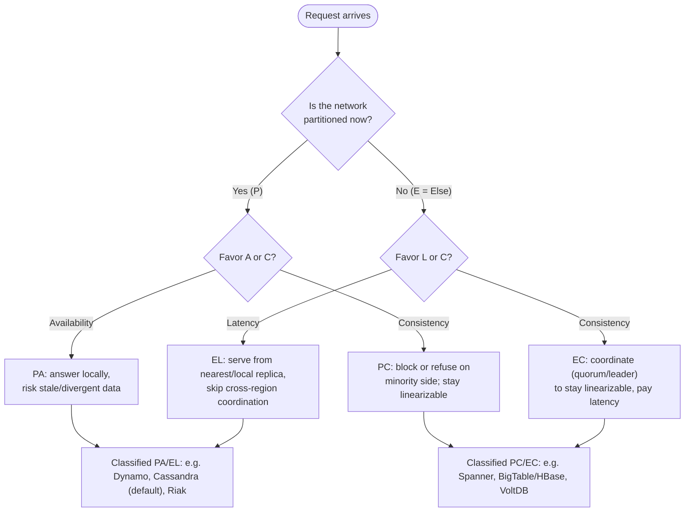

# CAP Theorem — Theory and Formal Foundations

<!-- level-focus -->
At professional level, focus on this question:

> How should teams adopt and operate **CAP Theorem — Theory and Formal Foundations** with measurable outcomes and limited coordination?

Use the smallest realistic scenario that exposes the decision and its failure behavior.
The CAP theorem is one of the few results in distributed systems engineering that
is both genuinely a *theorem* — proven, not folklore — and routinely misused in
practice. This document treats CAP at the level a principal engineer needs:
the Gilbert & Lynch (2002) formalization, the impossibility proof written out
cleanly, the partially-synchronous refinement that makes the result *usable*,
a precise definition of linearizability contrasted with its weaker and stronger
cousins, and the modern critique (Brewer 2012, Kleppmann 2015) that explains why
labelling a database "CP" or "AP" is almost always too coarse to be useful.

## 1. The conjecture and why a proof was needed

Eric Brewer presented the **CAP conjecture** as the keynote of the 2000 ACM
Symposium on Principles of Distributed Computing (PODC). Informally: a shared-data
system can provide at most two of three desirable properties — **C**onsistency,
**A**vailability, and **P**artition tolerance — simultaneously.

As a slogan this is memorable, but a slogan is not a theorem. The three words
each have a colloquial meaning broad enough that the claim could be read as
trivially true, trivially false, or meaningless depending on the reader. "Pick
two of three" suggests a symmetric trade-off among three interchangeable knobs,
which — as we will see — is misleading: partitions are not something you *choose*
to tolerate, they are a fact of the network that you must *respond* to.

Two years later, Seth Gilbert and Nancy Lynch at MIT supplied the missing rigor.
In *"Brewer's Conjecture and the Feasibility of Consistent, Available,
Partition-Tolerant Web Services"* (SIGACT News, 2002) they (a) fixed precise
mathematical definitions for each of C, A, and P, (b) fixed a network model, and
(c) *proved* that no algorithm can satisfy all three under that model. The
conjecture became a theorem. Crucially, the proof's content lives almost entirely
in the definitions — once C, A, and P are pinned down, the impossibility is a
short argument. Most real-world confusion about CAP is confusion about which
definitions are in force.

The lesson for a senior engineer: when someone says "system X is CP," ask *which
formal C, which formal A, which network assumptions*. The slogan compresses away
exactly the parameters that determine whether the statement is true.

---

## 2. The Gilbert & Lynch formal model

Gilbert & Lynch model a distributed system as a finite set of nodes
`{n₁, …, nₖ}`, each running a deterministic algorithm, communicating only by
passing messages over a network. The object under study is a **read/write
register** — the simplest possible shared data type — with operations `write(v)`
and `read()`. The simplicity is deliberate: if you cannot even build a consistent,
available, partition-tolerant *register*, you certainly cannot build anything
richer (a database, a queue, a counter), because those reduce to or strictly
generalize a register.

### The asynchronous network

The base result uses the **asynchronous model**, the harshest realistic model:

- There is **no global clock**. Nodes cannot use real time to coordinate.
- Messages may be delayed by an **arbitrary, unbounded** amount.
- The network may **lose** messages.
- A node cannot distinguish a *slow* message from a *lost* one, nor a *crashed*
  peer from a *slow* peer. This is the famous indistinguishability that powers
  most impossibility results in the field (cf. FLP, Fischer–Lynch–Paterson 1985).

A **partition** is modelled cleanly: the message-passing system is allowed to lose
*arbitrarily many* messages sent from one group of nodes to another. When *all*
messages between two groups `G₁` and `G₂` are lost, the two groups run in complete
ignorance of each other for the duration.

### The adversary

It is useful to think of the proof as a game against an adversary who controls
message delivery. The adversary may delay or drop any message. The algorithm must
behave correctly *against every adversary strategy*. To prove impossibility, we
only need to exhibit **one** adversary strategy under which the desired properties
cannot all hold. That is exactly what the proof does: it constructs a single,
specific partition and a single execution that breaks any candidate algorithm.

---

## 3. Formal definitions: consistency, availability, partition tolerance

These three definitions *are* the theorem. Read them carefully.

### Consistency (C) = atomic / linearizable register

Gilbert & Lynch use **atomic consistency**, which is the register specialization
of **linearizability** (Herlihy & Wing, 1990). Precisely:

> There must exist a total order on all operations such that each operation looks
> as if it completed at a single instant, and this order is consistent with the
> real-time ordering of operations: if operation `op₁` completed before operation
> `op₂` began (in real time), then `op₁` appears before `op₂` in the total order.

For a register, the practical consequence: a `read()` must return the value
written by the **most recent** completed `write()` in this real-time-respecting
total order. A read can never observe a stale value once a newer write has
*completed*. This is a strong, "single-copy" illusion — clients cannot tell that
the data is replicated at all.

### Availability (A)

> Every request received by a **non-failing** node must result in a **response**.

Note three things. First, it is *every* request, not "most." Second, the node must
be non-failing — a crashed node is excused. Third, the definition as stated puts
no bound on *latency*: a response that takes an hour technically satisfies it.
This is a known weakness of the formal definition and a seam the modern critique
pries open (see §10–11). In the proof, availability is invoked in its strongest
form: the request must **terminate** with a response even while the network is
partitioned.

### Partition tolerance (P)

> The system continues to satisfy its guarantees even when the network loses
> arbitrarily many messages sent between nodes — including the total partition
> case, where two groups exchange no messages at all.

Partition tolerance is **not** a property you trade away by choice. On any real
network — across a WAN, even within a datacenter under a switch failure or a GC
pause that stalls a node past every timeout — partitions *will* occur. So the
honest reading of CAP is not "pick two of three." It is:

> **When a partition occurs, you must sacrifice either consistency or
> availability. You do not get to keep both.** When there is no partition, you may
> have both.

That reframing — partitions are imposed, C-vs-A is the real choice — is the single
most important correction to the "two of three" slogan.

---

## 4. The impossibility proof (asynchronous model)

We prove **Theorem 1 of Gilbert & Lynch**: in the asynchronous network model,
it is impossible to implement a read/write register that is simultaneously atomic
(C), available (A), and partition-tolerant (P).

The proof is by **contradiction** and is constructive — it exhibits a concrete
execution that any allegedly-CAP algorithm must mishandle.

### Setup

Assume, for contradiction, an algorithm **𝒜** that guarantees atomicity,
availability, and partition tolerance over the asynchronous model. Partition the
nodes into two non-empty groups:

- **G₁**, containing at least one node, and
- **G₂**, containing at least one node, disjoint from G₁.

Let the adversary drop **all** messages between G₁ and G₂. By **partition
tolerance**, 𝒜 must continue to operate correctly; by **availability**, every
request to any (non-failing) node in either group must still return a response —
*using only that group's local state and intra-group communication*, since no
information can cross the partition.

### The execution

Assume the register's initial value is `v₀`. Construct execution **α** as follows:

1. **Write on G₁.** A client issues `write(v₁)` with `v₁ ≠ v₀` to some node in G₁.
   By availability, this operation must terminate and return an acknowledgement.
   Call the completed write `W`. Because the partition blocks G₁→G₂ messages, no
   node in G₂ learns about `W`.

2. **Read on G₂.** *After* `W` has completed (in real time), a client issues
   `read()` to some node in G₂. By availability, this read must terminate and
   return some value. Call the completed read `R`.

3. **What can R return?** Node(s) in G₂ have received *no* message originating
   from G₁ during this execution. Their entire view of the world is identical to
   an execution in which `W` never happened. A deterministic algorithm cannot
   produce a different output from an identical input history, so `R` must return
   `v₀` (the only value G₂ has ever known), **not** `v₁`.

### The contradiction

By construction, `W` completed before `R` began (in real time). **Atomicity**
requires a total order respecting real-time precedence, so `W` must precede `R`,
and `R` — reading after the completed write `W` — must return `v₁`. But step 3
showed `R` returns `v₀ ≠ v₁`. The atomic-consistency requirement and the
availability requirement are therefore irreconcilable in execution **α**.

Hence no algorithm 𝒜 can guarantee all three properties under the asynchronous,
partition-prone model. ∎

### Why each hypothesis is load-bearing

- Drop **availability**: G₂'s read may **block** until the partition heals, then
  return `v₁`. Consistent and partition-tolerant, not available. (This is the
  "CP" choice.)
- Drop **consistency**: G₂'s read may return `v₀` *and that is declared
  acceptable* — the system promises only eventual convergence, not freshness.
  Available and partition-tolerant, not consistent. (This is the "AP" choice.)
- Drop **partition tolerance**: forbid the partition. With reliable in-order
  delivery and no message loss, G₁ can synchronously inform G₂ before `W`
  completes, so `R` sees `v₁`. Consistent and available — but only on a network
  that never partitions, which does not exist at scale.

The proof shows precisely *one* contradiction; the three corollaries show that
relaxing *any single* hypothesis dissolves it. That is the real content of CAP.

---

## 5. Staged diagram of the partition argument

The following Mermaid sequence diagram stages the execution **α** from §4 across
four numbered phases, making the indistinguishability at the heart of the proof
visible: G₂ behaves identically whether or not the write on G₁ ever occurred.

```mermaid
sequenceDiagram
    autonumber
    participant C1 as Client (to G1)
    participant G1 as Group G1 (has write)
    participant Net as Network (partitioned)
    participant G2 as Group G2 (isolated)
    participant C2 as Client (to G2)

    Note over G1,G2: Phase 1 — Partition installed: adversary drops ALL G1 to G2 messages
    Note over Net: G1 to G2 link severed for the whole execution

    Note over C1,G1: Phase 2 — Write completes on G1
    C1->>G1: write(v1), v1 != v0
    G1-->>G1: apply v1 locally
    G1->>Net: replicate v1 to G2
    Net--xG2: message DROPPED (partition)
    G1-->>C1: ack (write W completes in real time)

    Note over C2,G2: Phase 3 — Read issued on G2 strictly after W completes
    C2->>G2: read()
    Note over G2: G2 has never received any G1 message;<br/>its history is identical to "W never happened"
    G2-->>C2: returns v0 (only value G2 knows)

    Note over C1,C2: Phase 4 — The contradiction
    Note over C1,C2: Atomicity: W (completed) precedes R, so R must read v1<br/>Availability: R must terminate, and from G2 it can only return v0<br/>v1 != v0  =>  C and A cannot both hold under a partition
```

The diagram emphasizes the proof's lever: in Phase 3 the read on G₂ is forced to
return `v0`, because a deterministic node's output is a function of its received
history, and G₂'s received history is empty of anything from G₁. Availability
forbids it from waiting; consistency demands `v1`; both cannot win.

---

## 6. The partially-synchronous result

The asynchronous result is bleak but unrealistic in a subtle way: it grants the
adversary the power to make a slow message indistinguishable from a lost one
*forever*. Real networks are not adversarial in that limit — they have *some*
notion of time. Gilbert & Lynch therefore also study the **partially-synchronous
model**, and this is where CAP becomes engineering guidance rather than a
counsel of despair.

### The model

In the partially-synchronous model (after Dwork, Lynch & Stockmeyer, 1988):

- Every node has a **local clock** whose rate is bounded (it advances at a rate
  within a known factor of real time), though clocks are **not** synchronized to a
  global time.
- There is a known bound **Δ** such that, **when no partition is in effect**,
  every message is delivered within Δ. During a partition, the bound is suspended
  (messages may be lost).

The key power this grants the algorithm is the **timeout**: a node that has waited
longer than the round-trip Δ-bound may legitimately *conclude* it is partitioned
and act accordingly, rather than waiting forever.

### Theorem (partially-synchronous CAP)

Gilbert & Lynch prove:

> There **is** an algorithm that guarantees **atomic consistency** in *all*
> executions (even during partitions) and guarantees **availability** in all
> executions *in which no partition occurs and messages are delivered within Δ*.
> Moreover, even during a partition, stale data returned is bounded: once the
> partition heals, the system reconverges within a bounded time after the last
> message in the partition.

This is the precise statement behind the engineering folk wisdom "you only give up
C-or-A *during a partition*." A well-designed CP system is fully available in the
common case (no partition) and only sacrifices availability during the (hopefully
rare, hopefully short) windows when the network is split.

### The Δ / eventual spectrum

This result frames a whole spectrum:

- A **CP** algorithm uses Δ-timeouts to detect a probable partition, then refuses
  to serve writes/reads on the minority side (or blocks) to preserve atomicity.
  Think of a quorum-replicated store that requires a majority to ack.
- An **AP** algorithm always answers from local state, accepting that during a
  partition different replicas diverge, and reconciles afterward — converging to a
  single value once the partition heals and messages flow again. This is the
  **eventual consistency** regime (and its strengthening, *bounded staleness*,
  where the stale window is bounded by some t < ∞).

Both are rational points; the partially-synchronous theorem tells you that
*outside* partitions you sacrifice nothing, and *inside* partitions you sacrifice
exactly the property you chose to relax — no more.

---

## 7. Linearizability defined precisely

The "C" in CAP is **linearizability** (for a register, "atomic consistency"). It
is worth defining with full precision because it is routinely confused with
serializability, which is a different property governing a different thing.

### Definition (Herlihy & Wing, 1990)

Consider a concurrent **history** `H`: a sequence of operation *invocation* and
*response* events, one pair per operation, possibly overlapping in time. `H` is
**linearizable** if there exists a sequential history `S` (a total order of
complete operations) such that:

1. **Legality.** `S` is a legal sequential history of the object — each operation
   in `S` returns the result the object's sequential specification dictates given
   the operations before it. (For a register: a read returns the value of the most
   recent prior write.)

2. **Equivalence.** `S` contains exactly the same operations as `H`, each with the
   same arguments and the same return value.

3. **Real-time order preservation.** If operation `op₁` *responds* before
   operation `op₂` is *invoked* in `H` (they do not overlap, `op₁` strictly
   precedes `op₂`), then `op₁` precedes `op₂` in `S`. Operations that *do* overlap
   may be ordered either way.

The intuition: every operation appears to take effect **atomically at some single
instant** between its invocation and its response — its **linearization point**.
Once you can place every operation at such a point consistent with the object's
spec, the system behaves indistinguishably from a single, non-replicated copy
accessed one operation at a time.

### Two properties that matter for composition

- **Locality (composability).** A history over multiple objects is linearizable
  **iff** the projection onto each object is linearizable. This is unique to
  linearizability among the strong models — it means you can reason about each
  linearizable object independently and the whole system stays linearizable. (Both
  serializability and sequential consistency lack this property.)
- **Non-blocking.** A pending invocation never has to wait for another pending
  invocation to complete in order to be linearized. (Again, serializability does
  not guarantee this — a transaction may block.)

### Linearizability vs sequential consistency vs serializability

This is the trio people conflate. They differ on *what they order* and *whether
they respect wall-clock time*.

| Property | Unit ordered | Respects real-time order across clients? | Composable (local)? | Typical home |
| --- | --- | --- | --- | --- |
| **Linearizability** | single operations on **one object** | **Yes** — non-overlapping ops keep real-time order | **Yes** | Registers, single-key stores, consensus (Raft/Paxos) |
| **Sequential consistency** (Lamport, 1979) | single operations | **No** — only each client's program order is preserved; a global total order exists but need not match wall clock | No | Shared-memory multiprocessors, some replicated caches |
| **Serializability** (ANSI/ACID isolation) | **transactions** (groups of ops) | **No** by itself — any serial order of transactions is allowed, even one that contradicts real time | No | RDBMS transaction isolation |
| **Strict serializability** | transactions | **Yes** — serializable **and** real-time-respecting | (compositional in the transactional sense) | Spanner, CockroachDB, FoundationDB |

The crisp slogan:

- **Linearizability** = strict serializability restricted to *single-object,
  single-operation* transactions. It is a **recency** guarantee on one object.
- **Serializability** = transactions appear in *some* serial order. It says
  nothing about *which* serial order, so it permits time-travel: a transaction
  that ran later may be ordered earlier.
- **Strict serializability** = serializability **+** linearizability's real-time
  constraint, lifted to multi-object transactions. It is the strongest practical
  model and what "externally consistent" databases (Spanner) provide.

CAP's "C" is precisely **linearizability**. So a database can be fully ACID-
*serializable* and still not be "CP in the CAP sense" if it allows stale reads
that violate real-time recency — and conversely, a single-key store can be
linearizable without offering multi-key transactions at all. Mixing these axes is
the root of most "is X CP or AP" arguments.

---

## 8. Consistency models compared

Beyond the strong-model trio, practitioners place systems along a richer lattice
of consistency models. The following table orders the main models from strongest
(top) to weakest (bottom), with the operational guarantee each gives a client and
its relationship to CAP availability.

| Model | Guarantee to the client | Real-time? | Available under partition? | Example systems |
| --- | --- | --- | --- | --- |
| **Strict serializability** | Multi-object transactions in a real-time-respecting serial order | Yes | No (CP) | Google Spanner, FoundationDB, CockroachDB |
| **Linearizability** (atomic) | Each op on one object atomic, respects real-time recency | Yes | No (CP) | etcd, ZooKeeper (writes), Raft/Paxos registers |
| **Sequential consistency** | A single global order exists; each client's program order preserved; no wall-clock guarantee | No | No (still needs global agreement) | Classic shared-memory, some quorum reads |
| **Causal consistency** | Operations causally related (happens-before) are seen in order by all; concurrent ops may be seen in different orders | No | **Yes** — the strongest model achievable while staying available under partition (Attiya et al.; Mahajan et al.) | COPS, MongoDB causal sessions, Antidote |
| **Read-your-writes / monotonic** | Session guarantees: you see your own writes; reads never go backwards | No | Yes | Session-consistent caches, DynamoDB (configurable) |
| **Eventual consistency** | If writes stop, all replicas eventually converge to the same value; no freshness or ordering guarantee meanwhile | No | Yes (AP) | Dynamo, Cassandra (default), Riak, DNS |

Two facts from theory anchor this table for a principal engineer:

1. **Causal consistency is the frontier.** A line of results (Attiya, Ellen &
   Morrison 2017; Mahajan, Alvisi & Dahlin 2011) shows that **causal+** (causal
   consistency with convergent conflict handling) is, in a precise sense, the
   *strongest* consistency model that can remain **available** and
   **convergent** under partition. Anything strictly stronger (e.g.
   linearizability) forces you to give up availability when partitioned — which is
   simply CAP again. This is why so many "highly available but not eventually
   broken" designs aim squarely at causal consistency.

2. **Eventual consistency is a liveness promise, not a safety one.** "Eventually
   converges" says nothing about *what* clients observe in the meantime — they may
   read stale, may read non-monotonically, may see writes reorder. The session
   guarantees (read-your-writes, monotonic reads/writes, writes-follow-reads)
   exist precisely to patch the most surprising of these holes without paying for
   full linearizability.

---

## 9. What CAP does *not* say

Misuse of CAP almost always stems from over-reading it. The theorem is narrow.

- **It is not "pick two of three" as a free menu.** Partitions are imposed by the
  physical network. You do not "choose P." You choose, *given a partition*,
  between C and A. Outside partitions you may have both.

- **It says nothing about latency.** Availability in the formal sense is merely
  "the request eventually returns." A linearizable system that answers in 5 ms
  when healthy is "available" right up until it blocks during a partition. CAP is
  blind to the 5 ms vs 500 ms distinction that dominates real product decisions —
  which is exactly why PACELC exists (§11).

- **It is about a single register / single object.** The base theorem is a
  read/write register. Transactions, multi-key invariants, and isolation levels
  are a *richer* and largely orthogonal axis (serializability vs linearizability,
  §7). A system can be linearizable per-key and offer no cross-key atomicity.

- **"C", "A", and "P" are not binary in real systems.** Consistency is a spectrum
  (§8). Availability is a spectrum (per-operation, per-key, percentile latency).
  Partition tolerance has degrees (lossy link vs total split, brief vs sustained).
  Collapsing each to a single bit and then collapsing the system to one of two
  labels destroys most of the useful information — Kleppmann's central complaint.

- **CAP is not the only impossibility in play.** FLP (1985) already forbids
  *deterministic* consensus with even one crash failure in a *fully* asynchronous
  system; CAP is a sibling result about registers under partition. Real systems
  escape FLP with partial synchrony and failure detectors — the same escape hatch
  CAP uses in §6.

---

## 10. The modern critique: Brewer 2012 and Kleppmann 2015

Twelve years after the conjecture, the two most influential reassessments came
from Brewer himself and from Martin Kleppmann.

### Brewer, "CAP Twelve Years Later: How the 'Rules' Have Changed" (IEEE Computer, 2012)

Brewer's own retrospective walks back the slogan he popularized:

- **"Two of three" is misleading.** Because partitions are rare, a system is
  *normally* both consistent and available; the choice between C and A is made
  **only during a partition**, and only for the duration. Designers should think
  in terms of a **partition recovery strategy**, not a permanent two-of-three
  label.

- **The choice is per-operation, not per-system.** Within one system, some
  operations may favor availability (e.g. "add item to shopping cart" — accept the
  write, reconcile later) while others favor consistency (e.g. "charge the credit
  card" — refuse rather than double-charge). Labeling the whole system "AP" or
  "CP" erases this.

- **A partition has phases.** Brewer frames operation around a partition as a
  three-phase loop: (1) **detect** the partition (via Δ-timeouts), (2) enter an
  explicit **partition mode** that limits some operations or records intentions,
  and (3) **recover**, reconciling divergent state and compensating for any
  invariants violated during the partition. The engineering effort, he argues, is
  in (2) and (3) — exactly where the slogan offers no guidance.

### Kleppmann, "Please Stop Calling Databases CP or AP" (2015)

Kleppmann's critique is sharper and more formal:

- **The C/A/P categories are too coarse to classify real databases.** The CAP
  "C" is *linearizability*, the "A" is the very strict *every-request-to-a-
  non-failing-node-returns* notion, and "P" allows arbitrary message loss. Most
  real databases match **none** of these exactly. A system can be unavailable for
  reasons unrelated to partitions (a single leader that, when down, blocks writes
  regardless of any partition) — so it is "not available" by CAP, yet also "not CP"
  in any useful sense.

- **The definitions are mutually entangled in a way that defeats clean labels.**
  CAP availability requires *every* non-failing node to answer; a system with a
  single designated leader fails this whenever the leader is the only node that can
  serve a given operation — independent of partitions. So such systems are
  technically neither A nor cleanly P, and the two-letter label is undefined.

- **Latency is the missing dimension.** CAP ignores the cost, in *time*, of strong
  consistency when there is **no** partition. In practice the everyday trade-off is
  not C-vs-A during rare partitions, it is **consistency vs latency on every single
  request**. A globally linearizable write must coordinate across replicas and pays
  a latency tax even when the network is perfectly healthy.

Kleppmann's recommendation: stop reaching for the CAP label, and instead state the
**specific consistency guarantee** a system provides (linearizable? causal?
read-your-writes? eventual?) and its behavior under partition and under load
*operationally*. That is strictly more information than "CP" or "AP."

---

## 11. From CAP to PACELC

The latency gap Kleppmann names is formalized by **PACELC** (Daniel Abadi, 2010,
*"Consistency Tradeoffs in Modern Distributed Database System Design"*). PACELC
extends CAP with the case CAP omits — the normal, no-partition case:

> **If** there is a **P**artition, choose between **A**vailability and
> **C**onsistency (this is CAP). **E**lse (no partition, the common case), choose
> between **L**atency and **C**onsistency.

The decision tree makes the two independent trade-offs explicit:



A PACELC label carries two letters of real information: the partition-time choice
**and** the steady-state choice. Some illustrative classifications from Abadi:

| System | Partition behavior (P) | Normal behavior (E) | PACELC label |
| --- | --- | --- | --- |
| Dynamo, Cassandra, Riak (default tuning) | Availability | Latency | **PA / EL** |
| Google Spanner | Consistency | Consistency | **PC / EC** |
| HBase / BigTable | Consistency | Consistency | **PC / EC** |
| MongoDB (default) | Consistency (leader) | Latency-leaning | **PC / EL** |
| PNUTS (Yahoo) | Consistency | Latency | **PC / EL** |

PACELC is not a contradiction of CAP — it *contains* CAP as its left branch — but
it repairs the most important omission: the everyday cost of consistency when
nothing is broken. For a system designer choosing replication and coordination
strategy, the **E** half is what governs your p99 on every request, while the
**P** half governs your behavior during incidents.

---

## 12. Practical reading for the principal engineer

Distilling theory into the judgments you will actually make:

- **Partitions are not optional, so design the partition-mode and recovery
  explicitly.** Whichever of C or A you sacrifice, write down *how* you detect the
  partition (Δ-timeout, failure detector, quorum loss), *what* degrades in
  partition mode, and *how* you reconcile on heal (last-writer-wins? CRDTs?
  operator intervention? compensating transactions?). Brewer's three phases are a
  checklist, not a slogan.

- **Decide per-operation, not per-system.** Carts and counters can be AP/EL;
  payments and inventory decrements that must not oversell want PC/EC. A single
  service legitimately mixes both. Refuse to let "we're an AP shop" make the
  inventory decision for you.

- **State the actual consistency model, never the two-letter label.** "Reads are
  linearizable within a key; cross-key operations are read-committed; during a
  leader partition the minority blocks writes for up to one election timeout" tells
  a reviewer everything. "We're CP" tells them almost nothing — heed Kleppmann.

- **Watch latency in steady state (the E in PACELC).** The expensive trade-off in
  most products is not the rare partition; it is the coordination latency that
  strong consistency imposes on *every* request. If your read-heavy path can
  tolerate causal or read-your-writes semantics, you can often serve from a local
  replica and save a cross-region round trip on the hot path.

- **Reach for causal consistency when you want "as strong as possible while
  staying available."** It is the theoretical ceiling for a partition-available,
  convergent system; session guarantees (read-your-writes, monotonic reads) are
  the cheap, high-value subset to adopt first.

- **Remember the model.** CAP's strength is a *theorem*; its weakness is that the
  theorem's definitions are narrower than the words suggest. Carry the formal C
  (linearizability), the formal A (every request terminates), and the formal P
  (arbitrary message loss) in your head, and most "is this CP?" debates resolve
  themselves into precise, answerable questions.

---

## 13. References

- S. Gilbert, N. Lynch. *Brewer's Conjecture and the Feasibility of Consistent,
  Available, Partition-Tolerant Web Services.* ACM SIGACT News 33(2), 2002.
- E. Brewer. *Towards Robust Distributed Systems* (PODC 2000 keynote — the original
  conjecture).
- E. Brewer. *CAP Twelve Years Later: How the "Rules" Have Changed.* IEEE
  Computer 45(2), 2012.
- M. Herlihy, J. Wing. *Linearizability: A Correctness Condition for Concurrent
  Objects.* ACM TOPLAS 12(3), 1990.
- L. Lamport. *How to Make a Multiprocessor Computer That Correctly Executes
  Multiprocess Programs.* IEEE Trans. Computers, 1979 (sequential consistency).
- C. Dwork, N. Lynch, L. Stockmeyer. *Consensus in the Presence of Partial
  Synchrony.* JACM 35(2), 1988.
- M. Fischer, N. Lynch, M. Paterson. *Impossibility of Distributed Consensus with
  One Faulty Process.* JACM 32(2), 1985 (FLP).
- D. Abadi. *Consistency Tradeoffs in Modern Distributed Database System Design.*
  IEEE Computer 45(2), 2012 (PACELC).
- M. Kleppmann. *Please Stop Calling Databases CP or AP.* 2015; and *A Critique of
  the CAP Theorem*, arXiv:1509.05393, 2015.
- H. Attiya, F. Ellen, A. Morrison. *Limitations of Highly-Available
  Eventually-Consistent Data Stores.* IEEE TPDS, 2017 (causal+ as the strong-yet-
  available frontier).

An interactive, well-regarded visualization of linearizability and other
consistency models is published by Jepsen at
<https://jepsen.io/consistency> (verify before relying on it in any review).


---

## Apply it

1. Define the user or business outcome that **CAP Theorem — Theory and Formal Foundations** should improve.
2. Assign one owner for code, contracts, operations, and incidents.
3. Split delivery into reversible increments that produce evidence early.
4. Publish responsibilities, escalation paths, and compatibility windows.
5. Stop or expand only when the agreed measures support that decision.

## Verify your work

- Each increment has an owner, rollback path, and observable exit condition.
- Adoption, reliability, delivery time, and coordination cost are measured.
- Incident and migration exercises prove that responsibility is executable.
- The old path is removed only after telemetry proves it is unused.

## Review questions

- Which measurable outcome justifies investing in CAP Theorem — Theory and Formal Foundations?
- Which team owns the full lifecycle and incident response?
- What reversible increment produces the earliest useful evidence?
- Which exit condition proves that migration or adoption is complete?
