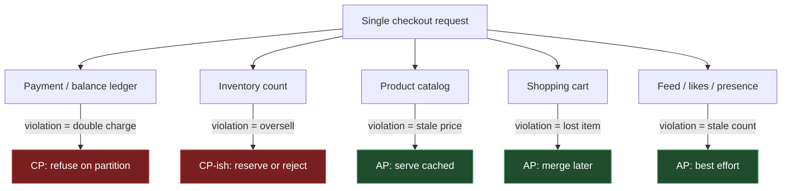
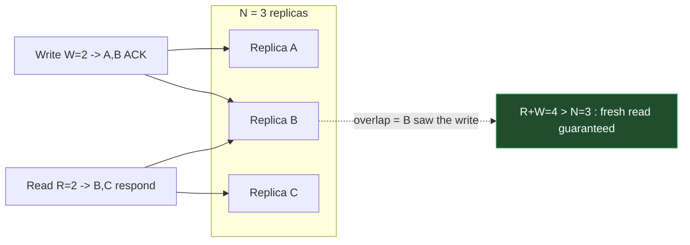
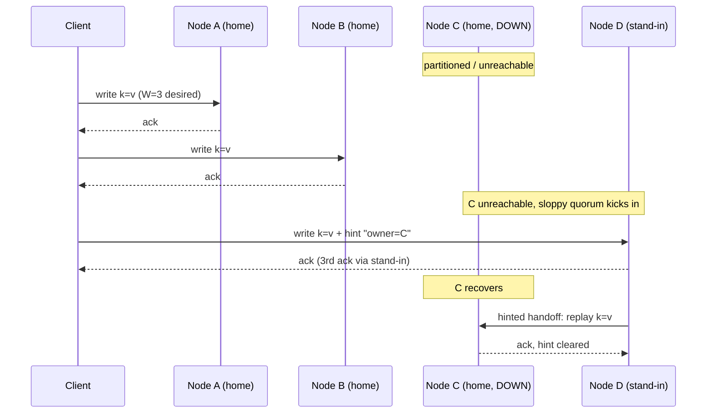

# CAP Theorem — Senior

<!-- level-focus -->
At senior level, focus on this question:

> Which system invariant is affected by **CAP Theorem** under failure, load, and change?

Use the smallest realistic scenario that exposes the decision and its failure behavior.
As an owner, you stop asking "is my system CP or AP?" That question is a category
error. A real product is not one system — it is a portfolio of data classes, each
with its own consistency contract, often sitting in the same request path. The
senior skill is to assign CP or AP **per data class and per feature**, to tune
quorum knobs against quantified targets, and to design what the system *does* when
a partition actually arrives — because the partition is rare, and the other 99.9%
of the time you are arguing about latency, not availability.

This document is about ownership: decision tables, a worked quorum-tuning example,
staged partition behavior, the operational reality on-call sees, and the senior-level
misuses that quietly sink architectures.

## 1. The owner's reframe: CAP is per-data-class, not per-system

The textbook framing — "during a network partition a distributed system can keep
either Consistency or Availability, not both" — is correct and almost useless for
design. It is useless because it implies a single global dial. Real products do not
have one dial. They have many independent data classes, and the cost of choosing
wrong is wildly different across them.

Consider one e-commerce product. In a single checkout request you touch:

- the **account balance / payment** ledger (double-charging is catastrophic),
- **inventory** counts (overselling is expensive but bounded),
- the **product catalog** (a stale price for 30 seconds is annoying, not fatal),
- the **shopping cart** (losing an item is a UX nuisance),
- the **recommendation feed**, **likes**, and **presence** ("3 people viewing this").

If you pick one CAP posture for the whole product you will either make the feed
brittle (CP everywhere → the homepage goes down because a quorum can't be reached)
or make the ledger unsafe (AP everywhere → you double-charge during a partition).
Neither is acceptable, and both are avoidable. The owner's move is to classify each
data class by **the cost of a consistency violation versus the cost of unavailability**,
and assign CP or AP accordingly — frequently within one storage fleet, sometimes
within one database, by configuring per-keyspace or per-operation consistency.

The same request fans out across both halves of the CAP wall. That is normal and
correct. A mature architecture is a **mosaic of consistency contracts**, not a
monolithic posture.

The two questions that drive every classification:

1. **What does a stale or conflicting read cost?** Money lost, regulatory breach,
   trust destroyed → push toward CP. A slightly wrong number on a dashboard → AP is fine.
2. **What does unavailability cost?** A user who can't pay walks away forever; a user
   who sees a 5-minute-old like count never notices. If unavailability is cheap and
   staleness is expensive, CP. If unavailability is expensive and staleness is cheap, AP.

---

## 2. A per-data-class CP/AP decision table for one product

This is the artifact you actually produce as an owner. Below is a worked table for a
mid-size marketplace. Note the **stale-read cost** and **unavailability cost** columns
— those, not abstract preference, decide the posture.

| Data class | Posture | Store / config | Cost of stale/conflicting read | Cost of unavailability | On-partition behavior |
|---|---|---|---|---|---|
| Account balance / payment ledger | **CP** | Spanner / single-leader Postgres, serializable | Double-spend, chargebacks, regulatory exposure | User retries in 30s; bounded revenue loss | Reject writes in the minority partition; return 503 / "try again" |
| Inventory reservation | **CP-leaning** | Single-leader per SKU, or quorum R+W>N | Oversell → cancellations, refunds, angry buyers | Lost sale during outage window | Block new reservations on the unreachable side; allow read of last-known stock |
| Order placement | **CP** | Same partition as ledger; transactional outbox | Duplicate orders, billing mismatch | Customer can't check out (high) | Fail closed; surface "we couldn't place your order" |
| Product catalog (price, description) | **AP** | Read replicas + CDN, async replication | Stale price for seconds–minutes | Storefront looks broken (very high) | Serve last-known-good from cache/replica |
| Shopping cart | **AP** | Dynamo-style, last-write-wins or CRDT merge | Re-added item / lost item — recoverable | User loses cart (medium) | Accept writes on both sides; merge on heal |
| Search index | **AP** | Elasticsearch, eventually consistent | Missing/stale result | Search down (high) | Serve possibly-stale index |
| Recommendation feed | **AP** | Cassandra `ONE`/`LOCAL_ONE` | Slightly worse recs | Blank feed (medium) | Best-effort; degrade to popular items |
| Likes / reaction counts | **AP** | Cassandra counters, `ONE` | Count off by a few | Counter frozen (low) | Accept writes everywhere; reconcile later |
| Presence ("online now") | **AP** | In-memory, TTL'd, no durability | Wrong online status | Dot turns grey (negligible) | Best-effort; expire on heal |
| Auth session validation | **CP-leaning** | Quorum reads on session store | Accept a revoked session (security) | Can't log in (high) | Prefer reject-on-doubt for privileged actions |
| Audit / event log | **AP-write, CP-read** | Append-only, quorum on read | Out-of-order events tolerated | Lost audit (compliance) | Buffer writes locally; never drop; reconcile order later |

Three things to internalize from this table:

- **CP and AP coexist in one product, one request, sometimes one database.** Cassandra
  lets you set consistency *per query* — the same cluster serves likes at `ONE` and a
  balance-adjacent counter at `QUORUM`.
- **"CP-leaning" exists.** Posture is a spectrum tuned by quorum levels, not a binary.
- **The decisive column is cost asymmetry**, not engineering taste. When stale-read cost
  ≫ unavailability cost, you go CP; flip it for AP. Equal costs → choose by which failure
  is easier to *operate* and *recover*.

---

## 3. Tunable consistency: N, R, W and the R+W>N rule

Dynamo-style stores (Cassandra, Riak, ScyllaDB, Amazon Dynamo, Voldemort) expose the
CP/AP spectrum directly through three numbers configured per keyspace or per query:

- **N** — replication factor: how many replicas hold each key.
- **W** — write quorum: how many replicas must acknowledge a write before it's "done."
- **R** — read quorum: how many replicas must respond before a read returns.

The governing inequality for **strong (read-your-writes) consistency** is:

> **R + W > N**

When R + W > N, the read set and the write set are guaranteed to **overlap by at least
one replica**. That overlapping replica has seen the latest acknowledged write, so the
read can detect and return the newest version (resolving by timestamp / vector clock).
If R + W ≤ N, the sets can miss each other entirely and you may read stale data.

A second, independent rule governs durability against conflicting writes:

> **W > N/2** guarantees no two conflicting writes both succeed (write quorum overlap),
> which prevents lost-update divergence without coordination.

Common operating points for **N = 3** (the usual default):

| R | W | R+W | Consistency | Read availability | Write availability | Typical use |
|---|---|---|---|---|---|---|
| 1 | 1 | 2 | None (eventual) | Survives 2 node losses | Survives 2 node losses | Likes, presence, metrics |
| 1 | 3 | 4 | Strong reads, fragile writes | Survives 2 node losses | **Zero** node loss tolerated | Read-heavy, write-rare config |
| 3 | 1 | 4 | Strong if write durable; fragile reads | **Zero** node loss tolerated | Survives 2 node losses | Write-heavy, read-rare logs |
| **2** | **2** | **4** | **Strong (read-your-writes)** | Survives **1** node loss | Survives **1** node loss | **Balanced default** |
| 2 | 3 | 5 | Strong + max durability | Survives 1 loss | Zero loss tolerated | Money-adjacent, write-fail acceptable |

The reason **R=2, W=2, N=3** is the canonical balanced setting: R+W=4 > 3 gives you
strong consistency, *and* both reads and writes survive the loss of any single replica.
You buy consistency without surrendering single-fault availability — the practical
sweet spot for most CP-leaning data classes in a Dynamo store.

In Cassandra terms these map to consistency levels: `ONE` (R or W = 1), `QUORUM`
(⌈(N+1)/2⌉, i.e. 2 for N=3), `LOCAL_QUORUM` (quorum within the local datacenter),
`ALL` (N), and `EACH_QUORUM` (quorum in every DC). `QUORUM` reads + `QUORUM` writes is
exactly R=2, W=2 for N=3 — the R+W>N guarantee in product clothing.

---

## 4. A quorum-tuning worked example

You own the **inventory reservation** service. Requirement: a customer must never see
stock that was already reserved by someone else (read-your-writes within a region), but
the service must keep working when a single node is being patched. Cross-region staleness
of a few hundred milliseconds is acceptable for browsing, but reservation must be locally
strong.

**Topology.** N = 3 replicas per region. Single region for the worked numbers.

**Goal.** Strong reads for the reservation path, survive one node down, keep p99 latency
under control.

**Step 1 — pick R, W for correctness.** We need R + W > N = 3. Candidates: (R=2,W=2),
(R=1,W=3), (R=3,W=1). Reservation is read-then-write heavy on both sides, and we must
survive one node loss on *both* paths, so (R=1,W=3) and (R=3,W=1) are out — each leaves
one path with zero fault tolerance. Choose **R=2, W=2**.

**Step 2 — verify fault tolerance.** With W=2 of N=3, one replica can be down and writes
still reach 2. Same for reads. Single-node maintenance does not shed availability. Losing
**two** replicas, however, drops below quorum: the service correctly sheds availability
(CP behavior) rather than returning stale stock. That is the intended trade.

**Step 3 — quantify latency.** Quorum latency is governed by the **slowest replica in the
quorum**, i.e. an order statistic. With R=2 of 3, a read waits for the 2nd-fastest of 3
responses. Suppose per-replica read latency p50 = 3 ms, p99 = 25 ms.

- A single-replica (`ONE`) read returns at the fastest of 3 → p99 ≈ 10 ms.
- A `QUORUM` (2-of-3) read returns at the 2nd-fastest → p99 ≈ 25–30 ms.
- An `ALL` (3-of-3) read returns at the slowest → p99 ≈ 60 ms+ (you inherit the tail of
  every replica).

So moving from `ONE` to `QUORUM` roughly doubles tail latency but buys strong reads;
moving to `ALL` doubles it again and buys nothing extra over `QUORUM` for consistency
while destroying availability. **`QUORUM` is the efficient frontier here.**

**Step 4 — the consistency/latency dial in numbers.**

| Config | R+W | Strong? | Survives N node losses | Read p99 (approx) | Write p99 (approx) |
|---|---|---|---|---|---|
| ONE / ONE | 2 | No | 2 reads, 2 writes | ~10 ms | ~10 ms |
| QUORUM / QUORUM | 4 | **Yes** | 1 read, 1 write | ~28 ms | ~28 ms |
| QUORUM / ALL | 5 | Yes | 1 read, **0** write | ~28 ms | ~60 ms |
| ALL / ALL | 6 | Yes | 0 read, 0 write | ~60 ms | ~60 ms |

**Decision.** Reservation path → `QUORUM/QUORUM`. The browse/catalog path that reads the
same inventory rows → `ONE` (it tolerates staleness for speed). **Same data, two
consistency levels, chosen per operation.** That is tunable consistency working as
designed.

**Step 5 — multi-region nuance.** If region B's reservation also needs strong reads but
you don't want a write to block on a cross-ocean replica, use `LOCAL_QUORUM`: quorum
within the writing region only. You get strong local reads at intra-region latency and
accept that cross-region reads may be briefly stale — which the table in §2 already
permits for browsing.

---

## 5. Sloppy quorums and hinted handoff

Strict quorum says: the write must reach W of the **N replicas that own this key** (the
"preference list" top-N). During a partition, if too many of those specific nodes are
unreachable, a strict quorum write **fails** — that's CP behavior.

Dynamo-style stores offer an AP escape hatch: the **sloppy quorum**. When the natural
home replicas are unreachable, the write is accepted by the next-healthy nodes *outside*
the preference list, with a **hint** recording where the data really belongs.

- **Sloppy quorum:** "any W reachable nodes will do," not "W of the home N." Maximizes
  write availability during partitions — you almost never reject a write.
- **Hinted handoff:** the stand-in node stores a hint ("this belongs to node C, who is
  down"). When C recovers, the stand-in **replays** the hinted writes to C, restoring the
  data to its rightful home. Hints are typically held with a TTL; if the owner stays down
  past the window, hints are dropped and **read repair / anti-entropy (Merkle-tree repair)**
  eventually reconciles.

The senior trade-off: sloppy quorums push you **toward AP** even on a store you tuned for
strong consistency. They raise write availability dramatically but **weaken the R+W>N
guarantee** — because the W acknowledgments may have landed on stand-in nodes that the
read quorum never consults. Read-your-writes can break transiently until hinted handoff
and read repair converge. For a likes counter, that's fine. For anything CP-leaning, you
either disable sloppy quorums or accept that "strong" degrades to "strong-when-healthy."

Operationally, watch **hint backlog** as a first-class signal: a growing hint queue means
a node has been down long enough that your effective consistency and durability are both
slipping. A hint queue that overflows its TTL means silent data divergence you'll only
catch at anti-entropy time.

---

## 6. CAP only governs the partition; PACELC governs the rest

The single most expensive senior-level misunderstanding is treating CAP as an
always-on dial. **CAP only describes behavior during a partition (P).** Partitions are
rare — well-run datacenters see them in the tail, not the median. So for the vast
majority of wall-clock time, your system is **not** partitioned, and CAP says nothing
about how it should behave.

What governs the non-partitioned regime is **PACELC**:

> **if P** (partition) → choose between **A** and **C**;
> **E**lse (no partition) → choose between **L** (latency) and **C** (consistency).

The "Else" clause is where you actually live. Even with the network perfectly healthy,
strong consistency costs latency: every quorum read waits on the slowest replica in the
quorum (§4 step 3), every synchronous cross-region write pays a round trip. The choice
you make there — fast-but-eventual vs. slow-but-strong — affects every request, not just
the once-a-quarter partition.

This reframes the §2 table. A row marked "CP" is really **PC/EC** (consistent during a
partition *and* willing to pay latency for consistency when healthy — Spanner, classic
RDBMS). A row marked "AP" is usually **PA/EL** (available during a partition *and*
preferring low latency when healthy — Cassandra, Dynamo at low consistency levels). The
interesting middle — **PA/EC** (give up availability under partition but stay fast when
healthy) — is where many quorum-tuned stores actually sit.

We treat the latency-vs-consistency axis lightly here on purpose; it is the subject of
the PACELC topic in this framework. The takeaway for CAP ownership: **do not justify a
latency decision with a CAP argument.** "We can't do synchronous replication, CAP forbids
it" is wrong — CAP is silent when there's no partition. The honest statement is "we chose
EL: we prefer latency over consistency in the normal case."

---

## 7. Staged partition behavior: what actually happens

CAP is a statement about a transient event. To own a system you must visualize the event
**in stages** — onset, during, heal, reconcile — because each stage has different failure
modes, different telemetry, and different runbook. Here is the same key written on both
sides of a partition, contrasted for a CP store and an AP store.

```mermaid
sequenceDiagram
    participant CW as Client (West)
    participant W as West replica set
    participant E as East replica set
    participant CE as Client (East)

    Note over W,E: STAGE 0 — Healthy. Quorum spans both sides.
    CW->>W: write x=1
    W->>E: replicate
    E-->>CW: ack (strong)

    Note over W,E: STAGE 1 — Partition onset. Link West<->East drops.
    rect rgb(60,30,30)
    Note over W,E: CP store: minority side loses quorum
    CW->>W: write x=2
    W--xCW: 503 (cannot reach quorum) — sheds AVAILABILITY
    CE->>E: read x
    E--xCE: 503 — minority refuses to serve
    end
    rect rgb(30,50,35)
    Note over W,E: AP store: both sides keep serving
    CW->>W: write x=2 (accepted locally)
    W-->>CW: ack
    CE->>E: write x=3 (accepted locally)
    E-->>CE: ack — CONFLICT created
    end

    Note over W,E: STAGE 2 — Heal. Link restored.
    rect rgb(30,50,35)
    W->>E: anti-entropy: x=2 vs x=3
    E->>W: vector clocks concurrent -> CONFLICT
    Note over W,E: resolve: LWW / CRDT merge / app sibling-resolution
    end

    Note over W,E: STAGE 3 — Reconcile. Single value (or merged) everywhere.
    CW->>W: read x
    W-->>CW: resolved value
```

The stages, made explicit:

- **Stage 0 — Healthy.** Quorum spans the topology. This is the PACELC "Else" regime
  (§6); you are paying latency, not fighting availability.
- **Stage 1 — Onset.** This is the only stage CAP describes. A **CP** store detects loss
  of quorum on the minority side and **sheds availability** — refusing reads/writes it
  cannot make safe (503, leader step-down, fencing). An **AP** store **keeps accepting**
  writes on both sides and thereby **manufactures conflicts**.
- **Stage 2 — Heal.** The network recovers. The AP store now has divergent histories to
  merge; the CP store simply re-forms quorum and the previously-rejected clients retry.
- **Stage 3 — Reconcile.** AP conflicts are resolved by last-write-wins (lossy), CRDT
  merge (lossless for the right data types), or application-level sibling resolution
  (Riak's model). CP needs no reconciliation — it never diverged.

The asymmetry to burn into memory: **CP pays at Stage 1 (visible outage), AP pays at
Stage 2–3 (invisible-until-it-isn't data conflicts).** You don't avoid pain by choosing
AP; you defer and transform it.

---

## 8. Operational implications: what on-call sees

The CP/AP choice is not abstract to the person holding the pager — it dictates the *shape*
of the incident.

**When a CP system hits a partition, on-call sees an availability incident:**

- A spike in **5xx / timeout** rates from the minority side; error budget burns fast.
- Leader-election churn, `NoLeaderException`, "could not achieve quorum" in logs.
- Latency cliffs as clients retry into a shrinking healthy set.
- The system is **loudly broken** — alerts fire, dashboards go red, SLO burn-rate alerts
  page within minutes. The good news: the data is **safe**. Recovery is "restore the
  network, quorum re-forms, retries succeed." Mean-time-to-detect is low.
- Runbook: confirm partition (don't fail over into a split brain), wait for or repair the
  link, verify quorum re-formed, drain the retry backlog. **Do not** force a minority
  promotion unless you have fencing — that is how CP systems get a split brain.

**When an AP system hits a partition, on-call sees... silence, then a data incident:**

- Availability metrics stay **green**. No pages at onset. This is the trap.
- The signals that matter are second-order: **rising hint-handoff backlog**, **growing
  read-repair counts**, **replication lag**, **conflict/sibling counters** climbing.
- The incident surfaces **after heal**, as customer reports: "my cart had duplicate
  items," "the like count jumped backward," "two orders for one click." MTTD is high
  because nothing red fired.
- Runbook: bound the blast radius (which keys diverged, for how long), verify the
  conflict-resolution strategy did the right thing, hunt for LWW data loss, reconcile or
  compensate (refunds, dedupe jobs). The data may be **subtly wrong** in ways monitoring
  can't see.

| Dimension | CP system on partition | AP system on partition |
|---|---|---|
| Primary symptom | 5xx / timeouts / quorum errors | Green dashboards, then user-reported anomalies |
| Time-to-detect | Minutes (alerts fire) | Hours–days (after heal, via support) |
| Data safety | Preserved | At risk (conflicts, possible LWW loss) |
| Key telemetry | Error rate, leader churn, quorum health | Hint backlog, read-repair rate, sibling/conflict count, replication lag |
| Recovery action | Heal link, retries succeed, drain backlog | Resolve conflicts, compensate, dedupe, audit |
| Worst failure mode | Split brain (if you force minority promotion) | Silent data divergence / lost writes |
| Error-budget impact | Immediate, large burn | Deferred; shows as correctness incidents |

The owner's instrumentation mandate: **for every AP data class, the conflict and
hint-backlog metrics must be dashboarded and alerted**, because they are your *only*
early warning. A CP system tells you it's hurting; an AP system makes you ask.

---

## 9. Degraded modes and graceful degradation

Owning CAP means designing the degraded mode **before** the partition, not improvising
during one. The principle: **a partition should change *what* a feature does, not whether
the product works.** You engineer explicit fallbacks per data class.

Graceful-degradation patterns by posture:

- **CP class, serve-stale-read fallback.** Payments can't write during a partition, but you
  can still *read* the last-known balance from a local replica and present it as
  "as of HH:MM" while disabling the write action. The user sees their balance; they just
  can't transfer until quorum returns. Availability of *reads* without sacrificing *write*
  safety.
- **AP class, accept-and-merge.** Carts, drafts, and reactions accept writes on every side
  and reconcile on heal (LWW for low-value, CRDT for things that must not lose data — a
  cart modeled as an OR-Set never loses an add). The feature never blocks.
- **CP class, queue-and-replay.** Order placement during a partition can return "accepted,
  processing" and enqueue the intent in a local durable outbox, replaying through the CP
  ledger once quorum returns — converting a hard failure into a delay. This demands
  **idempotency keys** so the replay can't double-charge.
- **Read-only / safe mode.** When the CP core is unreachable, flip the whole product into
  an explicit read-only mode (browse the catalog, view past orders) rather than throwing
  500s. Surface "checkout temporarily unavailable" — a designed message beats a stack trace.
- **Feature-flag shedding.** Pre-wire flags that, on partition detection, disable the most
  consistency-sensitive features (transfers, withdrawals, publish) while keeping AP
  features (browse, feed, search) live. This is CAP per-feature made operational.

Two non-negotiables for any degraded-mode design:

1. **Idempotency everywhere a write might be replayed.** Sloppy-quorum replays, outbox
   re-drives, and client retries all duplicate operations. Without idempotency keys, your
   graceful degradation becomes graceful double-charging.
2. **The degraded mode is itself a tested code path.** It runs only during rare events, so
   it rots silently. Inject partitions in game-days / chaos tests (block links, kill a
   minority, watch the fallbacks fire) so the first real partition isn't the first time the
   fallback runs.

The owner's deliverable is a **per-data-class degradation spec**: for each row in the §2
table, one sentence describing exactly what the user experiences during a partition and
exactly how the system reconciles on heal.

---

## 10. Senior-level misuses to kill in review

These show up in design docs from strong engineers. Catching them is the senior tax.

- **"We're a CA system."** No production distributed system is CA. The moment you have more
  than one node and a network between them, partitions are possible, so you must pick A or
  C *under* P — you don't get to opt out of P. "CA" is only meaningful for a single node,
  which by definition isn't distributed. When someone says CA, they almost always mean
  "we're CP and we've decided partitions are rare enough to tolerate the availability hit"
  — make them say *that*, because it has operational consequences (§8) that "CA" hides.

- **Treating CAP as a whole-system property.** The §1 reframe. "Our architecture is AP" is
  a smell; ask "which data class?" An AP feed riding on a CP ledger is the correct shape,
  not a contradiction.

- **Justifying a latency choice with CAP.** Covered in §6. "We can't replicate
  synchronously because CAP" confuses CAP (partition-time) with PACELC's Else clause
  (latency-time). Force the honest framing: "we chose EL."

- **Believing "AP" means "always available."** AP guarantees availability *during a
  partition*; it does not exempt you from overload, deploys, dependency failures, or
  bad data from the conflict resolution itself. AP just relocates the risk to correctness.

- **Assuming R+W>N gives you everything.** It gives **read-your-writes** under a strict
  quorum. It does **not** give you transactions across keys, serializability, or freedom
  from conflicts when sloppy quorums (§5) are enabled. Strong-per-key ≠ strong-across-keys.

- **Forgetting that quorum consistency is per-operation, not per-cluster.** Engineers set a
  cluster default and assume it's uniform; meanwhile someone's hot read path runs at `ONE`
  and silently serves stale data into a CP-leaning feature. Audit consistency levels per
  query, not per cluster.

- **Confusing "eventually consistent" with "eventually correct."** Eventual consistency
  converges replicas to *a* value, chosen by the resolution rule. With last-write-wins,
  that value can be the one that **lost** a concurrent update — convergence with data loss.
  "Eventual" makes a timing promise, not a correctness promise.

- **Promoting a minority leader during a partition.** The classic CP-into-split-brain
  mistake. Without fencing (epoch numbers, leases, STONITH), forcing the minority side to
  accept writes gives you two leaders and divergent histories — you turned a clean CP
  outage into an AP data-corruption incident.

---

## 11. Ownership checklist

Before a design review signs off on the consistency story, the owner can answer all of
these:

- [ ] Every data class in the product is listed with an explicit **CP / AP / CP-leaning**
      posture and a one-line justification by **cost asymmetry** (stale-read cost vs.
      unavailability cost), as in §2.
- [ ] For each quorum-tuned class, **N, R, W** are written down, R+W>N is verified where
      strong reads are required, and the **fault tolerance** (how many node losses each of
      reads and writes survives) is stated.
- [ ] The **latency cost** of the chosen consistency level is quantified against a p99 SLO
      (the order-statistic argument of §4 step 3), and you've confirmed you're not paying
      for `ALL` when `QUORUM` suffices.
- [ ] Wherever **sloppy quorums / hinted handoff** are enabled, you've acknowledged that
      "strong" degrades to "strong-when-healthy," and **hint backlog** is alerted.
- [ ] Latency decisions are justified with **PACELC's Else clause**, never with CAP.
- [ ] Each data class has a **staged partition spec** (onset / heal / reconcile) and a
      written **degraded-mode** behavior describing the exact user experience.
- [ ] Every replay/retry path has **idempotency keys**; LWW classes are reviewed for
      acceptable data-loss-on-conflict, and anything that must not lose writes uses **CRDTs**
      or app-level sibling resolution.
- [ ] AP classes have **conflict / sibling / read-repair / replication-lag** metrics
      dashboarded and alerted — the only early warning an AP system gives.
- [ ] No design artifact contains the phrase **"we're a CA system,"** and no one is
      promoting a minority leader without fencing.

CAP, owned correctly, is not a label you stamp on a system. It is a per-data-class
contract, tuned with quorum knobs, instrumented for the rare partition, and degraded
gracefully when that partition arrives — while you spend the other 99.9% of your time in
the PACELC Else regime, trading latency for consistency one query at a time.

*Next step:* [Professional level](professional.md)

---

## Apply it

1. State the system invariant that **CAP Theorem** must protect.
2. Mark ownership, state, and failure propagation at each boundary.
3. Compare two designs under load, dependency failure, and future change.
4. Define recovery and compatibility behavior before implementation.
5. Test the riskiest assumption with a focused experiment.

## Verify your work

- The experiment supports the design with evidence, not preference.
- Failure injection shows the blast radius and recovery path.
- Compatibility checks cover old and new callers or data.
- Operational signals reveal invariant violations and recovery progress.

## Review questions

- Which invariant must remain true when CAP Theorem fails?
- Where should recovery responsibility live, and why?
- Which assumption deserves an experiment before implementation?
- How can the design evolve without changing every consumer at once?
