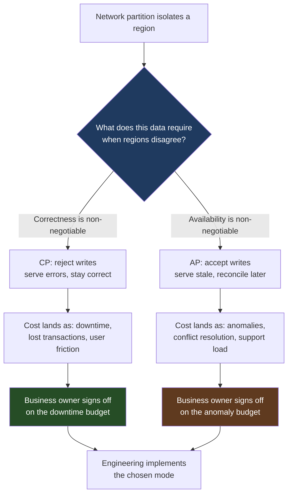
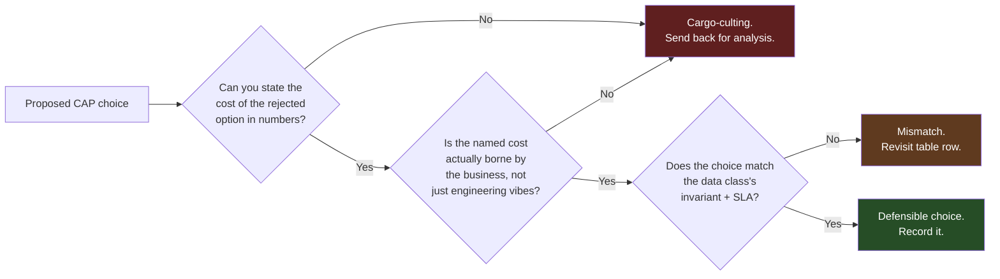
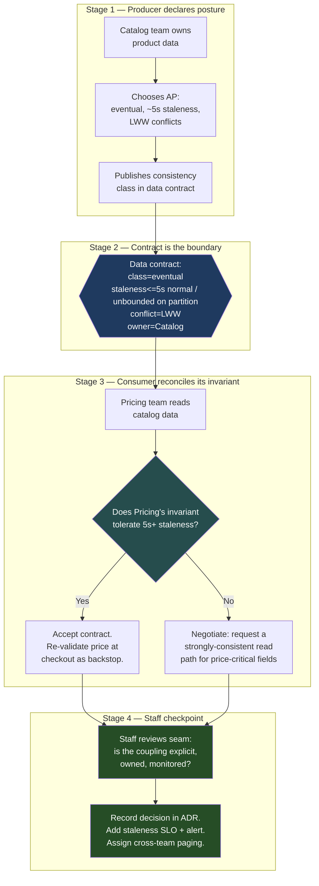

# CAP Theorem — Staff / Principal Level

At junior and senior levels, CAP is a technical theorem: under a network partition you must sacrifice either consistency or availability. At Staff/Principal level, CAP stops being a theorem you *prove* and becomes a decision you *broker*. The interesting part is no longer "what does the formula say" — it is *who in the organization is allowed to make this choice, how much it costs them when it goes wrong, and whether you can express the trade-off in a sentence a VP of Finance will sign off on.*

This document is about wielding CAP across teams and across years. It assumes you already know that C is linearizability, A is total availability, P is partition tolerance, and that real systems live on the PACELC spectrum (else-latency-vs-consistency when there is no partition). If those terms are unfamiliar, read the senior-level material first. Here we treat CAP as an organizational and communication instrument.

---

## Table of contents

1. [Why CAP is a communication tool, not an engineering detail](#1-why-cap-is-a-communication-tool-not-an-engineering-detail)
2. [The one sentence that reframes CAP as a business decision](#2-the-one-sentence-that-reframes-cap-as-a-business-decision)
3. [The business-decision framing table](#3-the-business-decision-framing-table)
4. [CAP cargo-culting and how to kill it](#4-cap-cargo-culting-and-how-to-kill-it)
5. [The choice is often already made: SLA, contract, and regulation](#5-the-choice-is-often-already-made-sla-contract-and-regulation)
6. [Data-class ownership and data contracts across teams](#6-data-class-ownership-and-data-contracts-across-teams)
7. [Staged cross-team data-contract flow](#7-staged-cross-team-data-contract-flow)
8. [Second-order consequences: the iceberg under the choice](#8-second-order-consequences-the-iceberg-under-the-choice)
9. [Buy the choice: Spanner-style CP vs Dynamo-style AP](#9-buy-the-choice-spanner-style-cp-vs-dynamo-style-ap)
10. [A decision record template you can mandate](#10-a-decision-record-template-you-can-mandate)
11. [Anti-patterns and failure stories](#11-anti-patterns-and-failure-stories)
12. [What "good" looks like at this level](#12-what-good-looks-like-at-this-level)

---

## 1. Why CAP is a communication tool, not an engineering detail

A Staff engineer's leverage does not come from picking AP or CP correctly on one service. It comes from making the *organization* pick consciously, repeatedly, and consistently. The failure mode that costs companies the most is not choosing wrong — it is choosing *implicitly*, where a database default or a framework convention silently decides a business question that nobody with business authority ever saw.

Consider how the decision usually surfaces. An engineer picks a datastore. The datastore has a default consistency mode. A multi-region deployment ships. Eighteen months later a fiber cut isolates `eu-west`, the system serves stale balances, two customers double-spend a gift-card credit, and now Finance is in a war room asking *who decided we would serve stale balances.* The honest answer — "nobody decided; it was the default" — is the most expensive sentence in engineering. Your job is to make sure that sentence can never be true.

So the first reframing: **CAP under partition is a question about the business's risk appetite, expressed in the vocabulary of money and trust, not latency and quorums.** The engineering is downstream. The Staff engineer's deliverable is a *forced, documented, cross-functional choice* — ideally before a single line of replication code is written.

The shape of the conversation you must enable:

> "When a region is cut off from the rest of the system, we have exactly two options for this data: **reject the writes** (the customer sees an error, the feature is unavailable, but the data stays correct), or **accept the writes and reconcile later** (the customer is served, but two regions can disagree and we may have to undo or merge their actions afterward). This is not a technical preference. It is a business choice about which is worse for *this specific data*: a customer who can't act, or a customer who acts on stale information. Pick one. I'll build whichever you pick — but you have to pick."

Notice what that paragraph does. It contains no jargon — no "linearizability," no "quorum," no "vector clock." It contains a cost on each side. And it ends by handing the decision to the people who own the cost. That is the entire skill.

The diagram's center node is owned by the business. Both leaf nodes have a named cost. Engineering only appears at the bottom. That ordering is deliberate and it is the thing most teams get backwards.

---

## 2. The one sentence that reframes CAP as a business decision

Most cross-functional misalignment on CAP comes from engineers describing the *mechanism* ("we use quorum reads with R+W>N") instead of the *outcome* ("during a regional outage, customers in the affected region cannot place orders, but no order is ever lost"). Stakeholders cannot evaluate a mechanism. They can evaluate an outcome with a price tag.

Train yourself and your org to translate every CAP decision into this template:

> **"During a partition, for *[data class]*, we will *[reject / accept]* writes, which means customers experience *[concrete outcome]*, costing approximately *[$ / trust / load]*, instead of *[the other concrete outcome]*, which would cost *[$ / trust / load]*."**

Fill it in for a payments ledger:

> "During a partition, for the *payments ledger*, we will *reject* writes, which means affected customers *cannot complete checkout for up to N minutes*, costing approximately *$X in delayed revenue per minute of partition*, instead of *accepting writes and risking double-charges or phantom balances*, which would cost *chargebacks, regulatory exposure, and a multi-day reconciliation effort.*"

Fill it in for a social-feed "like" counter:

> "During a partition, for the *like counter*, we will *accept* writes, which means the count may *briefly be wrong by a few in each region and self-heal within seconds*, costing approximately *nothing measurable*, instead of *rejecting writes*, which would cost *a visibly broken feature for no benefit*."

The same theorem, two opposite answers, and in both cases a non-engineer can immediately tell whether the answer is sane. That legibility is the deliverable. If your stakeholders ever say "I don't understand the trade-off, just do what's best technically," you have failed to translate — and you have just accepted accountability for a business risk that was never yours to own.

---

## 3. The business-decision framing table

This is the artifact a Staff engineer brings to the room. It maps each data class to the cost of inconsistency, the cost of unavailability, and the resulting choice. It is deliberately phrased so that product and finance can challenge any row without understanding a single distributed-systems concept.

| Data class | Cost of **inconsistency** (serve stale / accept conflicting writes) | Cost of **unavailability** (reject writes during partition) | Choice | Who owns sign-off |
|---|---|---|---|---|
| Financial ledger / payments | Catastrophic: double-spend, regulatory breach, unbalanced books, fraud, audit failure | Bounded: revenue delayed (not lost), customer retries, measurable per-minute cost | **CP** | CFO / Finance + Compliance |
| Inventory (oversellable goods) | High: oversell → cancellations, refunds, brand damage, possible legal exposure per SKU | Medium: "add to cart" fails, lost conversions, recoverable | **CP** (or AP + hard reservation budget) | Head of Commerce |
| Inventory (infinite digital goods) | Low: no scarcity to violate | Medium: lost sales during outage | **AP** | Product |
| User auth / session tokens | High: stale revocation = security hole; stale grant = lockout | Catastrophic: nobody can log in, whole product is down | **CP for revocation, AP for reads** (split the data class) | Security + Product |
| Shopping cart contents | Low: last-write-wins or merge is acceptable, user re-adds | High: user can't shop, abandons | **AP** | Product |
| Social graph / follows | Low: eventual visibility is expected by users | High: core engagement loop blocked | **AP** | Product |
| Like / view / reaction counters | Negligible: approximate counts are fine, self-heal | High: visibly broken feature | **AP** | Product |
| Audit / compliance log | High: a gap or reordering can fail an audit | Medium: writes can be buffered/queued, eventual is fine if *durable and ordered* | **CP-ish: durability + ordering over availability** | Compliance |
| Pricing / promotions | High: stale price = sell below cost or legal "advertised price" obligation | Medium: fall back to last-known-good price | **CP for activation, AP for serving cached** | Finance + Legal |
| User profile / preferences | Low: stale display name is harmless | Medium: settings page errors annoy | **AP** | Product |

Three things make this table powerful in practice:

**It splits "data class," not "service."** The auth and inventory rows show that a single service often holds *multiple* data classes with *opposite* answers. Token *revocation* must be CP (a revoked token serving as valid is a security incident); token *validation reads* can be AP (cache the public key, accept brief staleness). Treating "the auth service" as one CAP choice is the single most common modeling error. Decompose to the data class.

**Every row has a named owner.** CAP choices that lack a business owner default to whatever the database vendor shipped. The "Who owns sign-off" column is what converts an engineering preference into an organizational decision with accountability. When the partition eventually happens, the war room asks "what did we decide and who decided it," and this column has the answer.

**Both cost columns are filled even when one is obviously larger.** Forcing yourself to write the cost of the *unchosen* option prevents cargo-culting. If you can't articulate why you're *not* choosing AP for the ledger, you don't understand the choice well enough to defend it under pressure.

---

## 4. CAP cargo-culting and how to kill it

Cargo-culting is choosing a CAP posture for its reputation rather than for its measured cost. It runs in both directions.

**AP cargo-culting ("we chose eventual consistency because we need to scale").** This is the more fashionable error. "Scale" is invoked as a magic word, and an AP datastore is adopted without anyone quantifying the rate or cost of the anomalies it will produce. The trap: AP doesn't make the consistency problem go away — it *relocates* it from the database into your application code, your customer-support queue, and your reconciliation pipeline. Those costs are real, recurring, and usually larger than the latency you saved. A team "scales" by picking Cassandra, then spends two engineer-years writing conflict-resolution logic, building a reconciliation job, and staffing a support team to manually fix the anomalies — a cost that dwarfs the read-replica setup they were avoiding.

The question that kills AP cargo-culting: **"At our partition frequency and write rate, how many conflicting writes per day does this produce, what's the per-conflict resolution cost, and who pays it?"** If the team can't answer with numbers, they haven't earned the AP choice. Often the honest math is: partitions are rare, conflicts are rarer, and the "scale" they needed was *throughput*, which read replicas or sharding deliver without giving up consistency. Throughput and consistency are not the axis CAP describes. People conflate "I need more QPS" with "I need AP," and they are unrelated.

**CP cargo-culting ("we chose strong consistency to be safe").** The quieter, more expensive error. A team picks a strongly-consistent posture for data that didn't need it, and eats *avoidable downtime* every time the coordinating node or quorum is unreachable. A "like" counter behind a synchronous global quorum will go down during partitions for zero business benefit — you've spent availability to protect an invariant nobody cared about. Worse, CP often imposes a steady-state *latency* tax (the PACELC "else" branch): every write pays cross-region coordination cost even when there's no partition, degrading p99 for data that would have been perfectly fine eventually consistent.

The question that kills CP cargo-culting: **"What is the actual invariant this data must preserve, and what does it cost the business if that invariant is briefly violated?"** If the answer is "nothing really," you bought availability loss and latency for nothing.

The cure for cargo-culting in both directions is the same: **force a number onto the rejected option.** A choice you can only defend with an adjective ("safer," "more scalable") is a choice you haven't made.

---

## 5. The choice is often already made: SLA, contract, and regulation

A senior engineer opens the CAP debate. A Staff engineer first checks whether the debate is *already closed* by a constraint nobody mentioned. Frequently the consistency posture is dictated before engineering has any say — by a customer SLA, a commercial contract, or a regulation — and arguing the trade-off on technical grounds is wasted motion (or, worse, proposes something illegal).

Where the choice is pre-decided:

**Financial ledgers and double-entry accounting.** Regulatory frameworks and basic accounting integrity require that books balance and that no transaction is lost or duplicated. This is effectively a mandate for strong consistency (or for an architecture that achieves equivalent guarantees, e.g., an append-only event log with a single ordering authority). You do not get to "choose AP for the ledger to scale" — the auditors, not the architects, made this call. The engineering question is only *how* to satisfy CP affordably, not *whether* to.

**Inventory with real scarcity and oversell penalties.** If your contracts with sellers or your consumer-protection obligations make overselling expensive (refunds, penalties, fulfillment of a sale you can't honor), the cost of the inconsistency is contractually fixed and usually exceeds the cost of a brief "out of stock" during a partition. The contract has quantified the inconsistency cost for you. Read it before you architect.

**Data residency and sovereignty (GDPR, data-localization laws).** These can *force* partition-tolerant, region-isolated topologies — sometimes pushing you toward AP between regions because the law forbids the cross-region coordination a global CP system would require. Here regulation pushes the *opposite* way from the ledger case. The point is not which way it pushes; the point is that **the legal/contractual layer often sets the boundary conditions before CAP is an engineering question at all.**

**Contractual uptime SLAs (e.g., 99.99%).** A four-nines availability commitment is roughly 52 minutes of allowed downtime per year. If your CP design's coordinator failover or quorum-loss behavior can plausibly exceed that during partitions, your *contract* has already told you that you cannot afford that CP design as-is — you need either a more available CP system (faster failover, smaller blast radius) or an AP fallback for the SLA-bound paths. The SLA is a hard input to the CAP equation, not a thing CAP gets to override.

The Staff move: **before framing CAP as a choice, enumerate the constraints that have already chosen for you.** Pull the SLA. Read the relevant clause of the seller contract. Ask Compliance which invariants are regulated. Half the time, the "debate" collapses to "the law/contract requires CP here; our job is to make CP cheap," and you've saved the org a week of opinion-driven design review. The other half, you've documented *why* you're free to choose — which is itself a defensible decision record.

---

## 6. Data-class ownership and data contracts across teams

The most insidious CAP failures are *cross-team.* Team A owns a service and reasonably chooses AP for its own data — eventual consistency is fine for *their* invariants. But Team B consumes that data and has built an invariant that silently *assumes* strong consistency. Team A's perfectly-reasonable local choice corrupts Team B's correctness, and nobody finds out until production. No one did anything wrong locally; the failure is in the seam between them.

Example: the Catalog team serves product data AP — eventually consistent, sometimes a few seconds stale, totally fine for browsing. The Pricing team reads catalog data to compute promotional eligibility and *assumes* it reads a consistent snapshot. During a partition, Pricing reads a stale "in promotion" flag, applies a discount that was already revoked, and the company sells below cost. Catalog's AP choice was correct *for Catalog.* It was poison *for Pricing.* The bug lives in the contract that was never written.

The Staff-level fix is to treat the consistency guarantee as **part of the data's published contract**, with the same status as its schema. A data contract between teams should declare, explicitly:

- **Consistency class:** strong / read-your-writes / monotonic / eventual-with-bounded-staleness / eventual-unbounded.
- **Staleness bound:** "reads may lag writes by up to T seconds under normal operation; unbounded during partition."
- **Conflict semantics:** last-write-wins / merge / CRDT-converged / manual-resolution — and what a consumer should expect if they read mid-conflict.
- **Partition behavior:** "during a partition, this feed continues to serve (stale) / stops serving / returns a freshness header you must check."
- **Ownership:** which team owns the guarantee and is paged when it's violated.

The contract turns an invisible assumption into a negotiated, versioned interface. Now if Pricing needs strong consistency, that requirement is *visible* and *priced*: either Catalog provides a strongly-consistent read path for the fields Pricing depends on, or Pricing builds its own reconciliation/validation, or Pricing accepts the staleness and changes its invariant (e.g., re-validates price at checkout against an authoritative source). All three are fine — but the choice is now explicit, owned, and recorded, instead of being a latent production incident.

| Without data contracts | With data contracts |
|---|---|
| Consistency guarantee is implicit, learned from the source of an outage | Consistency class is a declared, versioned field of the interface |
| One team's AP choice silently breaks another's invariant | Downstream invariant assumptions are visible and negotiated |
| Staleness discovered in a war room | Staleness bound is documented and monitored against |
| Conflict semantics are a surprise | Conflict resolution behavior is part of the published spec |
| "Who owns this guarantee?" answered after the incident | Ownership and paging are pre-assigned |
| Cross-team CAP coupling is accidental | Cross-team CAP coupling is intentional and reviewed |

---

## 7. Staged cross-team data-contract flow

The diagram below stages how a consistency requirement should flow across teams — from the upstream team that *produces* a data class, through the published contract, to a downstream consumer whose invariant depends on it. The staging shows where the Staff engineer inserts a checkpoint so that an upstream AP choice cannot silently break a downstream consumer.

The load-bearing element is **Stage 4**. Stages 1–3 happen naturally as teams build. What separates a Staff engineer from a senior one is institutionalizing the checkpoint: every cross-team data dependency that crosses a consistency boundary gets a recorded decision, a monitored staleness bound, and an owner. Without Stage 4, the org accumulates invisible CAP coupling that only becomes visible during the partition that takes it down.

---

## 8. Second-order consequences: the iceberg under the choice

The CAP choice is the tip. The submerged mass is the engineering, organizational, and operational cost that the choice *commits you to for years.* Staff engineers are judged on whether they accounted for the iceberg, not the tip.

**AP commits you to conflict-resolution code — forever.** Choosing "accept writes during partition" means two regions can produce divergent writes that must later be reconciled. Someone has to *write the merge logic*: last-write-wins (and accept lost updates), CRDTs (and accept their modeling constraints and memory overhead), or application-specific merge (and maintain it as the schema evolves). This is not a one-time cost. Every new field, every new write path, re-opens the conflict-resolution question. The team that chose AP for "scale" owns a permanent tax on every future feature touching that data.

**Anomalies become customer-support load.** When the system serves stale or conflicting data, customers notice — "I was charged twice," "my item disappeared from the cart," "the count is wrong." Each anomaly that escapes into production becomes a support ticket, an escalation, sometimes a refund. At scale, the anomaly rate times the support cost per ticket is a real operating-expense line. A Staff engineer estimates this *before* choosing AP and includes it in the cost-of-inconsistency column. If support headcount has to grow to absorb anomalies, that cost belongs in the decision.

**Reconciliation pipelines become standing infrastructure.** AP systems that matter usually need a batch or streaming reconciliation job that detects divergence and repairs it — comparing regions, resolving conflicts the live merge couldn't, generating correction entries. This pipeline is itself a system: it needs monitoring, on-call, alerting on backlog, and correctness testing (a buggy reconciliation job corrupts data faster than the anomalies it fixes). Budget it as a first-class component, not a script.

**CP commits you to downtime budget and latency tax.** The CP iceberg is operational. You commit to *eating unavailability* during partitions and coordinator failures — which means your error budget, your on-call runbooks, and your SLA all have to absorb it. You also commit to the steady-state coordination latency (the PACELC "else" tax): every strongly-consistent write pays cross-region round-trips even when there's no partition. For globally distributed CP, that can be tens to hundreds of milliseconds per write, which propagates into every user-facing latency SLO that depends on it.

| Choice | Tip (the decision) | Iceberg (the standing cost you own) |
|---|---|---|
| **AP** | "We accept writes during partition" | Conflict-resolution code (perpetual), CRDT/merge maintenance, anomaly→support load, reconciliation pipeline as standing infra, customer-trust erosion from visible anomalies |
| **CP** | "We reject writes during partition" | Downtime budget consumed on partition/failover, latency tax on every write (PACELC else-branch), more complex failover runbooks, capacity for quorum, harder multi-region story |

The meta-skill: when someone proposes a CAP posture, ask **"what does this commit us to building and operating for the next three years?"** The right answer is never "nothing." If the proposer thinks it's free, they've only seen the tip.

---

## 9. Buy the choice: Spanner-style CP vs Dynamo-style AP

A defensible Staff move is to *not build the consistency machinery yourself* — to buy a datastore that bakes the CAP choice in, and inherit its guarantees, its operational maturity, and its conflict handling. The two archetypes:

**Spanner-style CP (Google Cloud Spanner, CockroachDB, YugabyteDB, and similar "NewSQL").** You buy strong consistency (external/linearizable) across regions, with horizontal scale and SQL. The vendor solved the hard part: global ordering (Spanner via TrueTime and bounded clock uncertainty; CockroachDB via hybrid logical clocks). You inherit CP, you inherit a high-availability story (these survive minority failures without giving up consistency), and you *don't write conflict-resolution code* because there are no conflicts to resolve — writes are serialized. The cost: write latency includes commit-wait / coordination overhead, you pay a premium price (especially Spanner), and you're now coupled to that system's operational and pricing model.

**Dynamo-style AP (Amazon DynamoDB in its eventually-consistent mode, Cassandra, Riak, ScyllaDB).** You buy availability and partition tolerance with tunable consistency. The vendor solved replication, hinted handoff, and gossip; you inherit AP and very high write availability. But the conflict problem is *handed to you* — last-write-wins by default (with its silent lost-update risk) or application-level resolution you must implement. You inherit availability; you do *not* inherit correctness. That part is still your job.

| Dimension | Spanner-style CP (buy) | Dynamo-style AP (buy) |
|---|---|---|
| What you inherit | Linearizable reads/writes, global ordering, no conflicts to resolve | High write availability, partition tolerance, replication machinery |
| What's still your job | Tolerating write latency, capacity/cost planning | Conflict resolution, anomaly handling, reconciliation |
| Steady-state latency | Higher writes (commit-wait / coordination) | Lower writes (no global coordination) |
| Behavior under partition | Minority side may reject writes; correctness preserved | Both sides accept writes; reconcile later |
| Operational maturity inherited | High (managed CP is well-trodden) | High (managed AP is well-trodden) |
| Cost profile | Often premium (esp. Spanner); pay for coordination | Often cheaper per-write; pay in engineering for conflicts |
| Lock-in risk | High: TrueTime/SQL-dialect/feature coupling; migration off is a project | Medium-high: data model + LWW semantics coupling; conflict logic is yours but portable-ish |
| Best when | Ledgers, inventory, anything with a hard invariant + budget | High-write, conflict-tolerant data; carts, feeds, telemetry |

**The lock-in and cost reckoning is the Staff-level part.** Buying the choice is often correct — building a globally-consistent store yourself is a multi-year mistake for almost everyone, and managed AP stores save you from re-deriving Dynamo. But "buy" is not free of judgment:

- **Lock-in is a strategic liability, not a footnote.** Spanner's value *is* TrueTime, and TrueTime doesn't exist off Google's infrastructure; migrating off Spanner means re-solving global ordering. That coupling should be a conscious, owned decision — "we are betting this data on GCP for the foreseeable future" — not a side effect of a quick proof-of-concept that ossified.
- **The cost model must be projected at scale, not at prototype.** Managed CP stores can be expensive per operation; managed AP stores can surprise you with the *engineering* cost of conflict handling even though the storage bill looks cheap. Model both the infra bill and the headcount cost at projected scale before committing.
- **"Buy the choice" still requires you to know the choice.** A managed store with a default consistency mode that nobody examined is just cargo-culting with a vendor logo. You must still map each data class to the right mode (DynamoDB and Cassandra both offer per-operation consistency tuning; using it correctly is *your* judgment, not the vendor's).

The strongest Staff outcome is frequently a **deliberate split**: buy Spanner-style CP for the small set of data classes with hard invariants (ledger, inventory, auth-revocation), and buy Dynamo-style AP for the large volume of conflict-tolerant data (sessions, feeds, telemetry, carts). You've matched each data class to a bought system whose baked-in CAP choice is correct for it — and you've documented why, so the next engineer doesn't "consolidate everything onto one database" and silently break the split.

---

## 10. A decision record template you can mandate

Staff influence scales through artifacts, not conversations. Mandate that any new data class crossing a partition boundary ships with a short CAP decision record (an ADR). The template:

- **Data class & owner.** Exactly which data, which team owns the guarantee.
- **Constraints already in force.** SLA clause, contract clause, regulation — does anything pre-decide this? (See §5.) If yes, cite it; the rest of the record explains *how to satisfy it*, not whether.
- **Invariant.** The one sentence describing what must stay true (e.g., "the ledger must always balance," "a token, once revoked, is never accepted").
- **Partition behavior, in plain language.** "When a region is isolated, we will [reject/accept] writes for this data, so customers experience [outcome]."
- **Cost of inconsistency** and **cost of unavailability**, both with numbers or named consequences. (Forcing the rejected option's cost kills cargo-culting — §4.)
- **Choice.** CP / AP / split-by-field, and for split, which fields go which way.
- **Second-order commitments.** Conflict-resolution approach, reconciliation pipeline, anomaly→support estimate, latency/downtime budget impact. (§8.)
- **Build vs buy.** Which datastore, what we inherit, what's still our job, lock-in accepted. (§9.)
- **Cross-team contract.** Consistency class, staleness bound, conflict semantics, partition behavior, paging owner — published for consumers. (§6.)
- **Monitoring.** The staleness SLO, the conflict-rate alert, the reconciliation-backlog alert.
- **Sign-off.** The business owner from the framing table (§3) who accepted the risk.

The sign-off line is the point of the whole document. It converts an engineering decision into an *organizationally accountable* one. When the partition happens — and over a multi-year horizon it will — the war room opens this record, sees the decision was conscious, sees who accepted the risk, and the conversation is "the documented trade-off held / didn't hold" instead of "who let this happen."

---

## 11. Anti-patterns and failure stories

**The default-database decision.** Nobody chose; the framework or vendor default chose. The partition serves stale balances and Finance learns the consistency posture of its money during an incident. *Fix:* no data class crossing a partition boundary ships without a recorded, signed-off CAP decision.

**"AP because scale."** A team adopts an eventually-consistent store invoking "scale," never quantifies the conflict rate, and spends years on conflict-resolution and reconciliation that costs more than the consistency they discarded — when what they actually needed was throughput, which sharding/replicas deliver under CP. *Fix:* demand the conflict-rate number; separate "I need QPS" from "I need AP."

**"CP to be safe."** A team wraps conflict-tolerant data (counters, feeds) in synchronous global coordination, eating partition-time downtime and steady-state latency for an invariant nobody cares about. *Fix:* demand the invariant and its violation cost; if it's "nothing," don't pay for CP.

**The silent cross-team corruption.** Upstream's locally-correct AP choice violates a downstream consumer's hidden strong-consistency assumption; discovered in production. *Fix:* consistency class is a published, versioned field of the data contract, with a Staff checkpoint at the seam (§6–§7).

**Modeling the service, not the data class.** "The auth service is CP" — but revocation needs CP and validation reads can be AP; treating the service as one choice over-constrains one path and under-protects another. *Fix:* decompose to data class; split-by-field is normal and often optimal.

**Buy-and-forget.** A managed store is adopted at its default consistency mode and nobody examined whether the default matches the data class — cargo-culting with a vendor invoice. *Fix:* "buy the choice" still requires *making* the choice and tuning per-operation consistency where the store supports it.

**Mistaking the theorem for the decision.** The engineer "knows CAP," picks correctly in isolation, and never frames it for the business — so the risk lands on engineering's shoulders by default, with no business sign-off when it costs money. *Fix:* the deliverable is a *brokered, owned, recorded* business decision, not a correct technical pick.

---

## 12. What "good" looks like at this level

A Staff/Principal engineer who has internalized CAP-as-organizational-instrument produces an org where:

- Every data class crossing a partition boundary has a **recorded, business-signed CAP decision** — and the database default is never the de facto decision-maker.
- The trade-off is always expressible in **one jargon-free sentence with a cost on each side**, so product, finance, and compliance can challenge it.
- **No CAP choice is defended with an adjective.** The rejected option always has a number, which is what kills cargo-culting in both directions.
- The team checks **what the SLA, contract, and regulation already decided** before opening any technical debate — and documents the constraint as the input it is.
- Consistency guarantees are **published, versioned data contracts**, so no team's local AP choice silently corrupts a downstream consumer's invariant, and cross-team consistency coupling is intentional and monitored.
- The **second-order costs** — conflict code, reconciliation pipelines, support load, latency/downtime budget — are estimated *before* the choice and owned *after* it.
- Build-vs-buy is a **conscious bet** with lock-in and cost-at-scale projected, frequently expressed as a deliberate per-data-class split between a CP store and an AP store.

The throughline: CAP at this level is not about being right under partition. It is about ensuring the organization makes the choice *consciously, legibly, and accountably* — over and over, across teams and years — so that when the partition finally happens, the answer to "who decided this?" is a name on a signed decision record, not a database default nobody ever looked at.

*Next step:* [Interview questions](interview.md)
