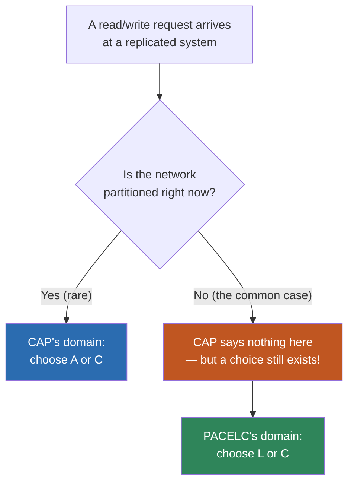
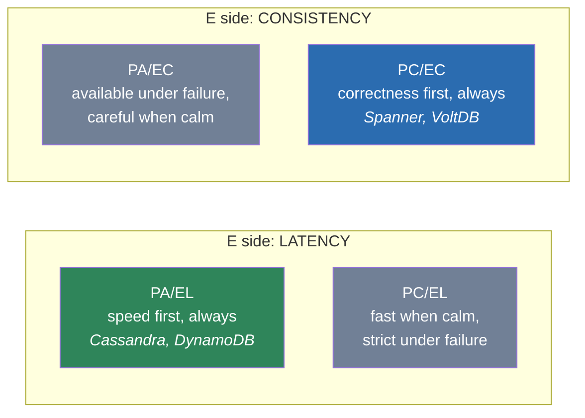
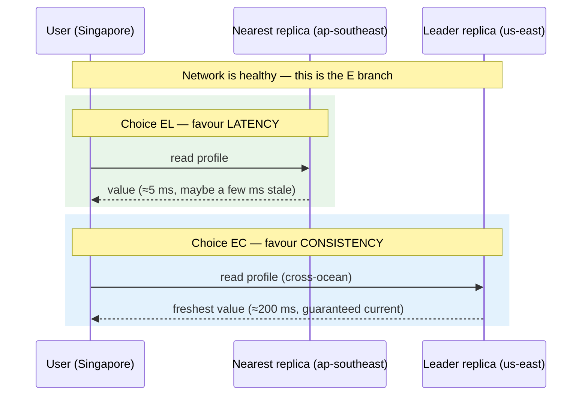
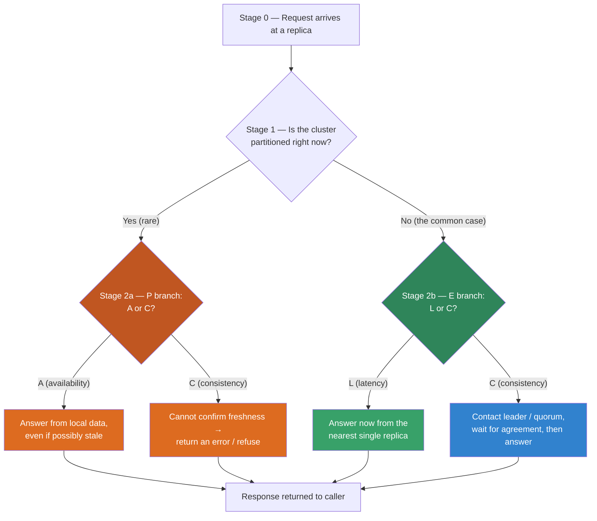

# PACELC — Junior

<!-- level-focus -->
At junior level, focus on this question:

> How can I apply **PACELC** in one small example and prove the result?

Use the smallest realistic scenario that exposes the decision and its failure behavior.
PACELC is the trade-off theorem that finishes the sentence CAP started. CAP told you what happens to a replicated system **during** a network partition. PACELC adds the part CAP forgot: what happens the rest of the time — which is almost all of the time. This page builds the intuition from the ground up, with a decision table, a staged read-path diagram, and a classification of real systems you have probably used.

---

## 1. The one-sentence mnemonic

Read PACELC as a sentence that branches in the middle:

> **If** there is a **P**artition, choose between **A**vailability and **C**onsistency.
> **E**lse (no partition, the normal case), choose between **L**atency and **C**onsistency.

That is the whole theorem. Five capital letters, two `if/else` branches, four leaf outcomes. Say it out loud a few times and you own the model:

> "**P**, **A** or **C**; **E**, **L** or **C**."

The letters were chosen by Daniel Abadi (the researcher who proposed PACELC in 2010) to make the acronym pronounceable — roughly "pass-elk." You will see systems labelled like `PA/EL` or `PC/EC`: the part before the slash is the partition behaviour, the part after is the everyday behaviour.

The single most important habit this page wants to build: **whenever you describe a distributed data store, give it both halves.** Saying "Cassandra is AP" is half an answer. Saying "Cassandra is **PA/EL**" tells the listener what it does during a partition *and* what it does on a calm Tuesday afternoon.

---

## 2. A 30-second refresher on CAP

CAP says: when a network **partition** splits your replicas into groups that cannot talk to each other, a replicated system can guarantee at most **two** of these three:

- **C**onsistency — every read sees the most recent write (a single, agreed-upon value).
- **A**vailability — every request gets a non-error answer.
- **P**artition tolerance — the system keeps working despite messages being dropped between nodes.

The catch people miss: in any real network, partitions **will** happen — cables get cut, switches reboot, a data centre loses its uplink. So `P` is not really optional; it is a fact of life. That collapses CAP into a single live decision: **when a partition strikes, do you sacrifice C or sacrifice A?**

- Keep **A**: every replica keeps answering with whatever local data it has, even if that data is stale. (An **AP** system.)
- Keep **C**: replicas that cannot confirm they hold the latest value refuse to answer rather than risk returning something wrong. (A **CP** system.)

That is genuinely useful. But notice what CAP is silent about: **the network is healthy almost all the time.** What governs the system's behaviour then? CAP shrugs. PACELC answers.

---

## 3. The insight CAP misses

Here is the heart of PACELC, stated as plainly as possible.

**Even when the network is perfectly healthy, a replicated system still faces a choice on every single request.** It can either:

- answer **immediately from the nearest single replica** — fast, but that replica might be a few milliseconds behind the others (possibly **stale**); or
- **wait for several replicas to agree** on the current value before answering — fresh and correct, but slower because it pays for extra round trips between machines.

This is **not** the partition decision. There is no failure happening. The data is replicated for good reasons — to survive a machine dying, to put data physically close to users, to spread out read load. But the moment you keep more than one copy of a value, the copies can momentarily disagree, and you must decide how patient you are willing to be before answering. **Patience costs latency. Impatience risks staleness.** That is the latency-versus-consistency trade, and you pay it on the calm, partition-free path that handles 99.9%+ of your traffic.

A short mental picture: imagine a fact written on whiteboards in three different offices. Someone updates the London whiteboard. For a brief moment, New York and Tokyo still show the old value while the update is couriered over. If you ask the *nearest* whiteboard, you get an instant answer that might be one courier-trip out of date. If you insist on phoning all three offices and waiting until they match, you get a guaranteed-correct answer but you waited for the phone calls. Replication makes copies; copies drift for an instant; you choose between speed and agreement.

> **Key takeaway:** CAP is about the rare emergency (a partition). PACELC's `E` branch is about the boring, constant, everyday cost of having more than one copy of your data.

---

## 4. Reading PACELC letter by letter

Let us decode each letter so the label is never mysterious again.

| Letter | Stands for | When it applies | The question it asks |
| ------ | ---------- | --------------- | -------------------- |
| **P** | Partition | The network is split | "We have a partition. What now?" |
| **A** | Availability | (answer to P) | Keep answering even if data may be stale. |
| **C** (after P) | Consistency | (answer to P) | Refuse to answer rather than serve possibly-wrong data. |
| **E** | Else | The network is healthy | "No partition. What governs us now?" |
| **L** | Latency | (answer to E) | Answer fast from the nearest replica, accept possible staleness. |
| **C** (after E) | Consistency | (answer to E) | Coordinate replicas for a fresh answer, accept higher latency. |

Two practical notes:

1. **`C` appears twice and means the same thing both times** — "every read reflects the latest write." What differs is the *price* you pay for it. On the `P` side the price is availability (you might error out). On the `E` side the price is latency (you wait). A system can choose consistency in one branch and not the other; that is exactly why we need two letters.
2. **The two halves are independent.** Knowing a system's partition behaviour does not tell you its everyday behaviour, and vice versa. That independence is what makes PACELC strictly more expressive than CAP.

---

## 5. The four combinations, explained simply

Combine the two branches — `{PA, PC}` × `{EL, EC}` — and you get four named profiles. Here is each one in plain language with the kind of workload it suits.

### PA/EL — "speed first, always"

- **During a partition:** stay **available**. Every replica keeps answering from local data even if it cannot reach its peers.
- **Normally:** favour **latency**. Answer from the nearest replica without waiting for global agreement.

This profile never makes the user wait for coordination and never refuses a request. The cost is that reads can be slightly stale and, after a partition heals, conflicting writes may need reconciling. **Best for:** shopping carts, social feeds, user sessions, telemetry — workloads where "fast and almost always right" beats "slow but perfectly fresh." This is the most common profile for large, latency-sensitive internet services.

### PC/EC — "correctness first, always"

- **During a partition:** favour **consistency**. Replicas that cannot confirm they hold the latest value will reject requests rather than risk a wrong answer.
- **Normally:** favour **consistency** too. Coordinate replicas on the read/write path so every answer is fresh.

This profile guarantees you never see stale or conflicting data, in exchange for higher latency on the happy path and possible unavailability during a partition. **Best for:** bank ledgers, inventory counts, billing, anything where a wrong-but-fast answer is worse than a slow-or-missing one.

### PC/EL — "correct under failure, fast under calm"

- **During a partition:** favour **consistency** (refuse rather than risk staleness).
- **Normally:** favour **latency** (answer fast from a nearby replica).

A pragmatic middle: be strict precisely when the network is misbehaving, but relax for speed when everything is fine. Less common, but it models systems that tighten their guarantees only when they detect trouble.

### PA/EC — "available under failure, careful under calm"

- **During a partition:** favour **availability** (keep answering, accept staleness).
- **Normally:** favour **consistency** (coordinate for fresh reads).

The mirror image of `PC/EL`, and the rarest in practice. It describes a system that pays for strong consistency on the healthy path but, when a partition hits, chooses to keep serving rather than block.

The two highlighted corners — `PA/EL` and `PC/EC` — are the ones you will meet most often, because most teams pick the *same* priority on both sides: either "always favour speed/availability" or "always favour correctness." The two grey corners are the deliberate hybrids.

---

## 6. The PACELC decision table

This is the table to internalize. Walk the two branches and pick one cell from each.

| Branch | Condition | Option | What the system does | What you give up |
| ------ | --------- | ------ | -------------------- | ---------------- |
| **P** (partition) | Replicas can't all reach each other | **A** — Availability | Keep answering from whatever local data exists | Reads may be stale; writes may later conflict |
| **P** (partition) | Replicas can't all reach each other | **C** — Consistency | Reject requests that can't be confirmed correct | Availability — some requests error out |
| **E** (else / healthy) | Network is fine | **L** — Latency | Answer from the nearest single replica, no waiting | Freshness — that replica may lag by a few ms |
| **E** (else / healthy) | Network is fine | **C** — Consistency | Coordinate replicas before answering | Speed — every request pays extra round trips |

How to use it when reasoning about a design:

1. Ask first: *"During a partition, would I rather return possibly-stale data, or return an error?"* That picks `A` or `C`.
2. Ask second: *"On a normal day, would I rather answer in single-digit milliseconds with maybe-slightly-stale data, or wait tens to hundreds of milliseconds for a guaranteed-fresh answer?"* That picks `L` or `C`.
3. Stitch the two answers together: e.g. `A` + `L` = **PA/EL**.

Most of the time the `E` (else) answer matters more, because that is the branch you exercise on nearly every request — see [section 10](#10-why-the-e-side-matters-more-day-to-day).

---

## 7. A concrete example: the global profile store

Make it real. Suppose you run a service that stores user **profiles** (display name, avatar, bio) for users all over the planet. To keep reads fast for everyone, you replicate the profile data to three regions: **us-east**, **eu-west**, and **ap-southeast**. Writes go to a designated **leader** replica; reads can be served by any replica.

Now a user in Singapore opens their profile page. The system has a choice, and the choice **is** PACELC's `E` branch in action:

- **Latency choice (`EL`):** serve the read from the **nearest** replica — `ap-southeast`, a few milliseconds away. The page paints almost instantly. The only risk: if someone just edited the bio via the leader in `us-east`, the Singapore replica might be a few hundred milliseconds behind, so the user could momentarily see the *old* bio.

- **Consistency choice (`EC`):** route the read to the **leader** (or wait for a quorum of replicas to agree) before answering. Now the bio is guaranteed current — but the request had to cross an ocean and back, so it might take 150–250 ms instead of 5 ms.

Neither answer is "wrong." For a profile bio, stale-by-a-moment is harmless and speed is delightful, so `EL` is the sensible pick. For, say, a user's **two-factor-authentication setting** or **account balance**, a stale read could be a security or money problem, so `EC` earns its latency.

Here is the everyday `E`-branch trade laid out as the data flows:

The same store, the same request, the same healthy network — and yet a real decision with a real cost. That decision is invisible to CAP and front-and-centre in PACELC.

---

## 8. Staged walk-through of a read

Let us slow the read path down into discrete stages and see exactly where each PACELC decision is made. Follow a single request from arrival to answer.

Read it stage by stage:

- **Stage 0 — arrival.** A read lands on some replica. Nothing has been decided yet.
- **Stage 1 — partition check.** The system effectively asks, "Can I reach the peers I'd need to guarantee correctness?" In healthy operation (the vast majority of the time) the answer is yes, and we fall to the right-hand `E` branch.
- **Stage 2a — the P branch (rare).** Only reached during an actual partition. Here the design's `A`-vs-`C` choice fires: an **A** system serves local (maybe stale) data; a **C** system would rather error than risk wrongness.
- **Stage 2b — the E branch (common).** Reached on every normal request. Here the design's `L`-vs-`C` choice fires: an **L** system answers immediately from the nearest replica; a **C** system reaches out to the leader or a quorum and waits.
- **Response.** All four paths end in an answer (or, on the `PC` path, a deliberate refusal).

Notice the asymmetry of *how often each branch runs*. Stage 2a is the dramatic one everybody talks about, but it almost never executes. Stage 2b runs constantly. That is the practical reason the `E` letters deserve as much of your attention as the `P` letters.

---

## 9. Classifying real systems

You can pin a PACELC label on most well-known data stores. Here are the headline two from the topic scope, plus a few more for context. (Real systems are often tunable — many can be configured toward stronger consistency or lower latency — so read these as the system's *default / characteristic* stance, not an unbreakable law.)

| System | PACELC label | During a partition (P) | When healthy (E) | One-line reason |
| ------ | ------------ | ---------------------- | ---------------- | --------------- |
| **Amazon DynamoDB** | **PA/EL** | Stays available, serves local data | Default reads favour low latency (eventually consistent) | Built for fast, always-on internet-scale reads; offers an opt-in "strongly consistent read" that shifts toward EC |
| **Google Spanner** | **PC/EC** | Prefers consistency; may reject to stay correct | Coordinates (using synchronized clocks) for fresh reads | Designed so applications can assume one true, current value globally |
| **Apache Cassandra** | **PA/EL** | Replicas keep answering independently | Tunable, but defaults favour latency | Dynamo-style, "always writeable," tunable consistency per query |
| **Apache HBase** | **PC/EC** | A region without its server is unavailable | Reads go to the single authoritative region server | Strong single-copy semantics on top of HDFS |
| **MongoDB (default)** | **PC/EC** | Minority side without a primary stops accepting writes | Reads from the primary are fresh | Single-primary replica set with majority writes |

The two anchors to memorize:

- **DynamoDB = PA/EL.** Partition? Keep serving. Healthy? Serve fast and maybe-slightly-stale. It is the textbook "speed and availability first" store.
- **Spanner = PC/EC.** Partition? Stay correct even if that costs availability. Healthy? Pay the coordination latency for a globally fresh answer. It is the textbook "correctness first" store.

These two sit on opposite corners of the four-box grid from [section 5](#5-the-four-combinations-explained-simply), which is exactly why they are the canonical examples — they make the contrast maximally visible.

---

## 10. Why the E-side matters more day to day

It is tempting to obsess over the `P` branch because partitions are dramatic and the CAP theorem made them famous. But step back and look at *frequency*:

- **Partitions are rare.** A well-run cluster might see a meaningful partition a handful of times a year, lasting seconds to minutes. The `P` branch governs maybe a few minutes of behaviour annually.
- **The latency-versus-consistency trade is paid on every request.** Every read, every write, all day, every day, on the healthy path, exercises the `E` branch. If your service handles ten thousand requests per second, that is ten thousand `E`-branch decisions per second.

So the `E` choice — `L` versus `C` — is the one that shapes what your users actually feel: page-load speed, the occasional "I just changed this, why does it still show the old value?" surprise, the cost of your cross-region traffic. The `P` choice matters intensely *when* a partition happens, but it happens rarely.

The numbers are illustrative, not measured — but the shape is the point. The branch you tune for "the common case" is the `E` branch. A senior engineer's instinct is therefore: **CAP tells me how I fail; PACELC's `E` tells me how I feel on a normal day — and I live in normal days.**

This reframing is the single most valuable thing PACELC adds. It moves the consistency conversation out of the "rare disaster" corner and into the "design decision I make for every request" centre, where it belongs.

---

## 11. Common misunderstandings

A few traps that catch people new to PACELC:

- **"PACELC replaces CAP."** No — it *extends* CAP. The `PA`/`PC` half **is** the CAP decision, restated; PACELC just bolts on the `E` branch that CAP never modelled.

- **"The two C's are different kinds of consistency."** They are the same property (a read sees the latest write). What differs is the *currency you pay*: availability on the `P` side, latency on the `E` side.

- **"A system has one fixed label forever."** Many real systems are **tunable**. DynamoDB can do a strongly-consistent read on request (nudging it toward `EC`); Cassandra lets you set consistency levels per query. Treat a label as the *default character*, and remember individual operations can dial it up or down.

- **"Latency on the `E` side means the partition kind of slowness."** No partition is involved in the `E` branch. The latency is simply the cost of coordinating multiple healthy replicas so they agree before answering — round trips between working machines, not failure recovery.

- **"If there's no partition, there's no trade-off."** This is the exact intuition PACELC exists to correct. Replication alone — even with a flawless network — forces the latency-versus-consistency choice, because copies can briefly disagree.

- **"More consistency is always better."** Consistency is a *cost*, paid in latency (and sometimes availability). For a like-counter or a feed, paying that cost buys you almost nothing a user would notice, while the latency hit is very noticeable. Match the guarantee to what the data actually needs.

---

## 12. What to remember

If you keep only a handful of things from this page, keep these:

1. **The mnemonic:** *if Partition, choose Availability or Consistency; Else, choose Latency or Consistency.* Say it as "P → A or C; E → L or C."

2. **The big idea CAP missed:** even with a perfectly healthy network, a replicated system must choose, on every request, between **answering fast from one replica (low latency, maybe stale)** and **waiting for replicas to agree (consistent, slower).**

3. **The `E` branch dominates your day.** Partitions are rare; the latency-versus-consistency trade is paid on every single request. Tune for the common case.

4. **Always give both halves of the label.** "Cassandra is AP" is incomplete; "Cassandra is **PA/EL**" is the full picture.

5. **The two anchors:** **DynamoDB = PA/EL** (speed and availability first) and **Spanner = PC/EC** (correctness first). Memorize these two opposite corners and you can place most other systems relative to them.

6. **Consistency is a cost, not a free virtue.** It buys correctness in exchange for latency (and, under partition, availability). Spend it where the data genuinely needs it.

With that, you can label any replicated store you meet, reason about how it will behave both during a rare partition and on an ordinary request, and explain *why* a globally-replicated profile read can be either lightning-fast-and-slightly-stale or guaranteed-fresh-but-slow. That is exactly the working intuition PACELC is meant to give you.

---

*Next step:* [Middle level](middle.md)

---

## Apply it

1. Choose one small, known input for **PACELC**.
2. Predict the output or observable behavior.
3. Run the smallest example or probe that exercises the concept.
4. Change one input to trigger a failure or boundary case.
5. Explain the evidence using the guide's vocabulary.

## Verify your work

- Record the exact input, command or code path, and output.
- Repeat the probe and confirm the result is consistent.
- Show one expected success and one expected failure.
- Resolve any difference between the prediction and the evidence.

## Review questions

- What problem does PACELC solve in the example?
- Which input changes the observed result, and why?
- What is the smallest useful success check?
- Which beginner mistake would your evidence catch?
