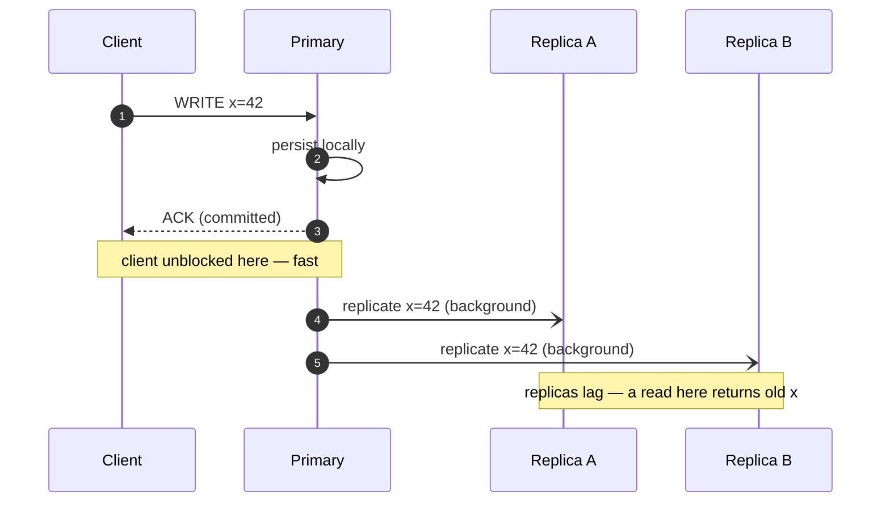
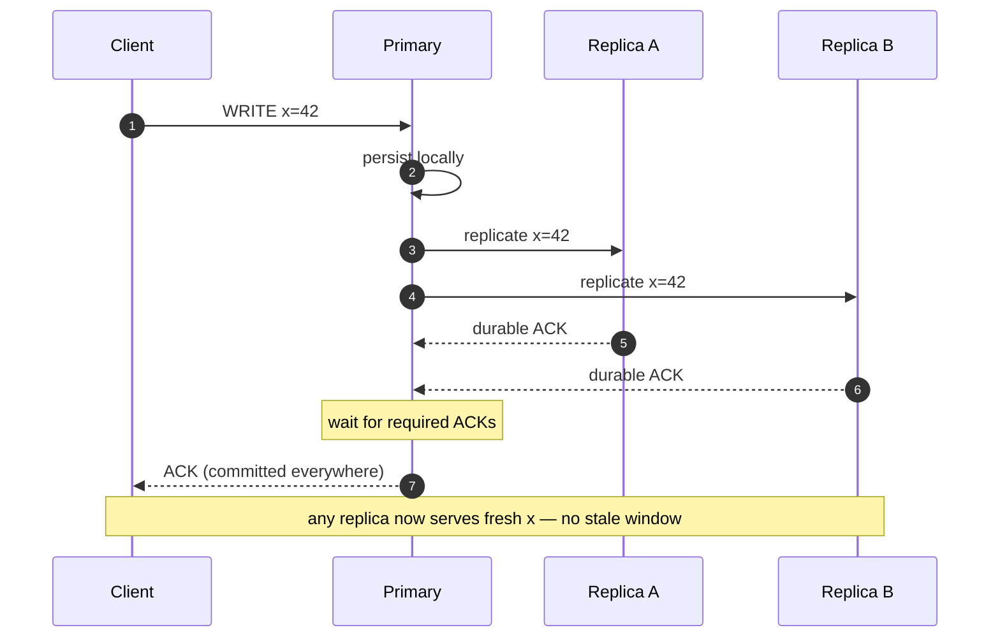
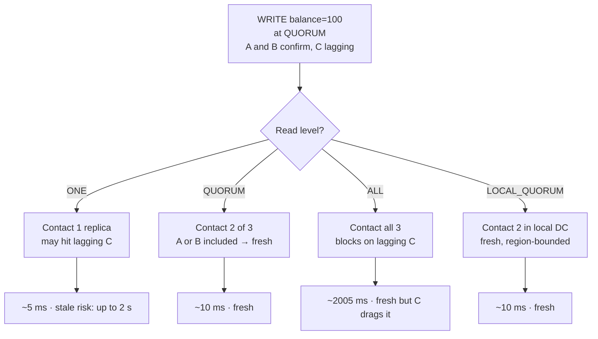
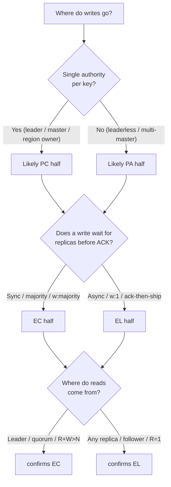

# PACELC — Middle

<!-- level-focus -->
At middle level, focus on this question:

> Where does **PACELC** belong in a maintainable component, and which trade-off selects the design?

Use the smallest realistic scenario that exposes the decision and its failure behavior.
PACELC extends CAP with the half that production systems live in 99.9% of the time: the **Else** clause. CAP only speaks during a partition (P); PACELC adds that **E**lse, when the network is healthy, a replicated store still chooses between **L**atency and **C**onsistency. The full statement: *if there is a Partition, trade between Availability and Consistency (PAC); Else, trade between Latency and Consistency (ELC).* This page is the practitioner's view: a verified classification of real systems, the replication mechanics that force the Else trade-off, and how tunable stores let you move the dial per request.

---

## 1. The Else clause is the one that bills you

Partitions are real but rare. A well-run datacenter network has partitions measured in minutes per quarter, not hours per day. If your reasoning stops at CAP, you have a model that only describes the rare case and says nothing about the steady state where every read and write actually happens.

The Else clause closes that gap. The moment you replicate data across more than one node — for durability, for read scaling, for geographic locality — every write has to decide **how many replicas must acknowledge before the client is told "done"**, and every read has to decide **how many replicas it must consult before returning a value**. Those two decisions are the entire EL-vs-EC trade-off:

- Wait for more replicas → stronger consistency, higher latency. This is **EC**.
- Wait for fewer replicas → weaker consistency, lower latency. This is **EL**.

There is no third option. You cannot have a value that is both confirmed-durable-on-all-replicas and returned without waiting for those replicas. The physics of the network (a round trip costs what it costs) make this a hard floor. PACELC's contribution is to name the floor and make it a deliberate design choice instead of an accidental property of whatever defaults your database shipped with.

> **The core middle-level intuition:** consistency is paid for in latency *during normal operation*, not just availability *during partitions*. A system that "never partitions" still has a PACELC label, because it still replicates, and replication still costs round trips.

---

## 2. Reading a PACELC label

A PACELC label has two independent halves joined by the Else:

```
P A/C  E  L/C
└─┬──┘     └─┬─┘
during a   during normal
partition   operation
```

- **First half (PA or PC):** behavior during a partition. PA = stay available, serve possibly-stale or conflicting data. PC = stay consistent, refuse or block requests that can't be made safe.
- **Second half (EL or EC):** behavior during normal operation. EL = favor latency, may return stale reads. EC = favor consistency, pay the latency.

The four combinations that occur in practice:

| Label | Meaning | Typical shape |
|-------|---------|---------------|
| **PA/EL** | Available under partition, low-latency normally | Dynamo-style, leaderless, eventual consistency |
| **PC/EC** | Consistent under partition, consistent normally | Single-leader with synchronous replication / consensus |
| **PC/EL** | Consistent under partition, low-latency normally | The rare hybrid (PNUTS): a primary copy guarantees timeline consistency, but normal reads come from possibly-stale local replicas |
| **PA/EC** | Available under partition, consistent normally | Almost theoretical; few real systems live here deliberately |

Two practical notes before the table:

1. **Most real systems are PA/EL or PC/EC.** Those two diagonal corners dominate because they are internally coherent: a system that gives up consistency when it's hard (partition) usually also gives it up when it's merely expensive (latency), and vice versa.
2. **Tunable stores don't have a single label.** Cassandra, DynamoDB, Cosmos DB, and others let you move along the axis *per request*. We classify them by their *default* and note the tuning range.

---

## 3. Master classification table of real systems

This is the centerpiece. Each entry gives the label, the *mechanism* that produces it, and the *justification* — because a label without a mechanism is trivia. "Default" means out-of-the-box configuration; many of these can be tuned.

| System | PACELC | Replication model | Justification |
|--------|--------|-------------------|---------------|
| **DynamoDB** | **PA/EL** (default) | Multi-replica, quorum-style; eventually-consistent reads by default | Default reads hit one replica → low latency, possible staleness (EL). Strongly-consistent reads are opt-in. Stays available under failures. Tunable toward EC per-read. |
| **Cassandra** | **PA/EL** (tunable) | Leaderless, replicas = RF, per-request consistency levels | Default ONE read/write favors latency and availability. Move to QUORUM/ALL to buy consistency at latency cost. Partition behavior: still serves whatever replicas are reachable (PA). |
| **Riak** | **PA/EL** | Leaderless Dynamo-style, N/R/W tunable, vector clocks | Designed explicitly on the Dynamo paper. Default favors availability and low latency; conflicts surface as siblings for the app to resolve. |
| **Cosmos DB** | **Tunable, often PA/EL** | Multi-region, 5 consistency levels (strong → eventual) | Strong + bounded-staleness lean EC; session/consistent-prefix/eventual lean EL. Multi-region writes stay available (PA). The most explicitly "pick your point" system. |
| **MongoDB** | **PC/EC** (default) | Single primary per replica set, oplog replication | Default `w:majority` write + reads from primary give consistency at latency cost (EC). On partition, a minority side has no primary and rejects writes (PC). Tunable toward EL via secondary reads / `w:1`. |
| **HBase** | **PC/EC** | Single RegionServer owns each region, HDFS underneath | Every key has exactly one serving node → strongly consistent reads/writes (EC). If that RegionServer is partitioned away, the region is unavailable until reassigned (PC). |
| **Spanner** | **PC/EC** | Paxos groups + TrueTime, synchronous majority replication | External (linearizable) consistency by design. Writes wait for a Paxos majority and TrueTime commit-wait → latency cost (EC). Minority partition cannot commit (PC). |
| **VoltDB / H-Store** | **PC/EC** | Synchronous k-safety replication, serializable single-threaded execution | Serializable ACID; commits replicate synchronously before acknowledging (EC). On partition it favors consistency, halting the minority (PC). |
| **PNUTS (Yahoo!)** | **PC/EL** | Per-record master, async replication, timeline consistency | The famous hybrid: a record's master enforces a single timeline (PC-ish — consistent ordering), but normal reads served from local async replicas favor latency over freshness (EL). See [section 9](#9-pnuts--the-interesting-pcel-case). |
| **MySQL (async replication)** | **PA/EL-ish** | Single primary, asynchronous binlog to replicas | Primary acks writes without waiting for replicas → low latency (EL), replicas lag → stale reads. Replicas stay readable if primary is unreachable (lean PA). Semi-sync changes this. |
| **PostgreSQL (sync replication)** | **PC/EC** | Single primary, synchronous commit to ≥1 standby | `synchronous_commit = on` with a sync standby blocks the commit until the standby acks → consistency at latency cost (EC). If no sync standby is reachable, the primary blocks rather than diverge (PC). |

Read the table as a spectrum, not eleven isolated facts. The PA/EL cluster (Dynamo, Cassandra, Riak, async MySQL) all share *no single authoritative replica on the read path*. The PC/EC cluster (Spanner, HBase, VoltDB, sync Postgres, default Mongo) all share *a designated authority that the write path must reach before acknowledging*. PNUTS is interesting precisely because it splits the difference.

---

## 4. Why replication design *creates* the Else trade-off

The Else trade-off is not a database "feature"; it falls out of three independent decisions every replicated system must make. Change any one and you move on the EL↔EC axis.

**Decision 1 — When does a write acknowledge?**

- *Async:* primary writes locally, acks the client immediately, ships changes to replicas in the background. Lowest write latency. Replicas lag → reads from them are stale → **EL**.
- *Sync:* primary waits for one or more replicas to durably acknowledge before acking the client. Higher write latency, but replicas are current → **EC**.

**Decision 2 — How many replicas does a read consult?**

- *One replica (nearest / any):* lowest read latency, may return a value that's behind → **EL**.
- *A quorum or all replicas:* read sees the latest acknowledged write (when paired with quorum writes), higher latency → **EC**.

**Decision 3 — Can reads come from followers, or only the leader?**

- *Follower/secondary reads:* scale read throughput and cut latency (read locally), but followers lag → **EL**.
- *Leader-only reads:* the leader has every acknowledged write, so reads are fresh, but all read traffic funnels to one node and may cross regions → **EC** (and a scaling cost).

These compose. The reason DynamoDB's *default* read is EL is that it makes the cheap choice on Decision 2 (consult one replica). The reason sync-replication Postgres is EC is that it makes the expensive choice on Decision 1. A "tunable" store is simply one that exposes these knobs to the application rather than hard-coding them.

The staleness window — *how far behind a stale read can be* — is governed by the gap between Decisions 1 and 2. If writes ack before replicas catch up (async) **and** reads consult lagging replicas (one-replica reads), staleness can be seconds. Close either gap and staleness shrinks toward zero, with a matching rise in latency.

---

## 5. Sync vs async replication — staged diagram

The two diagrams below are the mechanical heart of the Else clause. **Stage 1** is asynchronous replication (the EL choice): the client is acknowledged before replicas converge. **Stage 2** is synchronous replication (the EC choice): the client waits for replica acknowledgment. Same topology, different acknowledgment point, opposite PACELC half.

**Stage 1 — Asynchronous replication (EL: low latency, stale reads possible)**



In Stage 1 the client is freed at message 3, *before* the replicas have the value. A read routed to Replica A or B in the window between messages 3 and 5 returns the **old** value of `x`. That window is the staleness budget you accepted in exchange for write latency. This is exactly async MySQL and a default Cassandra ONE write.

**Stage 2 — Synchronous replication (EC: consistent, higher latency)**



In Stage 2 the client is freed only at the final message, after the required replicas confirm durability. There is no stale window for an acknowledged write — but the client paid the replica round trip(s) in its write latency. This is sync-replication Postgres, Spanner's Paxos commit, and a Cassandra QUORUM/ALL write.

The whole EL/EC distinction is *where the `ACK (committed)` arrow lands relative to the replicate arrows.* Move it earlier → EL. Move it later → EC. Everything else — quorum math, follower reads, consistency levels — is bookkeeping on top of this one choice.

---

## 6. Quorums, leader reads, and read-your-writes

Leaderless stores express the Else trade-off through **quorum arithmetic** rather than a single primary. Let `N` be the replication factor, `W` the replicas a write must reach, and `R` the replicas a read must consult.

**The strong-consistency condition is `R + W > N`.** When read and write quorums overlap by at least one replica, every read is guaranteed to touch at least one replica that saw the latest acknowledged write. That overlap is what makes a read "fresh."

With `N = 3`:

| R | W | R+W > N? | Consistency | Latency profile |
|---|---|----------|-------------|-----------------|
| 1 | 1 | 2 > 3 → no | Eventual (stale reads possible) | Fastest reads **and** writes — **EL** |
| 2 | 2 | 4 > 3 → yes | Strong (overlap guaranteed) | Balanced — **EC**, moderate latency |
| 3 | 1 | 4 > 3 → yes | Strong, fast writes / slow reads | Read-heavy EC |
| 1 | 3 | 4 > 3 → yes | Strong, fast reads / slow writes | Write-heavy EC |
| 1 | 1 | (with hinted handoff) | Highest availability under partition | Most **PA** + **EL** |

`R=W=1` is the canonical PA/EL corner: minimum latency, maximum availability, no overlap guarantee → eventual consistency. `R=W=2` (QUORUM on `N=3`) is the canonical "I'll pay for consistency" corner: it tolerates one replica being down while still guaranteeing overlap → EC.

**Leader vs follower reads** are the single-leader equivalent of the same dial. Reading from the leader is like a read that's guaranteed to see all acknowledged writes (EC, but funnels traffic). Reading from a follower is like `R=1` on a lagging replica (EL, scales out, may be stale).

**Read-your-writes (RYW)** is the consistency anomaly users notice first: you POST a comment, the page reloads from a stale follower, and your comment is gone. RYW is a *session-scoped* guarantee weaker than full strong consistency. Common implementations:

- **Route the session's reads to the leader** for a short window after a write.
- **Sticky routing** to the same replica that served the write.
- **Track a write timestamp/version** in the session and only read from replicas that have caught up to it (this is exactly what "session consistency" / consistent-prefix in Cosmos DB and MongoDB causal consistency do).

RYW shows that the EL/EC axis isn't binary — *session consistency* and *bounded staleness* are real, useful points between "eventual" and "strong," and they're cheaper than full EC because they only constrain reads relative to *your own* writes.

---

## 7. Tunable stores: choosing PACELC per request

The most important practical insight at this level: **a tunable store does not have one PACELC label — it has a label *per request*.** You choose where each operation sits on the EL↔EC axis.

**Cassandra consistency levels** (with `N = RF = 3`):

| Level | Replicas contacted | Effect | PACELC tendency |
|-------|-------------------|--------|-----------------|
| `ONE` | 1 | Lowest latency, may be stale | strongly **EL** |
| `TWO` | 2 | Slightly stronger, slightly slower | EL→EC |
| `QUORUM` | 2 (of 3) | `R+W>N` if both QUORUM → strong, tolerates 1 down | **EC** |
| `LOCAL_QUORUM` | majority in local DC | Strong within a region, avoids cross-DC latency | EC, latency-aware |
| `ALL` | 3 | Strongest, no fault tolerance for reads | hardest **EC**, lowest availability |

A single Cassandra cluster can serve a latency-critical feed read at `ONE` and a billing write at `QUORUM` in the same application. The cluster is "PA/EL by default" but *that request* is whatever level you asked for.

**DynamoDB** exposes a coarser, binary version of the same knob:

| Read mode | Mechanism | PACELC tendency |
|-----------|-----------|-----------------|
| **Eventually consistent read** (default) | Consult one replica | **EL** — ~half the cost, may lag by milliseconds–seconds |
| **Strongly consistent read** | Consult the leader replica for the partition | **EC** — fresh, higher latency, costs more read units, unavailable if leader replica is unreachable |

Note the operational tells: a DynamoDB strongly-consistent read costs *more read capacity units* and *can fail under conditions an eventually-consistent read survives*. The price and availability difference **is** the PACELC trade-off made visible on your bill.

**Cosmos DB** offers the richest menu — five named levels (Strong, Bounded Staleness, Session, Consistent Prefix, Eventual) that map almost one-to-one onto points along the axis from hard EC to soft EL, selectable as a default and overridable per request.

The mental model: **tunability turns a static architectural decision into a per-call business decision.** "Is this read worth the extra latency to be correct?" is now a question you answer per endpoint, not per database.

---

## 8. Worked example: one store, four consistency levels

Make it concrete. One Cassandra cluster, `RF = 3`, three replicas in the same region. Assume a single replica round trip costs **5 ms**, local disk persistence **1 ms**, and one replica (Replica C) is currently **2 seconds behind** because of a brief GC pause. We issue the *same* read of key `user:42:balance` at four consistency levels, immediately after a write that set it to `$100`.



Putting numbers to it (the write committed at QUORUM, so A and B hold `$100`; C still shows the old `$80`):

| Read level | Replicas contacted | Latency | Value returned | Staleness | PACELC point |
|------------|-------------------|---------|----------------|-----------|--------------|
| `ONE` | 1 (could be C) | ~5 ms | `$80` or `$100` | up to ~2 s if it hits C | **EL** — fast, can be wrong |
| `QUORUM` | 2 of {A,B,C} | ~10 ms | `$100` | 0 (overlap with write quorum guaranteed) | **EC** — correct, modest cost |
| `LOCAL_QUORUM` | 2 in local DC | ~10 ms | `$100` | 0 within region | **EC**, latency-optimized |
| `ALL` | 3 (must include C) | ~2005 ms | `$100` | 0 | hardest **EC** — correctness held hostage by the slowest replica |

Three lessons fall out of this single table:

1. **`ONE` is not "wrong" — it's a budget.** For a *view counter* or a *recommendations feed*, returning `$80`-equivalent stale data for two seconds is invisible to users and buys a 2× latency win. For a *balance check before a withdrawal*, it's a defect. Same store, same key, different correctness requirement → different level.
2. **`QUORUM` is the sweet spot for most "must be correct" reads.** It guarantees freshness (when writes also use QUORUM, since `R+W = 2+2 = 4 > 3`) while tolerating one slow or dead replica. It does *not* wait for the laggard.
3. **`ALL` couples your latency to your worst replica.** That `2005 ms` is not a bug — it's the literal meaning of "consult every replica." `ALL` also destroys availability: if C were *down* rather than slow, the read would *fail*, not just slow down. This is why `ALL` is rare in production: you usually want `QUORUM`'s correctness without `ALL`'s fragility.

The same exercise on DynamoDB collapses to two rows — eventually-consistent (`ONE`-like, ~5 ms, possibly `$80`) vs strongly-consistent (leader read, ~10 ms, `$100`, costs 2× RCU). Fewer knobs, identical underlying trade-off.

---

## 9. PNUTS — the interesting PC/EL case

Most systems are PA/EL or PC/EC because those corners are internally consistent. Yahoo!'s **PNUTS** is the textbook counterexample and the reason PC/EL is worth naming. It earns its label through a deliberate split between *ordering* and *freshness*.

PNUTS's design:

- **Per-record mastership.** Every record has a designated master replica (usually in the region that writes it most). All writes for that record go through its master, which serializes them. This gives **timeline consistency**: all replicas of a record apply its updates in the *same order*, never seeing a "rewound" or reordered history.
- **Asynchronous replication to other regions.** The master acks the write and propagates it asynchronously. Remote replicas lag.
- **Local reads by default.** A normal read is served from the *local* (possibly-stale) replica — fast, but behind the master.

Map that onto PACELC:

- **PC (partition behavior):** because each record has a single master that owns its write ordering, PNUTS will not let conflicting concurrent writes diverge into reconcilable conflicts the way a Dynamo-style system does. Under partition it leans toward preserving the consistent timeline rather than accepting divergent writes — the "C" side.
- **EL (normal behavior):** in healthy operation, reads come from the local async replica for low latency, *accepting staleness*. That's the "L" side — even though writes are consistently ordered, your read may be old.

So PNUTS is **consistent in how updates are ordered** but **latency-favoring in how fresh your reads are.** That's the precise meaning of PC/EL: you never see an *out-of-order* history (strong on ordering), but you may see an *old* one (weak on recency). PNUTS additionally offered per-read options — "read-any" (fastest, stalest), "read-critical(version)" (at least as fresh as a known version, i.e. read-your-writes), and "read-latest" (go to master, fully fresh) — making it an early tunable store along exactly the freshness axis we described in [section 7](#7-tunable-stores-choosing-pacelc-per-request).

The takeaway: **"consistency" is not one property.** Ordering consistency and recency are separable, and PC/EL is what you get when you keep the first and relax the second.

---

## 10. How to classify a system you've never seen

You can derive a PACELC label from the docs by answering five questions. This is the practitioner's checklist.



The five questions in words:

1. **Is there a single authority per key?** Leader, primary, region master, region-owning node → leans PC. Leaderless / multi-master → leans PA.
2. **Does a write block on replicas before acknowledging?** Synchronous / majority / `w:majority` → EC. Asynchronous / `w:1` → EL.
3. **Where do reads come from?** Leader-only or quorum reads → EC. Any-replica / follower reads → EL.
4. **What happens to the minority side during a partition?** Rejects writes / goes read-only / unavailable → PC. Keeps accepting writes → PA.
5. **Is any of this per-request tunable?** If yes, the "label" is a default, and the real answer is "it depends on the call."

Apply it to MongoDB: single primary per replica set (PC lean), default `w:majority` + primary reads (EC), minority loses its primary and rejects writes (PC) → **PC/EC**, tunable toward EL via secondary reads and `w:1`. The checklist reproduces the table.

---

## 11. Common mistakes and clarifications

**"My database never partitions, so PACELC doesn't apply."** The Else clause exists precisely *because* normal operation still trades latency for consistency. A partition-free system still has an EL-or-EC label the moment it replicates.

**"PA/EL means no consistency at all."** No. PA/EL means *eventual* consistency by default and an availability/latency preference. Most PA/EL stores (Cassandra, DynamoDB, Cosmos) let you opt into strong consistency per request. The label describes the *default and the cheap path*, not a hard limit.

**"Strong consistency is always better; just turn it on."** Strong consistency couples your latency to replica round trips and your availability to replica reachability (see the `ALL` row in [section 8](#8-worked-example-one-store-four-consistency-levels)). For a view counter that's a pure loss. Choose EC where correctness matters and EL where it doesn't — per request if your store allows it.

**"Tunable = no real trade-off."** Tunable means you *move* the trade-off per request, not that you escape it. Every individual call still pays either latency or staleness. You've just been handed the dial instead of a fixed setting.

**"PC/EC and CP are the same thing."** Related but not identical. CP (CAP) only describes partition behavior. PC/EC additionally commits you to paying for consistency in *normal* operation. A system can be CP yet quietly serve stale follower reads when there's no partition — that would be PC/EL, not PC/EC. The Else half is the new information PACELC adds.

**Confusing ordering consistency with recency.** As PNUTS shows, a read can be perfectly ordered (never rewound) yet stale (behind the master). "Consistent" without a qualifier is ambiguous; name whether you mean *ordering* or *freshness*.

---

## 12. Key takeaways

- **The Else clause is where production lives.** Partitions are rare; the latency-vs-consistency choice happens on every replicated read and write.
- **Replication design *is* the Else trade-off.** Three decisions — when a write acks (sync/async), how many replicas a read consults (quorum size), and whether reads hit the leader or followers — fully determine EL vs EC. The PACELC label is a *consequence* of these, not a separate property.
- **Most real systems are PA/EL or PC/EC.** Dynamo, Cassandra, Riak, async MySQL sit in PA/EL; Spanner, HBase, VoltDB, sync Postgres, default Mongo sit in PC/EC. PNUTS is the notable **PC/EL** hybrid — consistent ordering, latency-favoring freshness.
- **Tunable stores have a label *per request*.** Cassandra's ONE/QUORUM/ALL and DynamoDB's eventual/strong reads let you place each operation on the EL↔EC axis. Use the cheap (EL) path where staleness is invisible and the strong (EC) path where correctness is non-negotiable.
- **`R + W > N` is the leaderless strong-consistency condition.** Read and write quorums must overlap. `R=W=1` is the PA/EL corner; QUORUM is the practical EC sweet spot; `ALL` couples you to your slowest replica and is rarely worth it.
- **Classify by mechanism, not by reputation.** Ask: single authority per key? write blocks on replicas? where do reads come from? what happens to the minority under partition? is it tunable? The answers give you the label.

---

*Next step:* [Senior level](senior.md)

---

## Apply it

1. Find a real component where **PACELC** affects an interface or dependency.
2. Write two plausible choices and the constraint that favors each one.
3. Make the smallest reversible change at that boundary.
4. Exercise the component alone, then exercise the integrated flow.
5. Keep the decision note with the evidence that selected the option.

## Verify your work

- A focused check proves the local behavior.
- An integrated check proves callers and dependencies still agree.
- Logs, traces, compiler output, or benchmarks expose the boundary.
- Reverting the change restores the previous behavior without unrelated edits.

## Review questions

- Which boundary is most affected by PACELC?
- What constraint would make you choose the alternative design?
- How would you isolate a local defect from an integration defect?
- What evidence shows that the change remains maintainable?
