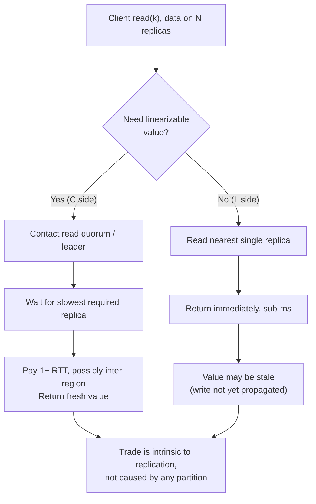
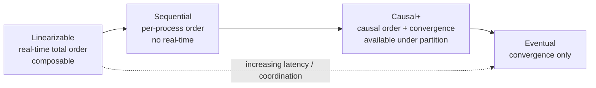
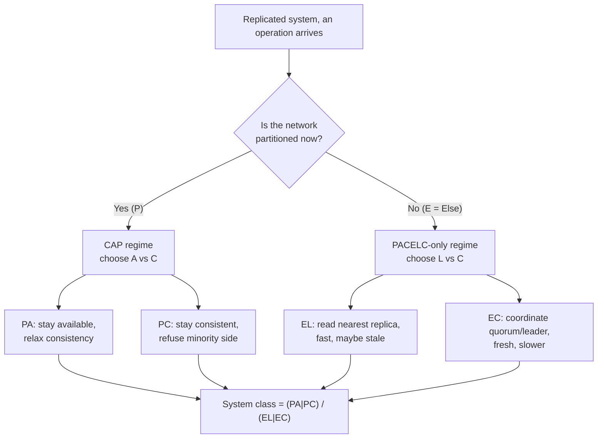

# PACELC — Theory and Formal Foundations

<!-- level-focus -->
At professional level, focus on this question:

> How should teams adopt and operate **PACELC — Theory and Formal Foundations** with measurable outcomes and limited coordination?

Use the smallest realistic scenario that exposes the decision and its failure behavior.
PACELC is the theorem that finished the sentence CAP started. Brewer's CAP told us what happens to a replicated system *when the network breaks*; it said nothing about the 99.9% of wall-clock time when the network works. Daniel Abadi's 2010 observation — formalized in his 2012 *Computer* article with Wada — was that the consistency/latency trade made during normal operation is a more important design driver for most production systems than the consistency/availability trade made during partitions. This document gives the formal treatment: the precise statement, why replication forces the latency↔consistency choice even with a perfect network, the consistency spectrum as a partial order with its coordination cost, session guarantees as named intermediate points, and the quorum math that lets you *quantify* the latency you pay for a given consistency level.

---

## 1. The Abadi Formulation

CAP, as proved by Gilbert and Lynch (2002), is a statement about an *asynchronous network model* in which messages can be arbitrarily delayed or lost. Its conclusion — you cannot simultaneously guarantee linearizable consistency and total availability in the presence of a partition — is a theorem about a degenerate, adversarial regime. Abadi's critique is not that CAP is wrong; it is that CAP describes the *exceptional* case and is silent about the *common* one.

His core argument, paraphrased from the 2012 article *"Consistency Tradeoffs in Modern Distributed Database System Design"* (Abadi, *IEEE Computer* 45(2)):

> Ignoring the consistency/latency tradeoff of replicated systems is a major oversight in CAP, as it is present at all times during system operation, whereas CAP is only relevant in the (arguably rare) case of a network partition.

Two empirical facts ground this:

- **Partitions are rare.** In a well-provisioned single datacenter, true partitions measured in seconds-to-minutes happen on the order of a handful of times per year. The consistency/availability choice CAP forces is therefore exercised infrequently.
- **Latency is paid on every request.** Any system that replicates data — and every system that wants durability or read scalability does — must decide, *for every single read and write*, whether to coordinate replicas (slow, consistent) or not (fast, possibly stale). This decision is made millions of times per second, in the absence of any failure.

A system architect who reasons only about CAP will pick "AP" or "CP," tune for the partition case, and then be surprised that their "CP" system is slow under perfectly healthy conditions, or that their "AP" system serves stale reads they never explicitly opted into. PACELC makes both axes first-class, forcing the architect to name *two* trade-offs, not one.

---

## 2. Why CAP Is Incomplete: Latency Is the Dominant Cost

Consider the cost structure of a replicated read, decomposed by operating regime:

| Regime | Frequency | Trade CAP names | Trade PACELC names |
|---|---|---|---|
| Network healthy | ~99.9%+ of uptime | *none* (CAP is silent) | Latency vs Consistency (the **ELC** branch) |
| Network partitioned | rare, bursty | Availability vs Consistency | Availability vs Consistency (the **PAC** branch) |

The asymmetry is the whole point. CAP populates one row of this table; PACELC populates both. Because the top row dominates the time-integral of system behavior, the **ELC** branch is where the latency budget of an entire product is actually spent.

There is a deeper reason latency deserves equal billing: **latency and consistency are continuously dialable against each other, while availability is essentially binary.** During a partition you are either serving the minority side (available, inconsistent) or refusing it (unavailable, consistent) — a coarse choice. During normal operation you can sit at *any* point on a smooth curve from "read one nearby replica, ~1 ms, eventually consistent" to "read a majority across regions, ~150 ms, linearizable." The richness of the design space lives almost entirely on the ELC axis, which is exactly the axis CAP omits.

---

## 3. The PACELC Statement, Precisely

The theorem is best read as a conditional with two branches:

```
if (P)  then choose between (A) and (C)
else    /* E */ choose between (L) and (C)
```

Spelled out:

- **P** — *Partition.* If a partition occurs, then the system must trade **A** (Availability) against **C** (Consistency). This is exactly CAP.
- **E** — *Else* (the normal, partition-free case). The system must trade **L** (Latency) against **C** (Consistency).

A system is classified by a pair drawn from `{PA, PC} × {EL, EC}`, giving four canonical archetypes: **PA/EL**, **PA/EC**, **PC/EL**, **PC/EC**. By convention the pair is written compactly, e.g. "PA/EL" or "PC/EC."

Two formal subtleties that distinguish principal-level understanding:

1. **The two C's are the same C, but the two choices are independent.** A system can refuse to sacrifice consistency under partition (PC) yet happily sacrifice it for latency in normal operation (EL) — Yahoo's PNUTS is the canonical PC/EL example. The branches are governed by *different* mechanisms (failure detection and failover policy vs. read/write replication strategy), so they decouple.

2. **PA/EC is "rare but not vacuous."** It looks contradictory — give up consistency under partition but not for latency in the common case — yet it is realizable: a system that pays full coordination cost on every normal operation (EC) but, when a partition is *detected*, chooses to keep serving rather than block (PA). The cost is paid always; availability is preserved only by relaxing consistency precisely when coordination becomes impossible.

---

## 4. Why Replication Forces L ↔ C Even Without Partitions

This is the analytical heart of PACELC, and it requires no failures at all — only the speed of light and the fact that data lives in more than one place.

Suppose a key `k` is replicated on `N` nodes, possibly in different racks, availability zones, or regions. A client issues `read(k)`. The system must answer one question: **how many replicas must this read consult before it is allowed to return a value?**

**Case A — read for freshness (the C side).** To guarantee a *linearizable* read — one that returns the value of the most recent completed write in real-time order — the read cannot trust any single replica, because that replica may not yet have applied the latest write. It must contact enough replicas (a read quorum) to be certain it observes any write that has been acknowledged. Concretely, it must reach the leader (in leader-based replication) or a quorum (in quorum replication). Reaching them costs at least one network round-trip to the slowest node in the required set. If those nodes are in another region, the read inherits inter-region RTT — tens to hundreds of milliseconds — *with the network perfectly healthy*.

**Case B — read for speed (the L side).** To make the read fast, the system reads the *one nearest* replica and returns immediately. Locally this is sub-millisecond. But the nearest replica may be behind: a write acknowledged elsewhere may not have propagated yet. The read may therefore observe stale data. This is not a failure; it is the defined behavior of asynchronous replication.

There is no third option that escapes the dilemma. To be *both* fast and linearizable would require the nearest replica to *always already know* the latest write — which means writes would have to be synchronously applied to every replica before acknowledgment, pushing the cost onto the write path instead (now *writes* pay the slowest-replica RTT). The trade does not vanish; it relocates between the read and write halves of `W + R > N`. **Replication makes L and C antagonistic by construction**, independent of partitions, because consistency is a statement about ordering across replicas and latency is the cost of communicating to establish that ordering.



---

## 5. The Consistency Spectrum as a Partial Order

"Consistency" is not a single property; it is a lattice of guarantees ordered by *strength*. A model `X` is **stronger than** `Y` (written `X ⊃ Y`) if every history admitted by `X` is also admitted by `Y` — i.e. `X` forbids more behaviors. Stronger models give clients more, and cost more coordination to enforce.

The principal chain relevant to PACELC, from strongest to weakest:

- **Linearizable (atomic) consistency.** Every operation appears to take effect instantaneously at some point between its invocation and response, and the resulting total order respects real-time precedence: if op `a` completes before op `b` begins, `a` precedes `b` in the order. This is the `C` of CAP and the strongest single-object guarantee. It is *composable* (a system of linearizable objects is itself linearizable) — a property sequential consistency lacks.
- **Sequential consistency.** Operations appear in *some* total order consistent with each process's program order, but that order need not respect real-time across processes. A read may legally return a value that was overwritten "before" it in wall-clock time, as long as no single process observes its own operations out of order. Strictly weaker than linearizable.
- **Causal+ consistency** (causal consistency with convergence). All processes see causally-related operations in the same order; concurrent operations may be seen in different orders, but replicas converge to the same state (the "+"). This is the *strongest* model that remains available under partition (Mahajan et al., and the COPS line of work). It captures "writes-that-depend-on-reads" ordering without paying global coordination.
- **Eventual consistency.** The only guarantee is convergence: if writes stop, all replicas eventually agree. There is no constraint on the order in which intermediate states are observed, no real-time guarantee, no causal guarantee. Cheapest to enforce; weakest to reason about.

The containment is strict at each step:

```
Linearizable  ⊃  Sequential  ⊃  Causal+  ⊃  Eventual
   (strongest)                              (weakest)
   most coordination                        least coordination
   highest latency cost                     lowest latency cost
```



The PACELC-relevant fact: **position on this chain maps monotonically onto position on the latency-cost curve.** Linearizable reads must coordinate (quorum/leader RTT). Eventual reads need not coordinate at all (one local replica). Causal+ sits in between: it requires tracking dependency metadata but not global agreement, so it can often be served locally with bounded bookkeeping. The chain is, simultaneously, an ordering of *strength* and an ordering of *price*.

---

## 6. Session and Client-Centric Guarantees

The four models above are *system-wide* (data-centric) properties. There is a parallel, weaker-but-useful family of **session guarantees** (Terry et al., 1994), which constrain only what a *single client session* observes. They are crucial to PACELC because they let you buy *most* of the value of strong consistency for *most* clients while paying close to eventual-consistency latency. They are points *between* eventual and strong, indexed by which anomaly they forbid:

- **Read-your-writes (RYW).** Once a client has written a value, its own subsequent reads never return an older value. Forbids the user-visible "I posted, refreshed, and my post vanished" anomaly.
- **Monotonic reads.** Successive reads by the same client never go backwards in time: if a client reads version `v`, it will never later read a version older than `v`. Forbids "the timeline went backwards."
- **Monotonic writes.** A client's writes are applied in the order the client issued them at every replica. Forbids reordered updates from one author.
- **Writes-follow-reads (session causality).** If a client reads version `v` and then writes `w`, then `w` is ordered after `v` at all replicas. This is the per-session expression of causality (a reply is never seen before the message it replies to).

Their power: each is enforceable with **sticky routing plus version vectors**, not global coordination. Pin a session to a replica (or carry a version token the client presents on each request), and the system can satisfy RYW and monotonic reads while still serving from a single nearby replica in the common case — paying eventual-consistency latency until the chosen replica lags behind the client's known version, at which point it either waits briefly or reroutes. This is why so many production systems advertised as "eventually consistent" actually expose **session guarantees** as the default: it is the cheapest point on the curve that does not produce blatantly wrong user-facing behavior.

In spectrum terms, session guarantees sit *below* causal+ in strength (they constrain one session, not all processes) but *above* raw eventual:

```
Linearizable ⊃ Sequential ⊃ Causal+ ⊃ {RYW, monotonic-reads, …}* ⊃ Eventual
```

(The `*` denotes that the four session guarantees are individually incomparable refinements of eventual; their *conjunction* approximates per-client causal consistency.)

---

## 7. The Consistency–Coordination–Latency Table

This is the table to internalize. It maps each consistency level to the coordination it requires, the latency it imposes on the common-case read path, the anomalies it forbids, and a representative PACELC stance.

| Consistency level | Coordination required (read) | Replicas contacted | Typical read latency | Anomalies forbidden | PACELC ELC stance |
|---|---|---|---|---|---|
| **Linearizable** | Read quorum or leader; real-time order | `R` with `W+R>N`, or leader | High: slowest-of-quorum RTT, inter-region if cross-region | Stale reads, reorderings, all single-object anomalies | **EC** — pay latency for freshness |
| **Sequential** | Global total order (consensus log), no real-time | Leader / consensus | High: append to ordered log | Per-process reorderings | **EC** |
| **Causal+** | Track + check dependency metadata; converge | Often local + dep wait | Medium: local read once deps satisfied | Causal-order violations | Tunable; near **EL** with metadata cost |
| **Read-your-writes** | Sticky session / version token | One (nearby) replica | Low: ~local, with occasional wait/reroute | Losing your own write | **EL** (mostly) |
| **Monotonic reads** | Sticky session / hi-water version | One (nearby) replica | Low: ~local | Time going backwards for one client | **EL** (mostly) |
| **Bounded staleness** | Read replica within bound `Δ` of leader | One, if fresh enough | Low–medium: local unless too stale | Reads older than `Δ` (time or versions) | **EL** with a freshness floor |
| **Eventual** | None | One (nearest) replica | Lowest: single local read | (none) | **EL** — pay staleness for speed |

The monotonic relationship is the lesson: **as you move up the strength column, the "replicas contacted" and "latency" columns climb together.** There is no row that is both top-of-column-1 and bottom-of-column-4. That impossibility *is* the ELC trade-off, tabulated.

---

## 8. Quantifying Consistency Cost via Quorum Math

The ELC trade-off is not hand-wavy; quorum systems let you compute it. Consider Dynamo-style quorum replication with replication factor `N`, write quorum `W`, and read quorum `R`.

**The strong-consistency condition.** A read is guaranteed to observe the latest acknowledged write if and only if the read quorum and write quorum *overlap* — by pigeonhole, every read set must intersect every write set:

```
W + R > N      (read-write overlap → strong / linearizable reads*)
```

(*With a real-time order also needing per-key versioning and read-repair or a coordinator to break ties; overlap is necessary, not by itself sufficient for full linearizability — but it is the load-bearing inequality.)*

If instead `W + R ≤ N`, read and write sets may be disjoint: a read can entirely miss the nodes that received the latest write, and you get **eventual consistency** with lower latency.

**The latency consequence — tail, not mean.** A quorum operation does not finish when the *fastest* replica replies; it finishes when the *q-th* replica replies, where `q = W` (writes) or `q = R` (reads). The operation's latency is the **q-th order statistic** of the per-replica response-time distribution. If per-replica latency has CDF `F(t)`, the time to hear from at least `q` of `N` replicas has CDF:

```
P(L_quorum ≤ t) = Σ_{i=q}^{N}  C(N,i) · F(t)^i · (1 − F(t))^{N−i}
```

The practical reading: **raising the quorum size `q` pushes you further into the tail of `F`.** Going from `q=1` (read nearest, eventual) to `q=⌈(N+1)/2⌉` (majority, strong) replaces "fastest replica" with "median-to-slowest replica." Because real replica latency distributions are heavy-tailed (GC pauses, queueing, a cross-region hop), the median quorum read can be an order of magnitude slower than the single-replica read — and the *p99* quorum read worse still, since it waits on the slowest required node.

This formula is the bridge between the consistency spectrum and a latency SLO: **pick `W`, `R`, `N` and you have simultaneously picked your consistency level (`W+R>N` or not) and your latency distribution (the `q`-th order statistic of `F`).** PACELC's ELC axis is, quantitatively, the choice of `q`.

---

## 9. A Worked Quorum-RTT Calculation

Make it concrete. Suppose `N = 3`, replicas placed in three availability zones of one region, plus an optional far region. Per-replica RTTs, healthy network:

| Path | One-way | RTT |
|---|---|---|
| Same AZ (local replica) | ~0.25 ms | ~0.5 ms |
| Cross-AZ, same region | ~0.5 ms | ~1 ms |
| Cross-region (e.g. us-east ↔ eu-west) | ~40 ms | ~80 ms |

**Scenario 1 — Eventual read, `R = 1`.** The coordinator answers from the nearest (same-AZ) replica. Latency ≈ the local replica's service time, dominated by the ~0.5 ms RTT (often the coordinator *is* the replica, so even less). Consistency: eventual. This is the **EL** corner.

**Scenario 2 — Strong read in-region, `N=3, W=2, R=2`.** `W + R = 4 > 3` ⇒ overlap ⇒ strong. The read waits for **2 of 3** replicas (`q=2`, the 2nd order statistic). With all three in-region, the 2nd-fastest reply lands at roughly the cross-AZ RTT, ~1 ms. Strong consistency for ~2× the eventual latency — cheap, *because all replicas are close.* This is **EC**, but a forgiving EC.

**Scenario 3 — Strong read with a cross-region replica.** Same `W=2, R=2`, but now one of the three replicas is in eu-west (~80 ms away) and the client is in us-east. The read needs 2 of 3 acks. The two in-region replicas answer in ~1 ms, satisfying `R=2` *without* waiting on Europe — **so a read can stay fast as long as the quorum can be formed from nearby replicas.** But the *write* path `W=2` has the same freedom only if 2 nearby replicas exist; if replicas are spread one-per-region (us-east, us-west, eu-west), then `W=2` forces every write to wait for a *second region*, and write latency jumps to the cross-region RTT (~80 ms). The trade has moved onto the write path exactly as Section 4 predicted.

**Scenario 4 — Linearizable across three regions, majority quorum.** `N=3` one-per-region, `W=2, R=2`. Both reads and writes need 2 of 3 acks, and the 2nd-closest region is always ~80 ms away. Every strongly-consistent operation pays **~80 ms minimum**, healthy network, no partition. Drop to `R=1` and reads return locally in ~0.5 ms but become eventual: a **160× latency difference** between the EC and EL choices on the *same* deployment. That ratio is the dollar value of the ELC trade-off for this topology, and it is why globally-distributed strong consistency is reserved for data that genuinely needs it.

The general principle the four scenarios expose: **quorum latency is governed by replica *placement* relative to the quorum size, not by the consistency label alone.** Strong consistency is cheap when a full quorum is local and expensive when a quorum spans regions. PACELC tells you the trade *exists*; quorum-RTT math tells you its *magnitude* for your topology.

---

## 10. Staged Quorum-Read Diagram

The following sequence stages a single linearizable read against `N=3, R=2` with one distant replica, showing precisely where latency is incurred and why the slowest *required* replica sets the bound. Read it as: the coordinator returns as soon as it has `R` consistent responses, but *strong* consistency requires it to also reconcile versions (read-repair) before answering.

```mermaid
sequenceDiagram
    autonumber
    participant CL as Client
    participant CO as Coordinator (near)
    participant R1 as Replica A (same-AZ)
    participant R2 as Replica B (cross-AZ)
    participant R3 as Replica C (cross-region ~80ms)

    Note over CL,R3: Stage 1 — Fan-out the read to satisfy R=2 of N=3
    CL->>CO: read(k), consistency = LINEARIZABLE
    CO->>R1: get(k)
    CO->>R2: get(k)
    CO->>R3: get(k)  %% fired in parallel

    Note over CO,R3: Stage 2 — Wait for the q-th (R=2) response
    R1-->>CO: value v1, version 7   (~0.5 ms)
    R2-->>CO: value v2, version 6   (~1 ms)
    Note over CO: R=2 satisfied at ~1 ms; R3 still in flight

    Note over CO: Stage 3 — Detect divergence → must reconcile
    Note over CO: version 7 ≠ version 6 → A is ahead of B

    Note over CO,R2: Stage 4 — Read-repair to restore overlap guarantee
    CO->>R2: write-back version 7
    R2-->>CO: ack

    Note over CL,CO: Stage 5 — Return the freshest value (linearizable)
    CO-->>CL: value v1 (version 7)
    Note over CO,R3: R3's late reply (~80 ms) is dropped — not on the critical path
```

Three principal observations the staging makes precise:

- **The critical path is the `R`-th fastest replica, not the `N`-th.** Because `R=2` and the two nearby replicas answered at ~1 ms, the cross-region replica's 80 ms reply never blocks the response. Quorum systems are *latency-robust* to a minority of slow nodes — that robustness is the entire reason quorums beat read-all/write-all.
- **Strong consistency adds the reconciliation stage (3–4).** An eventual read would have returned at Stage 2 from a single replica. Linearizability forces overlap detection and read-repair, which is extra work *even when no node failed*. This is the latency you pay for the C in ELC, visible as discrete stages.
- **If `R` could not be formed locally, the bound becomes the cross-region RTT.** Here two nearby replicas sufficed. Move to one-replica-per-region and Stage 2 cannot complete until ~80 ms — the diagram's shape is identical but its clock is 80× slower. Placement, again, is destiny.

---

## 11. Bounded-Staleness Models and Their Formal Guarantees

Between "strong" (EC, expensive) and "eventual" (EL, anomaly-prone) lies a parameterized family that lets you *dial* the trade-off with a formal bound rather than choosing a corner. The clearest production formalization is Azure Cosmos DB's five consistency levels, which are notable for carrying **explicit, documented guarantees** rather than marketing adjectives:

| Cosmos level | Formal guarantee | Where it sits |
|---|---|---|
| **Strong** | Linearizable: reads return the most recent committed write; reads majority-acked | EC corner |
| **Bounded staleness** | Reads lag the latest write by at most `K` versions **or** `T` time, whichever first; monotonic, causal within the bound | Tunable EC↔EL |
| **Session** | RYW + monotonic reads/writes + writes-follow-reads, *within a client session* | EL with per-client safety |
| **Consistent prefix** | Reads never see writes out of order: some prefix of the global write order, never a gap | EL, ordering-safe |
| **Eventual** | Convergence only; no order guarantee | EL corner |

**Bounded staleness** is the theoretically interesting one for PACELC. Its guarantee is a *two-dimensional staleness window* `(K versions, T seconds)`: a read may return data that is behind the latest write, but never by more than `K` updates and never by more than `T` wall-clock time. Formally it provides **monotonic reads and consistent prefix globally, and full linearizability *within* the window's edge.** The architect chooses `(K, T)`; smaller bounds approach Strong (and its latency), larger bounds approach Eventual (and its speed). Crucially, the bound is a *contract* the system enforces — if a replica cannot serve within the staleness window it must coordinate or reject, so staleness is never unbounded.

This is the right mental model for "tunable consistency" generally: it converts the binary spectrum positions of Section 5 into a *continuous knob* with a provable invariant. The PACELC reading: bounded staleness is a curve through the ELC plane parameterized by `(K, T)`, letting a single system occupy a chosen point on the latency↔consistency frontier per-request rather than per-deployment. Note also Cosmos's *consistency-prefix* and *session* levels are simply the named session guarantees of Section 6 given a SLA — confirming that the academic taxonomy and the commercial knobs are the same theory.

---

## 12. PACELC vs CAP: The Branch Relationship

The cleanest way to state the relationship: **CAP is the `P` branch of PACELC, and only the `P` branch.**



Formal correspondences:

- **CAP's "C" = PACELC's "C" = linearizability.** Both theorems use the same strong-consistency definition (Gilbert–Lynch's atomic/linearizable). PACELC does not redefine consistency; it adds a second context (normal operation) in which the same `C` is traded against a *different* resource (latency instead of availability).
- **CAP's "A" lives only in the P branch.** Availability — answering every request — is a meaningful choice *only when a partition makes coordination impossible*. With a healthy network you can always reach replicas, so "availability" is not a live trade; *latency* is. PACELC names this by replacing the absent A-trade with the L-trade in the `E` branch.
- **The two branches use different machinery.** The `P` choice (PA vs PC) is implemented by failure-detection thresholds and failover/fencing policy — what to do when nodes can't talk. The `E` choice (EL vs EC) is implemented by replication and read/write-quorum strategy — how to route requests when nodes *can* talk. This is why a system can be PC/EL or PA/EC: the branches are configured independently.

What PACELC adds over CAP, in one line: it forces you to specify behavior in the regime where your system actually spends its life, using a trade-off (latency) that CAP's partition-centric framing structurally cannot express.

---

## 13. Classifying Real Systems

The classification is a useful exam of whether you understand both branches. Canonical placements from Abadi's article and subsequent literature:

| System | Class | Reasoning |
|---|---|---|
| **Dynamo / Cassandra / Riak** | PA/EL | Sloppy quorums + hinted handoff stay available under partition (PA); default tunable quorums favor low-latency, eventually-consistent reads (EL). Can be pushed toward EC with `W+R>N`. |
| **Yahoo PNUTS** | PC/EL | Record-level mastering refuses inconsistent writes under partition (PC) but serves fast, possibly-stale reads from local replicas in normal operation (EL). The archetypal "decoupled branches" case. |
| **MongoDB (default)** | PA/EC (config-dependent) | With `majority` write concern + primary reads it leans EC under health; failover behavior under partition determines the P side. Read/write concern knobs move it across the table. |
| **Google Spanner** | PC/EC | Paxos quorums + TrueTime give externally-consistent (linearizable) reads/writes always; refuses to violate consistency under partition (PC) and pays coordination latency in normal operation (EC). The "consistency at any cost, mitigated by engineering" extreme. |
| **VoltDB / H-Store** | PC/EC | Single-copy serializability; consistency is non-negotiable on both branches. |
| **Cosmos DB** | tunable | Per-request consistency level (Section 11) lets one system occupy different ELC points; under partition the strong levels become PC, the relaxed ones effectively PA. |

The recurring lesson: **most "NoSQL" systems are PA/EL, most "NewSQL" systems are PC/EC, and the interesting designs (PNUTS, Cosmos, tunable Cassandra) deliberately *decouple* the two branches** — proving that PACELC's four-way split is not academic hairsplitting but a real, exploited design space.

---

## 14. Failure Modes of the Mental Model

Principal-level use of PACELC means avoiding its common misapplications:

1. **Treating the class as a property of the system rather than the configuration.** Cassandra is PA/EL *by default* but PC/EC with `W+R>N` and appropriate failover. The label describes a tuning, not an immutable trait. Always state the configuration alongside the class.

2. **Assuming EC implies slow and EL implies fast unconditionally.** Section 9 showed EC is *cheap* when a quorum is local and EL's advantage *collapses* when replicas are co-located. The trade-off's magnitude is a function of placement; the *direction* is fixed by theory, the *size* by topology.

3. **Forgetting that the L↔C trade relocates between read and write.** Tuning `R` down to make reads fast forces `W` up to preserve overlap, making writes slow. You are choosing *where* to pay, not *whether*. A system advertised as "low-latency reads" may be hiding inter-region write latency.

4. **Conflating session guarantees with eventual consistency.** A system offering read-your-writes is not "eventually consistent" in the naive sense — it forbids a real anomaly class at near-EL cost. Lumping all sub-linearizable systems into one "eventual" bucket discards the most useful middle of the spectrum.

5. **Believing PACELC subsumes everything.** It is a *two-trade* framing of *single-object/replication* consistency. It says nothing about transactional isolation (serializability vs snapshot isolation), which is an orthogonal axis. A PC/EC system can still be non-serializable. Keep the consistency axis (PACELC) and the isolation axis (ANSI/Adya levels) distinct.

---

## Apply it

1. Define the user or business outcome that **PACELC — Theory and Formal Foundations** should improve.
2. Assign one owner for code, contracts, operations, and incidents.
3. Split delivery into reversible increments that produce evidence early.
4. Publish responsibilities, escalation paths, and compatibility windows.
5. Stop or expand only when the agreed measures support that decision.

## Verify your work

- Each increment has an owner, rollback path, and observable exit condition.
- Adoption, reliability, delivery time, and coordination cost are measured.
- Incident and migration exercises prove that responsibility is executable.
- The old path is removed only after telemetry proves it is unused.

## Review questions

- Which measurable outcome justifies investing in PACELC — Theory and Formal Foundations?
- Which team owns the full lifecycle and incident response?
- What reversible increment produces the earliest useful evidence?
- Which exit condition proves that migration or adoption is complete?
