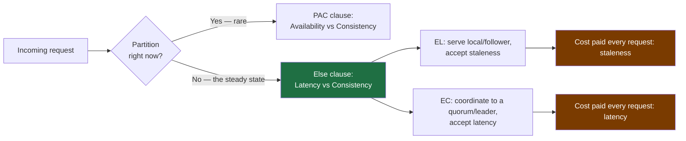
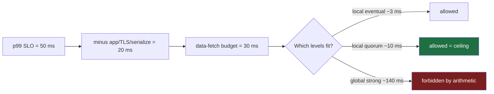
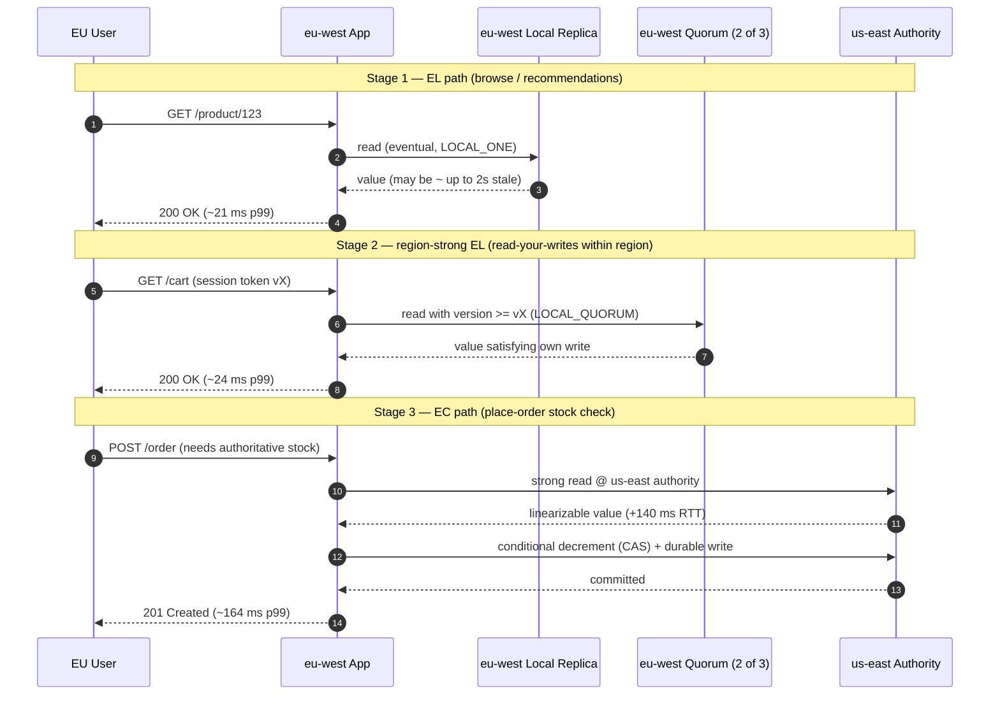

# PACELC — Senior

<!-- level-focus -->
At senior level, focus on this question:

> Which system invariant is affected by **PACELC** under failure, load, and change?

Use the smallest realistic scenario that exposes the decision and its failure behavior.
PACELC is CAP's honest sibling. CAP only describes the partition case — a rare, dramatic event. PACELC adds the clause that matters on **every single request**: **E**lse (no partition), you trade **L**atency against **C**onsistency. As an owner, you do not "choose PACELC for the system." You choose, per operation, where on the latency/consistency line each request lands, and you pay that choice on the steady-state critical path — not just during the once-a-quarter network split.

This page is about owning the **Else**. The senior skill is not reciting "PA/EL" for a database; it is decomposing one product into per-operation EL/EC choices, mapping a latency SLO to a consistency ceiling with arithmetic, and reaching for the cheaper middle-ground guarantees (read-your-writes, monotonic reads) instead of paying for global strong consistency you don't need.

---

## 1. The Else is the part you pay every request

The full PACELC formula reads: **if Partition (P) then choose between Availability (A) and Consistency (C), Else (E) choose between Latency (L) and Consistency (C).**

The PAC clause governs behavior during a partition. Partitions inside a single region, on healthy hardware, are rare — you may go quarters without one. The EC/EL clause governs behavior the rest of the time, which is to say **99.99% of the wall-clock and 100% of normal traffic**. That asymmetry is the whole point of the framework: the cost you optimize day-to-day is the Else cost, and it is paid on the latency of the read or write the user is waiting on right now.

Why is there a cost at all when the network is healthy? Because **strong consistency requires coordination**, and coordination requires round trips:

- A linearizable read in a quorum system must contact enough replicas to be sure it sees the latest acknowledged write. That is at least one extra network hop, often a cross-AZ or cross-region hop.
- A strongly-consistent write must reach a majority before it acknowledges. The acknowledgment is gated on the *slowest* of the required replicas — tail latency, not mean.
- Even a single-leader system pays: a strongly-consistent read that must go to the leader cannot be served by the nearest follower.

So "strong" is never free in the Else case. You pay it in p99 latency. The senior question is always: **for this specific operation, is the staleness I'd see under EL cheaper or more expensive than the latency I'd pay under EC?**



The classic PACELC labels for stores you'll meet:

| System | PAC choice | ELC choice | What that means in practice |
|--------|-----------|-----------|------------------------------|
| Dynamo / Cassandra (default) | PA | EL | Available under partition; favors latency over consistency in steady state |
| DynamoDB (default reads) | PA | EL | Eventual reads by default; strong reads opt-in and ~2× cost |
| Spanner | PC | EC | Refuses to serve stale; pays TrueTime commit-wait latency always |
| Cosmos DB (tunable) | PA/PC | EL/EC | Five consistency levels picked per request |
| MongoDB (default) | PC | EC | Reads from primary by default; tunable via read preference/concern |
| HBase / BigTable | PC | EC | Single-owner regions; strong but pays region-server hop |

Note the pattern: most **PC** systems are also **EC**, and most **PA** systems are also **EL** — because the same architectural decision (do we coordinate before answering?) drives both columns. The interesting systems are the tunable ones, where you the owner pick the cell per operation.

---

## 2. Per-operation EL/EC, not per-system

The junior framing is "Cassandra is PA/EL, so our system is eventually consistent." The senior framing is: **a single system serves dozens of operation types, and they do not share one consistency requirement.** Picking EL or EC per operation is the core ownership act.

Consider one e-commerce service backed by one tunable store. Walk the operations:

- **Read the product catalog / title / description.** Staleness tolerance: minutes. A price that's 30 seconds out of date on a browse page is invisible to the user and cheap to be wrong about. → **EL.** Serve from the nearest replica, eventual reads, no coordination.
- **Read personalized recommendations.** Staleness tolerance: hours. The model output is itself approximate; nobody can tell if a "recommended for you" row is slightly stale. → **EL**, aggressively. Often served from a cache that's deliberately stale.
- **Read inventory count on the product page.** Staleness tolerance: seconds-to-tens-of-seconds. "12 left in stock" being slightly off is fine; the truth is reconciled at checkout. → **EL**, but with a tighter staleness bound or a fallback.
- **Read the cart during checkout review.** The user just added an item; they must see it (read-your-writes). → **session-consistent EL** (read-your-writes), not full strong.
- **Read available balance / inventory at the moment of "place order."** Now staleness has a dollar cost: overselling the last unit, or letting a payment through on an overdrawn balance. → **EC.** Strong/quorum read against the authoritative replica, latency accepted.
- **Write the order + decrement stock.** Must be linearizable and durable across replicas before acknowledging. → **EC**, non-negotiable.

That's one product, one database, **and at least three different points on the EL/EC line**. If you push the whole system to EC to make checkout safe, you've made every product-browse read pay quorum latency for no benefit — and browse traffic is typically 10–100× checkout traffic. If you push the whole system to EL to make browsing fast, you oversell inventory and let bad payments through.

The asset you produce as owner is the **per-operation classification**: for each read and write path, the staleness budget and the resulting EL/EC choice, written down and enforced in code (which read concern / consistency level / read preference each call site uses).

```mermaid
flowchart TB
    subgraph One service, one tunable store
        direction LR
        A[catalog read] -->|tol: minutes| ELa[EL]
        B[recs read] -->|tol: hours| ELb[EL cached]
        C[stock display] -->|tol: seconds| ELc[EL bounded]
        D[cart review read] -->|must see own write| RYW[EL + read-your-writes]
        E[place-order stock check] -->|tol: 0| ECa[EC quorum]
        F[order write] -->|tol: 0| ECb[EC quorum]
    end
    style ECa fill:#7a1f1f,color:#fff
    style ECb fill:#7a1f1f,color:#fff
    style ELa fill:#1f6f43,color:#fff
    style ELb fill:#1f6f43,color:#fff
    style ELc fill:#1f6f43,color:#fff
    style RYW fill:#1f5f6f,color:#fff
```

---

## 3. The per-operation decision table

This is the deliverable. For each operation, capture: business cost of staleness, staleness budget, the resulting consistency target, the concrete knob, and the latency you're signing up for. Numbers below are illustrative of a single-leader-per-region store with one US region and one EU region (intra-region replica RTT ~1 ms, cross-region RTT ~80 ms one-way / ~140 ms round trip).

| Operation | Cost of being stale | Staleness budget | Consistency target | Concrete knob | p99 latency signed up for |
|-----------|--------------------|--------------------|--------------------|----------------|---------------------------|
| Product catalog read | ~0 (cosmetic) | minutes | Eventual (EL) | Cassandra `LOCAL_ONE` / Dynamo eventual read | ~3–8 ms (local replica) |
| Recommendations read | ~0 (already approximate) | hours | Eventual (EL) + cache | read from edge cache, TTL 1 h | ~1–3 ms (cache hit) |
| Inventory display count | low (reconciled later) | 10–30 s | Bounded-stale (EL) | `LOCAL_QUORUM` or eventual + max-staleness | ~5–12 ms (local quorum) |
| User profile / settings read | low, but jarring after edit | "see my own change" | Read-your-writes (session) | route to leader or sticky-version token | ~5–15 ms (local) |
| Cart contents during checkout | medium (lost item = lost sale + support) | read-your-writes + monotonic | Session (EL) | session token pinned to write replica | ~6–15 ms (local) |
| Place-order stock decrement | **high** (oversell, refunds, chargebacks) | 0 | Strong (EC) | quorum read+write at authoritative replica | ~15–40 ms (local quorum, leader) |
| Payment/balance check | **high** (financial loss) | 0 | Linearizable (EC) | strong consistency, single authority | ~20–50 ms (local) |
| Audit-log read for compliance | high (legal) | 0 | Strong (EC) | strong read, authoritative region | up to ~150 ms if cross-region |

Two senior observations from this table:

1. **The high-cost-of-staleness operations are the minority of traffic but carry the EC tax.** That's exactly right — you isolate the expensive coordination to the few operations that need it, and let the high-volume read path stay cheap.
2. **Read-your-writes appears repeatedly as a middle column.** It is not full strong consistency. It is the cheapest guarantee that fixes the single most common user-visible staleness bug ("I edited my profile and it reverted"). Reaching for it instead of EC is a recurring senior move — see §8.

---

## 4. Latency budget forces a consistency ceiling

Here is the inversion most engineers miss. We usually think "pick a consistency level, then measure the latency." The owner's reasoning runs the other way: **the latency SLO is fixed by the product, and that SLO imposes a hard ceiling on the consistency you are allowed to offer.**

If the product owner says "the product page p99 must be under 50 ms," and a strongly-consistent read for that page requires a cross-region quorum that costs 140 ms of network RTT alone, then **strong global reads are not a design choice you get to make.** They are arithmetically impossible inside the budget. The SLO has *forced* you down to local/follower reads or relaxed consistency. No amount of engineering cleverness recovers a 90 ms deficit that lives in the speed of light.

The reasoning chain:

1. Product fixes the **latency SLO** (e.g., p99 read ≤ 50 ms, end to end).
2. Subtract everything that isn't the data fetch: TLS, app-server processing, serialization, your own service hops. Say that's 20 ms. You have **30 ms left for the store**.
3. Compute the **coordination cost** of each consistency level for this data placement:
   - Local replica (eventual): one local hop, ~1–5 ms. ✅ fits.
   - Local quorum (region-strong): a couple of intra-region hops, ~5–15 ms. ✅ fits.
   - Global quorum / cross-region strong: ≥ one cross-region round trip, ~140 ms. ❌ blows the budget by 110 ms.
4. The strongest level whose coordination cost fits inside the remaining budget is your **consistency ceiling.** You may offer that or anything weaker. You may not offer anything stronger.



The practical consequence: **global strong consistency and tight single-digit-to-low-tens-of-ms global latency are mutually exclusive** for any data whose authoritative copy is more than one region away. You can have local-strong (strong within a region, eventual across regions), or global-eventual, but not global-strong-and-fast. Owners who promise both are promising to repeal the speed of light. Spanner's answer — pay the commit-wait latency always, and accept it — is honest precisely because it does *not* pretend to be fast and global-strong; it's EC and proud of it.

---

## 5. A worked latency-budget calculation

Make it concrete. Two regions: `us-east` (authoritative for writes) and `eu-west`. Measured network: cross-region one-way 70 ms, round trip 140 ms; intra-region replica RTT ~1 ms; intra-region quorum (contact 2 of 3 replicas, wait for slower) ~6 ms p99.

**Scenario A — product page read, served from `eu-west`, SLO p99 ≤ 50 ms.**

Fixed overhead (TLS resumption + app server + serialization + your two internal service hops): measured at 18 ms p99. Remaining data-fetch budget: `50 − 18 = 32 ms`.

| Strategy | Path | Data-fetch p99 | Total p99 | Verdict |
|----------|------|----------------|-----------|---------|
| Global strong read | `eu-west` app → quorum touching `us-east` | 140 ms (RTT) + ~6 ms | ~146 ms | ❌ 96 ms over |
| Leader read from `us-east` | `eu-west` app → `us-east` leader | 70 ms (one-way×2 ≈ 140) | ~140 ms | ❌ over |
| Local follower, eventual | `eu-west` app → local replica | ~3 ms | 21 ms | ✅ 29 ms spare |
| Local quorum (region-strong) | `eu-west` app → 2 local replicas | ~6 ms | 24 ms | ✅ 26 ms spare |

**Conclusion:** the 50 ms SLO *forces* `eu-west` product reads to be served locally — either eventual or region-local-quorum. Whatever `us-east` has just written may not yet have replicated to `eu-west` (replication lag, say p50 200 ms / p99 2 s), so a EU user may see data up to ~2 s stale. The SLO has chosen EL for us. The only remaining design decision is *which* EL: plain eventual (fastest, weakest) or local-quorum with bounded staleness (slightly slower, monotonic within region).

**Scenario B — place-order stock check, SLO relaxed to p99 ≤ 300 ms, correctness mandatory.**

Here staleness costs real money (oversell). Fixed overhead 18 ms. Budget for data fetch: `300 − 18 = 282 ms`.

| Strategy | Data-fetch p99 | Total | Verdict |
|----------|----------------|-------|---------|
| Global strong (route to `us-east` authority) | 140 ms RTT + 6 ms quorum | ~164 ms | ✅ fits, and it's *correct* |
| Local eventual | 3 ms | 21 ms | ❌ fast but can oversell → forbidden by correctness |

**Conclusion:** the checkout path has a looser latency SLO *on purpose*, precisely so that it can afford the cross-region strong read that correctness demands. This is the senior pattern in full: **you spend your tight latency budget on the cheap-to-be-stale reads (browse) and you spend your relaxed latency budget on the expensive-to-be-stale reads (checkout).** The latency budget and the consistency requirement are co-designed, per operation, not handed down globally.

Notice the design lever exposed: if business *also* wanted checkout under 50 ms, the only way to get both correctness and latency is to **move the authority closer** — region-partition the inventory so each region owns its own stock authoritatively (sharding by warehouse/region), turning a cross-region strong read into a local strong read. That's not a consistency knob; it's a data-placement change, and it's frequently the real fix when the EL/EC tradeoff feels impossible.

---

## 6. Tunable-consistency knobs in production

Owning the Else means knowing the exact knob per store and what it costs. These are the levers you actually turn:

**Cassandra / ScyllaDB — per-query consistency level (CL).**

- `ONE` / `LOCAL_ONE`: contact one replica (local DC for `LOCAL_*`). Cheapest, weakest. Pure EL.
- `LOCAL_QUORUM`: majority of replicas **in the local datacenter**. Strong *within a region*, eventual across regions. The workhorse: avoids the cross-region RTT while still surviving a single local replica loss. With RF=3 per DC, `LOCAL_QUORUM` waits for 2 local replicas — typically single-digit ms.
- `QUORUM` (global): majority across **all** datacenters. With two DCs of RF=3 (total 6), a global quorum is 4 replicas and *must* include cross-region replicas → pays the ~140 ms RTT. Almost never what you want on a latency-sensitive path; it's the trap that turns a 10 ms read into a 150 ms read.
- `EACH_QUORUM` (writes): a quorum in *every* DC — strongest, slowest.

The senior rule of thumb: **use `LOCAL_QUORUM` for reads and writes by default**; reach for `QUORUM`/`EACH_QUORUM` only where global linearizability genuinely matters, knowing each one drags the cross-region RTT onto the critical path. And remember: `LOCAL_QUORUM` read + `LOCAL_QUORUM` write gives read-your-writes *within a region* (R + W > RF), but **not** across regions.

**DynamoDB — strong vs eventual reads.**

- Eventual reads (default): may reflect a slightly stale replica; **half the read-capacity cost** and lower latency. EL.
- `ConsistentRead = true`: returns the latest acknowledged write within the region; **2× the cost** and higher latency. EC (region-local).
- Global Tables: multi-region, **last-writer-wins**, eventual cross-region. Strong reads are still only strong *within* a region — there is no global-strong DynamoDB read. The cross-region consistency is eventual, period.

**Read replicas (Postgres/MySQL/Aurora) — replica lag is the staleness.**

- Reads routed to a follower are eventual; the staleness is exactly the **replication lag**, which you must monitor (`pg_last_wal_replay_lag`, `Seconds_Behind_Master`, Aurora `ReplicaLag`). Under load, lag spikes — your "eventual" can silently become "minutes stale."
- Reads routed to the primary are strong but don't scale and add latency if the primary is remote.
- The senior discipline: **lag-aware routing** — if replica lag exceeds the operation's staleness budget, fail the read over to the primary (or reject), rather than silently serving stale data past its budget.

**MongoDB — readConcern × readPreference × writeConcern.** `readConcern: "majority"` + `readPreference: primary` ≈ EC; `readPreference: nearest` + `readConcern: local` ≈ EL; `readConcern: "linearizable"` is the strongest and slowest.

The unifying mental model: every one of these knobs is the same dial — **how many replicas, and which ones, must I hear from before I answer?** More replicas / more-distant replicas = stronger + slower. That dial is the EL↔EC slider made concrete.

---

## 7. Staged multi-region read path

The single most important diagram for owning the Else is the read path across regions, *staged* so you can see exactly where the cross-region RTT enters — because that entry point is where EC stops being affordable.



Read this diagram as three layers of one product, deliberately chosen:

- **Stage 1 (EL)** never leaves `eu-west`. No cross-region hop, so it's fast and cheap, and it accepts whatever staleness the replication lag imposes. This is the overwhelming majority of traffic.
- **Stage 2 (region-strong EL / read-your-writes)** still never leaves `eu-west` — `LOCAL_QUORUM` plus a version token gives the user their own writes back without any cross-region cost. This is the cheap middle ground (next section).
- **Stage 3 (EC)** is the *only* stage that crosses to `us-east`, paying the full 140 ms RTT — and it does so because the correctness cost of stale stock (oversell) dominates the latency cost. The cross-region hop is isolated to exactly the operations that justify it.

The architectural lesson the diagram encodes: **draw the cross-region boundary, then count how many of your operations cross it.** Every crossing is an EC tax. Owning the Else is largely the discipline of keeping that count as small as the business correctness requirements allow — and no smaller.

---

## 8. The cheaper middle ground: session guarantees

The framing "EL vs EC" sounds binary, but the most valuable consistency choices live *between* eventual and strong. These are the **session (client-centric) guarantees**, and reaching for them instead of full strong consistency is the highest-leverage senior move in this whole topic, because they fix the user-visible bugs at a fraction of EC's cost.

**Read-your-writes (RYW).** After a client writes X, that *same client* always reads X or newer — never an older value. This kills the #1 staleness complaint: "I changed my settings / posted a comment / added to cart, and it disappeared." Note what RYW does *not* promise: other users may still see the old value for a while. You've fixed the *self*-inconsistency, which is the one users actually notice and rage about, without paying for global agreement.

How it's bought cheaply:
- **Sticky routing** — pin the session to the replica it wrote to (or the leader) for a short window.
- **Version tokens** — the write returns a version/LSN; subsequent reads carry it and the store serves a replica at-or-past that version (e.g., DynamoDB conditional, Cassandra `LOCAL_QUORUM` R+W>RF within region, Mongo causal-consistency tokens, Postgres "wait for LSN").

**Monotonic reads.** Once a client has seen a value, it never later sees an *older* one — no "time travel backwards." Without it, a user refreshing a page can flip between two replicas at different lags and watch a comment appear, vanish, and reappear. Bought with sticky-replica routing per session.

**Monotonic writes / writes-follow-reads.** Order-of-write and causal-edge guarantees — your later write isn't applied before your earlier one; a reply isn't visible before the comment it replies to. Provided by causal consistency.

| Guarantee | Fixes which user-visible bug | Cost relative to EC | Typical mechanism |
|-----------|------------------------------|---------------------|-------------------|
| Eventual (none) | — | cheapest | nearest replica |
| Read-your-writes | "my own edit reverted" | small (sticky/version) | session token / sticky leader |
| Monotonic reads | "data flickered backward" | small (sticky) | sticky replica per session |
| Causal | "reply shown before its parent" | moderate | dependency tracking / version vectors |
| Strong / linearizable | "two clients must agree instantly" | highest (cross-replica coordination) | quorum / leader / consensus |

The decision discipline: **before you reach for strong consistency, ask whether a session guarantee covers the actual complaint.** Nine times out of ten the requirement is "the *user* must see *their own* action reflected" — which is read-your-writes, an EL-priced fix — not "*all* users must instantly agree on a global order," which is the expensive linearizable case. Defaulting to strong because it's "safe" is how you pay EC prices for an EL problem and then wonder why p99 is bad.

---

## 9. Multi-region amplifies the Else cost

Within one region the Else tradeoff is mild: the difference between eventual and local-quorum is a few milliseconds. Cross-region, the **same consistency choice costs 10–50× more**, because coordination now traverses the WAN. Multi-region doesn't change the PACELC labels — it *amplifies the price of the C in the EC cell*.

The amplification, quantified for our two-region example:

| Consistency choice | Single-region cost | Cross-region cost | Amplification |
|---------------------|--------------------|--------------------|---------------|
| Eventual / local read | ~3 ms | ~3 ms (served locally) | 1× — staleness, not latency, grows |
| Region-local quorum | ~6 ms | ~6 ms (stays local) | 1× |
| Global strong read | ~10 ms (if all replicas local) | ~146 ms (one RTT to authority) | ~15–25× |
| Global strong write (consensus) | ~10 ms | ~150 ms+ (majority across regions) | ~15× |

The structural insight: **going multi-region doesn't make eventual reads slower — it makes them *staler*** (replication lag is now a WAN trip, p99 lag can be seconds), and it makes **strong reads/writes dramatically slower** because coordination crosses the WAN. So the Else slider's two ends drift apart: EL gets *cheaper-but-staler*, EC gets *much more expensive*. The gap between them is exactly the WAN RTT, and that gap is where all your hard design decisions now live.

This is why mature multi-region designs converge on a few patterns, all of which are "keep coordination local":

- **Region-pinned authority (sharding by region/entity).** Each piece of data has a home region that owns strong reads/writes for it; other regions get eventual copies. A user's data is strong-consistent in their home region (a local hop) and eventual elsewhere. Cross-region strong is needed only for the rare cross-region entity. This converts most would-be global-strong operations into local-strong ones.
- **Follower/local reads everywhere, leader writes home.** Reads are EL and local; only writes pay to reach the authority. Pairs with read-your-writes tokens so users still see their own writes.
- **Bounded-staleness contracts.** Offer "eventual, but never more than N seconds behind," monitored and enforced by failing over to the authority when lag exceeds N. Gives EL latency with a *guaranteed* staleness ceiling — often the sweet spot.

The owner's takeaway: **in multi-region, the default must be local; every cross-region coordination is an explicit, justified exception, not an accident of a default consistency level.** A `QUORUM` (global) left in a query that should have been `LOCAL_QUORUM` is the canonical multi-region performance incident — one forgotten knob silently routing every read across an ocean.

---

## 10. Cost of staleness vs cost of latency

Strip away the vocabulary and the PACELC Else decision is one comparison, made per operation:

> **Is the business cost of serving slightly stale data greater or less than the business cost of the added latency to avoid it?**

Both sides are real costs, both measurable in money and user behavior:

**Cost of latency (the EC tax)** is well documented:
- Added p99 latency directly depresses conversion and engagement. The widely-cited industry figures: ~100 ms of added latency measurably reduces sales; multiple extra seconds on a results page sharply increase abandonment. Latency on the critical path is revenue.
- It compounds: a slow strong read inside a request that also makes other calls inflates the whole request's tail.
- It consumes capacity: coordination ties up connections and threads longer, reducing throughput per node.

**Cost of staleness (the EL tax)** is operation-specific and ranges from zero to catastrophic:
- **Zero / cosmetic:** a slightly old product description, a stale recommendation, a view count off by a few. Serve stale, pay nothing.
- **Annoyance:** the user's own edit appears to revert (fixed cheaply by read-your-writes — pay the small session cost, not full EC).
- **Money:** overselling the last unit of inventory; double-charging; letting a payment through on a balance that's already spent. Here staleness has a hard dollar figure — refunds, chargebacks, fraud loss, support cost.
- **Legal / safety:** stale access-control decisions (a revoked permission still honored), stale compliance data. Staleness can be unbounded liability.

The senior method is to put both costs in the same units and compare *per operation*:

1. Estimate **cost-of-staleness** for this operation: probability of a stale-induced bad outcome × business cost of that outcome, over expected traffic. For browse reads this is ~0; for "place order" it's `P(oversell) × (refund + support + reputation)`.
2. Estimate **cost-of-latency** for the EC alternative: added p99 × traffic × marginal revenue-per-ms (or the SLO-violation penalty).
3. Choose the cheaper side. Where cost-of-staleness ≈ 0, **always choose EL** — there is no upside to coordination. Where cost-of-staleness is high and traffic is low (checkout is rarer than browse), **choose EC** — the latency tax applies to few requests and the staleness loss would be severe.

This is why the per-operation decision table in §3 lands the way it does: high-volume / low-staleness-cost reads go EL (you'd be taxing your most frequent path for nothing), and low-volume / high-staleness-cost operations go EC (the tax is small in aggregate, the risk avoided is large). PACELC's Else, fully owned, is just this cost comparison applied with discipline to every read and write — and refusing to apply one global answer to operations whose cost structures differ by orders of magnitude.

---

## 11. Ownership checklist

You own the Else when all of these are true:

- [ ] **Every read/write path is classified EL / session / EC** in writing, with its staleness budget and the concrete store knob it uses — not "the system is eventually consistent."
- [ ] **Each latency SLO has been converted to a consistency ceiling** by arithmetic (SLO − fixed overhead vs. coordination cost), and no operation promises a consistency stronger than its budget allows.
- [ ] **The cross-region boundary is drawn and every crossing is counted**; each cross-region strong operation has an explicit business justification, and the default everywhere is local.
- [ ] **Session guarantees (read-your-writes, monotonic reads) are used wherever the complaint is "user must see their own action,"** instead of defaulting to expensive strong consistency.
- [ ] **Replica/replication lag is monitored against each operation's staleness budget**, with lag-aware failover to the authority when an EL read would exceed its budget — so "eventual" never silently becomes "minutes stale."
- [ ] **For each EL operation, the cost-of-staleness is genuinely ~0 or cheaply mitigated**; for each EC operation, the cost-of-staleness genuinely dominates the latency tax it imposes — and you can state both numbers.
- [ ] **No accidental global `QUORUM`** (or equivalent) sits on a latency-sensitive path where `LOCAL_QUORUM` was intended.

The thread through all of it: PACELC's Else is paid on every request, so own it per request. The two costs you're trading — staleness and latency — are both real, both measurable, and almost never minimized by one global answer. Decompose the product, price each operation's two costs, and let each operation sit at the cheapest point on the line.

*Next step:* [Professional level](professional.md)

---

## Apply it

1. State the system invariant that **PACELC** must protect.
2. Mark ownership, state, and failure propagation at each boundary.
3. Compare two designs under load, dependency failure, and future change.
4. Define recovery and compatibility behavior before implementation.
5. Test the riskiest assumption with a focused experiment.

## Verify your work

- The experiment supports the design with evidence, not preference.
- Failure injection shows the blast radius and recovery path.
- Compatibility checks cover old and new callers or data.
- Operational signals reveal invariant violations and recovery progress.

## Review questions

- Which invariant must remain true when PACELC fails?
- Where should recovery responsibility live, and why?
- Which assumption deserves an experiment before implementation?
- How can the design evolve without changing every consumer at once?
