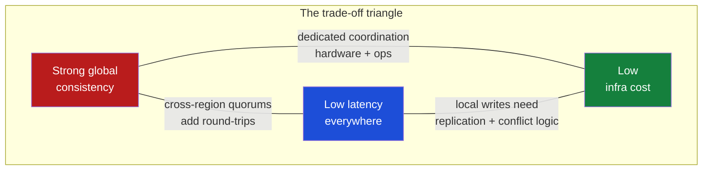
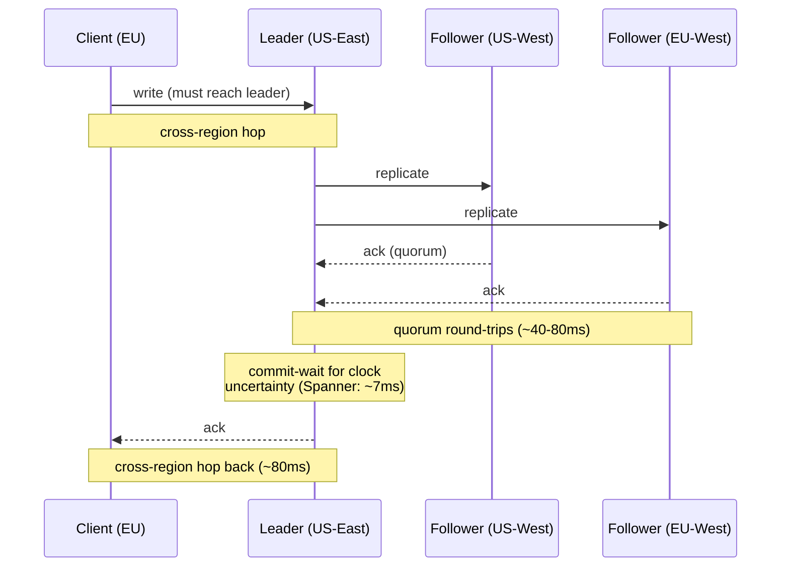
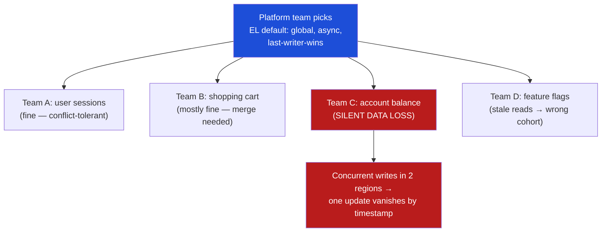
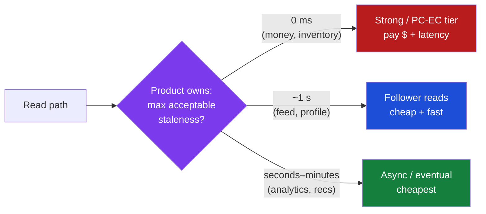
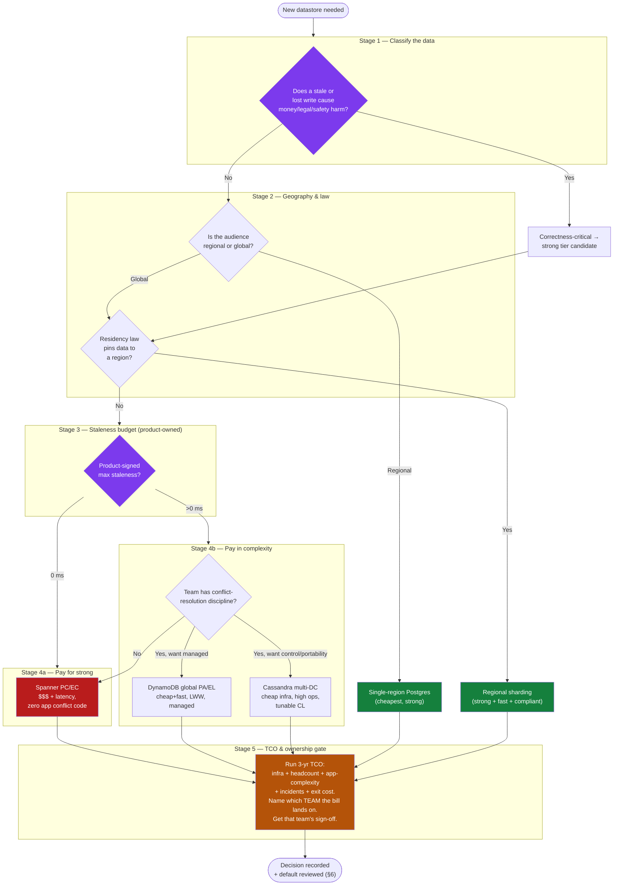
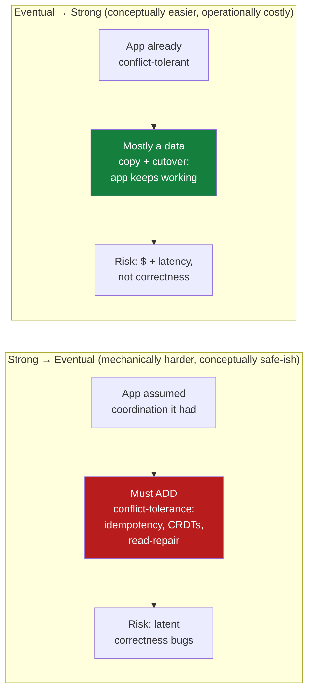

# PACELC — Staff / Principal Level

At junior and senior levels, PACELC is a model for reasoning about *a* database: "if Partitioned, choose Availability or Consistency; Else, choose Latency or Consistency." At the staff/principal level the model stops being about one system and becomes a **portfolio and procurement instrument**. You wield it to pick vendors, to set the platform defaults that hundreds of downstream engineers inherit, to allocate a multi-region latency budget, and to put a dollar figure on consistency. The theory is settled; the leverage is now organizational. This document is about that leverage.

The single most important reframing at this level: PACELC's binary choices (A-vs-C, L-vs-C) are the visible tip of a **three-way business trade-off — consistency versus latency versus cost**. Strong global consistency is not just slower; it is structurally more expensive, because the cross-region coordination that buys it (consensus quorums, TrueTime waits, synchronous replication) consumes network round-trips, dedicated hardware, and operational headcount. A staff engineer who presents the choice as "strong or eventual" to a VP has under-served them. The honest framing is a triangle, and you can usually optimize two corners at the expense of the third.

---

## Table of contents

1. [The three-way trade-off: consistency, latency, cost](#1-the-three-way-trade-off-consistency-latency-cost)
2. [Why strong global consistency costs money, not just milliseconds](#2-why-strong-global-consistency-costs-money-not-just-milliseconds)
3. [PACELC as a vendor-selection framework](#3-pacelc-as-a-vendor-selection-framework)
4. [The vendor comparison table](#4-the-vendor-comparison-table)
5. [Lock-in, TCO, and the exit cost of a consistency model](#5-lock-in-tco-and-the-exit-cost-of-a-consistency-model)
6. [The platform default is everyone's problem](#6-the-platform-default-is-everyones-problem)
7. [Multi-region strategy: where the latency tax lands](#7-multi-region-strategy-where-the-latency-tax-lands)
8. [Data residency interacting with consistency](#8-data-residency-interacting-with-consistency)
9. [Making staleness tolerance a product-owned number](#9-making-staleness-tolerance-a-product-owned-number)
10. [The staged decision diagram](#10-the-staged-decision-diagram)
11. [A worked TCO example: the $40k question](#11-a-worked-tco-example-the-40k-question)
12. [Running the database-selection review](#12-running-the-database-selection-review)
13. [Migrating across consistency models without a rewrite-from-zero](#13-migrating-across-consistency-models-without-a-rewrite-from-zero)
14. [Anti-patterns at organizational scale](#14-anti-patterns-at-organizational-scale)
15. [Staff-level checklist](#15-staff-level-checklist)

---

## 1. The three-way trade-off: consistency, latency, cost

The textbook PACELC dimensions are consistency and latency. In a real budget meeting there is always a third axis nobody drew on the whiteboard: **cost**. These three are coupled, and the coupling is the whole game.



You can comfortably hold **two** corners:

- **Consistency + Latency, sacrifice Cost** — Spanner. Strong, globally consistent reads that are also fast, but you pay for TrueTime infrastructure, redundant replicas, and a premium per-vCPU price.
- **Latency + Cost, sacrifice Consistency** — DynamoDB global tables, Cassandra multi-DC. Cheap and fast because every region serves locally, but the application now owns conflict resolution.
- **Consistency + Cost, sacrifice Latency** — single-region Postgres with cross-region reads going the long way. Cheap and strongly consistent, but a user in Singapore eats a 180 ms round-trip to us-east-1 on every request.

The staff move is to **name which corner you are sacrificing and get explicit sign-off on the cost of that sacrifice from the team that owns it.** Sacrificing consistency is "free" on the infra bill and shows up as a budget line in the application teams' incident count. Sacrificing latency is "free" in engineering effort and shows up as a conversion-rate line in the product P&L. Sacrificing cost shows up on your own bill where everyone can see it — which is, perversely, why it is the *least* dangerous corner to sacrifice politically and often the *most* defensible one to sacrifice technically.

A useful sentence to keep in your pocket: **"Consistency is a cost we can pay in dollars, in milliseconds, or in application complexity — pick the currency before you pick the database."**

It helps to notice *why* the triangle has exactly these three corners and not, say, four. The two PACELC dimensions — consistency and latency — are the corners every textbook draws. Cost is the third corner because coordination is not free to *build* or *run*, only to *avoid*. Every mechanism that buys consistency (quorums, synchronous replication, clock infrastructure) consumes either time (latency) or resources (cost), and you can shift the consumption between those two but not eliminate it. That is the deep reason the triangle is irreducible: **the physics of coordination forces you to spend it somewhere, and the only freedom you have is choosing the currency.** Recognizing this stops teams from chasing the impossible fourth corner — strong, fast, *and* cheap, globally — which a surprising number of architecture proposals are quietly trying to reach. There is no such system; there are only systems that hide which corner they sacrificed.

---

## 2. Why strong global consistency costs money, not just milliseconds

Junior engineers internalize "strong consistency is slower." Staff engineers need the next layer: *why the slowness has a price tag attached*. The latency and the cost are two readings of the same underlying physics — coordination.

To make a write strongly consistent across regions, **at least one party must wait for at least one round-trip to another region** before acknowledging. That fundamental fact spawns three cost centers:

1. **Replica count.** A consensus group needs a quorum, so 3 or 5 replicas instead of 1, often in 3 distinct regions/zones. You are paying for ~3–5× the compute and storage of a single-writer system, plus cross-region egress on every replicated write. Egress is the quiet killer: inter-region bandwidth is billed per GB and a write-heavy globally-replicated table can run a five-figure monthly egress bill that nobody forecast.

2. **Coordination infrastructure.** Spanner's strong consistency leans on TrueTime, which is GPS and atomic clocks in every datacenter. You do not buy the clocks, but you pay for them amortized into the price — Spanner's per-node cost is materially higher than a comparable DynamoDB or Cassandra node precisely because that coordination apparatus is baked in. There is no "cheap Spanner."

3. **Headroom for the wait.** Synchronous coordination means tail latency under load gets worse non-linearly. To keep p99 acceptable you over-provision: more nodes sitting partly idle so the quorum round-trips don't queue. Strong-consistency systems run at lower target utilization than eventually-consistent ones, which means more hardware per unit of useful throughput.

Conversely, eventual-consistency systems are cheap *because they refuse to coordinate*. A DynamoDB global-tables write commits locally and replicates asynchronously, so it pays one local fsync, not a cross-region quorum. The savings are real — and they are exactly equal to the cost of the conflict-resolution logic and reconciliation incidents you have just transferred to the application teams. **The money saved on infra is not destroyed; it is relocated to a different team's budget where it is harder to see.** Quantifying that relocation is the staff engineer's job.

A concrete way to feel the coordination cost: trace a single strongly-consistent cross-region write and count what it touches.



Every arrow in that diagram is either a millisecond on the latency budget or a dollar on the bill — usually both. The replication fan-out is replica *cost*; the round-trips are *latency*; the commit-wait is the price of the clock infrastructure. An eventual-consistency write collapses this entire diagram to a single local arrow: the client writes the nearest replica, gets an immediate ack, and the cross-region replication happens later, off the critical path, with no quorum and no wait. That collapse is the whole reason it is cheaper *and* faster — and the reason the application must now reconcile whatever the asynchronous replication eventually carries back from the other regions.

---

## 3. PACELC as a vendor-selection framework

When a database RFP lands on your desk, PACELC gives you a vocabulary to interrogate every candidate on the same axes instead of drowning in feature checklists. Classify each vendor by its PACELC letters, then immediately ask the cost and ops follow-ups the letters imply.

**Spanner — PC/EC.** During a partition it favors consistency (it will reject writes rather than diverge); in normal operation it *still* favors consistency over latency. The pitch to leadership is **operational simplicity bought with money**: app teams get a single, strongly-consistent, globally-distributed SQL database and never write conflict-resolution code. You pay for that with a premium price and a latency floor on cross-region writes. This is the right default when correctness bugs are existential (ledgers, inventory, identity) and the org would rather spend dollars than spread distributed-systems expertise across every product team.

**DynamoDB global tables — PA/EL.** During a partition it stays available; in normal operation it favors latency over consistency. The pitch is **cheap, fast, infinitely scalable** — and the catch is that global tables use last-writer-wins, so concurrent writes in two regions silently resolve by timestamp and one update vanishes. The application must be designed to tolerate that: idempotent writes, conflict-free data shapes (counters as CRDTs, append-only logs), or per-item region affinity. Choosing DynamoDB global tables is choosing to *invest in application discipline instead of infrastructure dollars*. That trade is excellent for high-volume, low-stakes-per-write data (sessions, carts, activity feeds) and catastrophic for ledgers if the team doesn't know what they signed up for.

**Cassandra multi-DC — PA/EL (tunable).** Like DynamoDB philosophically, but with knobs: you choose consistency level per query (`ONE`, `LOCAL_QUORUM`, `EACH_QUORUM`, `ALL`). The power is also the trap — consistency becomes a per-query decision distributed across hundreds of code sites, and `LOCAL_QUORUM` (fast, common default) gives you no cross-DC guarantee. The org cost is the **expertise tax**: you need engineers who understand quorum math, hinted handoff, read repair, and tombstones, or the cluster will quietly corrupt your latency and your data. Self-managed Cassandra trades license/cloud dollars for headcount.

The tunable-consistency angle deserves a staff-level caution, because it is seductive and dangerous in equal measure. The pitch — "you can dial consistency per query, so you get strong where you need it and fast where you don't" — sounds like it escapes the trade-off triangle. It does not. It merely *distributes the trade-off decision across every query in your codebase*, where it will be made inconsistently by hundreds of engineers under deadline pressure, most of whom will copy the `LOCAL_QUORUM` from the example in the wiki. The result is a system whose actual consistency guarantee is "whatever the median engineer pasted," which is unknowable and unauditable. Tunable consistency is a power tool that requires a *governance* answer (lint rules pinning consistency levels per table, code-review gates, a consistency-level registry) before it is a *capability* answer. Without governance, "tunable" means "unspecified," and unspecified consistency is the precondition for the worst class of data-loss incidents — the ones nobody can reproduce because the consistency level varied by code path.

**Single-region Postgres — PC/EC, but globally that means EL-by-distance.** Within its one region it is the gold standard of strong consistency and the cheapest, most-understood option on the board. Its "PACELC" only bites when you serve a global audience: there is no partition story because there is one region, and the latency cost is paid by every distant user as raw geographic round-trip time. The staff insight is that **single-region Postgres is the correct answer far more often than ambitious architectures admit** — if your users are regional, or your global users tolerate read replicas with replication lag, you avoid the entire distributed-consistency cost triangle. Reach for global distribution only when geography or availability *forces* it, not because it sounds senior.

The vendor-selection discipline is to **map each candidate's letters to a single sentence about who pays.** Spanner: "the company pays, in dollars." DynamoDB global: "the app teams pay, in conflict code." Cassandra multi-DC: "the platform team pays, in headcount and expertise." Single-region Postgres: "distant users pay, in latency — or nobody pays, if users are regional." If you cannot finish the sentence "with *X*, the cost of consistency is paid by *whom*, in *what currency*," you do not yet understand the vendor well enough to recommend it. The letters are a prompt for that sentence, not an answer by themselves.

A second-order trap in vendor selection is **conflating the managed product with the underlying model.** "DynamoDB" is not one PACELC point — a single-region DynamoDB table with strongly-consistent reads is PC/EC-ish; global tables flip it to PA/EL. "Postgres" can be single-region strong, or Aurora-multi-region with async replicas (EL), or a Patroni/Citus topology with different guarantees again. Always pin the candidate to a *specific configuration*, because the same product name spans multiple corners of the triangle depending on how it is deployed. The RFP question is never "Postgres or Dynamo" — it is "*this* Postgres topology or *that* Dynamo topology," and the consistency letters belong to the topology, not the brand.

---

## 4. The vendor comparison table

This is the artifact to bring to an architecture review. It scores the four archetypes on the axes that actually drive the decision.

| Dimension | Spanner (PC/EC) | DynamoDB global tables (PA/EL) | Cassandra multi-DC (PA/EL tunable) | Single-region Postgres (PC/EC) |
|---|---|---|---|---|
| **Default consistency** | Strong, external (linearizable) globally | Eventual across regions; LWW conflict resolution | Tunable per-query; default `LOCAL_QUORUM` = no cross-DC guarantee | Strong, serializable within the one region |
| **Cross-region write latency** | Tens of ms (TrueTime commit-wait + quorum) | Single-digit ms local; replication async | Single-digit ms local (`LOCAL_QUORUM`); `EACH_QUORUM` costly | N/A (one region); remote users pay geographic RTT |
| **Conflict handling owner** | Database (none for the app) | **Application** (must be conflict-tolerant) | **Application** at high CL; partial help from read-repair | Database (none) |
| **Relative infra $** | Highest (premium per-node, 3–5 replicas, TrueTime) | Low–moderate (pay-per-request or provisioned; egress adds up) | Low license; **high ops headcount** if self-managed | Lowest |
| **Operational burden** | Lowest (fully managed, no tuning) | Low (managed) but app-side discipline required | Highest (repairs, compaction, tombstones, quorum tuning) | Low (mature tooling, one node-set) |
| **Horizontal scale ceiling** | Effectively unbounded | Effectively unbounded | Very high | Vertical + read replicas; write ceiling per primary |
| **Lock-in / exit cost** | High (proprietary SQL dialect + TrueTime semantics) | High (proprietary API + DynamoDB Streams) | Low–moderate (open source, Cassandra/Scylla portable) | Lowest (standard SQL, ubiquitous) |
| **Best fit** | Global strong-correctness data: ledgers, inventory, identity | High-volume, conflict-tolerant data: sessions, carts, feeds | High-write, geo-distributed, team has CL expertise | Regional apps, or global apps tolerant of replica lag |
| **The bill lands on** | Finance (infra) | App teams (complexity + incidents) | Platform/SRE (headcount) | Nobody — until you outgrow one region |

The far-right *"bill lands on"* row is the one executives never see in a vendor datasheet and the one a staff engineer is uniquely positioned to add. Every option has a cost; the table's job is to make the cost *visible and attributed* rather than hidden in a different team's quarter.

---

## 5. Lock-in, TCO, and the exit cost of a consistency model

Total cost of ownership for a database is not the monthly bill. It is the monthly bill **plus the expected cost of leaving**, discounted by the probability you'll need to. Consistency model and lock-in are entangled in a way that surprises people.

The entanglement: **the stronger and more proprietary the consistency guarantee, the deeper the lock-in.** Spanner gives you a guarantee (external consistency via TrueTime) that *nothing else can replicate*. Once your application's correctness silently depends on linearizable reads with no application-side conflict logic, you cannot migrate to DynamoDB without *writing all the conflict logic you never had to write*. The migration isn't a data export; it's an application rewrite. That is the true exit cost, and it is highest for exactly the systems you were most relieved to make someone else's problem.

The mirror image: DynamoDB and Cassandra forced your app to be conflict-tolerant from day one. That discipline is portable. An app built for eventual consistency can usually run on *any* eventually-consistent store — Cassandra, Scylla, even a different cloud's KV store — because it never assumed coordination it can't get elsewhere. **The teams that took on application complexity bought themselves migration optionality.** The teams that bought operational simplicity bought lock-in. Neither is wrong; both are budget decisions that should be made on purpose.

A TCO model worth building for any candidate:

```
TCO(3yr) = infra_cost
         + ops_headcount_cost          (high for self-managed Cassandra)
         + app_complexity_cost         (high for eventual-consistency stores)
         + incident_cost               (conflict bugs, lag surprises, split-brain)
         + expected_migration_cost     (exit_probability × rewrite_effort)
```

Run that for all four archetypes and the "obvious cheap option" (raw Cassandra) and the "obvious premium option" (Spanner) often converge far closer than the sticker price suggests — because Cassandra's low infra line is offset by headcount and incidents, and Spanner's high infra line is offset by near-zero app-complexity and incident lines. The sticker price lies; the TCO model is honest. **Bring the TCO model, not the price list.**

One subtlety worth naming explicitly: **`exit_probability` is itself a function of the consistency choice.** Teams rarely migrate *away* from a system that just works and whose costs are predictable — so the highly-managed strong store (Spanner) has a *low* exit probability multiplying its *high* rewrite cost, while the cheap-but-operationally-demanding store (self-managed Cassandra) has a *higher* exit probability (orgs frequently flee Cassandra ops to Scylla or a managed offering) multiplying its *lower* rewrite cost. The expected-migration line is not just "how hard is it to leave" but "how likely are we to want to" — and the systems people most want to leave are often the ones cheapest to leave, which is a small mercy. The point is to estimate both factors, not just the rewrite effort, when filling the exit-cost line.

---

## 6. The platform default is everyone's problem

This is the section that separates staff from senior. When a platform team chooses the default datastore and its default consistency setting, they are not making one decision — they are making *every downstream team's* decision, by default, silently, with no review.

Consider a platform team that stands up a globally-distributed, eventually-consistent KV store as "the default database," with global replication on and last-writer-wins conflict resolution as the out-of-the-box behavior. That single choice propagates:



Team C did not choose eventual consistency. Team C chose "the company default database" because that is what the onboarding doc said to use. Their account-balance feature now has a latent data-loss bug that will surface as a customer-impacting incident eighteen months later, traced back to a default that a platform engineer set without ever meeting Team C. **A globally-eventual default does not remove conflict handling — it relocates it onto every app team, unannounced, opt-out-by-omission.**

The staff-level remedies:

- **Make the consistency default a conscious, reviewed decision, not an accident of the first system that got built.** If the default is eventual, that is defensible — *if* it's documented loudly and the dangerous use cases are flagged.
- **Provide a "strong tier" alongside the cheap tier**, and route correctness-critical data to it. Most orgs need both: a PA/EL store for the 95% of conflict-tolerant data and a PC/EC store for the 5% that touches money or identity. Offering only one forces every team into the wrong corner for half their data.
- **Put guardrails in the platform, not in a wiki page.** A wiki page that says "don't store balances in the eventual store" will be ignored. A schema-registry check, a data-classification tag that *routes* sensitive data to the strong tier, or a lint rule on the data-access layer will not be.
- **Treat the default as an API contract.** Changing the platform's default consistency later is a breaking change for every team that absorbed the old behavior into their assumptions. Version it; communicate it like an API deprecation.

There is a deeper organizational reason defaults are so dangerous: **defaults are absorbed silently and surface asymmetrically.** When a team adopts the default store, nothing in their experience signals "you have just inherited last-writer-wins." The code compiles, the tests pass, the demo works — because conflicts require *concurrent cross-region writes to the same key*, which almost never happen in development or in early low-traffic production. The default's danger is latent precisely while the system is small, and detonates exactly when the system gets large enough to matter. This is the worst possible failure timing: invisible when cheap to fix, catastrophic when expensive to fix. A guardrail that *forces the inheritance to be explicit* — a required `consistency:` field in the service manifest with no default value, so every team must consciously type `eventual` or `strong` — converts a silent inheritance into a deliberate choice. Removing the default is sometimes safer than picking a good one.

A practical pattern for the strong/cheap two-tier platform: expose them as **named, self-documenting tiers** rather than raw products. "Tier-Ledger" (strong, expensive, for money/identity) and "Tier-Stream" (eventual, cheap, for feeds/sessions) carry their semantics in their names, so a team picking "Tier-Stream" for account balances has to actively ignore the word "Stream." Naming is a guardrail. The platform team's job is not only to provide the two tiers but to make the *wrong* choice feel wrong at the moment of selection — through names, required fields, data-classification routing, and lint rules — because no amount of documentation competes with the path of least resistance.

The mental model: **a platform team's consistency default has the blast radius of a company-wide API.** Set it with the same care.

---

## 7. Multi-region strategy: where the latency tax lands

Going multi-region does not eliminate the latency tax — it relocates it. Someone, on some operation, pays a cross-region round-trip. The staff decision is *who pays, on which operation*, and that is a product decision disguised as an infrastructure one.

The fundamental geometry: in any multi-region system with a single source of truth for a given piece of data, you can make either **reads** or **writes** local-and-fast, but the other operation pays the cross-region cost. PACELC's EL/EC choice is precisely the choice of where to put that tax.

| Strategy | Reads | Writes | Latency tax falls on | Consistency |
|---|---|---|---|---|
| **Single primary region** | Remote regions pay RTT | Remote regions pay RTT | Distant users, all ops | Strong |
| **Primary + follower-read replicas** | Local & fast (possibly stale) | Remote regions pay RTT | Distant users, on writes | Read-your-writes broken across regions |
| **Multi-primary (active-active)** | Local & fast | Local & fast | Nobody — paid in conflicts instead | Eventual; app handles conflicts |
| **Regional sharding (data pinned to home region)** | Local for home users | Local for home users | Cross-region access (rare by design) | Strong *within* a region |

**Follower reads** are the most common pragmatic middle ground: keep one strongly-consistent write primary, place read replicas in every region, accept replication lag on reads. The latency tax shifts entirely onto writes and onto the read-your-writes guarantee (a user who writes in one region may not see their own write when read-routed to a local replica). For read-heavy, write-light workloads where staleness of a few hundred milliseconds is acceptable, this captures most of the latency win at a fraction of the multi-primary complexity. **Follower reads are the highest-leverage multi-region pattern most orgs under-use.**

**Regional sharding** (sometimes "geo-partitioning" or "data pinning") is the elegant escape from the trade-off entirely: if a European user's data lives only in Europe and is only accessed from Europe, there is *no* cross-region operation to pay for. You get strong consistency *and* low latency *and* no conflict logic — at the cost of giving up easy global queries and handling the rare cross-region user. When your data has natural geographic locality (most B2C and many B2B workloads do), this is often the best answer on the board and is criminally underused because it requires thinking about the data model up front rather than bolting on global replication later.

There is also a quieter consideration: **the latency tax is not uniform across your user base, and the distribution matters more than the average.** A single write primary in us-east-1 imposes ~10 ms on North-American writes and ~250 ms on Australian writes. If 2% of revenue is Australian, a uniform "p99 write latency" SLO hides a regional cohort with a catastrophic experience while the global number looks fine. Staff engineers should insist on **per-region latency SLOs**, not just global percentiles, precisely because multi-region architecture creates per-region winners and losers by design. The architecture choice *is* a choice about which geographic cohort you are willing to under-serve.

Follower-read regions deserve one more note: they reintroduce a subtle consistency hazard — **read-your-writes violation across regions.** A user who updates their profile in Sydney, then reloads, may be routed to a Sydney read replica that hasn't yet received the replication from the us-east-1 primary, and see their *old* profile. The fix (sticky routing to the primary for a short window after a write, or a session-consistency token) costs latency or complexity. This is the kind of detail that determines whether follower reads are a clean win or a stream of "my change disappeared" support tickets — and it is invisible until a user hits it.

The staff framing for leadership: **"Multi-region is not a latency fix; it is a choice about which users and which operations pay the latency, and whether we pay the rest of the bill in dollars or in conflict-handling code."**

---

## 8. Data residency interacting with consistency

Data-residency law (GDPR, data-localization mandates, sector regulations) is usually treated as a compliance checkbox. At staff level you must see that **residency requirements directly constrain your PACELC options**, sometimes eliminating the cheap one.

The interaction: a residency rule that says "EU personal data must physically remain in the EU" is, in PACELC terms, a *hard constraint on replica placement*. It can collide with consistency goals in two ways:

1. **It can forbid the cheap eventual-consistency global table.** A globally-replicated DynamoDB or Cassandra table copies every row to every region by design — which means EU personal data ends up in us-east-1. That is the *entire value proposition* of global tables and also a residency violation. You may be forced onto a per-region architecture (regional sharding) you would otherwise not have chosen, changing your cost and consistency profile.

2. **It can make strong global consistency physically impossible for some data.** If EU data cannot leave the EU, you cannot form a global consensus quorum that spans the EU and the US for that data. The strong-consistency boundary is now the residency boundary. You get strong consistency *within* the EU and *within* the US, but cross-jurisdiction strong consistency is off the table — not for cost reasons, for legal ones.

The convenient truth is that **residency and regional sharding point the same direction.** If law forces EU data to stay in the EU, the regional-sharding pattern from §7 becomes mandatory rather than optional — and regional sharding happens to give you strong consistency *and* low latency *within* each region with no conflict logic. The constraint that looks like a tax often nudges you toward the architecture you should have picked anyway. The mistake is discovering the residency requirement *after* committing to a global eventual-consistency store, then bolting on regional exceptions that fracture both your consistency model and your compliance posture.

There is a subtler interaction worth flagging: **residency can fragment a previously-global identity or reference dataset.** Suppose user accounts are global but must now be residency-partitioned. A "find user by email" lookup that used to hit one global table now has to fan out across jurisdictional shards, or maintain a residency-compliant global *index* that contains only non-personal routing keys (e.g., a hash → region map) while the personal data stays home. Designing that split — a minimal non-personal global directory pointing at residency-pinned personal stores — is a recurring staff-level pattern when residency law arrives at a system that assumed global reach. It preserves global discoverability without globally replicating regulated data, and it is far cheaper to design up front than to retrofit once the data is already globally smeared.

Staff move: **map residency boundaries onto consistency boundaries during design, not during the audit.** Treat "what data must stay where" as a first-class input to the database selection, equal to consistency and cost — because it can veto both.

---

## 9. Making staleness tolerance a product-owned number

The deepest staff-level reframing of PACELC: the EL/EC choice is often presented to engineers as a technical decision, but **"how stale can this read be?" is a product question with a quantitative answer that the product owner should set and sign.** Engineers cannot answer it correctly because they do not own the user experience or the revenue model; product cannot answer it correctly without engineering translating it into a number. The artifact is a jointly-owned **staleness budget**.

Most consistency disasters trace to an unstated assumption. The engineer assumed "eventually consistent is fine here." The product owner assumed "of course the balance is current." Nobody wrote down a number, so the assumption was never tested against reality. The fix is mechanical: for every read path, force the question **"what is the maximum acceptable staleness, in milliseconds or seconds, and what is the cost when we exceed it?"** and record the answer as a product requirement.



A worked staleness budget for a single product:

| Data / read path | Max staleness (product-set) | Cost if exceeded | Resulting tier |
|---|---|---|---|
| Account balance shown before a transfer | 0 (must be current) | Customer overdraws; regulatory exposure | Strong, PC/EC |
| Available inventory at checkout | 0–1 s | Oversell; refunds; CX cost | Strong or read-after-write |
| Order status in "my orders" | ~5 s | Mild confusion; support ticket | Follower read |
| Social feed / activity stream | ~30 s | Imperceptible | Eventual, cheap |
| Recommendation ranking | minutes | None | Eventual / batch |

The power of this table is that it **decomposes a monolithic "what database" question into per-read-path decisions with explicit owners.** It also reveals that almost no real product needs strong consistency *everywhere* — typically a small fraction of read paths demand zero staleness, and the rest can run on the cheap fast tier. That decomposition is exactly what lets you run a mixed portfolio (§6) instead of paying Spanner prices for your activity feed.

The organizational mechanism that makes this stick: **put the staleness number in the same artifact as the SLO.** Latency SLOs are already product-negotiated; staleness is the same kind of quality budget and belongs next to it. When staleness is a signed product number rather than an engineering guess, the consistency-vs-latency-vs-cost trade-off becomes a transparent business decision instead of a buried technical assumption that detonates in an incident review eighteen months later.

One refinement that separates good staleness budgets from great ones: **distinguish staleness from conflict.** They are different failure modes with different product costs. *Staleness* is "I see old-but-correct data for a while" — a follower-read profile that's 800 ms behind. *Conflict* is "two writes happened and one was silently lost" — last-writer-wins discarding a balance update. A read path can tolerate seconds of staleness while tolerating *zero* lost writes, or vice versa. The §9 table above measures staleness; for write-heavy data you need a second column — *"can this data lose a concurrent write?"* — because the answer routes you between "eventual reads are fine" (staleness-tolerant) and "we need a conflict-free data shape or a strong store" (conflict-intolerant). Conflating the two is how a team concludes "a few seconds of lag is fine here" and accidentally signs up for silent data loss they never evaluated.

---

## 10. The staged decision diagram

This is the end-to-end framework: a staged walk from "what is this data" to "which vendor," with the cost and ownership questions wired in at each gate. Use it to drive a real database-selection review.



Read the diagram as a sequence of *gates that each filter out a corner of the triangle*. Stage 1 asks whether you can afford to sacrifice consistency at all. Stage 2 lets geography eliminate the entire global-distribution cost if your users are regional — the cheapest possible exit. Stage 3 forces the product owner to put a number on staleness *before* engineering picks a tier. Stage 4 is where you decide whether to pay for consistency in dollars (Spanner) or in application complexity (DynamoDB/Cassandra). Stage 5 — the gate teams skip — makes the cost concrete and attributed before anyone commits.

The most important property of this staged flow is that **the cheapest correct answers are reachable early.** Many designs that "obviously need" a globally-distributed database get correctly routed to single-region Postgres at Stage 2 or to regional sharding at Stage 3, never reaching the expensive Stage-4 branches at all. A staff engineer's value is often in pulling a proposal *back up* the diagram to a cheaper stage, not pushing it down to a fancier one.

Note also that the diagram operates *per data class*, not per application. A single product walks the whole flow multiple times — its account-balance data exits at Stage 4a (Spanner), its sessions exit at Stage 4b (DynamoDB), and its EU personal data exits at Stage 2/3 (regional sharding for residency). The output of the framework is rarely "the database"; it is **a small portfolio of stores, each chosen for a data class, unified by a routing layer that sends each write to the tier its classification demands.** Resisting the urge to force every data class through one store — the single most common simplification that turns out expensive — is the framework's central payoff. One database is operationally simpler; the right two or three are dramatically cheaper and more correct, and the routing layer that unifies them is a modest, well-understood piece of engineering compared to the cost of getting the consistency tier wrong for half your data.

---

## 11. A worked TCO example: the $40k question

Abstractions don't survive a budget meeting; numbers do. Here is a concrete, defensible 3-year TCO comparison for a single decision — *"where do we put the user-profile and account-settings store for a global consumer app, ~50M users, read-heavy, with a small subset of account-balance/credits data"* — across two of the four archetypes. The numbers are illustrative orders of magnitude, not vendor quotes; the *method* is the deliverable.

| Cost line (3-year, illustrative) | Spanner (one strong tier for everything) | DynamoDB global + Spanner for the 5% money data |
|---|---|---|
| Infra / managed-service bill | ~$1.8M (premium nodes, 3-region, all data strong) | ~$520k Dynamo + ~$160k small Spanner = ~$680k |
| Cross-region egress | Included in node price | ~$90k (global-table replication) |
| Platform / SRE headcount | ~0.3 FTE ($210k) — fully managed, little tuning | ~0.4 FTE ($280k) — two systems, routing layer |
| App-complexity cost | ~0 (no conflict code anywhere) | ~$240k (conflict-tolerant design on the 95%) |
| Incident cost (3yr expected) | ~$60k (rare; correctness guaranteed) | ~$180k (LWW conflict bugs, lag surprises) |
| Expected migration / exit cost | ~$300k (high lock-in, proprietary dialect) | ~$120k (eventual-store portability for the 95%) |
| **3-year TCO** | **~$2.37M** | **~$1.59M** |

What the table teaches, beyond the bottom line:

- The **sticker price gap ($1.8M vs $680k) is misleading.** Once headcount, app-complexity, incidents, and exit cost are added, the real gap narrows from 2.6× to ~1.5×. The cheap option is still cheaper here, but by less than half what the price list implied — and if this app's data were *not* mostly conflict-tolerant, the app-complexity and incident lines would balloon and could flip the result.
- The **mixed-portfolio option wins** by refusing to pay strong-consistency prices for the 95% of data that tolerates staleness, while still buying Spanner's guarantee for the 5% that touches money. This is the §6 "strong tier alongside cheap tier" pattern expressed as dollars.
- The **app-complexity line ($240k) is real money that lands on a different team's budget.** A naive comparison that omits it makes the cheap option look ~$240k better than it is. Surfacing that line — and getting the app teams to own it knowingly — is the staff contribution.

The discipline: **never present a vendor decision with fewer than these seven cost lines.** A two-line comparison (infra + maybe headcount) is the single most common way a database decision goes wrong at scale, because it hides the costs that land on teams other than the one running the meeting.

---

## 12. Running the database-selection review

The framework is only useful if it changes how the decision actually gets made in a room. Here is how a staff engineer should run a datastore-selection review so that PACELC's trade-offs become explicit and owned rather than assumed.

**Before the meeting:**

- **Write the data classification first.** For each distinct data class (not "the database" — the *data*), state whether a stale or lost write causes money/legal/safety harm. This is Stage 1 of the decision diagram and it usually splits one "database decision" into two or three, each with a different right answer.
- **Get a draft staleness budget from product.** Walk the product owner through the §9 table for the top read paths *before* engineering convenes. Arriving with a signed staleness number per path turns the meeting from a debate into a routing exercise.
- **Pre-fill the TCO model** (§11) for two or three serious candidates. An empty TCO template invites hand-waving; a filled one invites correction, which is the conversation you want.

**In the meeting, enforce three rules:**

1. **Name the sacrificed corner out loud.** Every proposal sacrifices consistency, latency, or cost. If nobody can say which, the proposal isn't ready. "We'll use DynamoDB global tables" must be followed by "…which sacrifices consistency, paid in app-side conflict code owned by Team B, who are here and agree."
2. **Make the receiving team present.** The team that inherits the relocated cost — the app team that will write conflict logic, the SRE team that will run Cassandra — must be in the room and must say "yes" on the record. A cost relocated without consent is an incident scheduled for eighteen months out.
3. **Pull proposals up the diagram, not down.** The staff instinct should bias toward the cheaper, simpler stage. Ask "could this be single-region?" and "could this be regionally sharded?" before "which global distributed store?" Most proposals that reach the meeting assuming Stage 4 belong at Stage 2 or 3.

**After the meeting:**

- **Record the decision as an ADR** that names the PACELC classification, the sacrificed corner, the staleness budget, the TCO, and the team that owns each relocated cost. The ADR's job is to make the *next* engineer — who finds this database in production in three years — understand which assumptions are load-bearing.
- **Wire the decision into guardrails**, per §6. If the outcome is "money data goes to the strong tier," that belongs in a data-classification check or a routing rule, not only in the ADR.

The meeting is where PACELC stops being theory. A staff engineer who runs it well produces decisions that are *cheaper, more correct, and explicitly owned* — and, just as importantly, decisions that survive the departure of everyone who made them because the reasoning is recorded.

---

## 13. Migrating across consistency models without a rewrite-from-zero

Sometimes the org's earlier default was wrong and money data is sitting in an eventual-consistency store, or an over-cautious team put a high-volume feed in Spanner and the bill is unsustainable. Migrating *across consistency models* is the hardest database migration there is, because it is an *application* migration disguised as a data migration. Staff engineers are the ones who plan it so it doesn't become a year-long death march.

The two directions are asymmetric:



**Eventual → Strong is the easier direction.** An app built for eventual consistency makes no assumptions that a strong store violates — it already handles conflicts, idempotency, and staleness. Moving it to Spanner mostly *removes* burden. The migration is a data copy, a dual-write/backfill phase, and a cutover; the application code barely changes. The cost is the new infra bill and write latency, not a rewrite. This is the migration you run when an earlier eventual default proved unsafe for money data and you've decided to buy the guarantee.

**Strong → Eventual is the dangerous direction.** An app built against a strongly-consistent store has *absorbed coordination it never had to think about* — it reads its own writes, it assumes no two writers conflict, it treats a successful write as durable-and-visible everywhere. Moving it to an eventual store means *retrofitting every one of those assumptions*, and the failures are silent: no compiler error tells you that a balance update can now be lost to last-writer-wins. You must audit every write path for conflict-safety, make writes idempotent, reshape mutable counters into CRDTs or append-only logs, and add reconciliation. This is why it is cheaper to *start* eventual and migrate to strong than to start strong and migrate to eventual — and why the §6 default matters so much. **The direction you pick by default determines the difficulty of the day you change your mind.**

The phased mechanism that de-risks either direction:

1. **Dual-write, single-read.** Write to both old and new stores; keep reading from old. Validates write-path compatibility with zero user impact.
2. **Backfill + reconcile.** Copy historical data; run a continuous reconciliation job comparing old and new. For a strong→eventual move, the reconciler is also your conflict-detector — it surfaces exactly the writes that LWW would silently drop.
3. **Shadow-read.** Read from both, serve from old, log divergences. For strong→eventual this is where latent correctness bugs reveal themselves before users see them.
4. **Cutover by traffic percentage**, per data class, with the staleness budget (§9) as the acceptance criterion. Roll back instantly if divergence exceeds the product-signed tolerance.

The staff judgment is mostly in step 3: **shadow-reads are the only cheap way to discover which of your application's correctness assumptions were silently load-bearing on the old store's consistency model.** Skip them on a strong→eventual migration and you ship the bugs straight to production.

---

## 14. Anti-patterns at organizational scale

**Resume-driven distribution.** Choosing Spanner or a multi-region active-active topology because it is impressive, when single-region Postgres would serve a regional user base at a tenth of the cost and complexity. The triangle has three corners; picking the expensive one when geography doesn't require it sacrifices cost for nothing.

**The silent eventual default.** Covered in §6 — a platform team ships a globally-eventual default, every downstream team inherits last-writer-wins without consenting, and the money saved on infra reappears as conflict-bug incidents on app-team P&Ls. The infra dashboard looks great while the incident channel fills up.

**Strong consistency everywhere "to be safe."** The mirror anti-pattern: routing the activity feed and the analytics tables through the same strong, expensive tier as the ledger because "consistency is good." You are paying Spanner prices to make a recommendation ranking linearizable. The §9 staleness budget exists to kill this.

**Treating the sticker price as the cost.** Comparing vendors on monthly bill alone, ignoring headcount (Cassandra's ops tax), application complexity (eventual stores' conflict code), and exit cost (proprietary lock-in). The cheap option on the price list is frequently the expensive option on the TCO model.

**Discovering residency after committing.** Picking a global eventual-consistency store, then learning of a data-localization requirement, then bolting on regional carve-outs that fracture both the consistency model and the compliance story. Residency is a Stage-2 input, not an audit-time surprise.

**Unowned staleness assumptions.** No product-signed staleness number anywhere, so every read path's consistency is an undocumented engineering guess. This is the root cause of most consistency incidents and the cheapest one to prevent — it costs one column in the requirements doc.

**Defaults set by accident.** The company's default database is "whatever the first team happened to build on," and its consistency model propagates to hundreds of services that never reviewed it. Defaults deserve the scrutiny of a company-wide API decision because that is what they are.

---

## 15. Staff-level checklist

Before signing off on a datastore decision at organizational scale, confirm:

- [ ] The trade-off was framed as **three corners — consistency, latency, cost** — not a binary, and the sacrificed corner is named explicitly.
- [ ] For the strong-consistency option, the cost was quantified in **dollars** (replicas, egress, premium per-node, lower utilization headroom), not just milliseconds.
- [ ] For the eventual-consistency option, the relocated cost — **application conflict-handling and incident risk** — was quantified and attributed to the team that absorbs it.
- [ ] Every candidate was classified by **PACELC letters**, and the cost/ops/lock-in follow-ups each letter implies were asked.
- [ ] A **3-year TCO model** (infra + headcount + app-complexity + incidents + exit cost) was run, not a sticker-price comparison.
- [ ] **Lock-in and exit cost** were assessed; the strongest, most proprietary guarantee is also the deepest lock-in.
- [ ] If this is a **platform default**, it was reviewed with the blast radius of a company-wide API, a strong tier exists alongside the cheap tier, and guardrails are in code, not a wiki page.
- [ ] The **multi-region latency tax** was located: which users, which operations, and whether the rest of the bill is paid in dollars or conflict code. Follower reads and regional sharding were considered before active-active.
- [ ] **Data residency** was mapped onto consistency boundaries during design, not deferred to an audit.
- [ ] The **staleness tolerance is a product-signed number** per read path, recorded next to the latency SLO.
- [ ] The proposal was **pulled up the decision diagram** to the cheapest correct stage, not pushed down to the most impressive one.

PACELC at the staff level is not a deeper theory than at the senior level — it is the *same* theory applied to budgets, vendors, defaults, and org structure instead of to a single system. The skill is translating "A-vs-C, L-vs-C" into "who pays, in what currency, and did they agree to it." Master that translation and you turn a distributed-systems theorem into a procurement and platform-strategy tool that the rest of the organization can actually use.

*Next step:* [Interview questions](interview.md)
