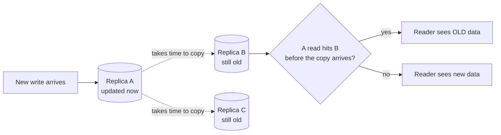
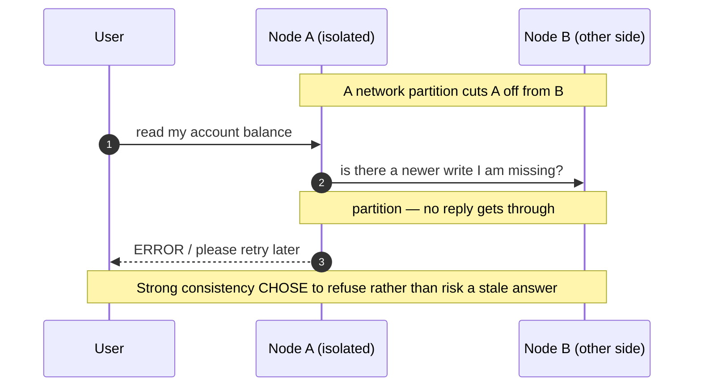

# Consistency vs Availability — Junior

<!-- level-focus -->
At junior level, focus on this question:

> How can I apply **Consistency vs Availability** in one small example and prove the result?

Use the smallest realistic scenario that exposes the decision and its failure behavior.
You are building a system that keeps more than one copy of your data. The moment a second copy exists, you face a question that never goes away: **when one copy gets a new write, what do the other copies show until they catch up?** Answer it one way and your reads are always fresh but the system sometimes refuses to answer. Answer it the other way and the system always answers but sometimes with slightly old data. That is the consistency-versus-availability trade-off, and this page builds the intuition for it from the ground up — no formulas, just stories and pictures.

## 1. The one sentence that explains everything

Here is the whole topic compressed into a single idea you can carry forever:

> **Consistency** is a promise about *how fresh* your data is. **Availability** is a promise about *whether the system answers at all*. When the network or a machine misbehaves, you often cannot keep both promises perfectly at the same time — so you decide which one you would rather break.

Everything else on this page is an unpacking of that sentence. A junior engineer who internalizes just this is already ahead of most people who can recite "CAP theorem" but cannot explain what it feels like in a real product.

Notice the two words "how fresh" and "whether it answers." They describe different things:

- A system can answer instantly but give you **old** data → highly available, weakly consistent.
- A system can give you **perfectly fresh** data but make you wait, or return an error, when it is not sure → strongly consistent, less available.

The art of system design is choosing the right point between these for each feature you build. And it is **per feature**, not per company. The same product can be strongly consistent for your bank balance and eventually consistent for a "likes" counter on the same screen.

---

## 2. Why replication forces the choice

If your data lived on exactly **one** machine, this entire topic would not exist. One machine has one copy. A read always sees the most recent write because there is nowhere else for the data to be. There is nothing to be inconsistent *with*.

The trouble starts because we cannot live with one machine. We keep multiple copies — this is called **replication** — for two unavoidable reasons:

1. **Durability and fault tolerance.** If the single machine catches fire, your data is gone and your service is down. With three copies on three machines in three locations, you survive losing two of them.
2. **Performance and scale.** One machine can only serve so many reads per second, and users in Tokyo should not wait for a round trip to a server in Virginia. Copies near users are fast; one central copy is slow for someone far away.

So replication is not a luxury; it is how every serious system survives and scales. But replication is exactly what creates more than one copy — and the instant a write lands on one copy, every *other* copy is momentarily wrong until the update reaches it.



That little gap — the time between "write lands on A" and "the update reaches B and C" — is called **replication lag**. It is usually milliseconds. But it is never zero, and it is during that gap that all the interesting decisions get made. Strong consistency says "hide that gap from readers, whatever it costs." Eventual consistency says "let readers see the gap; it closes fast and that is fine."

The key realization for a junior: **the trade-off is not optional and not anybody's mistake.** It is a direct, unavoidable consequence of keeping copies. The day you decided to keep copies — which you had to — you signed up for this question.

---

## 3. The consistency spectrum: strong, eventual, weak

People talk as if consistency is a yes/no switch. It is really a spectrum. Let us walk it from strictest to loosest, each with a concrete picture.

### Strong consistency — "every read sees the latest write"

**The promise:** the moment a write is acknowledged as successful, *any* read afterward — from any replica, by anyone — sees that new value or a newer one. You never travel back in time.

**Concrete example.** You transfer $500 out of your checking account. The instant the transfer confirms, your balance reads $500 lower on the website, on the mobile app, and at the ATM. There is no window where one screen shows the old balance and another shows the new one. The system behaves as if there were a single, authoritative copy that everyone reads from — even though, under the hood, there are many copies being carefully coordinated.

**The cost.** To deliver this promise, the replicas must agree *before* the write is confirmed, or reads must be routed in a way that guarantees freshness. That coordination takes time and, crucially, can fail: if replicas cannot reach each other, the safe move is to **stop answering** rather than risk handing out stale data.

### Eventual consistency — "replicas converge, eventually"

**The promise:** if writes stop coming, then after some (short) time, **all replicas will hold the same value.** In the meantime, different replicas may briefly disagree, and a read may return slightly old data. The word "eventually" means "given a little time to propagate" — typically milliseconds to seconds, not hours.

**Concrete example.** You change your profile picture. It updates instantly for you. A friend loading your profile from a replica in another region might see your old picture for a second or two, then it refreshes to the new one. Nothing is broken — the update is simply still in flight to their replica. Give it a moment and everyone converges on the new picture.

**The benefit.** Because replicas do not have to agree before answering, every replica can respond to reads *immediately* using whatever it currently holds. The system stays fast and stays up even when replicas cannot talk to each other.

### Weak consistency — "no promise about when, or whether, you see a write"

**The promise:** essentially none about freshness. A read may return old data, and there is no built-in guarantee about *when* it will catch up — or even that a given reader ever sees a particular intermediate value at all. Updates propagate on a best-effort basis.

**Concrete example.** A live video stream or a multiplayer game's positional updates. If a frame or a position packet is late or lost, the system does not pause everything to make sure you saw it — it moves on to the next, fresher update. You would rather have the *current* state than a perfect replay of every past state. Old data here is not slightly-stale-but-correct; it is simply skipped.

A helpful way to feel the difference: **eventual consistency promises you will catch up; weak consistency does not even promise that.** Eventual is the well-behaved middle of the spectrum that most large internet products live in. Pure weak consistency is reserved for cases where freshness matters far more than completeness.

---

## 4. What availability actually means

Availability has a precise, simple meaning that beginners often blur:

> A system is **available** if every request it receives gets a sensible, non-error response in a reasonable time — even if that response is built from slightly older data.

Read that carefully. Availability does **not** mean "the data is correct and fresh." It means "the system answered instead of timing out or returning an error." Those are different qualities, and conflating them is the single most common confusion in this whole topic.

Three things follow from this definition:

1. **A slow response can still be unavailable in practice.** If a request takes 30 seconds because replicas are arguing about the latest value, the user experiences a hang. From their point of view the system is down, even though it is technically still working on it. This is why "consistency costs latency" matters so much — high latency is a soft form of unavailability.
2. **An error is unavailable, even if it is a "correct" error.** A bank returning "Sorry, we cannot show your balance right now, please retry" is *protecting consistency by sacrificing availability*. It refused to answer rather than answer wrongly. That can be the right call — but it is unambiguously a hit to availability.
3. **Answering with old data is still available.** When YouTube shows a view count that is a few minutes behind, it answered. The user got a number, the page loaded, nothing was broken. It chose availability over perfect freshness.

So the trade-off, restated with this definition in hand: **a strongly consistent system would rather give you an error or a hang than a stale answer. An eventually consistent system would rather give you a slightly stale answer than an error or a hang.** Same situation, opposite preference.

---

## 5. A stale-read story you have already lived

Let us make this concrete with a story almost everyone has experienced without naming it.

You are commenting under a popular post. You type "Totally agree, great point!" and hit **Send**. Your comment appears immediately — you see it at the bottom of the thread. Satisfied, you message your friend: *"Just replied to that post, go look."*

Your friend opens the same post. They scroll. Your comment is **not there.** They reply: *"I don't see anything?"* You are confused — it is clearly there on *your* screen. Your friend refreshes once... twice... and on the third try, there it is. Two seconds, maybe three, and it appeared.

Nothing was broken. Here is what happened under the hood:

- Your **Send** wrote your comment to a replica close to you — call it **Replica West**. It confirmed instantly, so you saw it instantly.
- Your friend, sitting in a different region, was being served by **Replica East**.
- The system is **eventually consistent** for comments. Your write was still propagating from West to East when your friend first loaded the page. East had not yet received the update, so it honestly returned what it knew: a thread without your comment. That is a **stale read** — a correct answer about a slightly outdated copy.
- A second or two later, the update reached East. Now East had your comment too. Your friend's refresh hit an up-to-date replica and saw it.

The system chose **availability**: East answered your friend immediately with the data it had, rather than blocking the page load while it phoned West to ask "wait, is there anything newer?" For a comment thread, a two-second delay is completely acceptable, and a fast-loading page is worth far more than guaranteed up-to-the-millisecond freshness.

Now imagine the same lag on your **bank balance** instead of a comment. You transfer money, see the new balance, then check from another device and it shows the *old* balance. That is alarming — it looks like your money vanished. For balances, the brief staleness that is harmless for comments becomes unacceptable. That is exactly why banks pick strong consistency for balances and social apps pick eventual consistency for comments. **Same mechanism, different stakes, different choice.**

---

## 6. Before, during, after: watching a stale read happen

Let us slow the comment story down to three frozen moments and watch the data on each replica. This is the staged "before → during → after" view of a stale read.

```mermaid
sequenceDiagram
    autonumber
    participant You
    participant West as Replica West
    participant East as Replica East
    participant Friend

    Note over You,Friend: BEFORE — both replicas agree, thread has 0 of your comments
    You->>West: read thread
    West-->>You: [no comment yet] (correct)
    Friend->>East: read thread
    East-->>Friend: [no comment yet] (correct)

    Note over You,Friend: DURING — you write; West has it, East does not yet
    You->>West: POST comment "Great point!"
    West-->>You: 200 OK (you see it instantly)
    West--)East: replicate the new comment (in flight, ~2s)
    Friend->>East: read thread (before update arrives)
    East-->>Friend: [no comment yet] ← STALE READ
    Note over Friend: Friend sees old data — system stayed AVAILABLE

    Note over You,Friend: AFTER — replication caught up; replicas agree again
    West--)East: ...replication completes
    Friend->>East: refresh thread
    East-->>Friend: ["Great point!"] (now fresh)
    Note over You,Friend: Converged — eventual consistency delivered on "eventually"
```

Walk through the three stages:

- **Before (steps 1–4).** Quiet state. Both replicas hold the same thread. Any read from anywhere is correct because there is nothing in flight. There is no consistency problem when nothing is changing.
- **During (steps 5–8).** You write. West acknowledges and you see your comment — this is why *your own* writes always look instant; you read your own change from the replica that took it. The update begins copying to East (step 7, the dashed async arrow). In that window your friend reads from East and gets the **stale** result. This is the only moment a stale read is even possible: while an update is in flight.
- **After (steps 9–11).** Replication completes. East now matches West. The next read your friend does returns the fresh comment. The replicas have **converged** — the defining behavior of eventual consistency.

The single most important thing to take away from this diagram: **the staleness window is exactly the replication lag, and outside that window everything is consistent.** Stale reads are not random corruption. They are a bounded, short, well-understood gap that exists only during propagation — and an eventually consistent system accepts that gap in return for never having to block or refuse a read.

Now contrast it with what a **strongly consistent** system would have done at step 8. Instead of East returning old data, it would either (a) route the read so it sees the latest write, or (b) make the read wait until East had confirmed it had the newest data, or (c) return an error rather than risk a stale answer. Any of those keeps the data fresh — at the price of a slower or failed read. That price is the subject of the next two sections.

---

## 7. How strong consistency slows down or refuses

Strong consistency is not magic. To promise that every read sees the latest write, the system has to *do extra work* before it can safely answer, and sometimes that work cannot be completed. Two consequences fall out, both of which hurt availability.

### It slows down (added latency)

Before confirming a write, a strongly consistent system typically waits for **several replicas to agree** that they have the new value. Before serving a read, it may have to **check with other replicas** to be sure it is not handing out something stale. Each of these checks is a network round trip. Round trips take time — and the more spread out your replicas (say, across continents), the more time. So strong consistency tends to make both writes and reads slower. As we saw in [section 4](#4-what-availability-actually-means), enough added latency *is* a form of unavailability from the user's seat.

### It refuses (during a network problem)

Now imagine the replicas **cannot reach each other** — a network link drops between two data centers. This is called a **network partition**, and it is not rare; cables get cut, routers fail, cloud zones lose connectivity. A strongly consistent system now faces a dilemma on the isolated side:

- It cannot confirm with the other replicas whether there has been a newer write it does not know about.
- Therefore, to keep its promise of never serving stale data, it must **refuse to answer** — return an error or block — until the partition heals.



This is the trade-off at its sharpest: when the network breaks, a strongly consistent system **picks correctness over answering.** For a bank balance or an inventory count or a "did this username get taken?" check, that is usually the right call — a wrong answer is worse than no answer. Better to say "try again in a moment" than to let two people both buy the last item, or to show a balance that lets someone overdraw.

The lesson: **strong consistency buys you correctness by spending latency, and during failures by spending availability.** Nothing is free.

---

## 8. How eventual consistency keeps answering

Eventual consistency makes the opposite bet, and it gets the opposite behavior.

Because each replica is *allowed* to answer from whatever it currently holds — without first checking with the others — every replica can respond **immediately and independently.** That has two happy consequences that are exactly the mirror image of the previous section.

### It stays fast

No waiting for other replicas before answering a read; no waiting for a quorum to confirm before acknowledging a write to the local replica. Reads and writes are served locally, so they are quick, and they stay quick even when replicas are far apart. The propagation to other replicas happens **in the background, after** the user has already gotten their answer.

### It stays up during a network problem

Return to the partition from the last section. The isolated node cannot reach the others. A strongly consistent system refused. An eventually consistent system simply **keeps answering from its own copy.**

```mermaid
sequenceDiagram
    autonumber
    participant User
    participant NodeA as Node A (isolated)
    participant NodeB as Node B (other side)

    Note over NodeA,NodeB: Same partition — A cannot reach B
    User->>NodeA: read the post's like count
    NodeA-->>User: 1,204 (from A's local copy — maybe slightly stale)
    Note over NodeA: A answers immediately; it does not need B's permission
    Note over NodeA,NodeB: When the partition heals, A and B reconcile and converge
```

The like count Node A returns might be a little behind — perhaps the true number is 1,230 and some recent likes happened on B's side. But the user got a number, the page loaded, nothing errored. The system stayed **available.** When the partition heals, the replicas exchange what they missed and converge on the correct total.

For a like count, that is exactly the behavior you want. Nobody is harmed by seeing 1,204 instead of 1,230 for a few seconds, and a page that always loads is worth far more than a like count that is correct to the last digit. **Eventual consistency buys you speed and uptime by spending freshness.** Again — nothing is free; you just chose a different thing to pay with.

---

## 9. Everyday product examples

The trade-off feels abstract until you map it onto things you use daily. Here is how real products place individual features on the spectrum. Notice that **one app uses both** — the choice is per feature, driven by *what a wrong/stale answer would cost.*

- **Your bank balance → strong.** A stale balance could let you overdraw or could terrify you into thinking money disappeared. The cost of staleness is high (financial and emotional), so banks pay the latency/availability price for freshness. If the system is unsure, it would rather make you retry than show a wrong number.
- **"Is this username available?" at signup → strong.** Two people must not both grab `@coolname`. The check has to reflect the latest reality. Staleness here means a duplicate identity — unacceptable — so this gets strong consistency even though signup is otherwise a low-stakes flow.
- **E-commerce "last 1 in stock" checkout → strong (at least for the final purchase step).** Overselling the last unit means an angry customer and a cancelled order. The decrement of inventory at purchase needs to be correct.
- **YouTube / video view count → eventual.** Whether a video shows 1,000,003 or 1,000,050 views right now changes nothing for anyone. Counting every view through a strongly consistent path would be enormously expensive at that scale and would slow the page. So view counts lag by seconds or minutes, and that is completely fine.
- **Social media likes, follower counts, retweet counts → eventual.** Same reasoning as views. These are high-volume, low-stakes numbers. They are allowed to be briefly behind, and they converge.
- **A friend's profile picture or bio update → eventual.** As in our story, a second of staleness is invisible and harmless.
- **DNS (how `example.com` turns into an IP address) → eventual.** When a domain's address changes, the update spreads across the internet's caches over minutes to hours. Until it does, some users reach the old address. This is intentional: it keeps name lookups fast and the system globally available.
- **Live sports scores, presence ("online now") dots, multiplayer positions → weak/eventual leaning weak.** You want the *current* state, fast; a missed intermediate update is not worth pausing for. Skipping a stale frame to show the fresh one is the right behavior.

The pattern to memorize: **money, identity, and inventory lean strong; counts, feeds, profiles, and live signals lean eventual.** When in doubt, ask, "If a user saw data that was two seconds old here, what is the worst thing that happens?" If the answer is "they lose money or two people grab the same thing," lean strong. If the answer is "they see a slightly old number for a moment," lean eventual.

---

## 10. The comparison table

Pin this table to the wall of your mind. It is the whole page in one grid.

| Aspect | Strong consistency | Eventual consistency | Weak consistency |
|---|---|---|---|
| **Core promise** | Every read sees the latest write | Replicas converge soon after writes stop | No freshness guarantee at all |
| **Can a read be stale?** | No | Yes, briefly (the replication-lag window) | Yes, and it may stay stale or be skipped |
| **Will replicas eventually agree?** | Always agree (kept in sync) | Yes — "eventually," usually ms to seconds | Not promised |
| **Speed (latency)** | Slower — coordination/round trips before answering | Fast — answers from local copy | Fastest — answers immediately, no checks |
| **Behavior during a network partition** | May refuse or block to avoid stale answers | Keeps answering from local copy | Keeps answering |
| **What you pay** | Latency, and availability during failures | Freshness (brief staleness) | Freshness and any catch-up guarantee |
| **What you get** | Correctness you can trust instantly | Speed and uptime | Maximum speed and uptime |
| **Good fit for** | Bank balances, inventory checkout, username claims, unique IDs | View/like counts, profiles, comments, news feeds, DNS | Live scores, presence, gaming positions, telemetry |
| **Example systems / stores** | A single-leader SQL database read from the leader; Google Spanner; etcd / ZooKeeper (config & coordination) | Amazon DynamoDB (default mode); Apache Cassandra; Redis replicas; CDN edge caches | Live media/RTP streams; UDP-style telemetry pipelines; gossip-only metrics |

A few notes so you read the table honestly:

- The "example systems" column is about **typical defaults and common use**, not hard labels. Many of these databases can be *tuned*: DynamoDB and Cassandra can be asked for stronger reads at the cost of speed; a SQL database read from a *replica* instead of the leader can give you stale reads. The system is a tool; the consistency you get depends on how you configure and use it. As a junior, knowing the default behavior is plenty.
- "May refuse or block" under strong consistency is the partition behavior from [section 7](#7-how-strong-consistency-slows-down-or-refuses). It is a feature, not a bug — it is the system protecting you from a wrong answer.
- Weak and eventual share a lot. The dividing line is the **"will replicas eventually agree?"** row: eventual promises convergence; weak does not.

---

## 11. A light word on CAP and PACELC

You will hear two acronyms thrown around. You do not need to derive them as a junior, but you should recognize them, because they are just formal names for the intuition you already have.

**CAP** stands for **Consistency, Availability, Partition-tolerance.** The famous claim is: when a network **partition** happens (replicas cannot talk), you must choose between **C** (refuse to serve stale data) and **A** (keep answering, possibly stale). You cannot have both *during the partition.* That is exactly the choice we drew in sections 7 and 8 — the same node, the same broken link, two opposite reactions. CAP is just the textbook label for that fork in the road. (Partition-tolerance is not really optional in any real distributed system — partitions *will* happen — so in practice CAP reduces to "during a partition, pick C or A.")

**PACELC** is a useful extension that adds the part CAP leaves out: **if Partitioned, choose A or C; Else (normal operation), choose between Latency and Consistency.** In plain words: even when the network is *fine*, you still trade freshness against speed — stronger consistency costs more latency, exactly as we saw in [section 7](#7-how-strong-consistency-slows-down-or-refuses). PACELC captures that the trade-off is not only about rare failures; it shows up in everyday latency too.

That is all you need for now. If someone says "this database is AP" they mean it favors availability over consistency when the network breaks (like Cassandra). "CP" means it favors consistency (like etcd). You can map any system you meet onto the pictures on this page; the acronyms are just shorthand.

---

## 12. Common misunderstandings

A short list of traps that catch beginners. Read these now and you will avoid weeks of confusion later.

- **"Eventual consistency means the data might be wrong forever."** No. *Eventual* specifically promises convergence — once writes stop, all replicas reach the same correct value, usually within milliseconds to seconds. It is briefly behind, not permanently broken. The thing with *no* catch-up promise is *weak* consistency, which is a different point on the spectrum.
- **"Available means correct/fresh."** No. Available only means *the system answered.* It can answer with old data and still be perfectly available. Freshness is the *consistency* axis, not the availability axis. Keeping these separate is the single biggest unlock in this topic.
- **"Strong consistency is just better; eventual is a compromise for lazy engineers."** No. Strong consistency costs real latency and can force the system to refuse requests during failures. For a view counter, paying that cost would be absurd. Eventual consistency is the *right* answer for a huge fraction of real features, not a consolation prize.
- **"My write disappeared!"** Usually not — you are reading a different, not-yet-updated replica. Wait for replication to catch up (or, in a well-built app, you get routed to read your own writes from a fresh replica, which is why your *own* changes look instant even in eventually consistent systems).
- **"This is rare edge-case stuff."** No. Every social feed, every CDN, every DNS lookup, every multi-region app you use runs on these trade-offs *constantly.* Stale reads are a normal, designed-for part of how the internet works, not an exotic failure.
- **"We can just avoid the whole problem by having one copy."** Only until that one machine fails or gets overwhelmed. The moment you need durability or scale — which is always, eventually — you need copies, and copies bring the trade-off back. There is no escape hatch; there is only choosing well.

---

## 13. How to reason about it as a junior

You will not be designing a global database next week. But you *will* be asked things like "should this number be exactly right immediately, or is a short delay okay?" Here is a simple thought process you can apply on day one.

1. **Find the data that has more than one copy.** Caches, read replicas, CDNs, search indexes that lag the database — anywhere a copy exists, staleness is possible. If there is only one copy, relax; there is no trade-off here.
2. **Ask: what does a stale read cost here?** Walk through the worst case of a user seeing two-second-old data. Lost money? Two people grabbing the same unique thing? An overdraft? → lean **strong**. A slightly old count, an old avatar, a feed missing the newest post for a moment? → lean **eventual**.
3. **Ask: what does refusing to answer cost here?** If the feature must *always* load (a homepage, a feed, a profile), refusing is very expensive, which pushes you toward availability and therefore eventual consistency. If it is fine to say "please retry" (a money transfer, a checkout), you can afford to be strict.
4. **Default to eventual for high-volume, low-stakes data; reserve strong for money, identity, and inventory.** This single heuristic gets you the right answer most of the time and matches what large real systems actually do.
5. **Remember it is per feature, not per system.** Do not look for one global answer. The same app is strong for balances and eventual for likes. Decide feature by feature.
6. **When you read "stale" in a log or a bug report, do not panic.** Ask whether the feature was *supposed* to be eventually consistent. A stale like count is working as designed. A stale bank balance is a real bug. The same symptom means different things depending on the promise the feature made.

That is genuinely most of what a junior needs. The depth — quorums, read-your-writes, monotonic reads, tunable consistency, and the formal models — comes next, but it all sits on top of the intuition you just built.

---

## 15. Recap

- Keeping more than one copy of your data — **replication** — is mandatory for durability and scale, and it is what creates the consistency-vs-availability trade-off in the first place. One copy, no trade-off; many copies, unavoidable trade-off.
- **Consistency** is about *how fresh* a read is; **availability** is about *whether the system answers at all.* They are different axes, and blurring them is the classic beginner mistake.
- Consistency is a **spectrum**: **strong** (always the latest write, slower, may refuse during failures), **eventual** (briefly stale but converges fast, stays fast and up), and **weak** (no freshness or catch-up promise, maximum speed).
- A **stale read** is just a read that hit a replica during the **replication-lag window**, before the latest write arrived. It is bounded and short, not corruption. Outside that window everything is consistent.
- During a **network partition**, strong consistency *refuses or slows down* to avoid wrong answers, while eventual consistency *keeps answering* from local copies and reconciles later. Same broken link, opposite reaction — that is CAP in one sentence.
- The choice is **per feature**: money, identity, and inventory lean **strong**; counts, feeds, profiles, and live signals lean **eventual**. Ask "what does a stale answer cost here?" and "what does refusing cost here?" and the answer usually picks itself.
- Nothing is free: strong consistency pays with latency and availability; eventual consistency pays with brief staleness. You are not avoiding a cost — you are choosing which cost you would rather pay.

*Next step:* [Middle level](middle.md)

---

## Apply it

1. Choose one small, known input for **Consistency vs Availability**.
2. Predict the output or observable behavior.
3. Run the smallest example or probe that exercises the concept.
4. Change one input to trigger a failure or boundary case.
5. Explain the evidence using the guide's vocabulary.

## Verify your work

- Record the exact input, command or code path, and output.
- Repeat the probe and confirm the result is consistent.
- Show one expected success and one expected failure.
- Resolve any difference between the prediction and the evidence.

## Review questions

- What problem does Consistency vs Availability solve in the example?
- Which input changes the observed result, and why?
- What is the smallest useful success check?
- Which beginner mistake would your evidence catch?
