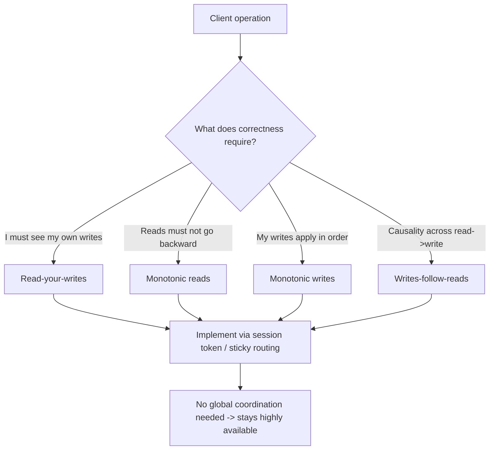
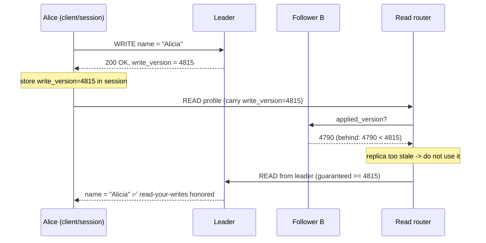
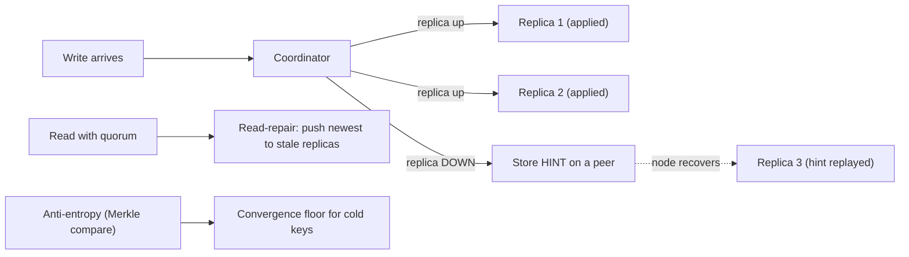

# Consistency vs Availability — Middle

<!-- level-focus -->
At middle level, focus on this question:

> Where does **Consistency vs Availability** belong in a maintainable component, and which trade-off selects the design?

Use the smallest realistic scenario that exposes the decision and its failure behavior.
The junior view of this trade-off is a dial labeled "C" on one end and "A" on the other. That picture is useful for intuition and useless for engineering. In production you do not pick a global setting; you pick *per-operation* guarantees, and you implement them with concrete mechanics: replication modes, routing rules, conflict resolution, and failover policy. This page is about those mechanics — the practitioner's toolkit for delivering "consistent enough" without sacrificing more availability than you must.

The central reframe for this level: **most user-facing systems do not need linearizability, they need session guarantees.** A user does not care whether *every* client in the world sees their profile update instantly. They care that *they* see their own update after they make it. That distinction — global consistency versus client-centric consistency — is where almost all practical wins live.

## 1. Client-centric (session) guarantees

Strong consistency (linearizability) is a property of the *whole system*: every observer agrees on a single, real-time order of operations. It is expensive because it forces coordination on every read and write. Session guarantees are weaker but vastly cheaper: they constrain only what a *single client session* observes, and they are the guarantees that map directly to user-perceived correctness.

There are four canonical session guarantees. Each one prevents a specific, nameable bug.

**Read-your-writes (read-your-own-writes).**
After a client writes a value, any subsequent read *by that same client* returns that write (or a newer one) — never an older value. Without it, a user updates their profile photo, the page reloads, the read lands on a lagging replica, and the old photo reappears. The user concludes "my save didn't work" and saves again, possibly creating duplicate side effects.

**Monotonic reads.**
If a client reads a value, later reads by that client never return an *older* value. Time only moves forward for that session. Without it, a user refreshes a comment thread, sees 12 comments, refreshes again and sees 9 — because the two reads hit replicas at different lag points. The data appears to travel backward in time.

**Monotonic writes.**
Writes from a single client are applied in the order the client issued them. Without it, a client sends "set status = away" then "set status = online"; if these land on a replica that applies them out of order, the final stored state is "away" — the opposite of what the user last asked for.

**Writes-follow-reads (read-your-writes' mirror, also called *causal* in this family).**
If a client reads value X and then performs a write W, then any client that sees W also sees X. This preserves causality across the boundary of a read-then-write. Without it, you reply to a comment you just read, and someone else sees your reply but not the comment it answers — an orphaned, nonsensical thread.

The key engineering insight: **all four are achievable without global coordination.** They are typically implemented at the routing/session layer (sticky routing, version tokens, per-session high-water marks), not by making the storage engine linearizable. That is what makes them cheap enough to use everywhere.



---

## 2. Session guarantees: the bug-prevention table

Each guarantee earns its place by killing a specific class of bug. Memorize the *bug*, not the definition — the bug is what tells you, in a design review, whether you need the guarantee.

| Guarantee | Formal promise | Concrete bug it prevents | Typical implementation |
|---|---|---|---|
| **Read-your-writes** | A read after your write returns that write or newer | "I saved my profile but it shows the old value" → duplicate re-saves | Route the session's reads to the leader for a TTL after a write; or attach a write-version token and require replicas ≥ that version |
| **Monotonic reads** | Successive reads never return older data | Comment count flickers 12 → 9 → 12 on refresh; "time travel" | Sticky session to one replica; or track a per-session high-water version and reject staler replicas |
| **Monotonic writes** | Your writes apply in issue order | "away" then "online" lands as final "away"; out-of-order updates | Per-session sequence numbers; serialize a session's writes through one replica/queue |
| **Writes-follow-reads** | A write depends on, and stays ordered after, the reads it followed | Reply visible without the comment it answers; orphaned causal chains | Causal tokens / dependency stamps propagated with the write |
| **(reference) Linearizability** | One global real-time order for all clients | Two clients disagree on which transfer won a balance race | Consensus on every op (Raft/Paxos), or single-leader strict serialization — high cost |

The table's last row is deliberate: it shows what you are *buying out of*. Linearizability solves the multi-client disagreement problem that session guarantees do **not** solve. If two different users race on the same bank balance, no session guarantee helps — you need real coordination. Knowing where session guarantees stop is as important as knowing what they do.

---

## 3. Worked example: read-your-writes routing

Let's trace the canonical failure and its fix end to end, because the mechanics are subtle.

**Topology.** One leader, two followers. Writes go to the leader and replicate asynchronously to followers (lag: typically 20–200 ms, occasionally seconds under load). Reads are load-balanced across followers to spread query load — the standard read-scaling pattern.

**The bug.**

1. `t=0ms` — User Alice updates her display name from "Alice" to "Alicia". The write hits the **leader**, commits, returns `200 OK`. Alice's browser navigates to her profile page.
2. `t=15ms` — The profile page issues a read. The load balancer routes it to **Follower B**, which has not yet received the replication stream for Alice's write (its applied position is behind the leader by ~80 ms right now).
3. `t=15ms` — Follower B returns "Alice". The page renders the *old* name.
4. Alice sees her change "didn't take." She edits again. Now you have a confused user and possibly a duplicate audit-log entry.

This is not a bug in any single component. The leader is correct, the followers are correct, the load balancer is correct. The *system* violates read-your-writes because the read path has no knowledge of the write path. The trade-off was made implicitly — async replication for availability and read-scaling — and it leaked into UX.

**Fix A — version-token routing (preferred).**
On every successful write, the leader returns the replication position it committed at — call it a `write_version` (in Postgres this is the LSN; in many systems a logical timestamp or commit index). The client stores this token in its session and sends it on the next read. The read router then picks a replica **whose applied position ≥ `write_version`**, or falls through to the leader if none qualify yet.



**Fix B — sticky-to-leader window (simpler).**
For a short TTL (e.g., 5 s) after any write in a session, route *all* that session's reads to the leader. Crude but effective; the cost is extra leader read load for that window. Good enough for low write-rate, read-heavy profiles.

**Fix C — sticky-to-replica (gives monotonic reads too).**
Pin a session to *one* replica. This alone gives monotonic reads (one replica's applied position only moves forward) and, combined with token-checking, read-your-writes. The risk: if that replica is the laggy one, the whole session is slow; and on replica failure you must re-pin and may briefly regress.

**Cost accounting.** Fix A is the most precise — it sends to the leader *only when necessary*. Under steady state, by the time Alice's read arrives, a nearby follower has often already caught up, so the read stays on a follower and leader load barely rises. This is the practitioner's sweet spot: you pay for consistency exactly where and when it is needed, not globally.

---

## 4. Eventual consistency mechanics

"Eventual consistency" sounds like a promise that data will *somehow* converge. In real systems, convergence is not magic — it is a set of background mechanisms that actively reconcile replicas. If you run an eventually-consistent store, you are operating these mechanisms whether you understand them or not.

**Replication lag.**
The fundamental quantity. It is the time (or version distance) between a write committing on the leader/coordinator and that write being visible on a given replica. Lag is not a fixed number — it spikes with write bursts, long-running queries on the replica, network hiccups, and replica restarts (which replay a backlog). Every consistency anomaly in an async system is ultimately *a read landing inside the lag window.* Monitoring lag (e.g., `pg_stat_replication` replay lag, Kafka consumer lag, DynamoDB/Cassandra hinted-handoff backlog) is the single most important consistency observability metric.

**Anti-entropy.**
A background process that periodically compares replicas and repairs divergence — the convergence "floor" that guarantees data eventually agrees even if no one reads it. Implementations compare **Merkle trees** of key ranges: each replica builds a hash tree over its data, replicas exchange tree hashes, and only the subtrees that differ are walked down and reconciled. This makes a full-dataset comparison cheap (you transfer hashes, not data, until you find a divergent leaf). Cassandra's `nodetool repair` is the textbook example.

**Read-repair.**
Consistency repair triggered *by a read*. When a coordinator reads from multiple replicas (because the read consistency level asks for more than one), it compares the returned versions. If they disagree, it returns the newest to the client **and** writes the newest value back to the stale replicas — repairing them as a side effect of being read. Hot keys thus self-heal quickly; cold keys rely on anti-entropy. This is why read-heavy eventually-consistent systems often feel "more consistent than they should be": frequent reads keep popular data converged.

**Gossip.**
A decentralized protocol by which nodes share cluster *metadata* — who is up, who is down, ring/token assignments, schema versions — by periodically exchanging state with a few random peers. State spreads epidemically: after O(log N) rounds, the whole cluster knows. Gossip is about *membership and health*, not data convergence, but it is the substrate that makes the data mechanisms possible (a node must know which peers own a key before it can repair it).

**Hinted handoff.**
A durability/availability trick for *writes during a node outage.* If a replica that should receive a write is temporarily down, the coordinator stores a **hint** (the write, plus "this belongs to node X") on another node. When node X recovers, the hint is replayed to it. This lets writes succeed at the chosen consistency level even when some target replicas are unavailable — trading a temporary, repairable inconsistency for write availability. The danger: if the hint-holder dies before replaying, or the down node stays down past the hint TTL, hints are dropped and you rely on anti-entropy to catch up.



These five mechanics are the engine room of eventual consistency. **The summary rule:** read-repair fixes hot data fast, anti-entropy guarantees cold data eventually, hinted handoff keeps writes available during transient failures, gossip keeps everyone's map current, and replication lag is the metric that tells you how far from converged you currently are.

---

## 5. Replication modes: sync, async, semi-sync

Replication mode is the lever that sets the consistency/latency/durability trade-off *at the storage layer*. The choice is not academic — it directly determines how much data a failover can lose and how slow your writes are.

**Asynchronous replication.**
The leader commits locally and acknowledges the client *immediately*, then ships the change to followers in the background. Writes are fast (one local commit) and stay available even if every follower is down — the leader doesn't wait for anyone. The cost: a committed-and-acknowledged write may not yet be on *any* follower. If the leader dies in that instant, the write is gone. This is the **data-loss window**, and its size equals the current replication lag.

**Synchronous replication.**
The leader does not acknowledge the client until at least one (or all, depending on config) follower has durably received the write. Now a committed write is guaranteed to exist on ≥2 nodes, so a leader crash loses nothing. The cost: every write pays the round-trip latency to a follower, and — critically — if the synchronous follower is down or slow, **writes block or fail.** Strict "wait for all followers" sync replication ties your write availability to your *least available* replica. That is why naive full-sync is rare in practice.

**Semi-synchronous replication.**
The pragmatic middle. The leader waits for **at least one** follower to acknowledge, then commits — but does not wait for all of them. You get "the write is on at least two nodes" durability without coupling availability to every replica. Most production setups use a variant: MySQL semi-sync, Postgres `synchronous_commit` with `synchronous_standby_names` set to "any 1 of N", or quorum writes in Dynamo-style systems (`W` replicas must ack). The subtle failure mode: some semi-sync implementations **time out and silently fall back to async** under pressure (e.g., MySQL's `rpl_semi_sync_master_timeout`). When that happens, your "durable" guarantee quietly degrades exactly when load is highest — precisely when a crash is most likely. Always alert on semi-sync fallback events.

**Quorum framing (Dynamo-style).**
Many distributed stores express this as `N`/`W`/`R`: `N` replicas, a write needs `W` acks, a read needs `R` responses. When `W + R > N`, the read and write sets overlap, so a read is guaranteed to see at least one replica with the latest write — *strong-ish* consistency without a single leader. `W=N` is full sync (durable, fragile); `W=1` is essentially async (fast, lossy). Semi-sync corresponds to a middle `W` like `quorum`. This is the same trade-off, expressed as a tunable rather than a mode.

---

## 6. Sync vs async replication comparison

| Dimension | Asynchronous | Synchronous (full) | Semi-synchronous / quorum |
|---|---|---|---|
| **Write latency** | Lowest — one local commit, no waiting | Highest — local commit + slowest follower RTT | Moderate — local + fastest of the required acks |
| **Data-loss window on leader crash** | Up to current replication lag (can be seconds) | Zero — write is on ≥2 nodes before ack | Zero for the acked replicas; remainder catches up async |
| **Write availability if a follower is down** | Unaffected — leader never waits | Writes block/fail — coupled to weakest replica | Survives as long as *enough* replicas (W of N) are up |
| **Read scaling** | Excellent — many followers, but reads may be stale | Followers in sync; reads fresher but fewer typically | Tunable via R; `W+R>N` gives overlap |
| **Failover safety** | Risky — promote may lose un-replicated tail | Safe — promoted node has all acked writes | Safe if you promote an in-sync replica |
| **Typical use** | Read replicas, cross-region replicas, analytics | Financial ledgers, single-region critical writes | Most production OLTP (MySQL semi-sync, PG quorum commit) |
| **Sneaky failure mode** | Silent data loss on crash; nobody notices until audit | Cluster-wide write stall when one replica is sick | Silent degrade to async on timeout — durability illusion |

The decision rule that falls out of this table: **use async for replicas whose staleness you can tolerate (read scaling, geo, analytics), use semi-sync/quorum for your primary write path so failover is safe without coupling to every node, and reserve full-sync for the small set of writes where any loss is unacceptable.** Mixing modes per-table or per-keyspace is normal and correct.

---

## 7. Failover and its consistency cost

Failover is where the replication trade-off stops being abstract and becomes "did we just lose customer data." When a leader fails, you must promote a follower to become the new leader. The consistency cost of that promotion depends entirely on what mode you replicated in and which follower you choose.

**The async failover data-loss window.**
With async replication, followers lag the leader. When the leader dies, the most-up-to-date follower is still *missing the tail of writes* that committed on the leader but hadn't shipped yet. Promote it and those writes are **permanently lost** — they were acknowledged to clients (clients believe they succeeded) but exist nowhere now. The size of this window is the replication lag at the instant of failure. Under steady load that might be 50 ms of writes; under the overload that *caused* the failure, it could be seconds — and overload-induced failures are common, so the worst data loss tends to coincide with the worst lag.

**The split-brain hazard.**
If the old leader didn't truly die — it was just unreachable (network partition) — and you promote a new one, you now have **two leaders accepting writes.** Both sets of writes are "committed." When the partition heals, you have divergent histories that must be reconciled (and some writes may be discarded). This is the availability-vs-consistency trade-off at its sharpest: promoting fast maximizes availability but risks split-brain; refusing to promote until you're *sure* the old leader is dead maximizes consistency but extends the outage. Fencing (STONITH, leases, epoch/term numbers that invalidate the old leader's writes) is how you make promotion safe.

**Failover safety by mode.**

- *Async failover:* fast, always available, but loses the un-replicated tail. Acceptable only where that loss is tolerable (cache-like data, re-creatable state) — never for money or orders without compensating logic.
- *Semi-sync failover:* if you **always promote an in-sync replica** (one that was in the synchronous ack set), you lose nothing, because every acked write was on that replica before the client was told "success." This is the standard safe configuration.
- *Sync failover:* zero loss, but you may be unable to promote at all if the only in-sync replica is also unreachable — availability suffers.

**Operational checklist for safe failover.**
1. Fence the old leader (revoke its lease / bump the term) *before* accepting writes on the new one — prevents split-brain.
2. Promote the **most-advanced in-sync** replica, not just "a" replica.
3. Quantify and alert on the expected loss window = replication lag at failure time.
4. After healing, run anti-entropy/reconciliation; don't assume the old leader's tail can be silently re-applied (it may conflict).

---

## 8. Staged diagram: replication lag and failover

The single most instructive way to internalize this trade-off is to watch a write's fate across normal operation, a stale read, and a failover — staged so each phase is distinct.

```mermaid
sequenceDiagram
    autonumber
    participant C as Client
    participant L as Leader
    participant F1 as Follower 1 (in-sync)
    participant F2 as Follower 2 (lagging)

    Note over C,F2: STAGE 1 — Normal async write (fast, but a lag window opens)
    C->>L: WRITE x = 42
    L-->>C: 200 OK (committed locally)
    L--)F1: replicate x=42 (async)
    L--)F2: replicate x=42 (async, queued behind backlog)
    Note over F2: F2 still has x = (old). Lag window is OPEN.

    Note over C,F2: STAGE 2 — Stale read lands inside the lag window
    C->>F2: READ x
    F2-->>C: x = (old)  ❌ violates read-your-writes
    Note over C: this is the bug fixed by version-token routing (Section 3)

    Note over C,F2: STAGE 3 — Leader crashes BEFORE F2 caught up
    L-xL: 💥 crash (F2 never received x=42)

    Note over C,F2: STAGE 4 — Failover: choose whom to promote
    Note over F1: F1 has x=42 (in-sync) -> promote F1 = ZERO loss ✅
    Note over F2: F2 missing x=42 -> promoting F2 = DATA LOSS ❌
    F1->>F1: fence old leader (bump term), then promote
    F1-->>C: now leader; x=42 preserved
```

Read this diagram as the whole page compressed into four beats: async replication opens a lag window (Stage 1), reads inside that window are stale (Stage 2), a crash inside that window threatens the un-replicated tail (Stage 3), and your *choice of which replica to promote* decides whether that threat becomes real data loss (Stage 4). Every mitigation in this document — version-token routing, semi-sync, promoting the in-sync replica, fencing — is an intervention on one of these four beats.

---

## 9. Conflict resolution basics

Once you allow writes to more than one place — multi-leader, active-active, or even async failover that re-accepts the old leader's diverged tail — you can get **concurrent conflicting writes** to the same key. Now you need a rule for what the converged value is. There are three families, in increasing order of correctness and cost.

**Last-write-wins (LWW).**
Attach a timestamp to each write; on conflict, the one with the larger timestamp wins. Dead simple and used widely (Cassandra's default). Its fatal flaw is **clock skew**: timestamps come from different machines' wall clocks, which drift. If node B's clock is 200 ms ahead of node A's, a *logically later* write on A can be silently discarded because A's timestamp is "smaller." Worse, LWW *throws away* the losing write entirely — there is no record it ever happened. So LWW means "we will silently lose some writes whenever clocks disagree and two writes race." Use it only when losing one of two concurrent writes is acceptable (e.g., overwriting a presence/last-seen field) and pair it with tight NTP and ideally a hybrid logical clock to bound the skew damage.

**Version vectors / vector clocks (intro).**
Instead of trusting wall clocks, track *causality* directly. Each replica maintains a counter; a version vector is the map `{replica → counter}` describing what a value has "seen." When two versions are compared:
- If vector A dominates B (every component ≥, at least one greater), A is causally *newer* — keep A, no conflict.
- If neither dominates the other, the writes are **concurrent** — a genuine conflict the system cannot order, and it must either keep both (siblings) or hand them to the application to merge.

The win: version vectors *detect* conflicts correctly regardless of clock skew, and never silently drop a write — they surface the conflict instead. The cost: they're bigger (one entry per writer), need pruning, and they only *detect* the conflict; they don't tell you the right merged answer. (Vector clocks are the per-event variant; version vectors are the per-replica variant used by Dynamo-style stores. Treat the distinction as a senior-level detail.)

**Application-level merge.**
For concurrent (truly conflicting) writes, the *application* knows the semantics, so it resolves. The classic example is Amazon's shopping cart: two concurrent versions of a cart are merged by **union of items** (so an "add to cart" is never lost — at worst a removed item reappears, which is a far better failure than a lost sale). More generally, CRDTs (conflict-free replicated data types) are data structures whose merge function is mathematically guaranteed to converge regardless of order — a structured form of application-level merge that needs no manual reconciliation. This is the highest-correctness option and the right answer when *no write may be silently lost*.

| Strategy | Correctness | Cost / complexity | When to use |
|---|---|---|---|
| **Last-write-wins** | Lowest — silently drops a write; clock-skew dependent | Trivial (one timestamp) | Overwrite-style fields where one of two concurrent writes is disposable |
| **Version vectors** | Detects conflicts correctly; never loses writes silently | Moderate — vector size, pruning, must handle siblings | When you must *know* a conflict happened and decide deliberately |
| **App-level merge / CRDT** | Highest — converges with no lost intent | Highest — must define a sound merge per data type | Carts, counters, collaborative state — anywhere lost writes are unacceptable |

The practitioner's rule: **default to detecting conflicts (version vectors) rather than silently resolving them (LWW), and reserve LWW for fields where you have explicitly decided a lost write is harmless.** "We used LWW and didn't think about clock skew" is one of the most common root causes in distributed-data postmortems.

---

## 10. Choosing per-operation: a decision checklist

The whole point of this level is that the C-vs-A choice is *per operation*, not per system. Use this checklist in design reviews.

1. **What's the worst outcome of a stale read here?** A flickering counter (tolerable → async + monotonic reads) versus a double-charge (intolerable → strong read). Name the concrete bug.
2. **Does correctness span multiple clients, or just one session?** Single-session → a session guarantee suffices and stays available. Cross-client (shared balance, inventory count, uniqueness) → you need real coordination/linearizability for *that* operation only.
3. **What's the acceptable data-loss window on failover?** Zero → semi-sync/quorum on this write path, promote in-sync replicas. Non-zero / re-creatable → async is fine and cheaper.
4. **Can two writers concurrently touch this key?** No (single-leader per key) → no conflict resolution needed. Yes → choose LWW only if a lost write is harmless here; otherwise version vectors or app-merge.
5. **Is the read path aware of the write path?** If reads can land on lagging replicas after a write, add version-token routing for the operations where read-your-writes matters; leave the rest on cheap follower reads.
6. **Are you monitoring replication lag and semi-sync fallback?** If not, your durability and consistency guarantees are unverified assumptions, not facts.

Run those six questions per critical operation and you will end up with a *mixed* system — strong where it must be, eventually-consistent-with-session-guarantees almost everywhere else — which is exactly what well-engineered systems look like.

---

## 11. Takeaways

- **Session guarantees, not linearizability, are the everyday tool.** Read-your-writes, monotonic reads, monotonic writes, and writes-follow-reads each kill a specific user-visible bug, and each is implementable at the routing/session layer without global coordination — so they stay cheap and available.
- **Eventual consistency is run, not hoped for.** Read-repair fixes hot keys, anti-entropy (Merkle compare) guarantees cold keys converge, hinted handoff keeps writes available during outages, gossip keeps membership current, and replication lag is the metric that measures how far from converged you are right now.
- **Replication mode sets the data-loss window.** Async = fast but loses the un-replicated tail on crash; full-sync = zero loss but couples write availability to your weakest replica; semi-sync/quorum is the production default — durable enough, available enough, *if* you promote in-sync replicas on failover.
- **Failover is where the trade-off bites.** Async failover can silently lose acknowledged writes; split-brain can duplicate leadership. Fence the old leader, promote the most-advanced in-sync replica, and quantify the loss window.
- **Default to detecting conflicts, not silently resolving them.** LWW silently drops writes and is hostage to clock skew; version vectors detect conflicts correctly; application-level merge / CRDTs preserve intent. Reserve LWW for fields where a lost write is genuinely harmless.
- **The decision is per-operation.** Mixed systems — strong where multi-client correctness demands it, session-guaranteed-and-eventual everywhere else — are the mark of mature engineering, not a compromise.

*Next step:* [Senior level](senior.md)

---

## Apply it

1. Find a real component where **Consistency vs Availability** affects an interface or dependency.
2. Write two plausible choices and the constraint that favors each one.
3. Make the smallest reversible change at that boundary.
4. Exercise the component alone, then exercise the integrated flow.
5. Keep the decision note with the evidence that selected the option.

## Verify your work

- A focused check proves the local behavior.
- An integrated check proves callers and dependencies still agree.
- Logs, traces, compiler output, or benchmarks expose the boundary.
- Reverting the change restores the previous behavior without unrelated edits.

## Review questions

- Which boundary is most affected by Consistency vs Availability?
- What constraint would make you choose the alternative design?
- How would you isolate a local defect from an integration defect?
- What evidence shows that the change remains maintainable?
