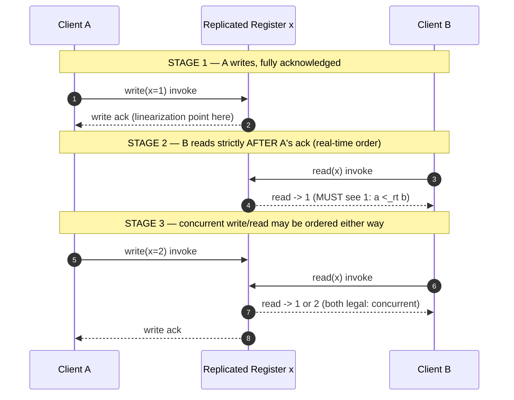
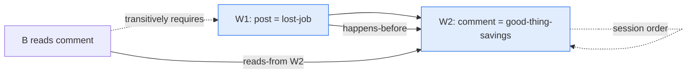
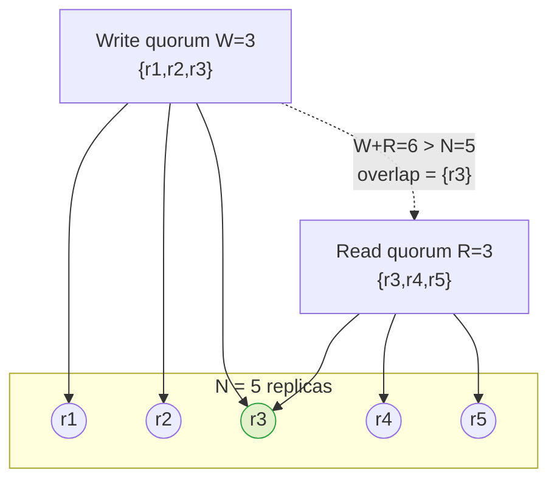
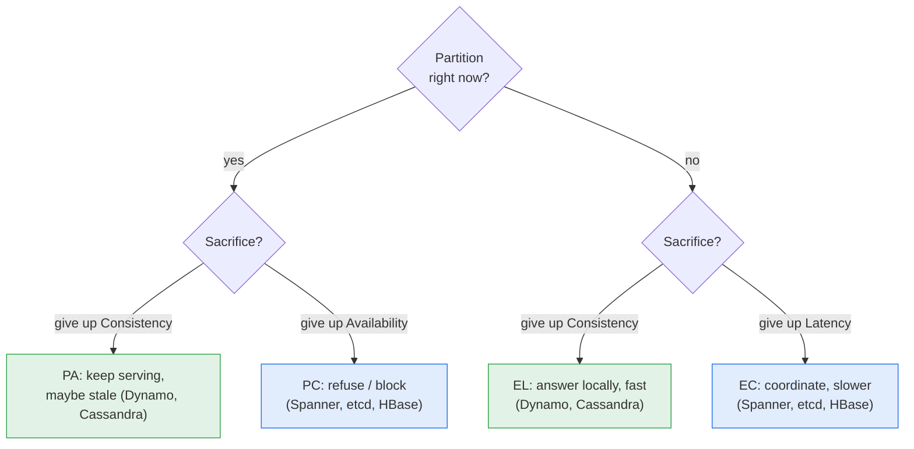

# Consistency vs Availability — Theory and Formal Foundations

<!-- level-focus -->
At professional level, focus on this question:

> How should teams adopt and operate **Consistency vs Availability — Theory and Formal Foundations** with measurable outcomes and limited coordination?

Use the smallest realistic scenario that exposes the decision and its failure behavior.
A system that replicates state must answer one question on every read: *which of the many possible histories of writes am I allowed to observe?* The answer is a **consistency model** — a contract between the data store and its clients that constrains the set of legal outcomes. Stronger models forbid more anomalies but demand more coordination; coordination, in turn, costs latency in the common case and availability under partition. This document gives a rigorous, principal-level treatment of the consistency hierarchy, session guarantees, conflict-free replicated data types, the replication protocols that realize each model, and the precise sense in which CAP and PACELC are theorems rather than slogans.

## 1. The Object Model and Why Models Exist

Fix a set of **objects** (registers, counters, sets) shared by concurrent **processes**. Each process issues **operations** against an object. An operation has an *invocation* event and a *response* event separated in wall-clock time; between them the operation is *pending*. A **history** is the sequence of invocation and response events produced by an execution. A consistency model is a predicate over histories: it declares which histories are *legal*.

Two operations are **concurrent** if neither's response precedes the other's invocation in real time. Concurrency is exactly where ambiguity lives — a model must say what a reader may see when writes overlap. Three orders matter throughout:

- **Real-time / wall-clock order** (`<_rt`): `a <_rt b` iff `a`'s response happens before `b`'s invocation.
- **Program order / session order** (`<_so`): the order in which a single process issued its operations.
- **Causal order** (`<_hb`, "happens-before"): the transitive closure of session order and the reads-from relation (a read that observes a write is ordered after it).

A **sequential specification** says what a single, non-concurrent execution of an object must return (a read returns the value of the most recent write). Every model below asks for *some* total or partial order over operations that (a) is consistent with the sequential specification, and (b) respects whichever of the three orders the model chooses to honor. The models differ precisely in **which order they preserve**.

> Mental model: stronger consistency = "the order I observe agrees with more of reality." Linearizability agrees with real time; sequential agrees with program order only; causal agrees with cause-and-effect only; eventual agrees with nothing until quiescence.

---

## 2. Linearizability: Real-Time Order Plus Single-Copy Semantics

**Linearizability** (Herlihy & Wing, 1990) is the strongest single-object model. A history is linearizable if there exists a total order `<_lin` over its operations such that:

1. `<_lin` is consistent with the object's sequential specification (it looks like a valid single-threaded execution), and
2. `<_lin` respects real-time order: if `a <_rt b` then `a <_lin b`.

Equivalently: every operation appears to **take effect atomically at a single instant** — its **linearization point** — somewhere between its invocation and its response. Concurrent operations may be ordered either way; non-overlapping operations may not.

Two properties make linearizability the model designers reach for:

- **Single-copy illusion.** The replicated object behaves as if there is exactly one copy. A value, once written and acknowledged, is visible to *every* subsequent read by *any* client. This is what we colloquially call "strong consistency."
- **Locality (composability).** A history over multiple objects is linearizable **iff** each per-object sub-history is linearizable. Linearizability composes for free; sequential consistency does not. This is why linearizable objects are excellent building blocks.



In Stage 2 the read is *not* concurrent with the write — it begins after the write's response — so linearizability *forces* it to observe `1`. In Stage 3 the operations overlap, so either return value is admissible. The model's entire content is captured by which pairs are forced and which are free.

The cost is structural: to guarantee that an acknowledged write is visible everywhere, a linearizable system must either funnel reads/writes through a single agreed order (consensus) or block until enough replicas confirm. Under a network partition this is exactly the operation that cannot complete — see §11.

---

## 3. Sequential Consistency

**Sequential consistency** (Lamport, 1979) relaxes the real-time clause. A history is sequentially consistent if there exists a total order `<_seq` over operations such that:

1. `<_seq` is consistent with each object's sequential specification, and
2. `<_seq` respects **program order** for each process: if `a <_so b` then `a <_seq b`.

Crucially, `<_seq` need **not** respect real-time order across processes. Operations from different clients may be reordered freely as long as each client's own operations keep their issue order. A consequence: a write acknowledged to client A at time `t` may legally remain invisible to client B reading at `t + 10s`, provided some single global interleaving exists that explains every client's observations.

The intuition is "the result is *as if* all operations executed on a single thread in *some* order that each process would accept as its own program order." Multiprocessor memory under SC behaves like a fair interleaving of per-thread instruction streams.

Sequential consistency is strictly weaker than linearizability (every linearizable history is sequentially consistent; not conversely). It also **loses locality**: two SC objects can each be sequentially consistent while their combination is not. Because of this, and because it offers no real-time guarantee yet still demands a single global order (nearly as expensive to enforce as linearizability), SC is more common as a *memory model* than as a distributed-database contract.

---

## 4. Causal Consistency and Causal+

**Causal consistency** preserves only the **happens-before** partial order. Define `a -> b` ("a causally precedes b") as the transitive closure of:

- **session order**: `a` and `b` are by the same process and `a` was issued first;
- **reads-from**: `b` is a read that returns the value written by `a`;
- **transitivity**: if `a -> c` and `c -> b` then `a -> b`.

A store is causally consistent if every process observes operations in an order consistent with `->`. Operations that are **concurrent** under `->` (neither causally precedes the other) may be observed in **different orders by different replicas**. This is the key relaxation: no global agreement is required, only agreement on cause and effect.

Causal consistency is profound because it is the **strongest model achievable while remaining available under partition** (Mahajan et al.; the *Highly Available Transactions* line of work). It forbids the anomalies that violate intuition — you can never see an effect before its cause — yet it never needs to block waiting for a remote replica.

The classic example: A posts "I lost my job," then comments "good thing I have savings." B sees the comment. Causal consistency guarantees B also sees the original post (the comment causally depends on it via A's session order). It does **not** guarantee that two independent posts appear in the same order to all readers.

**Causal+ consistency** (Lloyd et al., COPS, 2011) adds **convergent conflict handling**: concurrent writes to the same key are resolved by a deterministic, replica-agnostic function (e.g., last-writer-wins by timestamp, or a CRDT merge) so that replicas not only respect causality but also **converge** to identical state. Plain causal consistency permits permanent divergence on concurrent writes; causal+ rules it out.



If a replica delivers `W2` to B, causal delivery **requires** `W1` to have been delivered first. The dependency is carried explicitly (version vectors or dependency lists) so the receiving replica can hold `W2` in a pending buffer until `W1`'s dependencies are satisfied — see the staged diagram in §6.

---

## 5. PRAM and the Weak End of the Hierarchy

**Pipelined RAM (PRAM)**, also called **FIFO consistency** (Lipton & Sandberg, 1988), keeps only the *session-order* fragment of causality. Each process's writes are observed by every other process **in the order that process issued them**, but writes from *different* processes may be observed in *any* relative order, and the reads-from edges are not respected globally.

Formally: all processes see the writes of a *single* process in that process's program order; there is no constraint relating writes across processes. PRAM is strictly weaker than causal consistency precisely because it drops the transitive reads-from edge. Under PRAM the job-loss example can break: B's comment may arrive at C before A's post, because the cross-process causal edge created when B *read* A's post is not propagated.

PRAM matters as a theoretical floor: it is the weakest model that still preserves any per-writer ordering, and it is the residue you get from causal consistency once you remove the reads-from relation. **Causal = PRAM + the reads-from order.** This decomposition is the cleanest way to remember the hierarchy's middle.

---

## 6. Eventual Consistency and Strong Eventual Consistency

**Eventual consistency** is a *liveness* property with almost no *safety* content: *if writes stop, then after some unspecified delay all replicas converge to the same value.* It says nothing about what intermediate reads return, nothing about ordering, nothing about how conflicts resolve. A read may return any previously written value, a stale value, or — absent convergent conflict handling — different replicas may pick different winners and stay divergent forever in the presence of concurrent writes. Eventual consistency is the cheapest model: every operation is local, nothing blocks, partitions never reduce availability.

**Strong Eventual Consistency (SEC)** (Shapiro et al., 2011) strengthens it with a safety guarantee that requires no coordination:

> **SEC:** any two replicas that have received and applied the *same set* of updates (in any order) are in the *same state*.

SEC = eventual delivery (liveness) + **state convergence given equal update sets** (safety). The order of delivery is irrelevant — which is exactly what makes SEC reachable without consensus. CRDTs (§9) are the canonical mechanism that achieves SEC.

The staged diagram below shows causal-but-eventual delivery: a concurrent pair converges, and a causally dependent update is buffered until its dependency arrives.

```mermaid
sequenceDiagram
    autonumber
    participant Ra as Replica A
    participant Rb as Replica B
    participant Rc as Replica C
    Note over Ra,Rc: STAGE 1 — concurrent independent writes (no causal edge)
    Ra->>Ra: apply Wa(x=1)
    Rb->>Rb: apply Wb(y=2)
    Ra-->>Rc: gossip Wa
    Rb-->>Rc: gossip Wb
    Note over Rc: STAGE 2 — C applies Wa, Wb in EITHER order; converges (SEC)
    Note over Ra,Rc: STAGE 3 — causal dependency: Wd depends on Wa
    Ra->>Ra: apply Wd(x=1 -> x=3), dep={Wa}
    Ra-->>Rc: gossip Wd (carries dep Wa)
    Note over Rc: dep Wa already delivered -> deliver Wd immediately
    Ra-->>Rb: gossip Wd (carries dep Wa)
    Note over Rb: Wa NOT yet delivered -> BUFFER Wd until Wa arrives
    Ra-->>Rb: gossip Wa
    Note over Rb: dep satisfied -> deliver Wa then Wd (causal order preserved)
```

Stage 2 is where SEC earns its keep: order-independence means C never needs to wait for an agreement on whether `Wa` or `Wb` "wins" — both are merged. Stage 3 shows that *causal+* delivery layered on top of an eventually-consistent transport is implemented by **buffering** out-of-order messages, never by blocking writers.

---

## 7. The Consistency Lattice

The models form a partial order under "is strictly stronger than" (forbids a superset of anomalies). The chain that concerns most distributed stores is:

**linearizable ⊐ sequential ⊐ causal+ ⊐ causal ⊐ PRAM ⊐ eventual**

(`⊐` = "strictly stronger / forbids more"). Real-time order is the top edge; remove it to get sequential. Remove the global total order to get causal+. Remove convergence to get causal. Remove the reads-from edge to get PRAM. Remove per-writer FIFO to get eventual.

| Model | Order preserved | Forbids | Available under partition? | Coordination cost | Typical store |
|---|---|---|---|---|---|
| **Linearizable** | real-time + single total order | stale reads, lost real-time order, all object-level anomalies | **No** | Consensus or quorum read+write per op (1–2 RTT) | etcd, ZooKeeper, Spanner (TrueTime), single-leader DB |
| **Sequential** | program order, single total order | per-process reorderings; not stale cross-client reads | No (still needs a global order) | Global agreement, but no clock sync | Multiprocessor memory (SC), some RSM configs |
| **Causal+** | happens-before + convergent merge | causality violations, permanent divergence | **Yes** | Track dependencies (version vectors); no blocking | COPS, Eiger, MongoDB causal sessions |
| **Causal** | happens-before | seeing effect before cause | **Yes** | Dependency metadata; concurrent writes may diverge | Bayou (per-session), academic causal stores |
| **PRAM/FIFO** | per-writer program order | reordering a single writer's stream | **Yes** | FIFO channels per writer | Some pub/sub log replicas |
| **Eventual** | none (until quiescence) | nothing about intermediate reads | **Yes** | None (fully local) | Dynamo, Cassandra (default), Riak, DNS |
| **Strong Eventual (SEC)** | none on delivery; convergence on equal update sets | permanent divergence | **Yes** | None (CRDT merge is associative/commutative/idempotent) | Riak DT, Redis CRDT, Automerge, Yjs |

Two subtleties principals must keep straight:

1. **Sequential is not "between" causal+ and linearizable on the availability axis.** SC requires a single global order, so like linearizability it is *not* highly available; causal+ sits below SC on strength yet *above* it on availability. The lattice on strength and the lattice on availability are different orders — and the boundary between "available" and "unavailable" under partition runs between SC and causal+, not where strength would suggest.
2. **SEC and causal are incomparable in the strict ordering sense** — SEC says nothing about ordering of *causally related* operations unless you add causal delivery, while causal says nothing about *convergence*. Causal+ is exactly their join.

---

## 8. Session Guarantees and How They Compose

Global models are often more than a single client needs. **Session guarantees** (Terry et al., Bayou, 1994) are *per-client* properties that can be provided cheaply on top of an eventually-consistent store, by routing a session's metadata (the set of writes it has read/written) along with it. The four:

- **Read Your Writes (RYW):** if a session writes `x` then later reads `x`, the read reflects that write (or a newer one). Forbids a user not seeing their own just-submitted comment.
- **Monotonic Reads (MR):** successive reads in a session never go backward in time — once a session sees version `v`, it never sees a version older than `v`. Forbids "the count went from 5 to 3."
- **Monotonic Writes (MW):** writes by a session are applied at all replicas in session order. Forbids replica A applying `W2` before `W1` when both come from the same session.
- **Writes Follow Reads (WFR):** if a session reads `v` and then writes `w`, then `w` is ordered after `v` at every replica (the write's causal dependency on the read is honored). This is the session-level seed of causality.

Their composition is the headline result: **RYW + MR + MW + WFR, provided to every session, is equivalent to causal consistency.** Causality is, operationally, the *union* of the four session guarantees applied universally. This is why a store like MongoDB can advertise "causal consistency" by implementing session guarantees with `afterClusterTime` tokens, and why you can *buy back* exactly the consistency a feature needs without paying for a global order.

| Guarantee | Prevents anomaly | Metadata needed | Implementation sketch |
|---|---|---|---|
| Read Your Writes | not seeing own write | set of versions written by session | route reads to a replica ≥ session's write-set, or carry write timestamps |
| Monotonic Reads | reads moving backward | high-water version seen | reject/redirect reads from replicas behind the session's max-seen version |
| Monotonic Writes | own writes reordered | session write order | apply writes in session order; FIFO per session |
| Writes Follow Reads | effect ordered before cause | versions read before this write | attach read-set as the write's dependency |

Composition rules of thumb: the guarantees are **independent** (any subset can be provided), they are **additive** (providing more never invalidates fewer), and they are **sticky-session-friendly** — pinning a client to one replica trivially provides all four, which is why session affinity is the cheapest path to per-client causality. Lose the sticky session (failover, load shed) and you must carry the metadata explicitly.

---

## 9. CRDTs: Coordination-Free Convergence

A **Conflict-free Replicated Data Type** is a data type whose replicas converge to the same state under SEC **without any coordination**, because concurrent updates are designed to *commute* or because states form a *join-semilattice*. Two equivalent formulations:

### 9.1 State-based (CvRDT — convergent)

A replica's state is an element of a **join-semilattice** `(S, ⊔)`: a partial order with a least-upper-bound (`⊔`, "merge") that is **commutative, associative, and idempotent**. Updates move state *upward* in the lattice (monotonically). Replicas periodically exchange full states and merge with `⊔`. Convergence follows from lattice algebra alone: merge of any set of states is the same regardless of order, grouping, or repetition — exactly the algebraic shape SEC needs.

**G-Counter (grow-only counter).** State is a vector `P[1..n]`, one entry per replica; replica `i` increments only `P[i]`. The value is `Σ P[k]`. Merge is element-wise `max`. `max` is commutative/associative/idempotent, so the vector is a semilattice; two replicas that have seen the same increments produce the same vector → same sum. To support decrement, run two G-Counters (`P` for increments, `N` for decrements) and report `ΣP − ΣN` — a **PN-Counter**.

### 9.2 Operation-based (CmRDT — commutative)

Replicas broadcast *operations* (not states) over a reliable, **causal** delivery channel. The design requirement: concurrent operations **commute** (applying them in either order yields the same state). Given causal delivery + commutativity, all replicas that received the same operation set reach the same state.

**OR-Set (Observed-Remove Set) sketch.** The naive set has an add/remove race: which wins when `add(x)` and `remove(x)` are concurrent? OR-Set resolves it by tagging each add with a unique token: `add(x)` creates `(x, tag_k)`; `remove(x)` removes **only the (x, tag) pairs the remover has observed**. An add concurrent with a remove carries a *fresh* tag the remover never saw, so it survives. Element `x` is "in the set" iff it has at least one add-tag not cancelled by an observed remove. This makes "add wins over concurrent remove," is deterministic, commutes, and converges — a clean SEC realization of a mutable set.

### 9.3 Why this is the deep result

CRDTs prove that **a non-trivial, available, partition-tolerant, strongly-eventually-consistent replicated data type exists** — they are the constructive witness that the causal+/SEC corner of the design space is inhabited, not merely a theoretical possibility. The price is paid in the *type system*: you may only use operations that fit a semilattice or commute, and you pay metadata overhead (tombstones, version vectors, tags) that can grow without garbage collection. CRDTs do not abolish conflict; they push conflict resolution into a deterministic, coordination-free **merge function** chosen at design time.

---

## 10. Replication Protocols

Consistency models are contracts; replication protocols are the machinery that honors them. The four canonical families, ordered by the strength they naturally provide:

### 10.1 Primary-Backup (single-leader)

One replica is the **primary**; all writes go to it, it orders them, then propagates to backups. With **synchronous** propagation (primary waits for backup acks before acknowledging the client) and reads served by the primary, the system is **linearizable** — there is a single point that totally orders operations. The cost: write latency includes the slowest acknowledging backup, and a primary partition halts writes (unavailability) until a new primary is elected. **Asynchronous** propagation trades linearizability for latency: an acknowledged write can be lost on primary failure, and backup reads are stale (at best causal/RYW with session routing).

### 10.2 Chain Replication

Replicas form a linear **chain**: writes enter at the **head**, flow node-by-node to the **tail**; the **tail** acknowledges writes and serves **all** reads. Because every read hits the tail and a write is acknowledged only after reaching the tail, chain replication is **linearizable** with an elegant division of labor: writes are pipelined for high throughput, reads are offloaded to a single node, and strong consistency falls out of the topology. Failure handling is simpler than primary-backup (head/middle/tail failures have distinct, local repair rules). The cost is write latency proportional to chain length and reduced read scalability (one tail). **CRAQ** (Chain Replication with Apportioned Queries) relaxes this to let *any* node serve reads while preserving linearizability via version dirtiness checks.

### 10.3 Quorum / Dynamo-style

Each object is replicated to `N` nodes. A write must be acknowledged by `W` of them; a read must collect responses from `R` of them. The **quorum overlap condition** `W + R > N` guarantees any read quorum intersects any write quorum, so a read sees at least one replica holding the latest acknowledged write — yielding strong (linearizable-ish) reads *if* combined with read-repair and a real-time-respecting write coordination. Dynamo deliberately uses **sloppy quorums** and permits `W + R ≤ N` for higher availability, accepting eventual consistency and resolving concurrent writes with version vectors + application merge. The dial: large `W`/`R` → strong + slower + less available under partition; small `W`/`R` → fast + available + eventually consistent.



The intersection node `r3` is the guarantee made physical: it holds the latest write and is in the read quorum, so the read cannot miss it.

### 10.4 State-Machine Replication via Consensus

Model the service as a deterministic **state machine**; replicate it by having all replicas agree on the **same totally-ordered log of commands** (the *replicated log*) using a consensus protocol — **Paxos**, **Raft**, **Viewstamped Replication**, or for Byzantine faults **PBFT**. Each replica applies the log in order, so all replicas traverse identical states. SMR over a consensus log is the gold standard for **linearizable**, fault-tolerant services: it tolerates up to `f` crash failures with `2f+1` replicas (or `3f+1` for Byzantine), and it is what backs etcd, Consul, ZooKeeper (Zab), and Spanner's per-shard Paxos groups. The cost is one consensus round (≥1 RTT to a majority) per write, and **unavailability whenever a majority cannot be assembled** — the structural penalty CAP makes unavoidable.

| Protocol | Natural model | Reads | Write latency | Failure behavior |
|---|---|---|---|---|
| Primary-backup (sync) | linearizable | from primary | slowest backup ack | halt on primary loss, re-elect |
| Chain replication | linearizable | from tail | chain length | local repair per position |
| Quorum `W+R>N` | strong reads | `R` replicas | `W` acks | available while quorum reachable |
| Quorum `W+R≤N` (Dynamo) | eventual | `R` replicas | `W` acks (small) | always available, merge later |
| SMR / consensus | linearizable | leader or quorum | 1 majority RTT | available iff majority alive |

---

## 11. CAP, PACELC, and the Cost of Linearizability

**CAP** (Brewer 2000; Gilbert & Lynch 2002 made it a theorem) states that an asynchronous network system cannot simultaneously guarantee all three of: **C**onsistency (here meaning *linearizability*), **A**vailability (every request to a non-failed node returns a non-error response), and **P**artition tolerance (the system keeps operating despite arbitrary message loss between nodes). Since partitions are a fact of real networks (you cannot opt out of P), the live choice during a partition is **C or A**.

The proof is a two-line adversary argument. Partition the nodes into `{G1}` and `{G2}`. A client writes `x=1` to `G1`; another reads `x` from `G2`. If the system is **available**, `G2` must respond without hearing from `G1` (messages are lost) — it returns the stale `x=0`, violating linearizability. If the system is **consistent**, `G2` must wait for `G1`'s value — but the partition means it waits forever, violating availability. **Linearizability is exactly the consistency level that this argument kills**: the write was acknowledged in real time before the read began, so linearizability *requires* the read to reflect it, and only cross-partition communication could deliver it. Weaker models survive because they never made that promise — causal/eventual reads are entitled to return stale-but-causally-valid values, so `G2` answers locally and stays available.

This is why the §7 availability boundary sits between sequential consistency and causal+: any model demanding a *single global order that respects real time* (linearizable) or even *a single global order* (sequential) can be forced to block by a partition, whereas causal+ and below resolve every read from local state plus merge.

**PACELC** (Abadi, 2012) completes the picture by naming the cost CAP omits — the *latency* you pay even when the network is healthy:

> **if P**artition: choose **A**vailability or **C**onsistency; **E**lse (normal operation): choose **L**atency or **C**onsistency.



PACELC classification is the most useful one-line summary of a store's philosophy: **PA/EL** systems (Dynamo, Cassandra, Riak) are available and fast and pay in consistency; **PC/EC** systems (Spanner, etcd, HBase, single-leader SQL) are linearizable and pay in availability under partition and latency always. The `else` branch is the part teams forget: even with a perfect network, linearizability costs a coordination round-trip on the critical path — there is no free strong consistency, only strong consistency you pay for on every write.

---

## 12. Consistency vs Isolation: Objects vs Transactions

A frequent and consequential confusion: **consistency models and isolation levels are different axes.**

- **Consistency models** (linearizability, causal, eventual) govern **single-object** operations: given concurrent reads and writes to *one* register, what may a read return? The reference property is *real-time recency of a single object*.
- **Isolation levels** (serializable, snapshot, read-committed) govern **multi-object transactions**: given concurrent transactions each touching *many* objects, which interleavings are admissible? The reference property is *serializability* — the result equals *some* serial execution of the transactions.

The two are orthogonal because they constrain different things:

- **Linearizability** says nothing about transactions; it is per-object and assumes operations are individually atomic.
- **Serializability** says nothing about real time; transactions may be reordered relative to wall clock as long as *some* serial order explains the result. A serializable schedule can run a transaction "in the past."

The model that demands **both** is **strict serializability** (a.k.a. *one-copy serializability* with real-time order, or "external consistency" in Spanner's terms):

> **Strict serializability = serializability (transactions appear in some serial order) + linearizability (that order respects real-time order across transactions).**

| Property | Unit | Real-time order? | Multi-object? | Anomaly it rules out |
|---|---|---|---|---|
| Linearizability | single object | yes | no | stale read of one object |
| Serializability | transaction | no | yes | write skew, lost update across objects |
| Snapshot isolation | transaction | no (snapshot time) | yes | dirty/non-repeatable reads; *allows* write skew |
| Strict serializability | transaction | yes | yes | both single-object staleness and non-serial interleavings |

Practical upshot: a store can be *linearizable but not serializable* (a single-register consensus service like etcd — no multi-key transactions), *serializable but not linearizable* (a database that gives serializable isolation but may run a transaction against a stale snapshot, returning results from "the past"), or *strictly serializable* (Spanner with TrueTime, FoundationDB) — the strongest and most expensive guarantee, where transactions are both serial-equivalent and respect the real-time order in which they committed. When a requirement says "strong consistency," a principal must ask *single-object or transactional?* — the answer decides whether you need linearizability or strict serializability, and they cost differently.

---

## 13. Canonical Results and References

The claims above rest on a small set of foundational results worth citing precisely:

- **Lamport (1978/1979)** — *happens-before* and the definition of sequential consistency; the logical-clock foundation for causal order.
- **Herlihy & Wing (1990)** — *Linearizability: A Correctness Condition for Concurrent Objects*; the real-time + locality definition used in §2.
- **Lipton & Sandberg (1988)** — PRAM consistency (FIFO), the §5 floor of the per-writer hierarchy.
- **Gilbert & Lynch (2002)** — the formal proof of Brewer's CAP conjecture for asynchronous networks (§11).
- **Abadi (2012)** — *Consistency Tradeoffs in Modern Distributed Database System Design*; the PACELC formulation.
- **Terry et al. (1994), Bayou** — the four session guarantees and their composition into causality (§8).
- **Shapiro, Preguiça, Baquero, Zawirski (2011)** — *Conflict-free Replicated Data Types* and *Strong Eventual Consistency*; the semilattice/commutativity framework and G-Counter/OR-Set (§6, §9).
- **Lloyd, Freedman, Kaminsky, Andersen (2011), COPS** — *causal+ consistency* and a scalable causally-consistent store (§4).
- **van Renesse & Schneider (2004)** — *Chain Replication for Supporting High Throughput and Availability* (§10.2).
- **DeCandia et al. (2007), Dynamo** — sloppy quorums, `W+R` tuning, version-vector conflict resolution (§10.3).
- **Lamport (1998) Paxos / Ongaro & Ousterhout (2014) Raft** — consensus underpinning state-machine replication (§10.4).
- **Bailis et al. (2013/2014)** — *Highly Available Transactions* and *Coordination Avoidance*; the formal map of which guarantees survive partition, validating the §7 availability boundary.

A widely used, genuinely interactive teaching resource for these properties is Kyle Kingsbury's Jepsen consistency-model map: <https://jepsen.io/consistency> (a navigable lattice of every model discussed here with the implication edges between them). The Jepsen test framework itself (<https://github.com/jepsen-io/jepsen>) empirically checks real stores against these models — the practical complement to the theory.

---

## 14. Practitioner Decision Guide

Translate the theory into a design checklist:

1. **State the read contract per feature, not per system.** A "show my just-posted comment" path needs Read-Your-Writes; a leaderboard tolerates eventual; a bank balance transfer needs strict serializability. Different features in one product legitimately demand different models — buy each one exactly what it needs.

2. **Default to causal+ for user-facing collaborative state.** It is the strongest model that stays available under partition; CRDTs (§9) implement it without coordination for counters, sets, sequences, and registers. Reach for linearizability/consensus only for the small core that genuinely needs a single authoritative order (locks, leader election, unique-ID allocation, account-balance invariants).

3. **Use the PACELC label as a procurement filter.** Decide your `else` branch first: if your SLO is latency-bound at the median, a PC/EC store puts a coordination round-trip on every write — confirm you can afford it before choosing Spanner-class consistency. If you cannot, you are choosing PA/EL and must design merge/conflict semantics deliberately, not by accident.

4. **Honor the quorum overlap math.** If you run a Dynamo-style store and want read-after-write strength, you must set `W + R > N` *and* enable read-repair/anti-entropy — otherwise you have eventual consistency regardless of intent. Write the inequality on the design doc.

5. **Pin sessions to get causality cheaply.** Sticky sessions provide all four session guarantees for free (§8). Plan the metadata-carrying fallback (cluster-time tokens, version vectors) for the moment a session loses its affinity — that is when silent staleness bugs appear.

6. **Name the right strong model.** "Strong consistency" is ambiguous. Single-object linearizability ≠ transactional serializability ≠ strict serializability (§12). Pick the precise one, because they have different protocols and different price tags.

The through-line of this entire topic: **consistency is a dial whose cost is paid in coordination, and coordination is paid in latency always and availability under partition.** The art is spending that coordination only where a real-time, cross-client, or transactional invariant truly requires it — and using session guarantees and CRDTs to get everything else for free.


---

## Apply it

1. Define the user or business outcome that **Consistency vs Availability — Theory and Formal Foundations** should improve.
2. Assign one owner for code, contracts, operations, and incidents.
3. Split delivery into reversible increments that produce evidence early.
4. Publish responsibilities, escalation paths, and compatibility windows.
5. Stop or expand only when the agreed measures support that decision.

## Verify your work

- Each increment has an owner, rollback path, and observable exit condition.
- Adoption, reliability, delivery time, and coordination cost are measured.
- Incident and migration exercises prove that responsibility is executable.
- The old path is removed only after telemetry proves it is unused.

## Review questions

- Which measurable outcome justifies investing in Consistency vs Availability — Theory and Formal Foundations?
- Which team owns the full lifecycle and incident response?
- What reversible increment produces the earliest useful evidence?
- Which exit condition proves that migration or adoption is complete?
