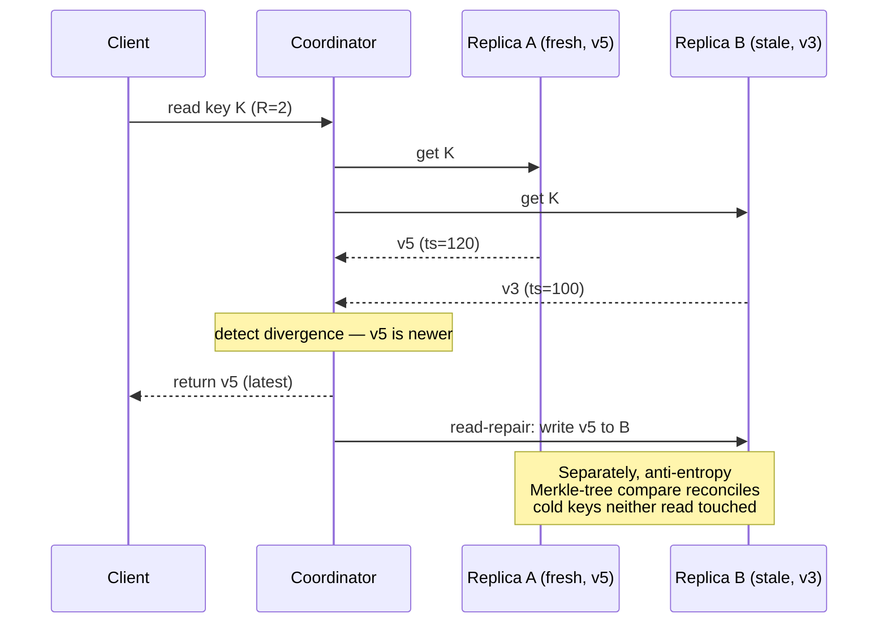
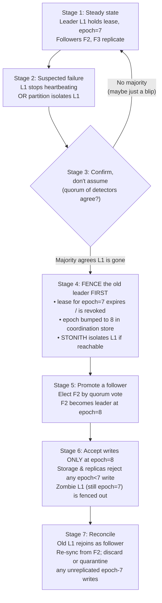

# Consistency vs Availability — Senior

<!-- level-focus -->
At senior level, focus on this question:

> Which system invariant is affected by **Consistency vs Availability** under failure, load, and change?

Use the smallest realistic scenario that exposes the decision and its failure behavior.
As a senior owner of the consistency/availability trade-off, you are no longer choosing
between abstract labels. You are signing your name to numbers: *how many seconds of writes
may we lose on a regional failure (RPO)*, *how long may the write path be down (RTO)*, and
*how stale may a read be before it breaks a contract*. This document is about turning the
CAP/PACELC intuition into operational decisions — per data class, per failover runbook,
per quorum setting — and into the on-call muscle memory that prevents a two-leader
catastrophe at 3 a.m.

## 1. The owner's reframing: from theorem to SLOs

CAP tells you that during a network *partition* you must sacrifice either consistency (C)
or availability (A). PACELC adds the part most senior engineers actually live with:
*else* (E), when there is **no** partition, you still trade **latency (L)** against
**consistency (C)**. A synchronous quorum write is consistent but pays a round trip on
every request; that latency tax is charged every single day, not only during the rare
partition.

The senior reframing is therefore: **CAP is a budgeting problem, not a binary choice.**
You do not pick "CP" or "AP" for the whole system. You pick, per data class, a point on a
continuum, and you back it with three numbers:

- **RPO** — recovery point objective: the maximum acceptable *data loss* window measured
  in time (e.g., "≤ 5 s of writes").
- **RTO** — recovery time objective: the maximum acceptable *downtime* of the affected
  capability (e.g., "≤ 60 s to restore writes").
- **Staleness bound** — the maximum acceptable *read lag* on the availability-favoring
  path (e.g., "reads may be ≤ 2 s behind the latest committed write").

If you cannot state those three numbers for a data store, you do not yet own its
consistency posture — you are hoping. The rest of this document is about replacing hope
with a defensible decision and a runbook.

A useful mental model is that every replicated system has a **dial** with two physical
limits. Crank it toward consistency and you pay write latency and lose availability during
partitions. Crank it toward availability and you accept staleness and a non-zero data-loss
window. The senior job is to place the dial *per data class* and to make the placement
explicit, reviewed, and monitored — never accidental.

---

## 2. Choosing a consistency level per data class

The single biggest leverage move is to stop treating "the database" as one consistency
decision. Different data inside the same product tolerates wildly different staleness. A
balance ledger and a "last seen" timestamp do not deserve the same guarantees, and forcing
both to strong consistency wastes latency budget while forcing both to eventual
consistency invites a correctness incident.

Classify each piece of state by asking two questions: *what breaks if a reader sees stale
data?* and *what breaks if a write is silently lost?* The answers map onto a consistency
level.

| Data class | Example | Read-after-write needed? | Tolerable staleness | Consistency level | Failure preference |
|---|---|---|---|---|---|
| Money / ledger | Account balance, payment captured | Yes, monotonic | 0 (linearizable) | Strong / linearizable (single-leader, sync commit) | CP — refuse writes rather than diverge |
| Inventory / limited stock | "3 left" oversell guard | Yes for the seller's own action | < 1 s | Strong on decrement, RYW on display | CP on decrement |
| Identity / auth state | Password hash, MFA enrollment | Yes | < 1 s | Strong, read-your-writes | CP |
| User profile / settings | Display name, avatar | Read-your-writes for the editor | 1–5 s for others | RYW + bounded staleness | AP-leaning |
| Social graph / counts | Follower count, like count | No | 5–30 s | Eventual | AP |
| Feed / timeline | Home feed entries | No | seconds–minutes | Eventual | AP |
| Sessions / cache | Rate-limit counters, ephemeral state | No (regenerable) | best effort | Eventual / local | AP, lose freely |
| Audit / telemetry | Append-only event log | No (write durability matters) | minutes | Eventual but durable | AP for read, CP for write durability |

Two non-obvious points senior reviewers should enforce:

1. **"Strong" can be scoped to one operation, not the whole entity.** Inventory display
   can be eventually consistent ("about 3 left") while the *decrement* that commits a sale
   goes through a linearizable conditional write. You pay the strong-consistency cost only
   on the operation that can cause harm.

2. **Read-your-writes (RYW) is a per-session guarantee, not global strong consistency.**
   It is cheap to provide (route a user's reads to the leader, or to a replica known to
   have caught up to the user's last write token) and it removes the most common
   user-visible "I saved it and it disappeared" complaint without paying for global
   linearizability.

The deliverable from this section is a table like the one above, checked into the design
doc, reviewed, and revisited whenever a new feature adds a data class.

---

## 3. Documenting staleness tolerance

A consistency level that lives only in someone's head is a future incident. Senior
ownership means the staleness contract is **written, bounded, and monitored**.

For each AP-leaning data class, document:

- **Bound** — the maximum acceptable lag, as a number with units (e.g., `staleness ≤ 2 s
  p99`). "Eventually" is not a bound; it is an abdication.
- **Measurement** — how you observe lag in production. For replica reads this is
  replication lag (bytes or seconds behind the leader). Export it as a metric and alert
  before it reaches the contracted bound, not after.
- **Behavior at breach** — what the system does when lag exceeds the bound. Options:
  serve stale with a warning, fail over reads to the leader, shed read load, or surface a
  "data may be delayed" banner. Pick one *before* the breach happens.
- **Client-visible guarantee** — translate the bound into product language. "Follower
  counts may be up to 30 seconds behind" is a real, defensible statement an SRE and a PM
  can both agree to.

A concrete instrument: stamp every write with a logical or hybrid-logical-clock token and
return it to the client. On the next read, the client (or the gateway) can pass the token
and the read layer can either wait until a replica has applied at least that token
(bounded-staleness / "read your writes") or transparently route to the leader. This turns
an abstract "eventual" into an enforceable "monotonic, ≤ N ms behind your own last write".

The litmus test for whether your staleness documentation is real: **can on-call, woken at
3 a.m., look at a dashboard and say within 60 seconds whether the staleness contract is
currently being violated?** If not, the contract is not operational yet.

---

## 4. RPO and RTO: defining the recovery contract

RPO and RTO are the two coordinates that turn "we have failover" into an engineering
commitment. They are independent and must be set independently.

Read the diagram as a timeline of a single incident:

- **RPO** measures *backward* from the moment of failure: how far back is the last point
  to which you can recover without loss? If the last durable state on the surviving replica
  is from `12:00:00` and the leader died at `12:00:05`, every write in those 5 seconds is
  gone — your **RPO is 5 seconds** for this incident. RPO is a property of your
  **replication and backup strategy**.

- **RTO** measures *forward* from the moment of failure: how long until the capability is
  serving again? If writes resume at `12:01:00`, your **RTO is 55 seconds**. RTO is a
  property of your **detection + failover automation**.

The crucial senior insight: **these two are set by different mechanisms and cost
differently.**

- Driving **RPO toward 0** requires synchronous replication — a write is not acknowledged
  until a second site has it durably. That costs *write latency on every request* and
  *availability* (if the synchronous peer is unreachable, you either block writes or
  silently degrade to async, weakening your RPO).

- Driving **RTO toward 0** requires automated failure detection and promotion. That costs
  *engineering investment* and introduces *split-brain risk* — the faster and more
  automatic the promotion, the more carefully you must fence the old leader.

You can have a tiny RPO and a large RTO (synchronous replication, but manual promotion), or
a large RPO and a tiny RTO (async replication with instant automated failover that may lose
the async window). Most production systems live at a deliberate point in between. State both
numbers, per data class, and make sure the design's replication mode (next section) actually
delivers the RPO you claim.

---

## 5. Replication mode sets your RPO

Your RPO is not a wish; it is mechanically determined by *when* a write is considered
committed relative to *where* the data physically is. Replication mode is the lever.

| Replication mode | When write is acked | RPO (data-loss window) | Write latency impact | Availability during peer loss |
|---|---|---|---|---|
| Synchronous (1 sync replica) | After ≥1 remote replica has it durably | **0** (no committed write is lost) | + 1 inter-node/region RTT per write | Blocks writes if the sync peer is down (unless you fall back to async) |
| Semi-sync (ack to relay log, not applied) | After remote has *received* (not applied) the log | ≈ 0, tiny window if remote crashes before apply | + 1 RTT (network), no apply wait | Same blocking risk, smaller |
| Async | Immediately after local durable write | **> 0** = replication lag at failure (often 100 ms–seconds, more under load) | None (local only) | Writes continue; lag grows |
| Quorum sync (W of N) | After W replicas ack | 0 if surviving set ≥ R overlaps last write | + slowest-of-W latency | Tolerates N−W failures without losing writes |

The defining trade-off in one sentence: **synchronous replication buys RPO = 0 by spending
write latency and availability; asynchronous replication buys low latency and high write
availability by accepting a data-loss window equal to the replication lag at the instant of
failure.**

Practical consequences senior owners must internalize:

- **"Async RPO" is a *distribution*, not a constant.** Under steady state your lag might be
  80 ms; under a backfill, a long-running transaction, or replica I/O saturation it can blow
  out to many seconds. Your effective RPO is the *tail* of replication lag, and that tail is
  exactly what spikes during the kind of incident that also kills your leader. Alert on
  replication lag p99, and treat "lag exceeds RPO budget" as a page, because it silently
  enlarges your data-loss window before any failover.

- **Synchronous replication that silently degrades to async is a lie about your RPO.** Many
  systems, when the synchronous peer becomes unreachable, will (by default or by a
  misconfiguration) continue acking writes locally to preserve availability. That is a valid
  *choice* — but it converts your RPO from 0 to "unbounded for the duration of the
  degradation," and on-call must *know* it happened. Either make degradation explicit and
  alerted, or configure the system to refuse writes (preserving RPO at the cost of
  availability) and decide that consciously per data class.

- **Cross-region sync has a latency floor you cannot engineer away.** A round trip between
  two regions 100 ms apart adds ~100 ms to every committed write, full stop. For a money
  ledger that is usually acceptable; for a high-fanout social write it is often not, which is
  why the *same company* runs ledgers synchronously and feeds asynchronously.

---

## 6. Quorum tuning: sliding N/R/W along the spectrum

Quorum systems (Dynamo-style stores like Cassandra and Riak, and any system with tunable
read/write consistency) expose the trade-off as three numbers you control directly:

- **N** — replication factor: how many copies of each key exist.
- **W** — write quorum: how many replicas must ack before a write is considered successful.
- **R** — read quorum: how many replicas must respond before a read returns.

The foundational rule:

> **If `R + W > N`, the read set and the latest write set are guaranteed to overlap by at
> least one replica, so a read is guaranteed to see the most recent acknowledged write
> (strong consistency for that operation).** If `R + W ≤ N`, the sets may not overlap, and
> reads can be stale (eventual consistency).

This single inequality is the dial. By moving R and W you slide continuously between
availability and consistency *per operation*, even within one keyspace.

| Configuration (N=3) | R + W vs N | Consistency | Write availability | Read availability | Typical use |
|---|---|---|---|---|---|
| W=3, R=1 | 4 > 3 | Strong; read sees latest | Low (all 3 must be up to write) | High | Write-rarely, read-heavy, must-be-fresh config |
| W=1, R=3 | 4 > 3 | Strong; read sees latest | High | Low (all 3 must answer) | Write-heavy ingest, occasional strong read |
| **W=2, R=2** | **4 > 3** | **Strong; tolerates 1 node down on each side** | **Medium** | **Medium** | **The standard "quorum" balanced default** |
| W=1, R=1 | 2 ≤ 3 | Eventual; may read stale | Highest | Highest | Caches, counters, max availability |
| W=3, R=3 | 6 > 3 | Strong, no fault tolerance for the op | Lowest | Lowest | Rarely correct — fragile |

The senior's favorite default is **N=3, W=2, R=2**: `R + W = 4 > 3` gives strong consistency
for the operation, and the system still tolerates **one** replica being down on *both* the
read and write side. You get strong consistency *and* survive a single-node failure — the
sweet spot for most OLTP-adjacent quorum data.

Subtleties that separate a senior from a tutorial:

- **Quorum overlap guarantees *visibility*, not *atomicity* or ordering.** Two concurrent
  writes to the same key under quorum can still produce conflicting versions; overlap only
  guarantees a later read *can see* a write, not that writes were serialized. You still need
  conflict resolution (last-write-wins clocks, vector clocks, or CRDTs) for concurrent
  updates.

- **"Sloppy quorum" trades the guarantee for availability.** When the natural replicas for a
  key are unreachable, some systems write to *substitute* nodes ("hinted handoff") to keep
  accepting writes during a partition. This boosts write availability but breaks the strict
  `R + W > N` guarantee — a subsequent read from the natural replicas may miss the hinted
  write until handoff completes. Know whether your store does this, because it silently moves
  you from CP toward AP during exactly the partition you were trying to survive.

- **Per-request tunability is a feature, not a global setting.** Modern stores let each query
  pick its consistency level. Use `QUORUM`/`LOCAL_QUORUM` for the decrement-the-inventory
  write and `ONE` for the "render an approximate count" read against the *same* table. That
  is per-operation dial placement in action.

---

## 7. Read-repair and anti-entropy

Eventual consistency only converges if something actively pushes replicas back into
agreement. Two background mechanisms do this, and a senior owner must know which one is
load-bearing for their staleness bound.

- **Read-repair** happens *on the read path*. When a read touches multiple replicas
  (because R > 1) and they disagree, the coordinator detects the stale replica, returns the
  freshest value to the client, and asynchronously writes the fresh value back to the stale
  replicas. This repairs *frequently read* keys cheaply but does nothing for cold data that
  is rarely read.

- **Anti-entropy** is a *background* reconciliation independent of reads. Replicas
  periodically compare their data — efficiently, using **Merkle trees** so they exchange
  only hashes of ranges and drill down only where hashes differ — and stream the missing or
  newer rows to whichever replica is behind. This catches the cold keys that read-repair
  never touches and is what bounds your *worst-case* convergence time.

The senior implication: **your staleness bound is only as good as your convergence
mechanism's worst case.** If anti-entropy is disabled, throttled, or backlogged, a key that
is written once and read rarely can stay divergent for a long time, and a failover that
loses the "fresh" replica then loses the data permanently. Monitor anti-entropy/repair
progress and treat a stalled repair as a quiet erosion of your durability and staleness
guarantees — not a cosmetic background chore.

---

## 8. Failover design and split-brain prevention

A failover is the moment the consistency/availability trade-off becomes *operational
violence*: you are deliberately changing who is allowed to accept writes while part of the
system may still believe the old leader is alive. The single most dangerous outcome is
**split-brain** — two nodes both accepting writes as "leader," diverging, and forcing a
later painful merge or data loss.

The defenses, in increasing strength:

- **Leases / TTL-based leadership.** Leadership is granted for a bounded time. A leader must
  continuously renew its lease; if it cannot reach the coordination service to renew, it must
  *self-demote* before the lease expires. This guarantees that by the time a new leader is
  promoted, the old one has already stopped accepting writes — *provided clocks and timeouts
  are configured so the old lease is provably expired before the new one is granted*.

- **Epoch / fencing tokens.** Every leadership term gets a monotonically increasing number
  (epoch / term / generation). Writes carry the epoch; downstream storage and replicas
  *reject* any write stamped with an epoch lower than the highest they have seen. Even if a
  zombie old leader wakes up and tries to write, its stale epoch is fenced out at the storage
  layer. This is the most robust guard because it does not rely on the old leader behaving
  well — it relies on *receivers refusing stale authority*.

- **STONITH ("Shoot The Other Node In The Head").** The cluster *forcibly* powers off or
  isolates the suspected-dead node (via IPMI, cloud API, or network fencing) before promoting
  its replacement. If you cannot prove the old node is dead, you make it dead. Brutal,
  effective, and standard in HA clustering (Pacemaker/Corosync).

- **Quorum-based promotion (avoid the partition minority).** Promotion requires a majority of
  an odd-sized control group to agree. The minority side of a partition cannot reach majority,
  so it cannot elect a leader and *must* stop serving writes. This is why coordination services
  (etcd, ZooKeeper, Consul) are sized at 3 or 5 nodes — to make "who has majority" unambiguous.

The following staged diagram shows a correct, split-brain-safe failover sequence. The key is
that **fencing of the old leader provably precedes acceptance of writes by the new leader.**

Two failures this sequence is explicitly designed to prevent:

1. **The zombie leader.** L1 was only partitioned, not dead. When connectivity returns it
   still thinks it is leader at epoch 7 and tries to write. Because the new leader is at
   epoch 8 and *every receiver rejects epoch < 8*, the zombie's writes are refused. Without
   fencing tokens, those writes would silently corrupt state.

2. **The premature promotion.** Without Stage 3's quorum confirmation, a transient
   heartbeat blip promotes F2 while L1 is perfectly healthy — instant split-brain. Requiring
   a *majority* to agree on the failure means the minority side of a real partition can never
   trigger (or win) an election.

---

## 9. The on-call failover runbook

When the page fires, the senior-designed runbook should make the human's job *checklist-shaped*,
not *invention-shaped*. The decisions were made at design time; on-call executes and
verifies. A concrete sequence:

1. **Confirm it is real.** Distinguish "leader is dead" from "the monitoring path to the
   leader is dead." Check from a second vantage point. A failover triggered by a monitoring
   partition is itself an incident.

2. **Check the replication lag *before* promoting.** This is the moment your RPO is decided.
   If the chosen follower is 0.2 s behind, fast promotion loses 0.2 s of writes. If it is
   30 s behind (a backfill blew out the lag), you are about to choose between losing 30 s of
   data or waiting for catch-up. *Know the number before you act.* If there is a more-caught-up
   follower, promote that one.

3. **Fence before promote.** Confirm the old leader's lease is revoked and its epoch is
   superseded, and trigger STONITH if the platform supports it, *before* directing traffic to
   the new leader. Never promote into an un-fenced old leader.

4. **Promote, bump the epoch, and redirect.** Promote the chosen follower, advance the epoch
   in the coordination store, and update the service-discovery / connection-routing layer so
   clients and replicas follow the new leader.

5. **Verify write path and read-your-writes.** Issue a canary write and read it back. Confirm
   replication to the remaining followers has resumed and lag is shrinking.

6. **Decide on the old leader's unreplicated writes.** When the old leader rejoins, any writes
   it accepted but never replicated (your RPO window) must be **quarantined, not silently
   replayed**. Replaying them after the new leader has accepted *different* writes for the same
   keys causes divergence. Capture them for forensic/manual reconciliation; do not auto-merge.

7. **Record the actual RPO and RTO.** Log the measured data-loss window and downtime against
   the *contracted* targets. If actual RPO exceeded the SLO (because lag was high), that is a
   finding for the postmortem — your async window was bigger than promised.

The meta-rule: **on-call should be choosing between pre-defined options with known
consequences, never designing a failover live.** If the runbook ever requires creativity
during the incident, the design is incomplete.

---

## 10. Fast promotion vs waiting: the data-loss/downtime dial

When a follower is promoted, you face the single most consequential live trade-off — and it
is exactly RPO vs RTO again, in real time:

- **Promote immediately** (fast): the new leader starts accepting writes now. **RTO is
  minimized.** But any writes the old leader had that this follower has *not yet replicated*
  are **lost** — **RPO grows** by exactly the replication lag at the instant of promotion.

- **Wait for the follower to catch up** (or for the old leader to possibly recover): you
  drain the replication backlog first, so **RPO shrinks toward 0**. But the service stays
  *down for writes* while you wait — **RTO grows**, and if the old leader never recovers, you
  may have waited for nothing.

The decision is **data-class-dependent**, and it should be encoded as policy in the runbook,
not improvised:

| Data class | Lag at failover | Default action | Rationale |
|---|---|---|---|
| Money ledger | any | **Wait / require RPO=0 path** | Losing a committed payment is unacceptable; better to be down longer. Ideally synchronous replication makes the wait near-zero. |
| Money ledger | 0 (sync replica) | Promote immediately | Sync replica already has every committed write; no data loss, no need to wait. |
| User profiles | < 2 s | Promote immediately | Sub-2 s of lost profile edits is within the documented staleness tolerance; uptime matters more. |
| Feed / counts | any | Promote immediately | Eventual data; losing a few seconds of feed writes is invisible and recoverable. |
| Inventory decrement | any | **Wait or refuse** | Losing a decrement risks overselling; prefer brief unavailability of the buy button over a guaranteed oversell. |

The senior framing to put in the design doc: *"For data class X, on a failover with
replication lag L, we will [promote immediately / wait up to T seconds / refuse writes],
accepting up to L of data loss in exchange for minimal downtime"* — written down, per class,
**before** the incident. That sentence is the operationalization of the entire
consistency/availability trade-off.

---

## 11. Worked decision: an order-payment system

Let us make the abstractions concrete for a single system: the checkout path of an
e-commerce platform. We will set consistency level, RPO/RTO, replication mode, and quorum
for each data class, and justify every number.

**System context.** Two regions, ~80 ms apart. Peak ~2,000 orders/minute. A lost payment is a
financial and trust catastrophe; a lost "recently viewed" entry is invisible.

**Step 1 — Classify the data and set the targets.**

| Data class | Consistency | RPO target | RTO target | Why |
|---|---|---|---|---|
| Payment / order ledger | Strong, linearizable | **0** | ≤ 30 s | A committed payment must *never* be lost; brief write downtime is tolerable |
| Inventory decrement | Strong on decrement | **0** | ≤ 30 s | Losing a decrement → oversell → cancellations and refunds |
| Cart contents | Read-your-writes | ≤ 5 s | ≤ 10 s | A lost cart edit annoys; it does not lose money; uptime matters |
| Product catalog (reads) | Eventual, bounded staleness ≤ 30 s | n/a (re-derivable) | ≤ 5 s (read replicas) | Catalog is rebuildable from source of truth; serve stale freely |
| Recently-viewed / recommendations | Eventual | best effort | best effort | Pure convenience; lose freely |

**Step 2 — Pick replication mode to meet each RPO.**

- *Payment ledger:* RPO = 0 demands **synchronous replication** to a second node, ideally in
  a second availability zone. Every committed payment is durable in ≥ 2 places before the
  customer sees "order confirmed." Cost: ~1 ms intra-region RTT (sync to a same-region AZ
  peer, *not* cross-region, to keep latency low) added per payment write. We accept that tax;
  a payment is a rare, high-value operation, and 1 ms is invisible to a checkout.
- *Cart:* RPO ≤ 5 s allows **asynchronous replication**. Carts are written constantly; we do
  not want to pay sync latency on every "add to cart." A 5 s loss window is within the
  documented tolerance.
- *Catalog / recommendations:* asynchronous read replicas; loss is irrelevant because the
  data is re-derivable from the system of record.

**Step 3 — Tune quorum (for the quorum-store data classes).** Suppose cart and
recommendations live in a Dynamo-style store with **N = 3** per region.

- *Cart decrement of "items in cart" need not be strongly consistent*, but the user must see
  their own edits (read-your-writes). We use **W = 2, R = 2** (`R + W = 4 > 3`): strong enough
  that the editing user sees their write, while tolerating one node down on each side.
- *Recommendations:* **W = 1, R = 1** — maximum availability, eventual consistency, because
  freshness is worthless here and we never want a recommendation write or read to fail.

**Step 4 — Design the payment-ledger failover.**

- Synchronous standby in a second AZ; **epoch/fencing tokens** on every ledger write so a
  zombie old leader is refused; **lease-based leadership** with a coordination quorum (3-node
  etcd) so the minority side of a partition cannot promote.
- **Promotion policy:** because RPO = 0 is required and the sync standby already holds every
  committed payment, on-call **promotes immediately** to the *synchronous* standby — there is
  no data-loss window to wait out. RTO is dominated by detection + fencing + redirect, budgeted
  at ≤ 30 s. If, and only if, the sync standby is *also* unavailable, the policy is to **refuse
  payment writes** (return "try again shortly" at checkout) rather than promote an async replica
  and risk losing a captured payment. We consciously choose unavailability over a lost payment
  for this one data class.

**Step 5 — Design the cart failover.**

- Async replica; **promotion policy:** check lag; if lag ≤ 5 s (the RPO budget), **promote
  immediately** to minimize RTO. If lag has blown past 5 s, page and wait briefly for catch-up,
  because exceeding the documented staleness/RPO contract is itself a problem worth a short
  wait.

**The result is a single system running two opposite postures on purpose:** the payment ledger
is CP with RPO = 0 (it would rather refuse writes than lose a payment), and the cart and
recommendations are AP (they would rather stay up and lose a few seconds than ever block the
user). That is not inconsistency — that is the senior trade-off applied per data class, with
every number written down, justified, and turned into a promotion policy the on-call can
execute without inventing anything.

---

## 12. Anti-patterns and review checklist

Patterns that should fail a senior design review:

- **One consistency level for the whole database.** Forcing the cart and the ledger to the
  same posture wastes latency budget or invites correctness bugs. Classify per data class.
- **"Eventual" with no bound.** If there is no number and no breach behavior, it is not a
  contract. Demand a staleness bound and a monitor.
- **Claimed RPO = 0 over async replication.** The two are contradictory. If replication is
  async, RPO is the lag tail, period. Make the claim match the mechanism.
- **Synchronous replication that silently degrades to async.** Without an alert, your RPO
  quietly becomes unbounded during the exact incident you were guarding against.
- **Promotion without fencing.** Any failover that promotes a new leader without provably
  fencing the old one (lease expiry + epoch tokens + ideally STONITH) is a split-brain
  generator.
- **Auto-replaying the old leader's unreplicated writes on rejoin.** This silently diverges
  state. Quarantine and reconcile manually.
- **`R + W ≤ N` while claiming strong reads.** The overlap math is not a guideline; if the
  inequality is not strict, stale reads are *guaranteed possible*.
- **A runbook that requires creativity during the incident.** If on-call must design the
  failover live, the design is incomplete.

Review checklist to apply to any consistency/availability design:

- [ ] Is there a per-data-class consistency table, reviewed and checked in?
- [ ] Does every AP data class have a *numeric* staleness bound, a monitor, and a breach
      behavior?
- [ ] Is RPO stated per data class, and does the replication mode actually deliver it?
- [ ] Is RTO stated, and is there automated (or rehearsed-manual) failover to meet it?
- [ ] For quorum stores, does `R + W` match the claimed consistency for each operation?
- [ ] Is there fencing (lease + epoch + optional STONITH) so two leaders cannot both write?
- [ ] Does promotion require a coordination quorum so a partition minority cannot promote?
- [ ] Is the fast-promote-vs-wait policy written per data class, with the lag threshold?
- [ ] Does the runbook say what to do with the old leader's unreplicated writes?
- [ ] Have you rehearsed the failover (game day) and measured actual RPO/RTO vs targets?

---

## 13. Senior takeaways

- **CAP is a budget you allocate per data class, not a label you stamp on a system.** The same
  product correctly runs CP for money and AP for feeds. Owning the trade-off means making that
  allocation explicit and reviewed.
- **RPO and RTO are independent numbers set by different mechanisms.** RPO is decided by your
  replication mode (sync → 0; async → the lag tail). RTO is decided by detection + promotion
  automation. State both, per data class.
- **Your async RPO is the *tail* of replication lag, and that tail spikes during incidents.**
  Alert on lag p99 against the RPO budget so the data-loss window does not silently grow.
- **The quorum inequality `R + W > N` is the dial.** Move R and W to slide between consistency
  and availability per operation; `N=3, W=2, R=2` is the balanced strong-and-fault-tolerant
  default. Remember overlap guarantees *visibility*, not *ordering* — you still need conflict
  resolution and active anti-entropy.
- **Split-brain is the failure that matters most, and fencing is the cure.** Lease expiry,
  monotonic epoch tokens that receivers enforce, quorum-gated promotion, and STONITH together
  guarantee the old leader is provably silenced before the new one accepts writes.
- **Fast promotion vs waiting is RPO vs RTO made live.** Encode the choice as policy per data
  class *before* the incident, so on-call executes a checklist instead of inventing a failover.
- **If you cannot state the staleness bound, the RPO, and the RTO for a data store, you do not
  yet own its consistency posture.** Replace hope with numbers, monitors, and a runbook.

---

*Next step:* [Professional level](professional.md)

---

## Apply it

1. State the system invariant that **Consistency vs Availability** must protect.
2. Mark ownership, state, and failure propagation at each boundary.
3. Compare two designs under load, dependency failure, and future change.
4. Define recovery and compatibility behavior before implementation.
5. Test the riskiest assumption with a focused experiment.

## Verify your work

- The experiment supports the design with evidence, not preference.
- Failure injection shows the blast radius and recovery path.
- Compatibility checks cover old and new callers or data.
- Operational signals reveal invariant violations and recovery progress.

## Review questions

- Which invariant must remain true when Consistency vs Availability fails?
- Where should recovery responsibility live, and why?
- Which assumption deserves an experiment before implementation?
- How can the design evolve without changing every consumer at once?
