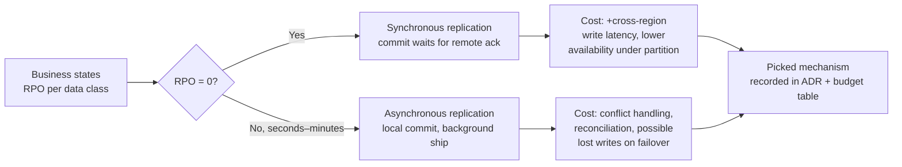
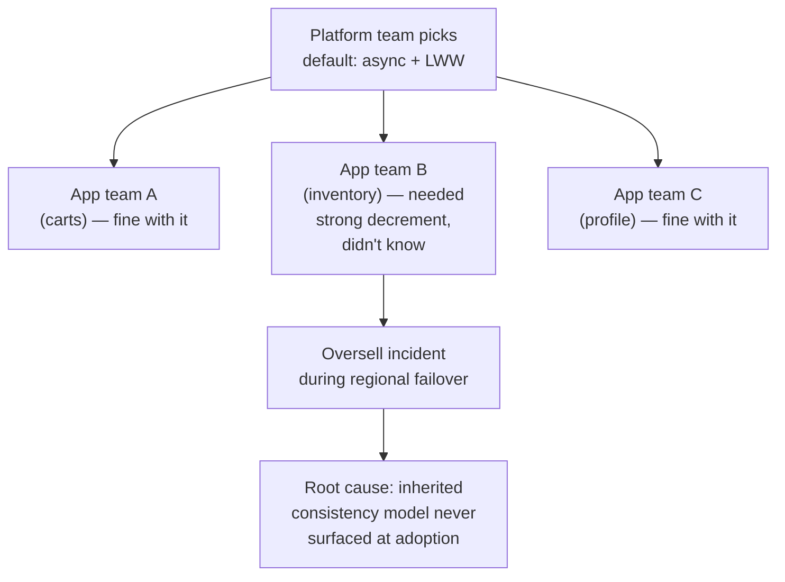
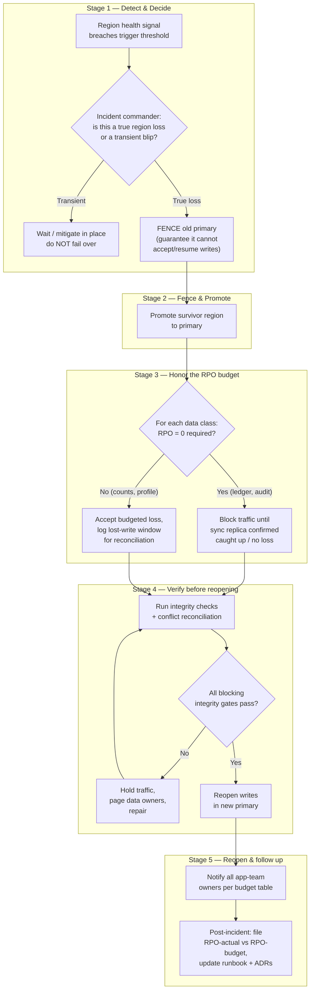

# Consistency vs Availability — Staff / Principal Level

The junior and senior pages treat consistency vs availability as a *systems theorem*:
CAP, PACELC, quorum math, the mechanics of synchronous vs asynchronous replication.
This page treats it as an *organizational and product decision*. At staff/principal
scope the interesting question is almost never "which is theoretically correct" — it is
"who in the company is allowed to decide how stale this number can be, what does each
choice cost, and who is on the hook when the trade-off bites in production."

The recurring failure mode at large companies is that consistency decisions are made
*implicitly* — a platform team picks a default, an app team inherits it without knowing,
and the gap surfaces three years later as a customer-support escalation or a data-integrity
incident during a regional failover. Your job at this level is to make those decisions
*explicit, owned, budgeted, and rehearsed*.

## Table of contents

1. [The reframe: a product decision wearing a systems costume](#1-the-reframe-a-product-decision-wearing-a-systems-costume)
2. [Staleness tolerance as a product-owned number](#2-staleness-tolerance-as-a-product-owned-number)
3. [The staleness budget by data class](#3-the-staleness-budget-by-data-class)
4. [RPO as a business data-loss budget](#4-rpo-as-a-business-data-loss-budget)
5. [The true cost of strong consistency](#5-the-true-cost-of-strong-consistency)
6. [The hidden cost of eventual consistency](#6-the-hidden-cost-of-eventual-consistency)
7. [Who pays each cost: the accounting view](#7-who-pays-each-cost-the-accounting-view)
8. [The platform default becomes everyone's constraint](#8-the-platform-default-becomes-everyones-constraint)
9. [Cross-team failover runbooks and game days](#9-cross-team-failover-runbooks-and-game-days)
10. [The regional-failover decision diagram](#10-the-regional-failover-decision-diagram)
11. [Making the trade-off visible: design reviews and ADRs](#11-making-the-trade-off-visible-design-reviews-and-adrs)
12. [Anti-patterns and failure stories](#12-anti-patterns-and-failure-stories)
13. [The staff checklist](#13-the-staff-checklist)

---

## 1. The reframe: a product decision wearing a systems costume

When an engineer says "we need strong consistency on the wallet," they have usually
already collapsed three separate decisions into one:

1. **A product decision**: how wrong is the user allowed to see this value, and for how long?
2. **A risk decision**: how much committed data is the business willing to lose if a region dies?
3. **An engineering decision**: which mechanism (sync replication, quorum, async + reconciliation) meets 1 and 2 at acceptable cost?

The senior-level mistake is to start at (3). The staff-level move is to force (1) and (2)
to be answered *by the people who own the risk* — product and the business — and then
let engineering pick the cheapest mechanism that satisfies the stated budget. Consistency
is not a property you buy in maximum quantity; it is a property you buy exactly enough of,
because every additional nine of consistency is paid for in latency, dollars, and on-call
pages.

The single most useful sentence you can introduce into a design review is:
**"What's our staleness budget for this, and who signed off on it?"** If nobody can
answer, the design is not ready — not because the architecture is wrong, but because
nobody owns the number it is being optimized for.

---

## 2. Staleness tolerance as a product-owned number

Staleness tolerance is the maximum amount of time a reader may observe an out-of-date
value before the business considers it a defect. It is a *product* number, expressed in
seconds (or transactions), not an engineering preference. The engineer's job is to surface
the question; the product owner's job is to answer it and sign their name to it.

Three worked examples make the boundary concrete:

- **A bank balance.** Most users assume a balance is "the truth." But the truth tolerance
  is not zero. A pending card authorization may take seconds to appear; a deposit may be
  "available" on a different clock than "posted." The real product number is something like:
  *the authorizable balance must be strongly consistent (no double-spend), but the displayed
  balance may lag the ledger by up to a few seconds as long as it is monotonic — it must
  never appear to go backwards.* That last clause — **monotonic reads / no backward jumps** —
  is frequently the actual requirement, and it is far cheaper than global linearizability.

- **A like count.** A post showing 10,402 likes when the true count is 10,418 is invisible
  to every human. The product-acceptable staleness here is *minutes*, and the acceptable
  error is *approximate*. Treating a like count as if it needed the same consistency as a
  balance is one of the most common and most expensive over-engineering mistakes in social
  products. The right answer is usually: eventually consistent, approximate, cached
  aggressively, and reconciled by a periodic batch job.

- **An inventory count.** This is the dangerous middle. Show "2 left in stock" when there
  is genuinely 1, and you will oversell — a real-money, real-support-ticket failure. But
  insisting on globally strong inventory across regions for a 50,000-SKU catalog is
  ruinously expensive. The product decision is usually nuanced: *display counts may be
  stale by seconds; the decrement at checkout must be strongly consistent or use a
  reservation pattern with compensation.* The staleness budget differs between the
  **browse path** (loose) and the **commit path** (tight) for the same logical data.

The discipline here is to refuse to answer "how stale can it be?" yourself. You write the
question into the design doc, you propose a default, and you require a named product owner
to approve, modify, or reject it. When it later becomes a problem, "engineering decided to
make likes eventually consistent without telling anyone" is a career-limiting sentence;
"the staleness budget for likes is 5 minutes, approved by the Feed PM in ADR-0142" is a
governance success.

---

## 3. The staleness budget by data class

The deliverable that turns this from a philosophy into an operating practice is a table.
It is owned jointly by product and the platform/architecture group, lives in the
architecture wiki, and is referenced by every design review. Each row maps a *data class*
to its tolerable staleness, its RPO (see §4), the chosen mechanism, and a named owner.

| Data class | Tolerable staleness (read) | RPO (data-loss budget) | Chosen mechanism | Accountable owner |
|---|---|---|---|---|
| Auth credentials / sessions | 0 for auth decision; ~30 s for revocation propagation | 0 (must not lose credential writes) | Sync-replicated store of record + short-TTL cache | Identity platform lead |
| Wallet / ledger (authorizable balance) | 0 (linearizable on the commit path) | 0 | Synchronous multi-AZ replication, single-writer region, consensus quorum | Payments staff eng + Finance |
| Wallet displayed balance | up to ~5 s, **must be monotonic** | inherits ledger RPO | Read-your-writes via sticky reads + async fanout | Payments product owner |
| Inventory — commit/decrement | 0 or reservation-with-compensation | ≤ 1 s | Strong decrement in home region OR reserve+settle | Commerce staff eng |
| Inventory — browse/display count | up to ~10 s | best-effort | Async replica + periodic reconcile | Catalog product owner |
| Shopping cart contents | up to ~30 s | ≤ 60 s | Async cross-region, last-writer-wins per item | Cart product owner |
| Order status / fulfillment state | up to ~60 s | ≤ 30 s | Async replication + idempotent event stream | Fulfillment product owner |
| Like / view / reaction counts | minutes; approximate OK | best-effort (regenerable) | Eventually consistent counters + batch reconcile | Feed product owner |
| User profile / settings | up to ~60 s | ≤ 5 min | Async multi-region, LWW | Profile product owner |
| Analytics / event firehose | minutes–hours | bounded by retention | Async, at-least-once, dedupe downstream | Data platform lead |
| Audit / compliance log | 0 for durability; read staleness irrelevant | 0 (legally required) | Sync append-only WAL, immutable store | Compliance + platform |

Several things about this table are deliberate and worth defending in review:

- **The same logical entity appears in multiple rows.** "Wallet" splits into the
  authorizable balance (RPO 0, linearizable) and the displayed balance (5 s, monotonic).
  Inventory splits into commit and browse. Collapsing these is how products end up paying
  for global strong consistency on a path that never needed it.
- **Staleness and RPO are distinct columns.** Staleness is about *reads* (how old can the
  value I show be). RPO is about *durability on failover* (how much committed data can I
  lose). A like count can be very stale *and* have a loose RPO. An audit log can have an
  irrelevant read staleness but an RPO of zero. Conflating them is a common error.
- **Every row has exactly one accountable human**, not a team name when avoidable. "The
  platform team owns it" is the answer that means nobody owns it at 3 a.m.

This table is the single artifact that, more than any diagram, distinguishes a staff-level
treatment of consistency from a senior one. It converts an architectural argument into a
governance object that survives reorgs.

---

## 4. RPO as a business data-loss budget

**RPO (Recovery Point Objective)** is the maximum amount of *committed* data the business
is willing to lose when it fails over from a dead region to a survivor. It is measured in
time: RPO = 0 means "lose nothing"; RPO = 60 s means "we accept losing up to the last
minute of writes that hadn't replicated when the region died."

The critical reframe at staff level: **RPO is a number the business sets, and engineering
meets — not the other way around.** Engineers frequently present RPO as a consequence of
the replication mechanism they happened to choose. Invert it. The business states the
tolerable data loss per data class, and that number *selects* the replication strategy:

The honest accounting of **RPO = 0** is where most teams flinch:

- Every write must be acknowledged by a remote replica (another AZ or region) *before* the
  commit returns to the client. That adds the inter-site round-trip to your write latency —
  single-digit milliseconds across AZs, but **tens of milliseconds across regions**, on
  every write, forever.
- Availability *drops*. If the remote replica is unreachable (network partition), a strict
  RPO = 0 system must refuse the write rather than risk losing it. You have explicitly
  chosen the C in CAP: under partition, you become unavailable. This is correct for a
  ledger and catastrophic for a like button.
- It costs more infrastructure: provisioned replicas in multiple sites, dedicated
  inter-region links, and the operational machinery (consensus, fencing, witness nodes)
  to make synchronous commit safe.

So the staff move is to ask the business: **"RPO = 0 on this data class costs roughly X in
write latency and Y in annual infra, and it means we reject writes during a partition. Is
the data loss you're avoiding worth that?"** For a payment ledger the answer is an obvious
yes. For a user's "last seen" timestamp the answer is an obvious no, and a 5-minute RPO
saves a fortune. The skill is making the business answer per data class instead of
defaulting the whole platform to one extreme.

A useful sibling metric is **RTO (Recovery Time Objective)** — how long the failover itself
may take. RPO is "how much data" you lose; RTO is "how long you're down." They trade against
each other and against cost; a budget table should ideally carry both, but RPO is the one
that drives the consistency/replication mechanism choice and is therefore the focus here.

---

## 5. The true cost of strong consistency

Strong consistency is not free, and the bill arrives in places that don't show up in the
design diagram. When a team argues for "just make it strongly consistent," enumerate the
real costs so the trade-off is honest:

- **Write-path latency.** Coordinating a quorum or waiting for synchronous remote
  acknowledgement adds the slowest required round-trip to every write. Cross-region
  consensus can mean 50–150 ms of added write latency depending on geography. This latency
  is *structural* — no amount of tuning removes the speed of light between Virginia and
  Frankfurt.

- **Reduced availability under partition.** By CAP, a strongly consistent system must
  sacrifice availability when the network splits. That means a *correct* implementation will
  deliberately return errors during partitions. Your error budget is now partly spent on
  doing the right thing, and your SLO must be set accordingly. A team that wants both 99.99%
  availability *and* strict linearizability across regions is asking for something the
  universe does not sell.

- **More infrastructure and more expensive infrastructure.** Consensus needs odd-numbered
  replica sets (3, 5) across failure domains. Synchronous cross-region replication needs
  low-latency private links. Witness/arbiter nodes need their own footprint. You are paying
  for capacity whose entire job is to make the system *slower but safer*.

- **Harder operations and on-call complexity.** Consensus systems fail in subtle ways:
  split-brain prevention, leader election storms, quorum loss when you lose one too many
  nodes, clock-skew sensitivity, the dreaded "the cluster is up but won't accept writes
  because it can't form a quorum." These are 3 a.m. incidents that require deep expertise.
  Every strongly consistent datastore you adopt is a new specialized on-call burden and a
  new training requirement for the team. **The operational tax is recurring and it scales
  with the number of distinct consistency mechanisms in your fleet.**

- **Cross-team coordination latency, not just machine latency.** When a strongly consistent
  store is shared across teams, schema changes, failover drills, and capacity changes now
  require coordination across all dependents. The "latency" you pay isn't only the wire —
  it's the meeting.

The staff framing: strong consistency is a *premium product*. You buy it where the cost of
being wrong (double-spend, oversold inventory, lost money) exceeds the premium. You do not
buy it as a default because it "feels safer," because the premium is paid on the hot path
of every single request whether or not that request needed the guarantee.

---

## 6. The hidden cost of eventual consistency

The opposite error is treating eventual consistency as "free availability." It is cheaper
on the write path, but it relocates the cost — it doesn't eliminate it. The costs of
eventual consistency are *deferred and dispersed*, which is exactly why they're
underestimated in design reviews:

- **Conflict-resolution code.** The moment two regions can accept writes to the same key,
  you own the problem of what happens when they disagree. Last-writer-wins is simple and
  silently loses data. CRDTs are correct but constrain your data model and add cognitive
  load. Application-level merge logic is bespoke, hard to test, and a permanent maintenance
  liability. This code is real engineering that the "just make it eventually consistent"
  proposal usually forgets to budget.

- **Anomaly-driven customer-support tickets.** Eventual consistency produces user-visible
  weirdness: an item disappears from a cart and reappears, a setting reverts, a count jumps
  around, a "deleted" message comes back. Each anomaly that escapes into production becomes
  support tickets, trust erosion, and sometimes a manual data-fix request. **Support load is
  a real, recurring cost line that the eventual-consistency choice creates and that a
  different team pays.**

- **Reconciliation jobs.** Approximate and eventually consistent data drifts. You will need
  periodic batch jobs to recompute counts, detect and repair divergence, and reconcile
  cross-region state. These jobs are infrastructure, they have their own on-call, they can
  themselves cause incidents (a bad reconcile that "corrects" good data), and they must be
  monitored. They are the standing army that keeps eventual consistency honest.

- **The debugging tax.** "It's correct, just eventually" makes reproduction hard. Bugs that
  depend on replication ordering and timing are among the most expensive to diagnose. Your
  engineers pay this in hours; the business pays it in slower incident resolution.

- **Reasoning load on every downstream consumer.** Once a value is eventually consistent,
  *every* reader must be written defensively (tolerate staleness, handle non-monotonic
  reads, expect conflicts). That constraint propagates to every team that touches the data.

The honest comparison is not "strong is expensive, eventual is cheap." It is "**strong
consistency pays its cost up-front, on the hot path, in latency and dollars, visibly, owned
by the platform team. Eventual consistency pays its cost later, dispersed across
conflict-resolution code, support, and reconciliation, often paid by a different team than
the one that chose it.**" Naming *who pays* is the whole game.

---

## 7. Who pays each cost: the accounting view

The reason these trade-offs are mismade is that the team making the choice is frequently
not the team paying for it. Make the cost incidence explicit:

| Cost | Incurred by which choice | Who actually pays it | When it shows up |
|---|---|---|---|
| Write latency on hot path | Strong consistency | Every user, every product team on that store | Immediately, continuously |
| Unavailability during partition | Strong consistency | Product / revenue; on-call | During network events |
| Extra replicas, private links | Strong consistency | Platform infra budget | Monthly, predictably |
| Consensus operational expertise | Strong consistency | Platform on-call team | During cluster incidents |
| Conflict-resolution code | Eventual consistency | App team that owns the data | Build time + every edge case after |
| Anomaly support tickets | Eventual consistency | Support org + the product's trust | Continuously, dispersed |
| Reconciliation jobs + their on-call | Eventual consistency | Data/platform team | Continuously |
| Lost writes on failover | Loose RPO | The business + the affected user | During regional outages |
| Slow incident diagnosis | Eventual consistency | All on-call engineers | During incidents |

The staff intervention is to surface this table in the design review so the person choosing
"eventual to keep it cheap" sees that they are externalizing cost onto Support and the data
team, and the person choosing "strong to be safe" sees that they are taxing every user's
write latency. Once the costs are attributed to *named cost centers*, the conversation stops
being about engineering aesthetics and starts being about budget — which is where it belongs.

---

## 8. The platform default becomes everyone's constraint

This is the structural insight that is invisible at the senior level and unavoidable at the
staff/principal level: **when a platform team picks a default consistency model, that choice
silently becomes a hard constraint on every app team built on top of it.**

Concretely: if the shared multi-region datastore the platform offers is async-replicated
with last-writer-wins, then *every* app team inherits eventual consistency and LWW conflict
behavior whether or not they understood that when they adopted the store. The inventory team
that assumed "the database keeps my counts correct" discovers, during a failover, that two
regions accepted conflicting decrements and LWW silently discarded one. They didn't choose
eventual consistency. They inherited it. And they'll learn about it via an oversell incident.

The principal-level responsibilities that follow:

1. **Make the platform's consistency contract explicit and prominent.** The store's
   documentation must state, in plain language, its consistency model, its conflict behavior,
   and its failover RPO — at the top, not buried. "Adopting this store means inheriting
   async + LWW + best-effort RPO" should be unmissable.

2. **Offer tiers, not a single default.** A mature platform offers, e.g., a strongly
   consistent tier (expensive, for ledgers) and an eventually consistent tier (cheap, for
   counts), and forces the adopting team to *choose* and record which tier and why. The
   choice goes in the budget table from §3.

3. **Build the default to fit the common case but require an explicit opt-in for the
   dangerous case.** If 90% of consumers are fine with eventual consistency, default to it —
   but make the commit-path-strong option a first-class, discoverable feature, and gate it
   behind a review so inventory-style teams don't fall through.

4. **Treat a default change as a breaking change.** If the platform later changes its default
   consistency or RPO behavior, that is a breaking change to every dependent's correctness
   assumptions, and must be socialized as such — not slipped into a minor release note.

The phrase to internalize: **a default is a decision you make on behalf of everyone who
doesn't read the docs.** At platform scale, that is most people. Own it accordingly.

---

## 9. Cross-team failover runbooks and game days

A regional failover is the moment all of the above becomes real simultaneously: stale reads,
RPO-budgeted data loss, conflict resolution, and inter-team coordination, all under incident
pressure. The difference between a clean failover and a data-integrity incident is almost
never the architecture — it is whether the *runbook* exists, is cross-team, and has been
*rehearsed*.

**Why failover turns into a data-integrity incident.** During failover, the system briefly
has either no writer (down) or, worse, the possibility of *two* writers (the old region
recovers and resumes before it's been fenced). If two regions accept writes to the same data,
you get conflicts that loose RPO and LWW will resolve by silently discarding data. The
sequence that prevents this — fence the old primary, promote the new one, drain and reconcile
in-flight writes, verify integrity before reopening traffic — is fiddly and spans teams
(network, data platform, each app team that owns affected state). If it lives only in one
SRE's head, it will be done wrong at 3 a.m.

**What a good cross-team failover runbook contains:**

- A **decision trigger**: explicit, measurable conditions under which failover is initiated,
  and *who is authorized to call it* (a single incident commander role, not a committee).
- **Fencing first**: the very first action is to guarantee the dead/degraded primary cannot
  accept or resume writes. Promotion before fencing is how you create split-brain.
- **Per-data-class steps** keyed to the budget table: each data class has a known RPO, so the
  runbook states explicitly which classes may lose up-to-N seconds of writes and which must
  be reconciled before traffic resumes.
- **Reconciliation and verification gates**: integrity checks that must pass before the new
  region serves writes — not optional, blocking.
- **Communication plan**: which teams are paged, in what order, and what each owner is
  responsible for verifying in *their* data class.
- **Recovery / failback**: how the recovered region re-joins without clobbering the new
  primary's writes.

**Game days** are the rehearsal. You deliberately fail over a region in a controlled window
(ideally in production, with guardrails) on a schedule, and you measure: Did we meet RPO per
data class? Did any conflict slip through? How long did fencing take? Which step in the
runbook was wrong or missing? Did the right teams get paged? The output of a game day is a
list of runbook defects fixed *before* a real outage finds them. A regional failover you have
never rehearsed is a hypothesis, not a capability. The companies that fail over cleanly are
the ones that have done it on purpose, repeatedly, when nothing was actually broken.

A subtle staff point: game days also *validate the budget table*. If the table claims
inventory has RPO ≤ 1 s but the game day shows 12 s of unreplicated decrements were lost,
either the mechanism is wrong or the budget is a fiction. The drill is how you keep the
governance artifact honest.

---

## 10. The regional-failover decision diagram

The following staged diagram is the decision-and-runbook flow for a regional failover,
showing where the consistency/RPO budget enters the live decision. It is deliberately drawn
as the *operational* sequence, not the architecture, because at staff level the architecture
is assumed and the operational discipline is what's scarce.

Read the diagram as a contract between the failover operators and the budget table from §3:
Stage 3 is *literally* the budget table being executed under pressure. If the table is wrong
or missing, Stage 3 has no inputs and the operators improvise — which is how failovers become
data-integrity incidents.

---

## 11. Making the trade-off visible: design reviews and ADRs

The mechanisms that keep all of this from rotting are *design reviews* and *Architecture
Decision Records*. The goal is to ensure no consistency/availability/RPO decision is ever
made implicitly, and that the reasoning survives the people who made it.

**In the design review**, require every design that introduces or touches stateful data to
answer four questions explicitly:

1. **Staleness budget**: How stale can each read be, and who (named product owner) signed off?
2. **RPO budget**: How much data can we lose on regional failover, per data class, and who
   from the business approved it?
3. **Cost incidence**: Given the chosen mechanism, who pays — write latency, infra,
   conflict-resolution code, support load, reconciliation jobs? (Reference the §7 table.)
4. **Failover behavior**: What happens to this data during a regional failover, and is it
   covered by the runbook and a game day?

A design that cannot answer these is not "more work for engineering" — it is *incomplete*,
because it is being optimized against an unstated target. The reviewer's job is to refuse to
approve until the target is stated and owned.

**In the ADR**, record the decision so it outlives the meeting. A consistency-decision ADR
should capture, at minimum:

| ADR field | What it records |
|---|---|
| Context | The data class, its access patterns, and the product/business constraints |
| Staleness budget | The agreed read-staleness number and the named product approver |
| RPO budget | The agreed data-loss budget and the named business approver |
| Decision | Strong / eventual / hybrid, and the specific mechanism chosen |
| Cost accepted | Which costs from §7 we are knowingly paying, and which teams pay them |
| Failover plan | Reference to the runbook section and the game-day cadence that validates it |
| Consequences | What downstream consumers must now assume (e.g., "reads are non-monotonic") |

The ADR's most valuable field is **"Consequences."** Three years later, when a new team
adopts this data, the ADR tells them exactly what consistency they're inheriting — closing
the §8 trap where the platform default silently became a constraint nobody read. An ADR that
says "consumers must tolerate up to 10 s of staleness and occasional non-monotonic reads" is
the artifact that turns an inherited surprise into an informed adoption.

---

## 12. Anti-patterns and failure stories

The following are the recurring failures this discipline exists to prevent. Recognizing them
fast is most of the staff/principal value.

- **The default-strong tax.** A team makes everything strongly consistent "to be safe,"
  including like counts and presence indicators. Result: every write pays cross-region
  latency, the infra bill balloons, and availability suffers during partitions — all to
  protect data that nobody would have noticed was stale. *Fix:* per-data-class budgets;
  strong only where being wrong costs real money.

- **The silent-eventual surprise.** A team adopts an eventually consistent store assuming the
  database "keeps things correct," never writes conflict-resolution logic, and discovers
  during a failover that LWW discarded half their decrements. *Fix:* the platform's
  consistency contract is explicit and adoption requires recording the tier chosen (§8).

- **RPO by accident.** Nobody set an RPO; the replication is "async because that's the
  default." A region dies, 90 seconds of orders vanish, and the company learns its data-loss
  budget was "whatever async happened to give us." *Fix:* RPO is a business-stated number per
  data class that *selects* sync vs async, not the residue of an unexamined default (§4).

- **The unrehearsed runbook.** A beautiful failover runbook exists in a wiki, written once,
  never executed. The real failover hits a step that was wrong, fencing is skipped, two
  regions write simultaneously, and a stale-reads problem becomes a corrupted-data problem.
  *Fix:* scheduled game days that turn the runbook from a document into a validated capability
  (§9).

- **Conflation of staleness and RPO.** A design demands RPO = 0 on a like count "because we
  don't want to lose likes," paying for synchronous replication on data that is regenerable
  and where nobody cares about a few lost increments. *Fix:* separate the read-staleness
  question from the durability question; they have different answers for the same data (§3).

- **The orphaned number.** A staleness budget exists in a doc but has no owner, so when it
  becomes inconvenient, an engineer quietly relaxes it. *Fix:* every budget row has one named
  human; changing it is a reviewed decision, not an edit.

- **Monotonicity ignored.** A displayed balance is made eventually consistent, and users
  watch it jump backward as reads hit lagging replicas. The actual requirement wasn't
  linearizability — it was *monotonic reads*, which is cheaper. *Fix:* identify the real
  guarantee needed (read-your-writes, monotonic reads, bounded staleness) rather than reaching
  for full strong consistency by reflex.

---

## 13. The staff checklist

A compressed, durable checklist you can apply in any design review or architecture
conversation where consistency vs availability is in play:

- [ ] **Every stateful data element is in the staleness budget table** with a tolerable
      staleness, an RPO, a mechanism, and exactly one named owner.
- [ ] **Staleness (reads) and RPO (durability on failover) are tracked as separate numbers** —
      never conflated.
- [ ] **The product owner, not engineering, signed off on each staleness number;** the
      business, not engineering, signed off on each RPO.
- [ ] **The same logical entity is split by access path where needed** (browse vs commit,
      authorizable vs displayed) rather than forced to one consistency level.
- [ ] **The real requirement is named precisely** — linearizability, read-your-writes,
      monotonic reads, bounded staleness — and not over-bought as "strong" by reflex.
- [ ] **The cost of the chosen mechanism is attributed to named cost centers** (latency on
      users, infra budget, conflict code on the app team, tickets on support, reconcile jobs on
      data platform).
- [ ] **The platform's default consistency model is documented prominently** and adopting
      teams must record which tier they chose and why.
- [ ] **A cross-team failover runbook exists**, fences before promoting, and executes the
      budget table per data class under pressure.
- [ ] **Game days are scheduled** and their output is a list of runbook defects fixed before a
      real outage — and a validation that RPO-actual matches RPO-budget.
- [ ] **Every consistency decision has an ADR** whose "Consequences" field tells future
      adopters exactly what guarantee they are inheriting.
- [ ] **No decision is implicit.** If you can't say who owns the number and what it costs, the
      design isn't done.

The throughline: at staff/principal level, consistency vs availability stops being a debate
about CAP and becomes a discipline of *making expensive trade-offs explicit, owned, budgeted,
and rehearsed* — so that the choice is made on purpose by the people who hold the risk, and
so that a regional outage is a planned, drilled event rather than the day the company learns
what its data-loss budget actually was.

*Next step:* [Interview questions](interview.md)
