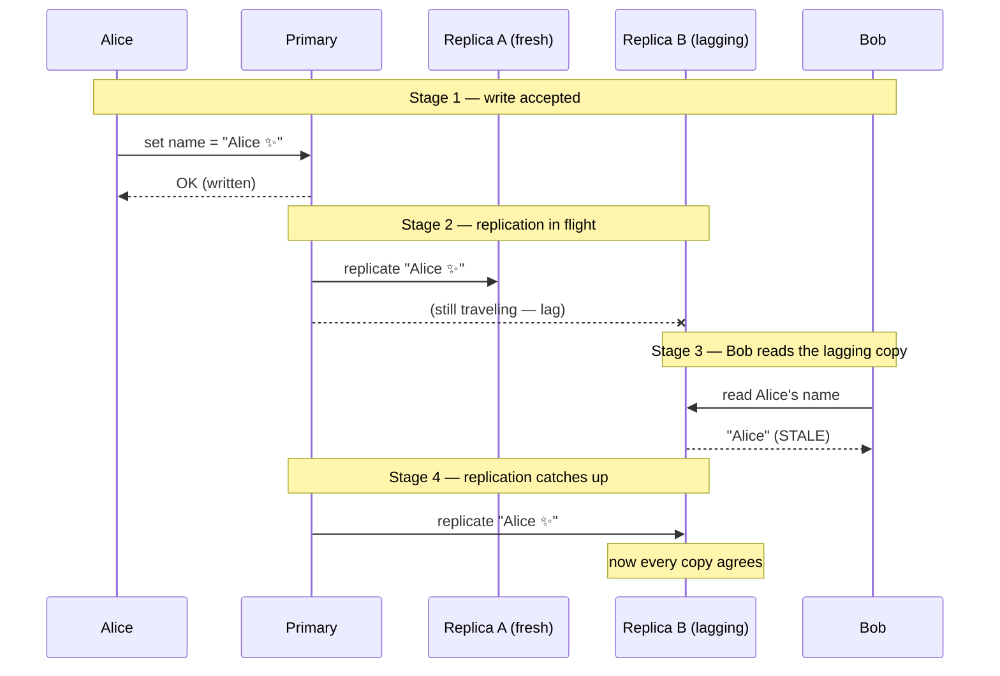
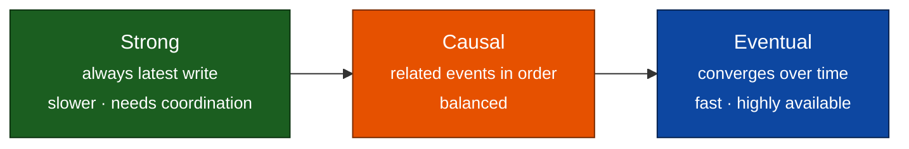

# Consistency Models — Junior

<!-- level-focus -->
At junior level, focus on this question:

> How can I apply **Consistency Models** in one small example and prove the result?

Use the smallest realistic scenario that exposes the decision and its failure behavior.
When you copy data across many machines, a hard question appears: **after someone writes, what is a reader allowed to see?** A *consistency model* is the contract a distributed data store makes to answer exactly that. This file builds the intuition from the ground up — what "consistency" means in this context, why replication forces a trade-off, and how the choices form a spectrum from *strong* to *eventual*.

## 1. Consistency Is Not the "C" in ACID

The word *consistency* is overloaded, and the two meanings are easy to confuse.

- **ACID consistency** (from database transactions) means: a transaction moves the database from one *valid* state to another, respecting rules you declared — foreign keys, unique constraints, check constraints. It is about **not breaking your own invariants**.
- **Distributed consistency** (this topic) means: given that your data is **copied onto several replicas**, what does a read observe relative to recent writes? It is about **what replicas let you see**.

These are unrelated axes. A system can enforce every ACID rule and still hand a reader an out-of-date copy of the data. When this topic says "consistency," it always means the second thing: *the guarantee about what a read can observe after a write.*

---

## 2. Why Replication Forces a Trade-off

If your data lived on exactly one machine, there would be no consistency spectrum: every read hits the one copy and sees the latest write, full stop. The trouble begins the moment you **replicate** — keep copies of the data on multiple nodes.

Why replicate at all? For very good reasons:

- **Availability** — if one node dies, another copy can still serve requests.
- **Latency** — put a copy near each region so users read from something close.
- **Read scale** — spread heavy read traffic across many copies.

But replication comes with an unavoidable physical fact: **a write cannot land on all copies at the same instant.** A write reaches the first replica, then travels over the network to the others. During that travel time — the *replication lag* — the copies **disagree**. One replica has the new value; another still holds the old one.

So the designer must choose:

- **Make readers wait** until all (or a quorum of) copies agree — safer, but slower and more fragile if a copy is unreachable.
- **Let readers read any copy immediately** — fast and available, but a reader might see an old value.

That choice *is* the consistency model. There is no free option; replication forces the trade-off.

---

## 3. A Concrete Example: Two Users and One Profile

Imagine a social app. A user's profile (including their display name) is replicated across two data centers: **Replica A** (US) and **Replica B** (Europe). Writes first go to a **primary** copy, which then forwards the change to the others.

**Alice** updates her display name from `"Alice"` to `"Alice ✨"`. A moment later, **Bob** loads Alice's profile.

- If Bob's read is routed to a replica that has **already received** the update, he sees `"Alice ✨"`.
- If Bob's read is routed to a replica that is **still lagging**, he sees the old `"Alice"`.

Same data, same instant, two different answers — purely because of *which copy* Bob happened to read and *whether the update had arrived there yet.* This is the entire problem in miniature.

The diagram below stages what happens over time:

The key moment is **Stage 3**: the write already succeeded, yet a valid read returns the *old* value because it touched a copy that had not caught up.

---

## 4. The Stale Read Problem

A **stale read** is a read that returns a value older than the most recent successful write. Stage 3 above is exactly that.

Stale reads are not a bug in the code — they are a *direct consequence* of reading from replicas that may lag. The question a design must answer is not "can we eliminate staleness forever" (on a single copy, yes; across replicas, only at a cost) but **"how much staleness is acceptable here, and what do we pay to reduce it?"**

Whether a stale read matters depends entirely on the data:

| Scenario | Is a stale read acceptable? | Why |
|---|---|---|
| A "like" count on a viral post | Usually yes | Being off by a few for a second is invisible to users. |
| A friend's updated display name | Usually yes | Seeing the old name briefly is harmless. |
| Your own bank account balance right after a transfer | No | Users expect to see *their own* action reflected immediately. |
| An inventory count at checkout | Often no | Overselling the last item causes real business harm. |

The lesson: staleness is a **product decision as much as a technical one.** Different data in the *same* system can tolerate different amounts of it.

---

## 5. The Spectrum: Strong → Causal → Eventual

Consistency is not a switch with two positions. It is a **spectrum** of guarantees. As a junior, hold onto three anchor points, from strictest to loosest:

- **Strong consistency** — every read reflects the latest completed write, no matter which replica serves it. It *feels like there is a single copy of the data*. Behind the scenes the system coordinates replicas before answering, so reads may be slower and may block if replicas are unreachable. **No stale reads.**

- **Causal consistency** — a sensible middle ground. It guarantees that operations which are *causally related* are seen in the right order by everyone. If Alice posts a message and Bob replies, no one will ever see Bob's reply *before* Alice's original message. Unrelated operations may still be seen in different orders on different replicas. It rules out the *confusing* anomalies without paying the full price of strong consistency.

- **Eventual consistency** — the loosest common guarantee. If writes stop, then *eventually* all replicas converge to the same value. In the meantime, reads may be stale and different readers may briefly see different values. In exchange you get the best latency and the best availability — any replica can answer immediately without coordinating.

Read the arrows as a dial: slide left for **stronger guarantees at the cost of latency and availability**; slide right for **faster, more available reads at the cost of freshness.** There are more precise models between and beyond these three (you will meet them in later tiers), but these three anchors are enough to reason about most systems.

---

## 6. Strong vs Eventual at a Glance

The two ends of the spectrum make the trade-off clearest side by side:

| Property | Strong consistency | Eventual consistency |
|---|---|---|
| **What a read returns** | The latest completed write, always | Possibly an older value, for a while |
| **Stale reads possible?** | No | Yes (temporarily) |
| **Read latency** | Higher — replicas coordinate first | Lower — any replica answers at once |
| **Availability during a partition** | Reduced — may block if replicas are unreachable | High — a reachable replica still answers |
| **Mental model** | "One single copy of the data" | "Many copies that catch up over time" |
| **Good fit for** | Balances, inventory, unique-username checks | Like counts, feeds, view counters, presence |

Neither column is "better." They are two answers to the same forced question, each correct for different data.

---

## 7. Key Takeaways

- **Consistency here ≠ the C in ACID.** This topic is about *what a read observes across replicas*, not about database invariants.
- **Replication forces the trade-off.** Copies cannot update at the same instant, so during replication lag they disagree — and someone has to decide what readers see meanwhile.
- **A stale read** is a read that returns a value older than the latest successful write. It is a natural consequence of reading from lagging replicas, not a coding mistake.
- **Consistency is a spectrum** with strong, causal, and eventual as useful anchors — trade freshness and availability against each other by sliding along it.
- **The right point depends on the data.** Money and inventory lean strong; counters and feeds are happy with eventual — often within the *same* system.

For deeper, adversarial testing of these guarantees in real databases, [jepsen.io](https://jepsen.io) is the canonical reference and is worth bookmarking for later tiers.

*Next step:* [Consistency Models — Middle](middle.md)

---

## Apply it

1. Choose one small, known input for **Consistency Models**.
2. Predict the output or observable behavior.
3. Run the smallest example or probe that exercises the concept.
4. Change one input to trigger a failure or boundary case.
5. Explain the evidence using the guide's vocabulary.

## Verify your work

- Record the exact input, command or code path, and output.
- Repeat the probe and confirm the result is consistent.
- Show one expected success and one expected failure.
- Resolve any difference between the prediction and the evidence.

## Review questions

- What problem does Consistency Models solve in the example?
- Which input changes the observed result, and why?
- What is the smallest useful success check?
- Which beginner mistake would your evidence catch?
