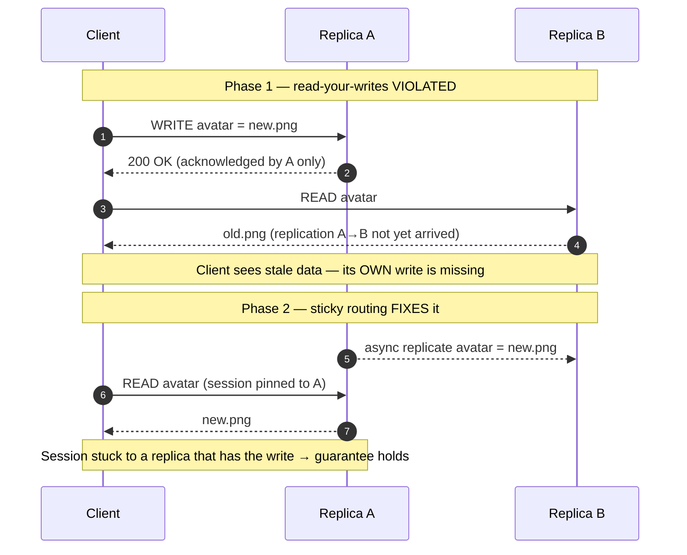

# Consistency Models — Middle

<!-- level-focus -->
At middle level, focus on this question:

> Where does **Consistency Models** belong in a maintainable component, and which trade-off selects the design?

Use the smallest realistic scenario that exposes the decision and its failure behavior.
A distributed store keeps multiple copies of data across replicas. A **consistency model** is the contract it offers about *what a read can return* given the writes that happened before it. Stronger models make the store easier to reason about but cost more latency and availability; weaker models are cheaper and more available but push correctness work onto the application.

This page enumerates the common models mechanically, gives each a one-line definition and a concrete allow/forbid scenario, ranks them by strength, and connects them to the mechanisms (quorums, sticky routing, tunable knobs) that implement them.

## 1. The mental model: writes, reads, replicas

Every guarantee below is a statement about the relationship between three things:

- **Real time** — when operations actually occurred on a wall clock.
- **Program order** — the order a single client issued its own operations.
- **Replicas** — the N copies of the data; a write applied to one replica takes time to propagate to the others.

The models differ in *which* orderings they promise to respect. Strong models respect real time across all clients. Weaker models respect only per-client order, or only cause-and-effect, or nothing at all beyond "eventually the same."

Keep one running example in mind: a user updates their profile photo (a **write**) and then loads their profile page (a **read**). Whether the read is guaranteed to show the new photo depends entirely on the model.

---

## 2. Linearizability (strong consistency)

**Definition:** every operation appears to take effect instantaneously at a single point between its start and end, and that order is consistent with real time. The system behaves as if there is one copy of the data.

**Allows / forbids:** if client A completes a write of `x = 1`, then any read that *starts after* A's write completes — from *any* client, on *any* replica — must return `1` or a newer value. It is forbidden for client B to read the old `x = 0` after A's write has returned success.

**Scenario:** A posts "I'm engaged!" and the post returns HTTP 200. B refreshes and *must* see the post. There is no window where the post exists for A but not for B.

**Cost:** every write must be acknowledged by enough replicas (or serialized through a leader/consensus group like Raft) before returning. This adds latency and, under a network partition, forces a choice: block or become unavailable (CAP's CP side).

---

## 3. Sequential consistency

**Definition:** all clients observe operations in *some* single total order, and that order respects each client's own program order — but it need **not** match real time.

**Allows / forbids:** the total order must preserve the order in which each individual client issued its operations. It is allowed for the agreed-upon order to lag real time: if A writes at 10:00:00 and B reads at 10:00:01, B may legally still see the pre-A state, *as long as* everyone agrees on the same overall sequence eventually.

**Scenario:** two users post to a shared feed. Sequential consistency guarantees every viewer sees the two posts in the *same* relative order, and each user's own posts appear in the order they sent them. It does **not** guarantee that order matches the clock — a viewer might see them "swapped" relative to wall-clock time, but never contradictorily between viewers.

**Cost:** cheaper than linearizability (no real-time coordination), but still requires global agreement on a single order.

---

## 4. Causal consistency

**Definition:** operations that are *causally related* (one could have influenced the other) are seen by all clients in the same order. Concurrent (unrelated) operations may be seen in different orders by different clients.

**Allows / forbids:** if A comments "yes!" *in reply to* B's question, no client may see the reply without first seeing the question. But two *independent* comments with no cause-effect link may appear in either order to different viewers.

**Scenario:** the classic bug it prevents — B posts "I lost my dog." A replies "So glad you found him!" Under causal consistency, A's reply (which causally follows a *later* update B made) can never appear before the update it responds to, so no viewer sees a nonsensical thread. Causality is tracked with version vectors / dependency metadata.

**Cost:** must track and ship causal dependencies with each write. This is the strongest model still achievable while staying **available under partition** (AP), which is why it is prized.

---

## 5. Session guarantees

These are *client-centric* guarantees, scoped to a single session (usually one user's connection). They are weaker than the global models above but often exactly what an application needs. Each is independent; a system may offer any subset.

- **Read-your-writes:** after you write a value, your own subsequent reads see that value (or newer). *Forbids:* you update your avatar, refresh, and see the old one.
- **Monotonic reads:** if you read a value, later reads never return an *older* value. *Forbids:* you see 42 replies, refresh, and see 40 — time appears to go backward.
- **Monotonic writes:** your writes are applied in the order you issued them. *Forbids:* you save a draft then publish, but the store applies publish-then-draft, losing your final edit.
- **Writes-follow-reads (a.k.a. read-your-reads causality):** if you read a value and then write based on it, your write is ordered *after* the write you read. *Forbids:* you reply to a comment, but your reply is ordered before the comment it answers — restoring causal sanity within a session.

**Why they matter:** a globally eventually-consistent store feels broken to a *single user* mostly because of missing session guarantees. Adding read-your-writes and monotonic reads makes the store feel consistent *to each user* without paying for global linearizability. The usual implementation is **sticky routing** — pin a session to a replica (or a set that has caught up), so the user's own history is coherent even if global state lags.

---

## 6. Bounded staleness

**Definition:** reads may return stale data, but the staleness is bounded — by a time window (e.g. "at most 5 seconds behind") or by a version lag (e.g. "at most K writes behind").

**Allows / forbids:** allows a read to miss a write from 2 seconds ago (within the bound); forbids returning data older than the guaranteed bound. It is the tunable middle ground between "always fresh" and "eventually, someday."

**Scenario:** a stock ticker guarantees prices are at most 1 second stale. Traders accept a 1-second lag but the system contractually refuses to show minute-old prices. Azure Cosmos DB exposes exactly this as a first-class level.

**Cost:** cheaper than strong consistency; requires replicas to track and enforce their lag, rejecting or redirecting reads that would exceed the bound.

---

## 7. Eventual consistency

**Definition:** if writes stop, all replicas *eventually* converge to the same value. No promise about *when*, and no ordering promise before convergence.

**Allows / forbids:** allows any replica to temporarily return any past value, allows different replicas to disagree, allows reads to go backward in time. Forbids only permanent divergence — given enough quiet time, everyone agrees.

**Scenario:** a "like" counter behind a globally distributed cache. Two users may briefly see 1,024 vs 1,027 likes; both numbers settle to the true total within seconds. Perfectly acceptable for a like count, dangerous for a bank balance.

**Cost:** cheapest and most available (AP). All the correctness burden — conflict resolution (last-write-wins, CRDTs), handling stale reads — moves to the application.

---

## 8. Strength ordering

From strongest (most guarantees, highest cost) to weakest:

```
Linearizability
      │   (drops real-time; keeps single global order)
Sequential consistency
      │   (drops global order for concurrent ops; keeps causal order)
Causal consistency
      │   (drops cross-session order; keeps per-session order)
Session guarantees  (read-your-writes, monotonic reads/writes, writes-follow-reads)
      │   (drops ordering; keeps a staleness bound)
Bounded staleness
      │   (drops the bound)
Eventual consistency
```

Two useful facts:

- **Linearizability implies sequential consistency implies causal consistency.** Each level is a strict superset of guarantees.
- **The CAP dividing line sits between causal and linearizable.** Causal consistency and everything weaker can stay available under a network partition (AP). Linearizability cannot — under partition it must sacrifice availability (CP).

---

## 9. Read-your-writes: violated, then fixed

Below, a single client writes to replica A, then reads from replica B before replication has caught up — so it misses its own write (violation). Sticky routing then pins subsequent reads to a replica guaranteed to hold the write, satisfying read-your-writes.



The fix does not require global strong consistency — only that *this session's* reads are routed to a replica that has already applied *this session's* writes. That is the cheap, common way to give users a coherent experience over an eventually-consistent store.

---

## 10. Quorums: R + W > N

Quorums are the working mechanism most Dynamo-style stores use to *dial* consistency without a single leader.

- **N** = number of replicas each key is stored on.
- **W** = number of replicas that must acknowledge a *write* before it is considered successful.
- **R** = number of replicas that must respond to a *read* before a value is returned.

**The overlap rule:** if `R + W > N`, then the set of replicas a read contacts *must* intersect the set that acknowledged the latest write — so a read is guaranteed to see at least one copy of the most recent write. Pairing this with a versioning scheme (timestamps or version vectors) lets the reader pick the newest value.

Worked example with `N = 3`:

- `W = 3, R = 1` — write to all, read from one. Reads are fast and always fresh, but a single replica being down blocks all writes.
- `W = 1, R = 3` — write to one, read from all. Writes are fast and available; reads are slower and must reconcile.
- `W = 2, R = 2` — the balanced default. `2 + 2 = 4 > 3`, so overlap holds. Tolerates one replica down for *both* reads and writes.
- `W = 1, R = 1` — `1 + 1 = 2 ≤ 3`, overlap **fails**. Fast and highly available, but a read may miss recent writes → effectively eventual consistency.

Quorum overlap gives *strong-ish* single-key consistency; it does **not** by itself provide linearizability across operations (concurrent writes can still produce conflicting versions that need resolution).

---

## 11. Tunable consistency

**Tunable consistency** means the consistency level is a *per-request knob*, not a fixed property of the whole database. Cassandra and Dynamo-style stores expose this directly by letting each query choose R and W.

In Cassandra, a query sets a **consistency level** such as:

- `ONE` — one replica responds (W or R = 1). Fastest, weakest.
- `QUORUM` — a majority responds (⌊N/2⌋ + 1). Choosing `QUORUM` for both reads and writes satisfies `R + W > N` and gives strong single-key reads.
- `ALL` — every replica responds. Strongest, least available (one node down blocks the operation).
- `LOCAL_QUORUM` — a majority *within the local datacenter*, avoiding cross-region latency in multi-DC deployments.

The power of this design: **you tune per operation, not per system.** The same table can serve a critical "read account balance" query at `QUORUM` (correctness first) and a "log a page view" write at `ONE` (throughput and availability first). Consistency stops being a global architectural decision and becomes a per-call trade-off you make with full knowledge of that call's requirements.

---

## 12. Comparison table

| Model | Guarantee | What it forbids | Typical cost |
|---|---|---|---|
| **Linearizability** | Single global order, consistent with real time | A read after a completed write returning an older value, from any client | Leader/consensus coordination; CP under partition |
| **Sequential** | One total order respecting each client's program order | Clients disagreeing on the relative order of operations | Global agreement on order (no real-time sync) |
| **Causal** | Cause-before-effect order for all clients | Seeing a reply before the message it answers | Track & ship causal metadata (version vectors); stays AP |
| **Session (RYW, monotonic, WFR)** | Per-session coherence of a user's own history | A user missing their own write, or reads going backward *for that user* | Sticky routing; per-session state; no global guarantee |
| **Bounded staleness** | Staleness capped by time or version lag | Returning data older than the promised bound | Track replica lag; redirect/reject over-stale reads |
| **Eventual** | Replicas converge if writes stop | Permanent divergence | Cheapest, most available (AP); conflict resolution in app |

**How to choose:** start from what the *feature* needs, not from what the database offers. Money and inventory decrements want linearizability (or serializable transactions). A user editing their own settings usually just needs read-your-writes + monotonic reads. Counters, feeds, and analytics tolerate eventual or bounded-staleness — and cost far less at scale.

---

*Next step:* [Consistency Models — Senior](senior.md)

---

## Apply it

1. Find a real component where **Consistency Models** affects an interface or dependency.
2. Write two plausible choices and the constraint that favors each one.
3. Make the smallest reversible change at that boundary.
4. Exercise the component alone, then exercise the integrated flow.
5. Keep the decision note with the evidence that selected the option.

## Verify your work

- A focused check proves the local behavior.
- An integrated check proves callers and dependencies still agree.
- Logs, traces, compiler output, or benchmarks expose the boundary.
- Reverting the change restores the previous behavior without unrelated edits.

## Review questions

- Which boundary is most affected by Consistency Models?
- What constraint would make you choose the alternative design?
- How would you isolate a local defect from an integration defect?
- What evidence shows that the change remains maintainable?
