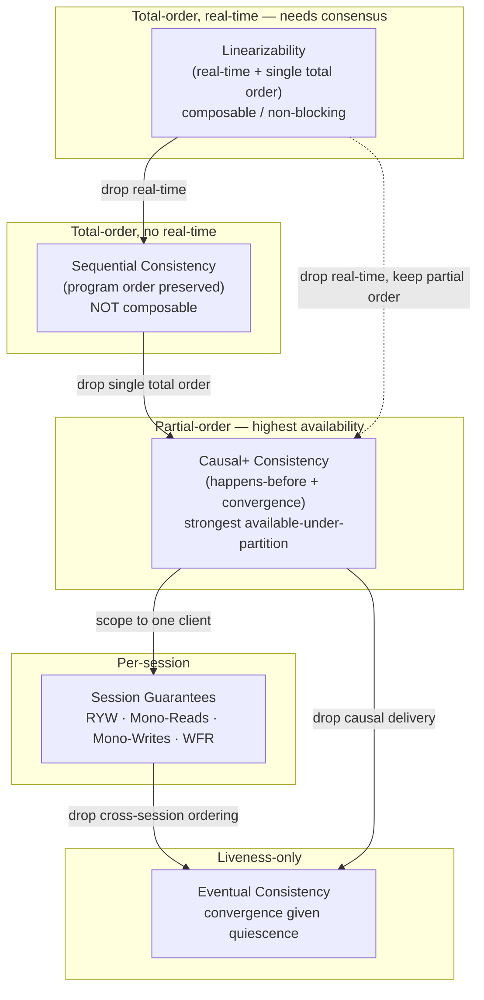
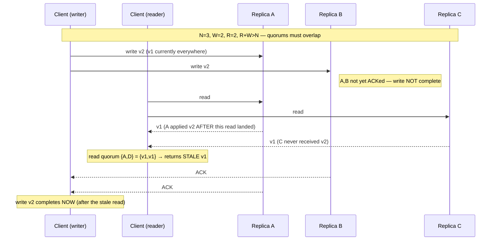

# Consistency Models — Professional

<!-- level-focus -->
At professional level, focus on this question:

> How should teams adopt and operate **Consistency Models** with measurable outcomes and limited coordination?

Use the smallest realistic scenario that exposes the decision and its failure behavior.
A consistency model is a **contract between a storage system and its clients**: given a set of concurrent operations, it defines which return values are legal. The professional treatment is formal — models are partial or total orders over operations, and the "strength" of a model is a *subset relation* over the histories it admits. A stronger model admits fewer histories (fewer surprises), a weaker model admits more (more availability and lower latency). Everything below is an application of that single idea.

## 1. The Formal Object: Histories and Legal Orderings

Fix a set of processes each issuing operations against shared objects. An **operation** has an *invocation* event and a *response* event separated in wall-clock time; the interval between them is the operation's duration. A **history** `H` is the sequence of invocation and response events. Two operations *overlap* if neither's response precedes the other's invocation.

A consistency model is defined by the set of *legal* orderings you are allowed to construct over the operations in `H`:

- Every model demands that the ordering respects each object's **sequential specification** — a register read must return the value written by the most recent write in the chosen order, a queue must dequeue in FIFO order, etc.
- Models differ in **which additional orderings they force the chosen order to respect**: real-time order, per-process program order, or causal order.

This is the unifying frame. "Linearizability" and "sequential consistency" are not different data structures; they are different *constraints on the witness order* you must be able to exhibit for a history to be legal.

---

## 2. Linearizability (Herlihy–Wing)

**Linearizability** (Herlihy & Wing, "Linearizability: A Correctness Condition for Concurrent Objects") requires that there exists a total order `S` over all completed operations such that:

1. **Sequential legality** — `S` is a legal history of each object's sequential specification.
2. **Real-time order** — if operation `a` *responds* before operation `b` is *invoked* in `H` (they do not overlap), then `a` precedes `b` in `S`. Overlapping operations may be ordered either way.

Intuitively, every operation appears to take effect *atomically at a single instant* — its **linearization point** — somewhere between its invocation and its response. Because that instant lies within the operation's real-time interval, a read that starts after a write completes is guaranteed to observe that write or something newer. This is the "reading the latest value" guarantee, made precise.

Two consequences matter at the professional level:

- **Composability / locality.** A history is linearizable **iff** each object's sub-history is linearizable independently. This is why linearizability is the model of choice for building larger systems from smaller linearizable components — you never have to reason about cross-object interference to preserve the guarantee. Sequential consistency does *not* have this property (see §3).
- **Non-blocking.** Linearizability does not force an operation to wait for another pending operation to complete; a pending invocation always has a valid completion. It is a *safety* property (nothing bad happens), not a liveness property.

Linearizability is single-object. It says nothing about atomicity across multiple objects — that is the province of serializability (§8).

---

## 3. Sequential Consistency (Lamport)

**Sequential consistency** (Lamport, "How to Make a Multiprocessor Computer That Correctly Executes Multiprocess Programs") requires a total order `S` such that:

1. **Sequential legality** — same as above.
2. **Program order** — the operations of each individual process appear in `S` in the order that process issued them.

Crucially, `S` **need not respect real-time order across processes.** If process `P1` completes a write and process `P2` later (in wall-clock time) issues a read, sequential consistency permits `S` to place `P2`'s read *before* `P1`'s write, as long as each process's own program order is preserved. A read can therefore return a "stale" value even though a newer write has globally completed — and the history is still sequentially consistent.

Two headline differences from linearizability:

- **No real-time anchor.** SC is a strictly weaker model: every linearizable history is sequentially consistent, but not vice versa.
- **Not composable.** The composition of two sequentially consistent objects can fail to be sequentially consistent. You cannot build SC systems by gluing SC parts and reasoning locally. This loss of locality is the practical reason SC is rarely the target contract for a distributed store — you get most of the reasoning cost of a total order without the composability payoff.

---

## 4. Causal Consistency and Happens-Before

Causal consistency drops the requirement of a *single* total order. It only requires that all processes observe **causally related** operations in an order consistent with their causal dependencies; **concurrent** (causally unrelated) operations may be observed in different orders by different processes.

The causal relation is Lamport's **happens-before** (`→`), the smallest partial order such that:

- if `a` and `b` are in the same process and `a` precedes `b`, then `a → b`;
- if `a` is a write and `b` is a read that observes `a`, then `a → b` (read-from / message delivery);
- transitivity: `a → b` and `b → c` imply `a → c`.

Operations `a` and `b` with neither `a → b` nor `b → a` are **concurrent** (`a ∥ b`).

**Causal consistency requirement.** If `a → b`, then every process that observes `b` must have already observed `a`. Reads never see an effect before its cause. Concurrent writes may be applied in any order at any replica, which is exactly what makes causal consistency achievable while remaining *available* under partition — it is the **strongest model that stays available** in the CAP sense (this is the Mahajan–Alvisi–Dahlin result, "consistency, availability, and convergence" — causal consistency, made *convergent* and *sticky-available*, is the ceiling).

**Enforcement mechanism: version vectors.** Each replica maintains a vector clock `V` mapping each writer/replica to a counter. A write tags its value with the vector of dependencies it has seen. A replica may **apply** an incoming write only when all of its causal dependencies are already applied locally — otherwise it buffers the write. Comparing vectors detects the three cases: `V₁ < V₂` (causally before), `V₁ > V₂` (after), or incomparable (`∥`, i.e. a conflict/concurrent write that convergence must resolve). Scalar Lamport timestamps give a *total* order consistent with happens-before but lose the ability to *detect* concurrency — they over-order, which is why version vectors are used when concurrency detection matters.

---

## 5. Convergence and Eventual Consistency

**Eventual consistency** is a **liveness** property, not a safety property: *if no new writes are made to an object, then eventually all replicas will return the same (last) value.* It says nothing about what happens *before* that quiescent point — reads may return arbitrarily stale or out-of-order values in the interim. On its own, eventual consistency is remarkably weak; almost any history is admissible short of the quiescent tail.

Two refinements make it usable:

- **Convergence (strong eventual consistency / SEC).** Any two replicas that have received the *same set* of updates are in the *same state*, regardless of delivery order. This removes the need for consensus on ordering. **CRDTs** achieve SEC by requiring update operations to commute (op-based) or states to form a join-semilattice with a monotone least-upper-bound merge (state-based). Convergence + causal delivery gives **causal+ consistency** — causal consistency with a deterministic conflict resolution rule so that concurrent writes converge rather than diverge indefinitely.
- **Conflict resolution.** When version vectors report `V₁ ∥ V₂`, the system must pick a deterministic outcome: last-writer-wins (via a timestamp/tiebreak — lossy), merge/multi-value (Dynamo-style siblings surfaced to the application), or CRDT merge. This is the "convergence, given no new writes, liveness not safety" clause made operational.

---

## 6. Session Guarantees

Between the extremes sits a family of **per-client (session) guarantees**, formalized in the Bayou work (Terry et al., "Session Guarantees for Weakly Consistent Replicated Data"). Each is defined relative to a single client's session, not a global order:

- **Read Your Writes (RYW / monotonic writes' dual).** A read in a session observes all writes previously issued *in that session*.
- **Monotonic Reads.** Successive reads in a session never go backwards in time — once a value `v` is seen, no later read returns a value older than `v`.
- **Monotonic Writes.** Writes from a session are applied at every replica in the order they were issued.
- **Writes Follow Reads (WFR).** If a session reads `v` then writes `w`, then `w` is ordered after the write that produced `v` at all replicas (preserves causal chains across the read-modify-write boundary).

These are enforced with the same clock machinery — a client carries a **read-set/write-set vector** (or a session token), and routes to a replica whose version vector dominates it, or waits until it does. The full conjunction of the four session guarantees, layered on convergence, is essentially **causal consistency scoped and pinned to a session**. Practically, session guarantees are the cheapest way to deliver an intuitive single-user experience on top of an eventually consistent store.

---

## 7. The Strength Lattice

The models form a partial order by history-inclusion — an arrow `A → B` reads "every history legal under `A` is legal under `B`", i.e. `A` is *stronger*.

Two subtleties the diagram encodes: (1) SC and causal consistency are **incomparable to each other only in composability**, but by history-inclusion linearizability ⊃ SC and linearizability ⊃ causal, while SC ⊃ causal is the usual textbook nesting for single objects. (2) The dashed edge (linearizability → causal directly) exists because you can weaken real-time all the way to partial order in one step.

---

## 8. Linearizability vs Serializability (the Two Axes — Adya)

A frequent professional confusion is conflating these. Following Adya's dissertation ("Weak Consistency: A Generalized Theory..."), they live on **two orthogonal axes**:

- **Linearizability** is about **single-object, real-time recency**. Its unit is one register/object; it constrains *ordering in real time*. No transactions.
- **Serializability** is about **multi-object atomicity**. Its unit is a transaction over arbitrarily many objects; a schedule is serializable if it is equivalent to *some* serial execution of the transactions. It says nothing about real time — that serial order may reorder transactions relative to wall clock.

Their conjunction is **strict serializability** (also "external consistency", the Spanner target): transactions are serializable *and* the equivalent serial order respects real-time order between non-overlapping transactions. Put crisply:

| Property | Unit | Real-time recency? | Multi-object atomicity? |
|---|---|---|---|
| Linearizability | single object | yes | no (no transactions) |
| Serializability | transaction | no | yes |
| Strict serializability | transaction | yes | yes |

This is why a store can be "serializable but not linearizable" (transactions atomic, but a read transaction may see a snapshot older than a just-committed write) and "linearizable but not serializable" (each single object is real-time-recent, but no cross-object transaction atomicity exists). Naming the axis you actually need is a hallmark of a rigorous design.

---

## 9. Mechanisms: Quorums, Clocks, and Repair

### Quorum intersection

With `N` replicas, a write waits for `W` acknowledgements and a read gathers `R` responses. The classic Dynamo-style rule `R + W > N` guarantees that **every read quorum intersects every write quorum** in at least one replica, so a read *set* always contains at least one replica that saw the latest completed write.

The professional caveat: **quorum overlap is necessary but not sufficient for linearizability.** The read set contains a replica with the latest value, but:

- The read must **reconcile** — pick the newest version by version vector/timestamp among the responses, not just return the first. Without this, it can return an older replica's value even though a newer one is in the set.
- **In-flight / partial writes** break single-order recency: a write that reached some but not `W` replicas can be seen by one read and not the next, violating monotonicity. Concurrent read/write overlap can yield a read that returns the *old* value followed by a later read that returns the *new* value **and then old again** unless read-repair or a "read must write back" (blocking read-repair, à la ABD) step is added.

The following interleaving shows a strict-quorum read (`R + W > N`, `N=3, W=2, R=2`) that still returns a **stale** value under a specific timing:

The read overlapped an incomplete write, its quorum `{A, D}` happened to miss the one replica (`B`) already holding `v2`, and returned `v1`. This is *legal* under quorum durability but *not* linearizable — the read is not serialized after a completed write because the write had not completed. Achieving linearizability on quorums (ABD / "read-impose-write-all") requires the read to write the newest value back to a quorum before returning, closing the window.

### Clocks

- **Lamport clocks** give a scalar total order consistent with happens-before; cannot detect concurrency.
- **Version vectors** detect concurrency (§4) at the cost of `O(replicas)` metadata.
- **Hybrid Logical Clocks (HLC)** combine physical time with a logical counter: they stay close to wall-clock (bounded by clock skew) yet guarantee that `a → b ⇒ HLC(a) < HLC(b)`. HLCs give causally-consistent, human-meaningful timestamps without the unbounded drift of pure logical clocks, and underpin snapshot reads in systems like CockroachDB.

### Anti-entropy and read-repair

Convergence is driven by background reconciliation: **read-repair** (on a read, push the newest version to any replica in the read set that is stale) and **anti-entropy** (periodic Merkle-tree exchange to detect and heal divergent key ranges). These are the liveness engine behind eventual consistency; without them, replicas that miss a write can stay stale indefinitely.

---

## 10. Bounded Staleness

Between strong and eventual sits **bounded staleness**, which quantifies *how* stale a read may be. Two formalizations:

- **t-visibility (time-bounded).** A read is guaranteed to observe all writes that completed more than `t` time units ago. Staleness is bounded by a wall-clock window `t`.
- **k-staleness (version-bounded).** A read may lag the latest write by at most `k` versions. Staleness is bounded by a *count* of missing updates.

The **PBS** (Probabilistically Bounded Staleness) line of work (Bailis et al.) makes this quantitative for quorum systems: given replica latency distributions and `(N, R, W)`, it computes the *probability* that a read returns a value within `t` of the latest write — the practically useful observation that partial quorums are "consistent enough" (e.g. 99.9% of reads fresh within a few ms) even when not guaranteed. Bounded staleness is the tunable knob (e.g. Azure Cosmos DB exposes exactly `t` and `k` as first-class consistency levels) that lets an operator trade a precise, *measurable* recency SLA for latency and availability.

---

## 11. CAP / PACELC Placement

- **CAP.** Under a network partition (P), a system must choose **C** (linearizability, the C in CAP is specifically linearizability) or **A** (availability). Linearizability and strict serializability are **CP**. Causal+ consistency, session guarantees, and eventual consistency are **AP** — causal+ being the *strongest* model that remains available under partition.
- **PACELC.** The richer statement: `if Partition then (A or C) else (Latency or Consistency)`. Even with no partition, stronger consistency costs latency because it requires coordination (extra round-trips, quorum waits, consensus). Thus:
  - Linearizable stores are **PC/EC** (choose consistency in both regimes; pay latency and lose availability under partition).
  - Dynamo-style and causal stores are **PA/EL** (choose availability under partition, low latency otherwise).
  - Bounded-staleness/session systems tune the EL↔EC dial explicitly.

The professional point: consistency strength (§7) and the PACELC quadrant are the *same choice* viewed from the correctness axis versus the operational axis. Picking a model on the lattice *is* picking a CAP/PACELC posture.

---

## 12. Comparison Table

| Model | Formal property | Real-time order? | Composable (local)? | CAP side | Example system |
|---|---|---|---|---|---|
| Linearizability | Single total order `S`; legal per object spec; respects real-time between non-overlapping ops | Yes | **Yes** | CP (PC/EC) | etcd, ZooKeeper (writes), single-key Spanner reads |
| Strict serializability | Serializable schedule whose serial order also respects real-time (transactions) | Yes | Yes (transactions) | CP (PC/EC) | Google Spanner, FoundationDB |
| Sequential consistency | Total order preserving per-process program order; no real-time constraint | No | **No** | CP-ish | classic shared-memory SC multiprocessors |
| Serializability (only) | Schedule equivalent to *some* serial order of transactions | No | Yes (transactions) | CP | serializable-isolation SQL engines |
| Causal+ consistency | Respects happens-before via version vectors; convergent conflict resolution | No | Yes (partial order) | AP (PA/EL) | COPS, Bayou, causal-mode stores |
| Session guarantees | RYW · Monotonic Reads · Monotonic Writes · WFR, scoped to a client session | No | Per-session | AP (PA/EL) | Cosmos DB "Session", MongoDB causal sessions |
| Bounded staleness | `t`-visibility and/or `k`-staleness bound on lag | Bounded window | Approximate | AP-tunable | Azure Cosmos DB "Bounded Staleness" |
| Eventual consistency | Liveness: replicas converge to last value absent new writes | No | Convergent | AP (PA/EL) | Dynamo, Cassandra (weak quorum), Riak |

*Note on Jepsen:* the operational check that a store actually delivers its claimed model is empirical — Jepsen (jepsen.io) constructs histories under partition/clock-skew fault injection and searches for a legal linearization/serialization; the absence of one is a concrete violation. Claimed consistency and *observed* consistency diverge more often than vendors admit, which is why the formal definitions above are also test oracles.

---

---

## Apply it

1. Define the user or business outcome that **Consistency Models** should improve.
2. Assign one owner for code, contracts, operations, and incidents.
3. Split delivery into reversible increments that produce evidence early.
4. Publish responsibilities, escalation paths, and compatibility windows.
5. Stop or expand only when the agreed measures support that decision.

## Verify your work

- Each increment has an owner, rollback path, and observable exit condition.
- Adoption, reliability, delivery time, and coordination cost are measured.
- Incident and migration exercises prove that responsibility is executable.
- The old path is removed only after telemetry proves it is unused.

## Review questions

- Which measurable outcome justifies investing in Consistency Models?
- Which team owns the full lifecycle and incident response?
- What reversible increment produces the earliest useful evidence?
- Which exit condition proves that migration or adoption is complete?
