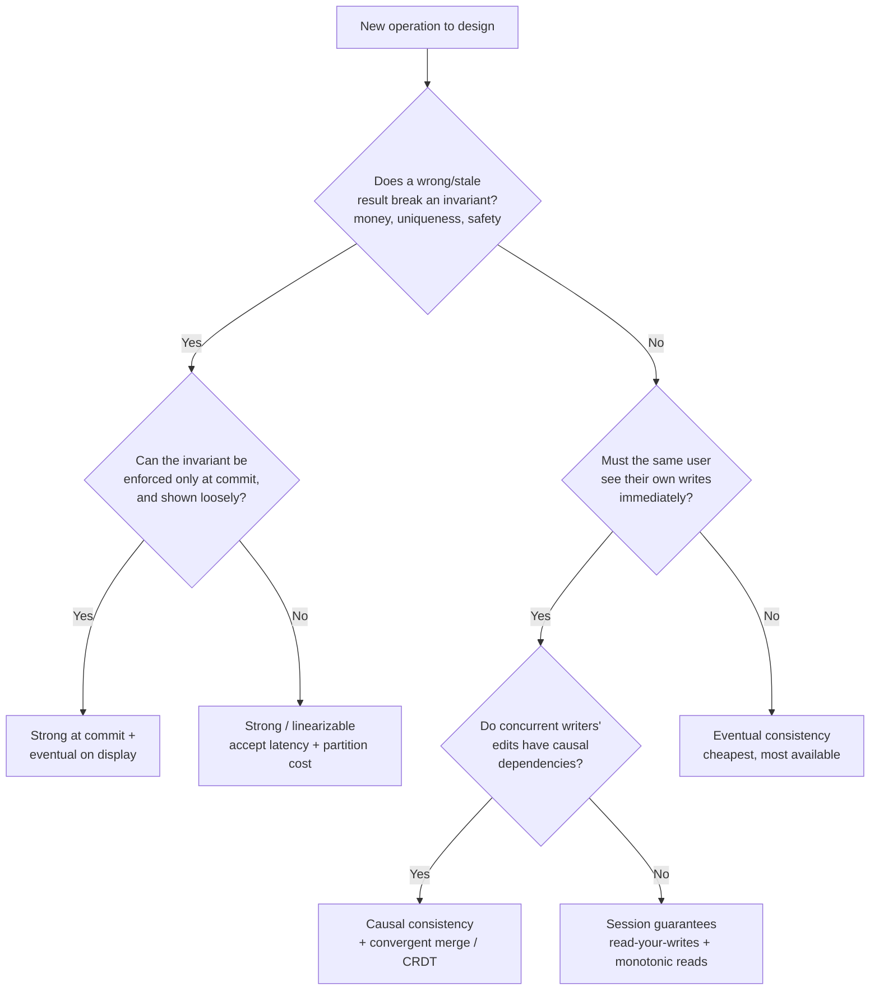

# Consistency Models — Senior

<!-- level-focus -->
At senior level, focus on this question:

> Which system invariant is affected by **Consistency Models** under failure, load, and change?

Use the smallest realistic scenario that exposes the decision and its failure behavior.
At the senior tier, consistency stops being a definitions quiz and becomes a
per-operation design decision. The junior/middle question was *"what does each
model mean?"* The senior question is *"which guarantee does **this** operation
actually need, and what am I paying — in latency, availability, and code
complexity — to get it?"* Almost every real system runs multiple consistency
models at once: strong for the money, weak for the feed, session guarantees for
the UX in between. The skill is matching the model to the operation and
refusing to pay for guarantees nobody needs.

## 1. The Cost Curve: Why Stronger Is Never Free

The single most useful mental model here is **PACELC**: *if there is a
**P**artition, choose between **A**vailability and **C**onsistency; **E**lse
(normal operation), choose between **L**atency and **C**onsistency.* The
consequence is that a strong model taxes you in **both** regimes:

- **Under partition** — a strongly consistent system must refuse reads/writes
  that it cannot safely serve. Stronger consistency ⇒ **less availability** when
  the network splits.
- **In normal operation** — every strong write (or linearizable read) must
  coordinate across replicas — a quorum round-trip, a consensus append, a
  leader hop. Stronger consistency ⇒ **higher tail latency**, always, even when
  nothing is broken.

You do not pay this tax once; you pay it on **every** operation that carries the
strong guarantee. So the design instinct is not "make it consistent" but
"make it *exactly as consistent as this operation requires, and no more.*"

| Model (strong → weak) | Coordination on write | Typical read latency | Availability under partition |
|---|---|---|---|
| Linearizable / strong | Quorum or consensus | Highest | Lowest (may reject) |
| Sequential | Global order, no real-time | High | Low |
| Causal | Track & respect happens-before | Medium | High (stays up) |
| Session (RYW, monotonic) | Per-client tracking only | Low–medium | High |
| Eventual | None (async replicate) | Lowest | Highest |

The table reads as one continuous trade: everything you gain in latency and
availability going *down* the rows, you lose in the strength of the guarantee
you can promise the application.

---

## 2. Choosing a Model per Use Case

The wrong question is "what's the best consistency model?" — there isn't one.
The right question is asked once per operation. Below, the same system might use
four different models across four features.

| Use case | Recommended model | Why |
|---|---|---|
| Bank balance / transfer | Strong (linearizable) | Money is a conserved quantity; a stale read enables double-spend. Correctness dominates latency; you pay the coordination tax gladly. |
| Social feed / timeline | Eventual | A post that appears 2 s late is invisible to the user. Availability and low latency matter far more than global agreement. |
| Shopping cart | Session + convergent merge | The user must see their own adds immediately (read-your-writes). Concurrent edits across devices merge (add-wins), never block. |
| Collaborative doc | Causal (+ CRDT/OT) | Edits have real dependencies (you reply to text that must already exist). Causal order preserves intent while staying available offline. |
| Username / handle registration | Strong (unique constraint) | Uniqueness is a global invariant; two people cannot own `@alice`. Requires a single point of serialization. |
| "Likes" counter | Eventual (convergent counter) | Approximate and monotonic is fine. Nobody audits a like count; contention on a strong counter would be a scaling disaster. |
| Inventory / "last item in stock" | Strong at commit, eventual on display | Show an eventually-consistent count on the product page (cheap, fast); enforce strong consistency only at the *reserve/checkout* step. |

Notice the last row: **the display path and the commit path use different
models for the same data.** That split is one of the most powerful senior moves —
show cheap, commit strict.

---

## 3. A Decision Flow for a Single Operation

Run this per operation, not per system.

The flow deliberately pushes you *down and to the right* — toward the weakest
model that still satisfies the operation — because that direction is where
latency and availability improve. You only climb back up to *strong* when an
invariant genuinely forces it.

---

## 4. Session Guarantees: The Pragmatic Middle Ground

Full linearizability is expensive; full eventual consistency produces baffling
UX ("I posted a comment and it vanished on refresh"). **Session guarantees** are
the middle ground that fixes the *user-visible* anomalies without paying for
global order. The four classic ones:

- **Read-your-writes** — after you write, *your* subsequent reads reflect it.
- **Monotonic reads** — you never see time go backwards (a value you already
  read cannot disappear on a later read).
- **Monotonic writes** — your writes are applied in the order you issued them.
- **Writes-follow-reads** — a write you make after reading X is ordered after X.

The crucial property: these are guarantees **scoped to one client session**, not
the global system. They are cheap because the system only tracks *your* recent
operations, not everyone's.

**How they're implemented in practice:**

- **Sticky sessions** — route a client's requests to the same replica (or the
  leader) for the session, so it naturally sees its own writes. Simple, but
  fragile: replica failover or a load-balancer reshuffle silently breaks the
  guarantee.
- **Version tokens** — the client carries a version/timestamp (e.g. a returned
  write token) and the read path waits until a replica is at least that fresh.
  More robust than stickiness and survives rerouting.

Session guarantees are the right default for interactive apps: they buy the
"it feels consistent to me" UX for a fraction of linearizable cost.

---

## 5. Causal Consistency: The "Sweet Spot" Argument

Causal consistency preserves the **happens-before** relationship: if operation
A causally precedes B (B was issued by someone who had already seen A), then
every replica observes A before B. Operations with **no** causal relationship
may be seen in different orders on different replicas — and that's fine, because
by definition nobody depended on their order.

The senior argument for causal as the "sweet spot":

- It is the **strongest model that remains available under partition.** This is
  a theoretical result, not a vibe — causal consistency sits right at the
  ceiling of what a still-available system can promise. Anything stronger
  (sequential, linearizable) must sacrifice availability during a split.
- It kills the anomalies users actually notice: a reply appearing before the
  message it replies to, a "delete" that un-deletes, a comment referencing a
  photo that isn't there yet. These are all *causal* violations, and causal
  consistency forbids exactly them.
- It costs less than strong: no global coordination, just tracking and
  respecting dependencies (vector clocks / dependency metadata).

The catch — and why it isn't a free lunch — is that it does **not** resolve
*concurrent* conflicting writes. Two users editing the same field with no causal
link between them will still diverge; causal consistency guarantees ordering,
not conflict resolution. You pair it with a convergence strategy (CRDTs,
last-writer-wins, application merge) to actually settle those.

---

## 6. Consistency at the Boundary vs Internally

A frequent senior insight: **the guarantee you expose at the API boundary need
not match the guarantee you use internally.** These are two different contracts:

- **Boundary contract** — what the *client* observes. This is what you must be
  honest about in docs and behavior.
- **Internal reality** — how replication, caching, and storage actually behave
  under the hood.

You can build a **strong-looking boundary on weaker internals**: e.g. route a
user through session guarantees + read-your-writes so *they* perceive
consistency, while the backing store replicates eventually. You can also do the
reverse — expose an explicitly eventual boundary ("changes may take a moment to
appear") so clients don't build in false assumptions.

The failure mode is a **mismatch you never declared**: the internals are
eventual, but the API's shape (synchronous response, no "pending" state) *implies*
strong consistency. Clients then write code that assumes read-after-write, and
it breaks intermittently in production. **Make the boundary guarantee explicit
and enforce it** — don't let it be an accident of the current deployment.

---

## 7. Tunable / Per-Operation Consistency in One System

Modern data stores (Cassandra/Dynamo-style quorums, and many managed
databases) let you choose the consistency level **per request**, not per
cluster. The classic knob is quorum tuning: with `N` replicas, a read touching
`R` and a write touching `W` gives you strong consistency when `R + W > N`
(overlapping quorums guarantee the read sees the latest write), and weaker,
faster behavior when `R + W ≤ N`.

This means one system can serve:

- **`W = N` / strong-read** operations for the checkout and balance paths;
- **`W = 1` / one-replica reads** for the "likes" and feed paths, taking the
  latency win.

The senior discipline is to treat the consistency level as **part of each
endpoint's contract**, chosen deliberately and documented — not left at the
library default. A common bug is inheriting a client's default level (often
weak) on an operation that silently required strong, and only discovering it
when a rare interleaving corrupts data. Per-operation power is also
per-operation responsibility: every endpoint's level should be a decision on
the record, ideally with a test that asserts it.

---

## 8. Caching: Every Cache Is Another Replica

A cache is not a neutral speed-up. **A cache is a replica** — an extra copy of
the data that can lag behind the source of truth. The moment you add one, you
have weakened the system's consistency, whether you meant to or not:

- A CDN, a Redis layer, an application-level memoization, a browser cache — each
  is a replica with its own staleness window (its TTL).
- Read-your-writes breaks the instant a client's read is served from a cache
  populated *before* their write. The write hit the database; the cache still
  holds the old value.
- Multiple cache tiers stack their staleness: a value can be old in the CDN,
  older in the app cache, and current in the DB — three "replicas" disagreeing.

Practical senior responses:

- **Bound the staleness deliberately.** A TTL *is* your consistency SLA for that
  path — pick it on purpose, don't accept a framework default.
- **Invalidate or write-through** on the paths that need read-your-writes; don't
  rely on TTL expiry for correctness-sensitive data.
- **Never cache the strong path.** Balance checks, uniqueness checks, and
  reservation/commit steps must read the source of truth. Cache the *display*,
  commit against the *truth* (§2's inventory pattern).

The mental checklist: *"How many replicas of this data now exist, and what is
the worst-case disagreement between them?"* Every cache you add changes that
answer.

---

## 9. The "It Worked in Test" Trap

The most dangerous consistency bugs are ones where code **accidentally relies on
behavior stronger than the model guarantees.** In a single-node test
environment, an eventually-consistent store behaves *exactly* like a strongly
consistent one — there's only one replica, no replication lag, no partition. So
read-after-write "just works," and the code ships.

In production, with real replicas and real lag, the guarantee the code assumed
was never actually promised. The failure is **intermittent and load-dependent**:
it surfaces only when a read lands on a replica that hasn't caught up yet — often
under exactly the traffic spike where you can least debug it.

Senior defenses:

- **Design against the *guaranteed* model, never the *observed* behavior.** If
  the store promises eventual consistency, assume a read can return stale data
  even if it never has in your tests.
- **Test with induced lag / partitions** (fault injection, delayed replicas) so
  the weak model's anomalies actually appear before production does.
- **Make assumed guarantees explicit in the code** — a comment or an assertion
  documenting "this path requires read-your-writes; served via version token"
  turns a silent assumption into a reviewable decision.

The rule of thumb: *if you didn't explicitly buy the guarantee, don't build on
it — even if it seems to hold.*

---

## 10. Senior Checklist

- Chose the consistency model **per operation**, not per system.
- Picked the **weakest model that still satisfies the operation's invariants** —
  and can name what invariant forced any use of strong.
- Accounted for the PACELC cost of every strong path: extra latency in normal
  operation, reduced availability under partition.
- Used **session guarantees** (read-your-writes, monotonic reads) for
  interactive UX instead of over-paying for linearizability.
- Considered **causal consistency + convergent merge** where operations have
  real dependencies but must stay available.
- Split **display vs commit**: cheap eventual reads for showing, strong reads
  for the money/uniqueness step.
- Made the **boundary guarantee explicit** and independent of internal
  mechanics.
- Treated the **quorum / consistency level as part of each endpoint's contract**,
  documented and tested — not the library default.
- Counted **every cache as a replica** and bounded its staleness on purpose.
- Guarded against the **"it worked in test"** trap by designing to the
  guaranteed model and testing with induced lag.

*Next step:* [Consistency Models — Professional](professional.md)

---

## Apply it

1. State the system invariant that **Consistency Models** must protect.
2. Mark ownership, state, and failure propagation at each boundary.
3. Compare two designs under load, dependency failure, and future change.
4. Define recovery and compatibility behavior before implementation.
5. Test the riskiest assumption with a focused experiment.

## Verify your work

- The experiment supports the design with evidence, not preference.
- Failure injection shows the blast radius and recovery path.
- Compatibility checks cover old and new callers or data.
- Operational signals reveal invariant violations and recovery progress.

## Review questions

- Which invariant must remain true when Consistency Models fails?
- Where should recovery responsibility live, and why?
- Which assumption deserves an experiment before implementation?
- How can the design evolve without changing every consumer at once?
