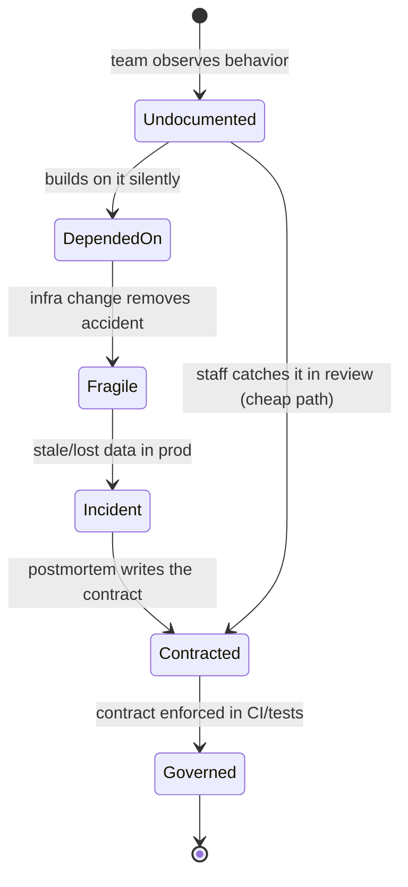

# Consistency Models — Staff

At the staff level, consistency stops being a technical toggle and becomes a **product and organizational commitment**. The question is no longer "can this store do linearizable reads?" but "what guarantee do we *promise* our customers and downstream teams, what does that promise cost in latency, dollars, and availability, and how do we keep the promise from silently drifting as the fleet evolves?"

The central failure mode you are paid to prevent: teams building on *observed* behavior that was never *guaranteed*, then getting paged at 3 a.m. when an infra change removes the accident they depended on.

## Table of Contents

1. [Consistency as a Product/SLA Decision](#1-consistency-as-a-productsla-decision)
2. [The Org Risk of Implicit Consistency](#2-the-org-risk-of-implicit-consistency)
3. [Consistency Contracts as Data Contracts](#3-consistency-contracts-as-data-contracts)
4. [Governing "Strong by Default vs Weak by Default"](#4-governing-strong-by-default-vs-weak-by-default)
5. [The Cost Conversation with Leadership](#5-the-cost-conversation-with-leadership)
6. [Per-Data-Class Consistency Policy](#6-per-data-class-consistency-policy)
7. [Migration Risk When Changing a Store's Consistency](#7-migration-risk-when-changing-a-stores-consistency)
8. [Testing Consistency as an Org Capability](#8-testing-consistency-as-an-org-capability)
9. [Framing to Non-Experts](#9-framing-to-non-experts)
10. [Staff Checklist](#10-staff-checklist)

---

## 1. Consistency as a Product/SLA Decision

A consistency model is a promise about what a reader can observe after a write. That promise has a price tag, and someone in the org is paying it whether or not they chose it deliberately.

The staff reframing has three moves:

- **From capability to commitment.** "The database *supports* strong reads" is an engineering fact. "We *guarantee* a customer sees their own comment within 200 ms globally" is a contract you must staff, budget, and defend under partition. Only the second one belongs in an SLA.
- **From binary to spectrum.** Strong and eventual are the endpoints; most product guarantees that actually matter to users live in between — **read-your-writes**, **monotonic reads**, **bounded staleness** ("at most 5 seconds behind"). These middle guarantees are often 10× cheaper than linearizability and cover 90% of real user complaints.
- **From technical to felt.** Users don't experience "eventual consistency." They experience "I posted and it vanished," "my balance flickered," "I got logged out on the other tab." Map every guarantee to the concrete anomaly it prevents, in user-facing language.

The deliverable is a **consistency SLA line item** per data class: the guarantee, the staleness bound, the availability target under partition, and the named owner who defends it.

---

## 2. The Org Risk of Implicit Consistency

The most expensive consistency incidents are not caused by weak guarantees. They are caused by **undocumented** ones — behavior that happened to hold on the old hardware, topology, or load, that a downstream team quietly built on.

Typical drift sequence:

- A read replica happens to lag <100 ms in the current region layout. A team ships a flow that reads immediately after write and "just works."
- Ops adds a cross-region replica for DR. Lag now spikes to seconds under failover. The flow starts showing stale data. Nobody changed the app code, so nobody looks there.
- The incident is triaged as a "database problem," burns two teams for a week, and the root cause — *a guarantee that was never promised* — is invisible in every design doc.

The cheap path — staff catching implicit dependence in design review and forcing the guarantee to be stated — costs a paragraph. The expensive path costs an incident. **Your job is to make the cheap path the default.**

Detection signals that a team is riding an implicit guarantee: code that reads its own write with no version check or read-your-writes routing; tests that only pass on a single-node dev DB; retries with fixed sleeps ("wait 500 ms then re-read"); dashboards that alert on "replica lag" but no product owner who can say what lag is *tolerable*.

---

## 3. Consistency Contracts as Data Contracts

Treat a datastore's consistency the way you treat an API schema: a **published, versioned contract** that downstream teams can depend on and that cannot change without a deprecation process.

A consistency contract for a data class states:

- **The guarantee** (e.g., read-your-writes for the writing session; eventual for other readers).
- **The staleness bound** for non-guaranteed readers ("p99 < 3 s, p999 < 15 s").
- **Behavior under partition** (does the write path stay available and reconcile later, or reject?).
- **Conflict resolution rule** if concurrent writes are possible (last-writer-wins by wall clock? CRDT merge? reject?).
- **What is explicitly NOT guaranteed** — the most valuable section, because it names the accidents nobody may depend on.
- **Owner and change process** — who signs off, and the notice period for a downgrade.

Publish these where downstream teams already look: alongside the API/schema registry, not buried in a wiki. The contract is what makes the difference between "we changed the replication topology and it was a non-event" and a week-long incident, because consumers were told the boundary and stayed inside it.

---

## 4. Governing "Strong by Default vs Weak by Default"

Across a fleet you set a **default posture** and require justification to deviate. The default shapes hundreds of decisions made by engineers who will never read a consistency paper.

| Signal | Lean **strong by default** | Lean **weak by default** |
|---|---|---|
| Blast radius of a wrong read | Financial, legal, safety, auth | Cosmetic, recoverable, low-stakes |
| Read/write ratio | Balanced or write-heavy correctness path | Massively read-heavy, tolerant of staleness |
| Latency budget | Generous (internal, batch) | Tight (interactive, global users) |
| Availability requirement under partition | Can reject writes to stay correct | Must stay writable (carts, drafts, telemetry) |
| Team maturity with distributed reasoning | Junior-heavy, high churn | Deep, has tooling to reason about anomalies |
| Cost sensitivity at scale | Low volume, cost immaterial | Hyperscale, consensus quorums are a real line item |

Governance mechanics that make the default real rather than aspirational:

- **Golden path stores** are pre-configured to the default posture, so the easy choice is the safe one.
- **Deviations require a one-page justification** reviewed by a small consistency-governance group (staff engineers across domains), not a full committee — keep the friction proportionate.
- **Fleet audits** periodically list which stores promise what, so posture drift is visible.

The anti-pattern is *no* posture: every team invents its own, guarantees are inconsistent across a single user journey (strong login, eventual profile, unknown for settings), and the composite experience is unpredictable.

---

## 5. The Cost Conversation with Leadership

Strong consistency is not free, and leadership deserves the trade stated in their terms. The three levers you are spending:

- **Latency.** Coordinating a write across a quorum or a global consensus group adds a round trip — often the difference between a 20 ms and a 150 ms write, felt directly by interactive users.
- **Money.** Consensus means more replicas, cross-region traffic, and more write amplification. At hyperscale, "strong everywhere" can be a materially larger infrastructure bill for data whose staleness nobody would notice.
- **Availability under partition.** This is the CAP trade in plain terms: when the network splits, a strongly consistent store must *reject* writes to avoid divergence. That is a deliberate availability sacrifice. Leadership should decide, per data class, whether "reject the write" or "accept and reconcile" is the correct business behavior.

Frame the pitch as: *"For THIS data, is the marginal correctness worth the marginal latency, dollars, and partition-time unavailability?"* For a bank ledger the answer is obviously yes. For a "last seen" timestamp or a like count, paying for linearizability is spending real money to prevent an anomaly no user would ever report. The staff skill is refusing the two lazy answers — "strong everywhere" (over-pays) and "eventual everywhere" (under-protects the 5% that matters) — and instead **partitioning the data by how much correctness is worth.**

---

## 6. Per-Data-Class Consistency Policy

The output of the cost conversation is a policy table that engineers can apply without re-deriving CAP each time.

| Data class | Guarantee | Staleness bound | Under partition | Why |
|---|---|---|---|---|
| Money / ledger / balances | Strong (linearizable) | 0 | Reject writes | Divergence is unrecoverable; correctness > availability |
| Auth / permissions / entitlements | Strong or bounded (seconds) | ≤ few s | Fail closed | Stale grant = security incident |
| User's own recent action (post, comment, edit) | Read-your-writes | 0 for author | Stay available | "It vanished" is the top user complaint |
| Social feed / recommendations | Eventual | seconds–minutes | Stay available | Staleness invisible; availability paramount |
| Counters / likes / view counts | Eventual, convergent (CRDT) | seconds | Stay available, merge | Approximate is fine; never reject a like |
| Config / feature flags | Bounded staleness | ≤ 30–60 s | Serve last-known-good | Fast enough; never block on config fetch |
| Analytics / telemetry | Eventual, at-least-once | minutes | Buffer and drain | Volume huge, correctness tolerant |

The table is a living artifact. Every new store or feature should be able to point at a row (or justify a new one). This is what turns consistency from a per-project debate into a fleet-wide default with documented exceptions.

---

## 7. Migration Risk When Changing a Store's Consistency

Changing a store's consistency guarantee — strengthening OR weakening — is one of the highest-risk migrations because the failure is often **silent**: no error, just occasionally-wrong data.

Two directions, two risk profiles:

- **Weakening** (e.g., adding read replicas, switching to async replication, going multi-region eventual for scale/cost). Risk: existing consumers silently relied on the old strength. **Before** you weaken, publish the new (weaker) contract, find every read-after-write and cross-partition read, and give consumers a migration window. A weakening with no consumer audit is an incident scheduled for later.
- **Strengthening** (e.g., eventual → strong for correctness after an incident). Lower correctness risk but real cost/latency/availability risk — you may have just made the store reject writes under partition where it used to stay up. Validate the new latency and availability profile against SLAs before flipping.

Staff-grade migration discipline:

- **Contract-first**: change the published contract and socialize it *before* the topology.
- **Dual-read / shadow verification**: read from old and new paths, diff results, alert on divergence before cutover.
- **Consumer inventory**: you cannot safely change a guarantee you cannot enumerate the dependents of. If the inventory doesn't exist, building it *is* the first migration task.
- **Reversibility**: keep the old path warm and the flag flippable until divergence metrics are clean.

---

## 8. Testing Consistency as an Org Capability

Consistency bugs don't reproduce on a laptop. They appear under concurrency, partition, and clock skew — exactly the conditions unit tests never create. An org that ships correctness-critical data needs consistency testing as a **standing capability**, not a per-incident scramble.

- **Fault-injection / linearizability testing** (Jepsen-style): drive concurrent operations against the store while injecting partitions, pauses, and clock skew, then check the observed history against the claimed model. This is the only way to know your store actually delivers the guarantee it advertises — vendors' claims and reality diverge more often than is comfortable.
- **Own it as a capability, not a heroic one-off.** Fund a small team or make it part of the platform group's charter. Run it in CI against your critical stores and on every version/topology upgrade, because a database point-release can quietly change its guarantees.
- **Property-based tests over invariants** at the application layer ("a user never sees their own committed write disappear") catch violations that example-based tests miss.
- **Game-day the partition.** Rehearse the CAP moment: split the network in a controlled window and confirm each data class behaves as its contract says (ledger rejects, cart stays writable). If nobody has ever watched the system partition, the contract is a hypothesis.

The org signal: consistency claims should be **tested, not asserted**. "We're strongly consistent" without a Jepsen-style test behind it is marketing, and staff engineers should say so in review.

---

## 9. Framing to Non-Experts

Most people who make consistency-relevant decisions — PMs, execs, junior engineers — will never learn the formal spectrum. Your leverage is translating it into decisions they can make well.

- **Anchor on the anomaly, not the theory.** "Eventual" means nothing to a PM. "For a few seconds after posting, another user might not see the comment yet" is a decision they can make.
- **Use the money/latency/availability triangle.** "Stronger guarantee = slower, costlier, and it stops accepting writes when the network breaks. For a bank balance that's the right trade. For a like count it's paying a premium to fix a problem no user has." One sentence, real decision.
- **Make the default the message.** Give teams a golden path and a one-line rule ("interactive user-facing = read-your-writes; money = strong; everything else = eventual unless you can name the anomaly you're preventing"). Most teams need a rule, not a seminar.
- **Name what you are NOT promising.** The single most useful sentence in any framing: "Do not build on the fact that replicas are usually fast — that is not a guarantee, and it will change."

---

## 10. Staff Checklist

- [ ] Every correctness-critical data class has a **published consistency contract** (guarantee, staleness bound, partition behavior, conflict rule, NOT-guaranteed section, owner).
- [ ] A fleet-wide **default posture** exists (strong or weak by default) with a lightweight deviation-justification process.
- [ ] A **per-data-class policy table** exists and new stores/features map to a row or justify a new one.
- [ ] The **cost conversation** (latency / dollars / partition-availability) has been had with leadership for the classes where strong consistency is expensive.
- [ ] No design ships with a **read-after-write or cross-partition dependency** on an unstated guarantee (caught in review).
- [ ] Consistency changes go **contract-first**, with a consumer inventory, shadow verification, and reversibility.
- [ ] Consistency claims on critical stores are **tested (Jepsen-style / property-based), not asserted**, and re-run on version/topology upgrades.
- [ ] The **partition case is rehearsed** in a game-day per data class.
- [ ] Non-expert stakeholders are given **rules and anomalies**, not theory.

---

*Next step:* [Consistency Models — Interview](interview.md)
