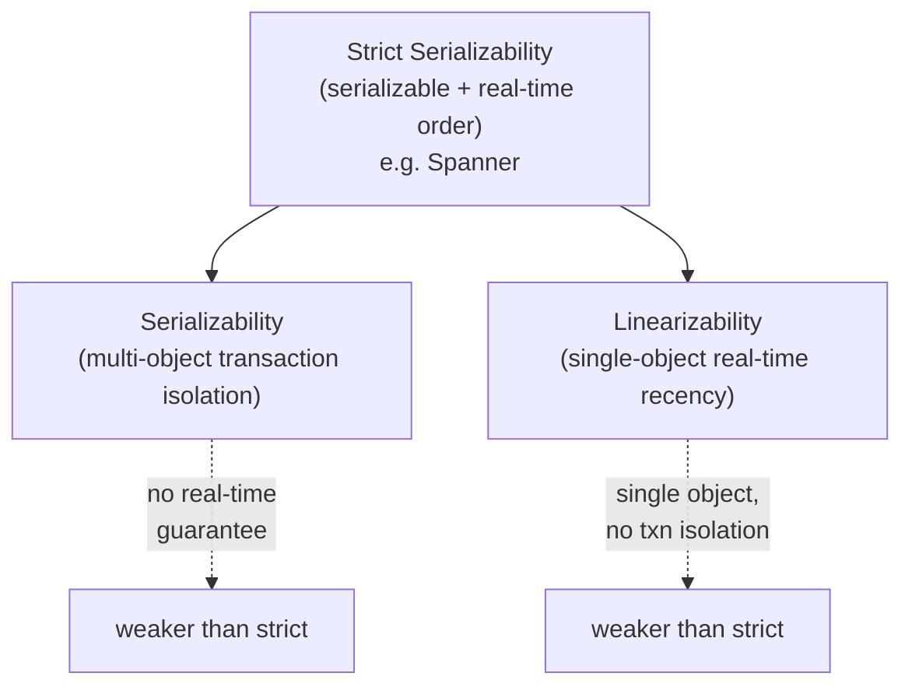

# Consistency Models — Interview

A tiered Q&A bank on the read/write guarantees a distributed store can offer. Questions run from fundamentals to staff-level judgment.

1. [What does "consistency" mean here, versus the C in ACID?](#q1-what-does-consistency-mean-here-versus-the-c-in-acid)
2. [Strong vs eventual — explain with an example.](#q2-strong-vs-eventual--explain-with-an-example)
3. [What is the stale-read problem, and where does it bite?](#q3-what-is-the-stale-read-problem-and-where-does-it-bite)
4. [Linearizability vs sequential consistency — what's the difference?](#q4-linearizability-vs-sequential-consistency--whats-the-difference)
5. [What is causal consistency, and what does it preserve?](#q5-what-is-causal-consistency-and-what-does-it-preserve)
6. [Name the four session guarantees and what each fixes.](#q6-name-the-four-session-guarantees-and-what-each-fixes)
7. [What is bounded staleness, and when is it useful?](#q7-what-is-bounded-staleness-and-when-is-it-useful)
8. [If R + W > N, is my quorum store linearizable?](#q8-if-r--w--n-is-my-quorum-store-linearizable)
9. [Linearizability vs serializability — how do they differ?](#q9-linearizability-vs-serializability--how-do-they-differ)
10. [How does consistency choice tie into CAP and PACELC?](#q10-how-does-consistency-choice-tie-into-cap-and-pacelc)
11. [Explain tunable consistency in Cassandra/Dynamo-style stores.](#q11-explain-tunable-consistency-in-cassandradynamo-style-stores)
12. [How do you choose a consistency model for a given use case?](#q12-how-do-you-choose-a-consistency-model-for-a-given-use-case)
13. [What's the staff-level risk of relying on stronger-than-guaranteed behavior?](#q13-whats-the-staff-level-risk-of-relying-on-stronger-than-guaranteed-behavior)
14. [Give a quick comparison of the main models.](#q14-give-a-quick-comparison-of-the-main-models)

---

## Q1: What does "consistency" mean here, versus the C in ACID?

They are different concepts that unfortunately share a word. In a distributed-storage context, "consistency" (a consistency *model*) describes the ordering and recency guarantees a system gives concurrent clients about reads and writes across replicas: if I write a value and you read the key, what are you allowed to see? The C in ACID is a database-transaction property meaning a transaction moves the database from one valid state to another with respect to declared invariants (constraints, foreign keys, triggers) — it is really an application-correctness guarantee enforced per transaction, not a statement about replication or cross-replica ordering. The distributed consistency spectrum (linearizable, causal, eventual, and so on) is what the CAP/PACELC theorems are about; ACID's C is not. When an interviewer asks about "consistency models," they mean the replica-ordering spectrum, so anchor your answer there.

## Q2: Strong vs eventual — explain with an example.

**Strong consistency** means once a write completes, every subsequent read (from any client, any replica) sees that write or a later one — the system behaves as if there were a single up-to-date copy. **Eventual consistency** only promises that if writes stop, all replicas *eventually* converge to the same value; in the meantime, reads may return stale data. Example: a user updates their profile display name from "Ann" to "Anna." Under strong consistency, the moment the update returns success, every device and every other user that reads the profile sees "Anna." Under eventual consistency, a read hitting a lagging replica might still return "Ann" for some window (milliseconds to seconds, sometimes longer under partition), and different readers may briefly disagree — but with no further writes they all settle on "Anna." Strong is easier to reason about; eventual is cheaper in latency and stays available during partitions.

## Q3: What is the stale-read problem, and where does it bite?

A stale read is when a read returns a value that was already superseded by a completed write the reader "should" have seen. It arises because a read can be served by a replica that hasn't yet received the latest write — classically a read replica lagging behind the leader. It bites hardest in read-your-writes scenarios and in read-modify-write loops. Canonical example: a user posts a comment (write goes to the leader), the page reloads and reads from a lagging follower, and the comment is missing — the user thinks their action failed and re-submits, creating a duplicate. It also bites correctness when application logic reads a value, computes based on it, and writes back: two clients each read the same stale balance, each subtract, and money is lost. Mitigations include routing a user's reads to the leader for a window after their write, read-your-writes session guarantees, or requiring a quorum/linearizable read for the sensitive path.

## Q4: Linearizability vs sequential consistency — what's the difference?

Both give a single total order over operations that respects each process's own program order. The difference is whether that order must respect *real time*. **Linearizability** requires that if operation A completes (in wall-clock time) before operation B begins, then A must appear before B in the total order — each operation appears to take effect atomically at some instant between its invocation and response. **Sequential consistency** drops the real-time constraint: there must be *some* single interleaving consistent with each process's program order, but operations from different processes can be reordered freely regardless of when they actually happened. So a sequentially consistent system may let a read return a value written "in the past" as long as a globally agreed order exists; a linearizable one cannot, because that would violate real-time precedence. Linearizability is strictly stronger and composable (a system built from linearizable parts is linearizable); sequential consistency is not composable.

## Q5: What is causal consistency, and what does it preserve?

Causal consistency preserves the order of operations that are *causally related* — related by potential cause-and-effect via Lamport's happened-before relation — while allowing concurrent (causally unrelated) operations to be seen in different orders by different replicas. It guarantees three things: writes that depend on earlier reads/writes are seen in that dependency order everywhere; if you see an effect, you also see its cause; and transitively, causal chains are respected. Classic example: Alice posts "I lost my job," then later comments "Actually it worked out, got a better offer." The comment causally depends on the post. Causal consistency ensures no one sees the reassuring comment before the original post — which eventual consistency does *not* guarantee. What it does *not* order is genuinely concurrent writes (two people editing unrelated keys), so it's much cheaper than linearizability. It is notable as the strongest model that can be provided while remaining available under network partitions.

## Q6: Name the four session guarantees and what each fixes.

Session guarantees are client-centric consistency promises scoped to a single client session, giving a coherent experience even on an eventually consistent store:

- **Read-your-writes (read-after-write):** once you've written a value, your own subsequent reads reflect it. Fixes the "I posted a comment but don't see it" problem.
- **Monotonic reads:** if you read a value, later reads never return an *older* value — you don't see time go backwards. Fixes reading a newer comment count, then a page refresh showing a lower one.
- **Monotonic writes:** your writes are applied in the order you issued them. Fixes "set password to X then to Y" landing as X.
- **Writes-follow-reads (causal, session-scoped):** a write you make after reading a value is ordered after the write that produced that value. Fixes replying to a comment and having your reply appear before the thing you replied to.

Together these approximate causal consistency from a single user's viewpoint and are often implemented by pinning a session to a replica or tracking version tokens, at far lower cost than global strong consistency.

## Q7: What is bounded staleness, and when is it useful?

Bounded staleness sits between strong and eventual: reads may be stale, but only within a defined bound — either a **time bound** (data is at most T seconds behind) or a **version bound** (at most K writes behind). It gives a hard SLA on how wrong a read can be, which is often exactly what a use case needs. It's useful when the application can tolerate mild lag but not unbounded lag: a leaderboard that may be up to 5 seconds behind is fine; a stock ticker that could be arbitrarily far behind is not. It lets you serve reads from replicas (cheap, low-latency, available) while capping the blast radius of staleness. Azure Cosmos DB exposes it as a first-class level. The trade-off: enforcing the bound requires the system to sometimes block or reject reads when a replica falls outside the window, or to redirect them to a fresher replica.

## Q8: If R + W > N, is my quorum store linearizable?

No — the quorum overlap R + W > N is necessary but not sufficient for linearizability. The condition guarantees that any read quorum intersects any write quorum in at least one node, so a read *can* observe the latest completed write. But subtle failures break single-copy semantics without read-repair and careful protocols: (1) if a write partially succeeds — reaches some replicas but not a full quorum — concurrent readers may see it or not, and later readers may see it disappear, violating monotonicity; (2) sloppy quorums with hinted handoff let writes and reads use non-overlapping node sets during failures; (3) without synchronizing on a total order, two concurrent reads can see writes in different orders; (4) last-write-wins conflict resolution by wall-clock timestamp can silently drop a write under clock skew. So R + W > N gives you a *strong-ish* read that reflects a recent write, but you need additional machinery (e.g., synchronous read-repair, ordering via consensus like Paxos/Raft) to actually claim linearizability. Dynamo-style stores explicitly do *not* promise it.

## Q9: Linearizability vs serializability — how do they differ?

They answer different questions and are orthogonal. **Serializability** is a *transaction-isolation* property: the outcome of executing multiple multi-object transactions is equivalent to *some* serial (one-at-a-time) execution of them. It says nothing about real-time order — the equivalent serial order can differ from wall-clock order. **Linearizability** is a *recency/ordering* property on *single-object* operations: each operation appears to take effect atomically at a real-time instant between its call and return. Serializability is about *what* interleavings of transactions are legal; linearizability is about *when* a single operation appears to happen. The gold standard that combines both — every transaction is serializable *and* the serial order respects real time — is called **strict serializability** (what Google Spanner targets). An interviewer testing depth wants to hear: serializability ≈ isolation across transactions, linearizability ≈ real-time recency on single objects, strict serializability = both.

## Q10: How does consistency choice tie into CAP and PACELC?

CAP says that during a network **partition (P)** you must choose between **consistency (C, meaning linearizability)** and **availability (A)** — you cannot have both while nodes can't talk. So a linearizable store must reject or block requests during a partition (CP), while an available store must serve possibly-stale data (AP). PACELC extends this to the common case with no partition: **Else (E)**, you still trade **latency (L)** against **consistency (C)**. Strong consistency requires coordinating replicas — waiting for a quorum or the leader — on every operation, which costs round-trips and thus latency, even in healthy conditions. That's the key staff-level point: strong consistency isn't only a partition-time availability cost; it's a *permanent latency tax* on the happy path. So Spanner is PC/EC (pays latency for consistency always), while Cassandra tuned low is PA/EL (favors availability and latency, accepting weaker consistency). Choosing a consistency model *is* choosing your position in PACELC.

## Q11: Explain tunable consistency in Cassandra/Dynamo-style stores.

Tunable (per-operation) consistency lets the *client* choose the consistency level of each read and write independently, rather than the store enforcing one global model. In Cassandra you specify levels like ONE, QUORUM, LOCAL_QUORUM, or ALL for reads (R) and writes (W) against a replication factor N. If you ensure R + W > N (e.g., QUORUM reads and QUORUM writes), you get strong-ish read-after-write for that key; if you use ONE/ONE, you get fast, highly available, but eventually consistent behavior. This means consistency becomes a per-query knob: a payment write might use QUORUM while an analytics read uses ONE. It also lets you trade for locality — LOCAL_QUORUM stays within a datacenter to avoid cross-region latency. The power is flexibility and the ability to spend consistency budget only where it matters; the danger is that correctness now depends on every code path picking the right level, and a single ONE read on a critical path silently reintroduces stale reads. (Recall from Q8 that R + W > N still isn't full linearizability.)

## Q12: How do you choose a consistency model for a given use case?

Start from the business-correctness question: *what is the cost of a stale or reordered read?* Then match:

- **Money, inventory, locks, uniqueness (usernames), leader election:** linearizable / strict-serializable. A wrong read means double-spend or lost data.
- **Social feeds, comments, messaging:** causal consistency or session guarantees — users must not see effects before causes, but global real-time order is unnecessary.
- **User-facing personal data (own profile, own cart):** read-your-writes + monotonic reads, usually via leader-pinning or sticky sessions.
- **Counters, likes, view counts, recommendations, analytics:** eventual consistency — approximate and self-healing is fine, and availability/latency dominate.
- **Dashboards, replicated caches with an SLA:** bounded staleness — cheap reads with a capped lag.

Also weigh geography (cross-region strong consistency is expensive), read/write ratio (read-heavy favors relaxed reads from replicas), and failure behavior (must it stay writable during a partition?). The senior move is to apply the *strongest model only on the paths that need it* and relax everywhere else, rather than picking one model for the whole system.

## Q13: What's the staff-level risk of relying on stronger-than-guaranteed behavior?

The core risk is **accidental correctness**: the system happens to behave strongly today (low load, healthy network, single region), code and tests come to depend on that behavior, and then a partition, a replica-lag spike, a region failover, or a config change to a lower consistency level exposes the weaker guarantee — and now you have a silent data-corruption bug in production that never appeared in testing. Concretely: code assumes read-your-writes because reads "usually" hit the leader; a routing change sends them to a follower and users lose their edits. Or a read-modify-write assumes linearizability from an eventually consistent store and, under concurrency, loses updates. The discipline is to (1) write down the *guaranteed* model, not the observed one, and design to the guarantee; (2) test against the weak behavior deliberately — inject lag, partitions, and replica reads in chaos tests; (3) make consistency levels explicit and reviewed on critical paths so no one silently downgrades a QUORUM to ONE; and (4) push invariant enforcement (uniqueness, balances) into a component that actually provides the needed guarantee (a linearizable store, a compare-and-swap, a transaction), rather than hoping the weaker store behaves. Never build correctness on behavior the system does not promise.

## Q14: Give a quick comparison of the main models.

| Model | Real-time order? | Preserves causality? | Available under partition? | Typical latency cost | Example use |
|---|---|---|---|---|---|
| **Linearizability** | Yes (single object) | Yes | No (CP) | High (coordination per op) | Locks, balances, leader election |
| **Sequential** | No | Yes (program order) | No | High | Shared-memory / replicated state machines |
| **Causal** | No | Yes | Yes | Medium (track dependencies) | Social feeds, messaging |
| **Session (RYW etc.)** | No | Per-session | Yes | Low–medium | User's own data, carts |
| **Bounded staleness** | Within bound | Within bound | Partial (enforces bound) | Low (replica reads) | Dashboards, leaderboards |
| **Eventual** | No | No | Yes (AP) | Lowest | Like counts, view counts, analytics |

The rule of thumb: consistency strength increases top-to-bottom-reversed — as you move toward linearizability you gain reasoning simplicity and lose availability and latency; as you move toward eventual you gain availability and speed and take on staleness and reordering.

---

*Next step:* [QPS — Junior](../../capacity-estimation/qps/junior.md)
