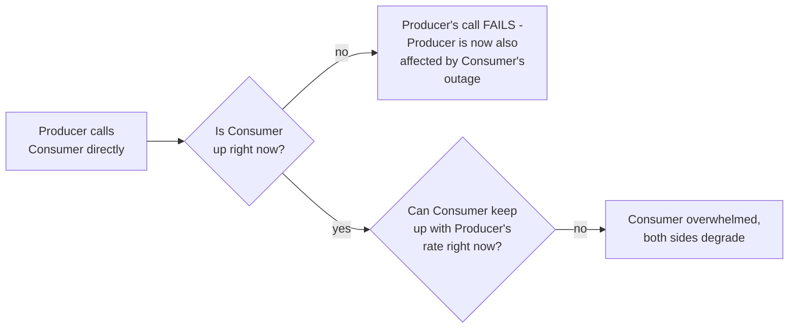
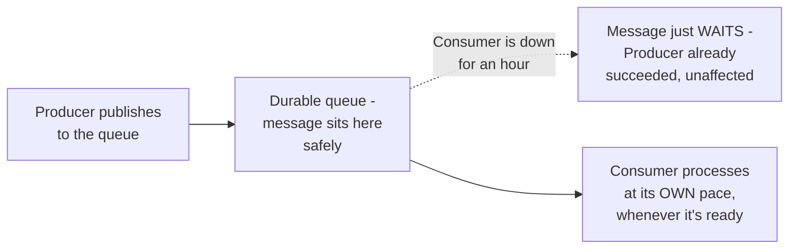

# Message Queues — Junior

<!-- level-focus -->
At junior level, focus on this question:

> Why does a direct call between a producer and consumer couple their
> availability and load characteristics together?

---

## Direct calls: both sides must be up, at the same time, at a matched pace

If Service A calls Service B directly (a synchronous HTTP call), both must
be available **simultaneously**, and B must be able to keep up with
whatever rate A sends requests at, **right now** — A's own reliability and
performance become entangled with B's.

## A queue decouples both dimensions

With a message queue between them: the producer publishes a message and
is **done** — it doesn't care whether the consumer is currently up,
overloaded, or slow. The message durably waits in the queue until the
consumer is ready to process it, at whatever pace the consumer can
actually sustain.

> 🎓 **Takeaway:** a message queue's core value is **decoupling** — the
> producer's success no longer depends on the consumer's availability or
> current capacity, and the consumer can process at its own sustainable
> rate rather than whatever rate the producer happens to be sending at.

## Test yourself

1. Why does a direct HTTP call from A to B mean A's reliability is now
   partly dependent on B's uptime?
2. If Consumer goes down for an hour, what happens to messages the
   Producer sent during that hour, assuming a durable queue is in place?
3. Give an example of two services in a real system where this decoupling
   would clearly be valuable.

Continue to [`middle.md`](middle.md).
