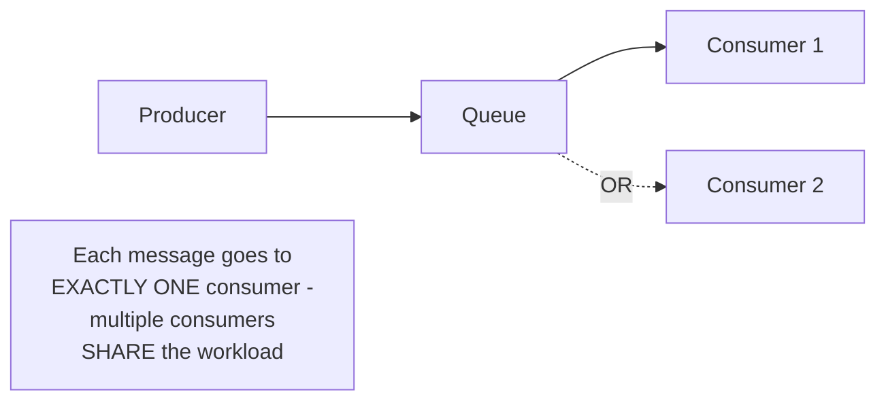
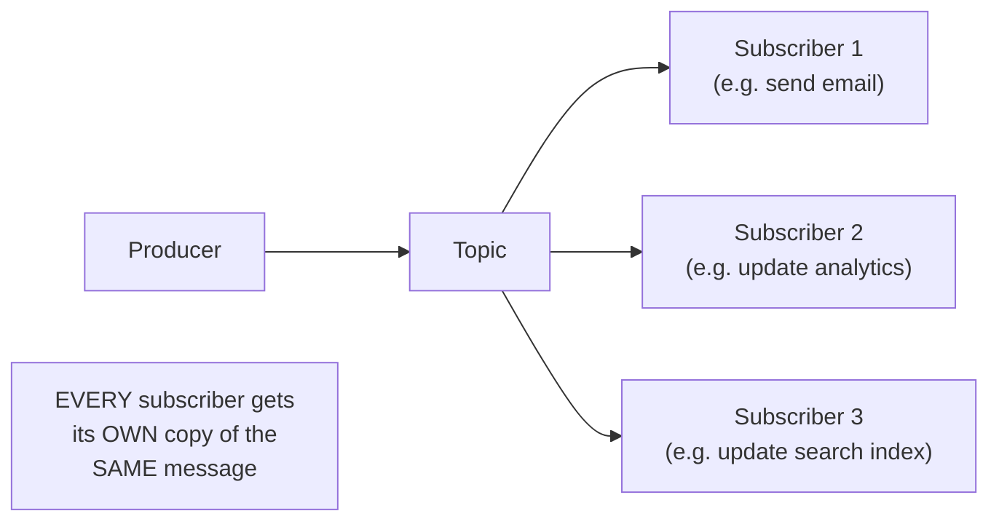

# Message Queues — Middle

<!-- level-focus -->
At middle level, focus on this question:

> When should a message go to exactly one consumer (a queue) versus every
> subscriber (pub/sub)?

Prerequisite: [`junior.md`](junior.md).

---

## Point-to-point: one message, one consumer



A classic **queue** delivers each message to exactly **one** consumer,
even with multiple consumers listening — this is the natural fit for
**work distribution**: "process this order," "resize this image" — the
work should happen once, and multiple consumer instances just share the
total workload for scaling.

## Publish/subscribe: one message, every subscriber



A **topic** (pub/sub) delivers each message to **every** subscriber
independently — this fits **event notification**: "an order was placed"
is one fact that potentially many independent, unrelated systems need to
react to, each in their own way, without knowing about each other.

| | Queue (point-to-point) | Topic (pub/sub) |
|---|---|---|
| Delivery | Exactly one consumer per message | Every subscriber gets its own copy |
| Fits | Work distribution/load balancing | Event notification/fan-out |
| Adding a consumer | Shares the existing workload (more throughput) | Adds an entirely new, independent reaction to every event |

```python
# Queue: work distribution - multiple workers SHARE the queue
queue.consume("resize_image_jobs", callback=resize_image)

# Topic: pub/sub - multiple subscribers EACH get every event
topic.subscribe("order_placed", callback=send_confirmation_email)
topic.subscribe("order_placed", callback=update_analytics)  # independent
```

> 🎓 **Takeaway:** choose a queue when you want to **scale out processing
> of the same work**; choose a topic when you want **multiple, independent
> systems to each react to the same event** — conflating the two is a
> common design mistake (e.g. accidentally building work distribution on
> top of pub/sub, causing every subscriber to redundantly do the same
> work instead of sharing it).

## Test yourself

1. Why would using a topic (pub/sub) for "resize this image" work
   distribution cause every subscriber to redundantly resize the same
   image, rather than sharing the workload?
2. Why would using a plain queue for "an order was placed" event
   notification prevent multiple independent systems from all reacting to
   it?
3. Design the queue/topic choice for: "process a payment," "notify three
   independent teams that a payment was processed."

Continue to [`senior.md`](senior.md).
