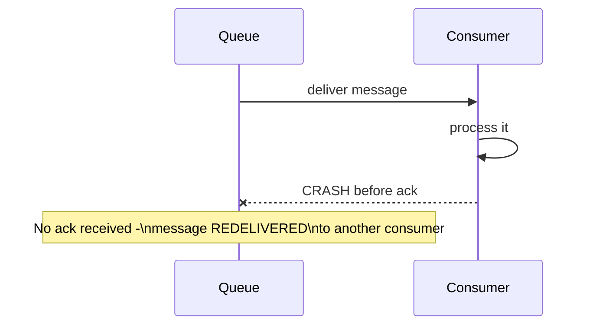
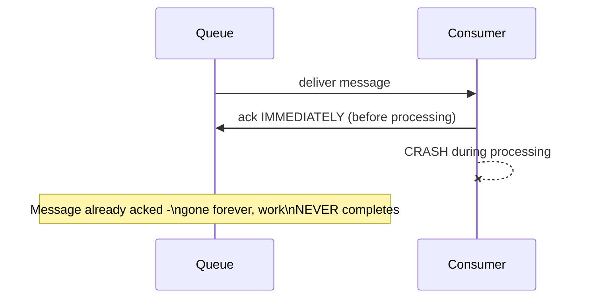
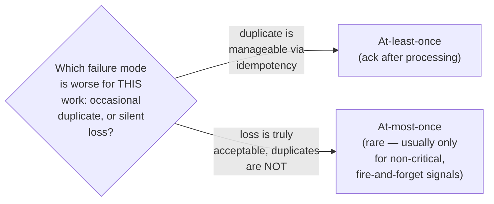

# Message Queues — Senior

<!-- level-focus -->
At senior level, focus on this question:

> How does the timing of message acknowledgment determine whether your
> queue behaves as at-least-once or at-most-once?

Prerequisite: [`middle.md`](middle.md).

---

## Ack-after-processing: at-least-once (safe from loss, risks duplicates)

If the consumer acknowledges **after** successfully processing a message,
a crash between "processing completed" and "ack sent" causes redelivery —
the message is processed **again** by another consumer. This is
**at-least-once** delivery: no message is ever lost, but duplicates are
possible (requiring the idempotency discipline from
[Retries & Idempotency](../../../distributed-system/17-background-jobs/04-retries-and-idempotency/README.md)).

## Ack-before-processing: at-most-once (risks loss, never duplicates)

If the consumer acknowledges **immediately upon receipt**, before actually
processing, a crash mid-processing means the message is **permanently
lost** — the queue already considers it delivered and won't redeliver.
This is **at-most-once**: no duplicates possible, but real risk of silent
work loss.

## The trade-off, and why at-least-once is almost always the right default

> 🎯 **Senior takeaway:** the choice of *when* to ack directly determines
> your delivery guarantee — this isn't a queue configuration detail to set
> and forget, it's a design decision with real consequences. Almost every
> production system should default to at-least-once (ack after processing)
> paired with idempotent handlers, because silent data loss is almost
> always worse than an occasional, handled duplicate.

## Test yourself

1. Why does acking after processing (rather than before) guarantee no
   message is ever silently lost, at the cost of possible duplicates?
2. Give a real example of work where at-most-once (ack before processing)
   might actually be an acceptable choice.
3. If your queue is configured for at-least-once delivery but your
   consumer handler isn't idempotent, what production risk does this
   create, and when would it likely surface?

Continue to [`professional.md`](professional.md) to see how a real broker
(AMQP/RabbitMQ) implements these guarantees internally at scale.
