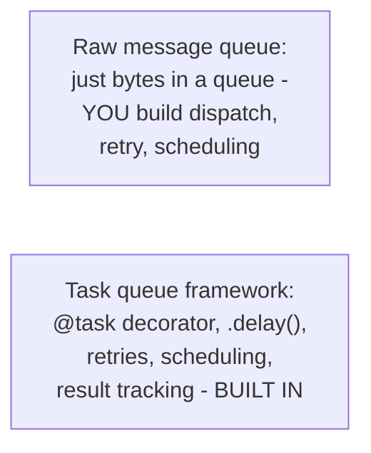

# Task Queues — Junior

<!-- level-focus -->
At junior level, focus on this question:

> What does a task queue framework provide beyond what a raw message queue
> already gives you?

---

## A raw message queue is generic; a task queue is opinionated

```python
# Raw message queue: you build everything yourself
queue.publish(json.dumps({"fn": "resize_image", "args": [image_id]}))
# You'd have to hand-write: deserializing, calling the right function,
# retry logic, scheduling, tracking results...

# Task queue framework (Celery): the framework does this for you
@app.task(max_retries=3)
def resize_image(image_id):
    ...

resize_image.delay(image_id)  # enqueue, framework handles the rest
```



A task queue framework (Celery, Sidekiq, BullMQ) is built **on top of** a
message broker (often Redis or RabbitMQ, per
[Message Queues](../01-message-queues/README.md)) specifically to handle
the recurring concerns of "running a Python/Ruby/JS function later,
possibly on a schedule, possibly retried on failure, possibly needing its
result checked later" — all the machinery covered across the
[Background Jobs](../../../distributed-system/17-background-jobs/README.md)
folder, packaged as a ready-made framework instead of requiring you to
hand-build it on a raw queue.

> 🎓 **Takeaway:** a task queue is a message queue **plus** an opinionated
> framework for defining, dispatching, retrying, and tracking units of
> executable work — reach for one whenever your actual need is "run this
> function asynchronously," rather than building this repeatedly on a raw
> queue.

## Test yourself

1. What specific machinery would you have to hand-build if you used a raw
   message queue instead of a task queue framework for "resize this
   image asynchronously, retry up to 3 times on failure"?
2. Why is `.delay()` (or its equivalent) a convenient abstraction over
   manually serializing a message and publishing it to a queue?
3. Name one thing a task queue framework provides that a raw message queue
   fundamentally cannot, without you writing equivalent code yourself.

Continue to [`middle.md`](middle.md).
