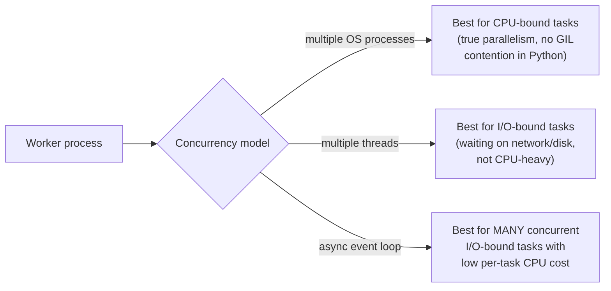

# Task Queues — Middle

<!-- level-focus -->
At middle level, focus on this question:

> How do you size a worker pool's concurrency for a given task type and
> expected volume?

Prerequisite: [`junior.md`](junior.md).

---

## Concurrency model: processes, threads, or async, per worker



Celery (and similar frameworks) let you choose a concurrency model per
worker pool: `prefork` (multiple OS processes — true parallelism, ideal
for CPU-bound tasks like image processing), `eventlet`/`gevent` (green
threads/async — ideal for I/O-bound tasks like calling external APIs,
where a single worker can hold thousands of concurrent in-flight requests
without needing thousands of OS threads).

## Sizing concurrency against actual task duration and volume

```
required_throughput = tasks_per_second
worker_concurrency_needed = required_throughput * average_task_duration_seconds
```

If you need to process 100 tasks/second and each takes an average of 0.5
seconds, you need **50** concurrent task slots (`100 × 0.5`) across your
worker pool — this is the same little's-law-style sizing math as the
connection pooling and queue-based load-leveling topics, applied to task
queue worker concurrency specifically.


> 🎓 **Takeaway:** worker concurrency isn't a number you guess — it's
> derivable from your actual task volume and duration, the same way
> connection pool and thread pool sizing is elsewhere in this tree. And
> the concurrency **model** (process/thread/async) should match your
> task's actual bottleneck (CPU vs. I/O wait), not be a default left
> unexamined.

## Test yourself

1. Why would using `prefork` (multiple processes) for a task that mostly
   waits on a slow external API be wasteful compared to an async model?
2. Using the sizing formula, how much concurrency would you need for 500
   tasks/second averaging 200ms each?
3. Why might CPU-bound and I/O-bound tasks in the same application
   deserve entirely separate worker pools with different concurrency
   models?

Continue to [`senior.md`](senior.md).
