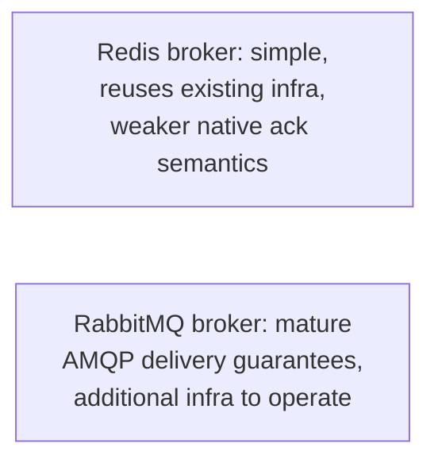
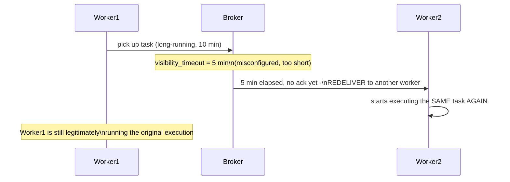

# Task Queues — Professional

<!-- level-focus -->
At professional level, focus on this question:

> What are the real, documented production bottlenecks in Celery/Sidekiq
> deployments — broker choice, visibility timeout pitfalls, and result
> backend contention — and how do you diagnose them?

Prerequisite: [`senior.md`](senior.md).

---

## Broker choice: Redis vs. RabbitMQ as Celery's transport

Celery supports multiple broker backends, and the choice has real
production consequences: **Redis** as a broker is simple to operate (if
you're already running Redis for caching, per the Cache-Aside professional
page) but lacks native, robust acknowledgment/redelivery semantics as
sophisticated as a purpose-built message broker — **RabbitMQ** (per the
Message Queues professional page's AMQP model) provides more mature
delivery guarantees and routing flexibility, at the cost of operating an
additional piece of infrastructure. Teams already running Redis often
start there for simplicity and migrate to RabbitMQ once delivery-guarantee
edge cases (documented, known Celery+Redis visibility-timeout issues,
covered next) become a real production problem.



## The documented visibility timeout pitfall

Celery with a Redis broker uses a **visibility timeout**: if a worker
doesn't ack a task within this window, the task is considered failed and
**redelivered** — a well-documented Celery+Redis production pitfall is
setting this timeout **shorter** than a task's actual worst-case
execution time, causing the exact same task to be redelivered and
executed **again** while the original execution is still legitimately
running, producing duplicate execution that looks like a delivery bug but
is actually a misconfigured timeout. This is directly analogous to the
lease-TTL-too-short problem from the Leases & Fencing professional page,
applied to task acknowledgment specifically.



## Result backend contention at scale

Per the Returning Results professional page's Celery-specific discussion:
at high task volume, the result backend itself (whichever of Redis/
database/RPC you chose) becomes a distinct scaling bottleneck from the
broker/worker throughput — a common production misdiagnosis is attributing
slow task processing to worker concurrency when the actual bottleneck is
result-backend write contention, diagnosable by comparing task-execution
duration against task-result-storage duration specifically.

## Production checklist (staff-level)

1. **Set visibility timeout comfortably longer than your worst-case task
   execution time** — measure actual p99/p999 task duration under real
   load, not average duration, and set the timeout with meaningful
   headroom above that tail.
2. **Choose broker (Redis vs. RabbitMQ) based on your actual delivery-
   guarantee requirements**, not just operational convenience — reassess
   this choice explicitly once visibility-timeout or delivery-duplication
   issues start appearing in production.
3. **Isolate result backend load from broker/worker throughput
   diagnostics** — measure and monitor them as separate, independently
   scalable resources, per the Returning Results professional page.
4. **Route task types to separate queues with dedicated worker pools by
   default for any system with mixed critical/non-critical work**
   (`senior.md`), rather than retrofitting this after a real incident.
5. **In a postmortem for unexplained duplicate task execution, check
   visibility timeout configuration against actual task duration first** —
   this is a specific, well-documented, and common root cause that's
   frequently misdiagnosed as a broker or idempotency bug instead.

## Cheat Sheet

```text
+------------------------------------------------------------------+
|                  TASK QUEUES — INTERNALS & SCALE                    |
+------------------------------------------------------------------+
| Broker choice: Redis (simple, reuses existing infra, weaker native     |
| ack semantics) vs. RabbitMQ (mature AMQP guarantees, more infra)       |
+------------------------------------------------------------------+
| DOCUMENTED PITFALL: visibility_timeout shorter than actual worst-      |
| case task duration -> task redelivered and executed AGAIN while the    |
| original execution is still legitimately running - looks like a        |
| delivery bug, is actually a misconfigured timeout. Set with real        |
| p99/p999 headroom, not average duration                                |
+------------------------------------------------------------------+
| Result backend contention is a SEPARATE scaling bottleneck from        |
| broker/worker throughput - diagnose independently, don't conflate      |
| "task processing is slow" with "worker concurrency is too low"         |
+------------------------------------------------------------------+
```

## Test yourself

1. Explain exactly how a visibility timeout set shorter than actual task
   duration causes duplicate execution, and why this looks like an
   idempotency bug at first glance.
2. Why should visibility timeout be set based on p99/p999 duration rather
   than average task duration?
3. A team reports "task processing has gotten slower" and immediately adds
   more workers, with no improvement. What else would you check first,
   based on this page?

## Further Reading

- Celery documentation — "Redis" and "Visibility Timeout" (the specific
  pitfall documented above) and "Result Backends."
- See also: [Message Queues — professional](../01-message-queues/professional.md),
  [Returning Results — professional](../../../distributed-system/17-background-jobs/03-returning-results/professional.md).
