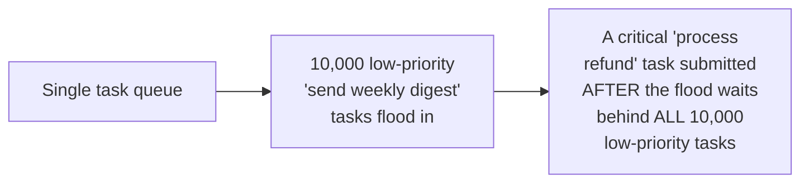
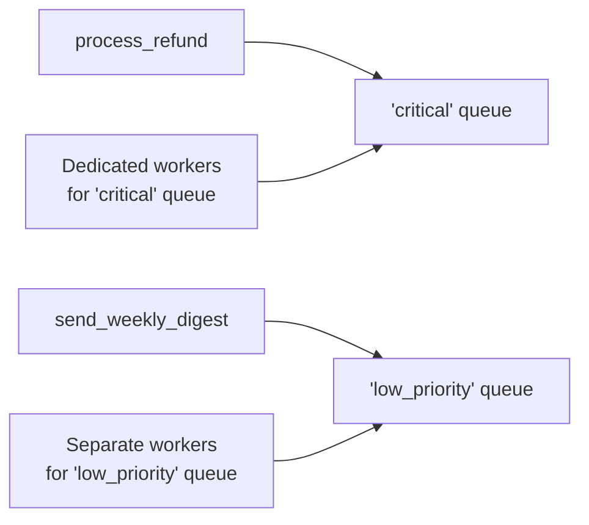

# Task Queues — Senior

<!-- level-focus -->
At senior level, focus on this question:

> How do you prevent a flood of low-priority tasks from delaying critical
> ones?

Prerequisite: [`middle.md`](middle.md).

---

## The head-of-line blocking problem, revisited



If all task types share one queue and workers process it in
roughly-FIFO order, a burst of low-priority work can delay a
time-sensitive critical task submitted moments later — the critical task
is stuck waiting behind everything already queued ahead of it, regardless
of its actual business importance.

## Task routing: separate queues per priority/type

```python
app.conf.task_routes = {
    "tasks.process_refund": {"queue": "critical"},
    "tasks.send_weekly_digest": {"queue": "low_priority"},
}
```



Routing different task types to **separate queues**, each with its own
dedicated worker pool, is a direct application of the Bulkhead pattern
(see the Bulkhead professional page) to task queues specifically — a
flood of low-priority tasks can never delay critical tasks, because they
don't share a queue or a worker pool at all.

## An alternative within one queue: priority levels

Some brokers (Redis-backed task queues with priority support) allow a
single queue to have priority levels, where workers always pull
higher-priority tasks first when available — this provides softer
prioritization without full queue separation, but risks **starvation**:
if high-priority tasks arrive continuously, low-priority tasks could wait
indefinitely, never getting picked up at all.

> 🎯 **Senior takeaway:** separate queues with dedicated worker pools per
> priority tier provide the strongest isolation (no starvation risk,
> true bulkheading); in-queue priority levels are simpler to operate but
> risk starving low-priority work entirely under sustained high-priority
> load. Choose based on whether occasional low-priority starvation is
> acceptable for your workload.

## Test yourself

1. Why does routing task types to separate queues with dedicated worker
   pools prevent the head-of-line blocking scenario entirely, rather than
   just reducing its likelihood?
2. Why can in-queue priority levels risk starving low-priority tasks
   indefinitely, in a way that separate dedicated queues do not?
3. Design the queue/routing strategy for a system with three task types:
   payment processing (critical), image resizing (moderate), and
   analytics event logging (low priority, high volume).

Continue to [`professional.md`](professional.md) to diagnose Celery/
Sidekiq bottlenecks at production scale.
