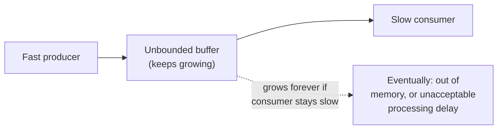
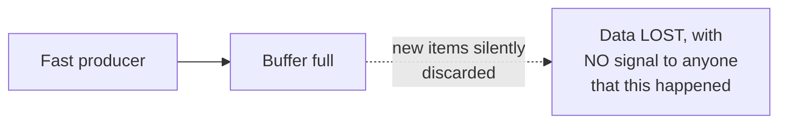
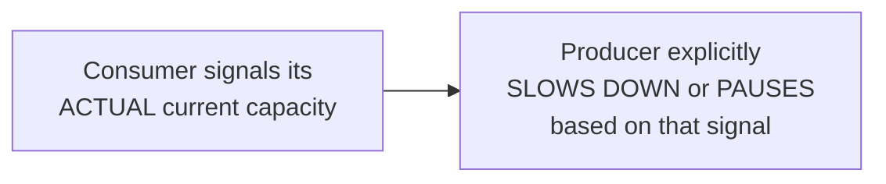

# Back-Pressure — Junior

<!-- level-focus -->
At junior level, focus on this question:

> Why are both "buffer everything forever" and "silently drop what doesn't
> fit" bad default responses to a slow consumer?

---

## Unbounded buffering: delays the problem, doesn't solve it

If a producer is faster than a consumer and nothing limits the buffer
between them, the buffer just keeps growing — this is the exact
unbounded-queue risk covered in the Queue-Based Load Leveling reliability
pattern: fine for a temporary burst, catastrophic for a sustained
mismatch.

## Silent dropping: loses data with no signal

The opposite extreme — silently discarding items once a buffer is full —
avoids unbounded memory growth but loses data **invisibly**, with no
feedback to the producer or any operator that something is being dropped.
This is often worse than either extreme: you get neither the safety of
"nothing is lost" nor the visibility of "we know exactly how overloaded
we are."

## What back-pressure actually does instead

Back-pressure means the **consumer's actual capacity** is explicitly
communicated back to the producer, and the producer **adjusts its rate**
in response — rather than either party guessing, buffering blindly, or
dropping silently.

> 🎓 **Takeaway:** the goal of back-pressure is to make "the consumer
> can't keep up" an **explicit, visible signal** that changes the
> producer's behavior, rather than a silent problem that manifests later
> as memory exhaustion or invisible data loss.

## Test yourself

1. Why does unbounded buffering only delay, rather than solve, a
   sustained producer/consumer rate mismatch?
2. Why is silently dropping data often worse than either buffering or an
   explicit backpressure signal?
3. What would an explicit backpressure signal actually look like in a
   simple example — what information does the consumer need to
   communicate?

Continue to [`middle.md`](middle.md).
