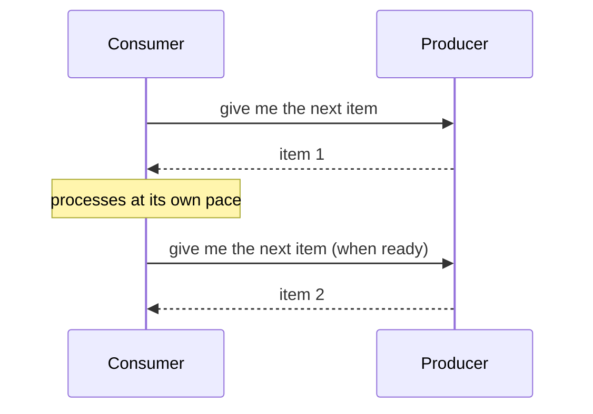
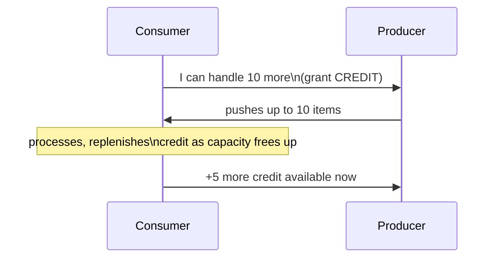

# Back-Pressure — Middle

<!-- level-focus -->
At middle level, focus on this question:

> How do push-based and pull-based flow control differ in how they
> achieve back-pressure?

Prerequisite: [`junior.md`](junior.md).

---

## Pull-based: the consumer asks for more, on its own schedule

In a **pull-based** model, the consumer explicitly requests each item (or
batch) only when it's ready for more — back-pressure is implicit and
automatic: the producer simply never sends faster than the consumer asks,
because the consumer controls the pace entirely. Polling and traditional
message queue "consume" APIs are pull-based by nature.

## Push-based with explicit credit: the producer pushes, but only within a granted allowance

This is the **credit-based flow control** mechanism from the Event-Driven
Background Jobs professional page — the producer pushes proactively
(lower latency per item than waiting for each individual pull request)
but is still bounded by however much credit the consumer has explicitly
granted, giving you push's latency benefit with pull's rate-control
safety.

| | Pull-based | Push-based + credit |
|---|---|---|
| Latency per item | Higher (must wait for next request) | Lower (producer sends proactively within its credit) |
| Complexity | Simpler | Requires credit tracking on both sides |
| Back-pressure | Automatic, implicit | Explicit, requires the credit protocol |

> 🎓 **Takeaway:** pull-based flow control gets back-pressure "for free"
> at the cost of latency; push-based-with-credit recovers push's latency
> advantage while still providing explicit rate control — the credit
> mechanism is what prevents push-based systems from defaulting back to
> `junior.md`'s uncontrolled-buffering problem.

## Test yourself

1. Why is back-pressure "automatic" in a pull-based model, without any
   extra protocol needed?
2. Why does pure push (with no credit mechanism at all) recreate exactly
   the unbounded-buffering risk from `junior.md`?
3. Design a simple credit-based protocol for a producer pushing sensor
   readings to a consumer that can only reliably process 100 readings/sec.

Continue to [`senior.md`](senior.md).
