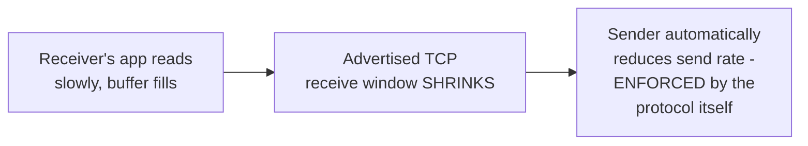
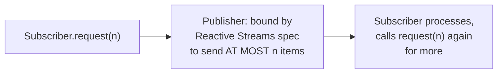

# Back-Pressure — Professional

<!-- level-focus -->
At professional level, focus on this question:

> How does TCP's own flow control implement back-pressure at the network
> protocol level, and how does the Reactive Streams specification formalize
> the same idea for application-level async code?

Prerequisite: [`senior.md`](senior.md).

---

## TCP flow control: back-pressure built into the transport layer

TCP itself implements back-pressure via the **receive window**: the
receiver advertises how many bytes of buffer space it currently has
available, and the sender is contractually bound to never send more than
that window allows. As the receiver's application reads data slower than
it arrives, its buffer fills, the advertised window **shrinks**, and the
sender automatically slows down — all of this happens below the
application layer entirely, meaning **every** TCP-based protocol
(HTTP, gRPC, a raw socket connection) inherits a working back-pressure
mechanism for free at the transport level, whether or not the application
protocol built on top of it does anything additional.



The professional-level nuance: this transport-level back-pressure protects
against **network-level** overload, but says nothing about **application-
level** overload further up the stack — an application can still read
bytes off the TCP socket promptly (keeping the TCP window open) while
being unable to actually **process** them fast enough internally,
meaning application-level back-pressure (per `senior.md`'s multi-hop
propagation) is a distinct concern TCP's own flow control does not solve
for you.

## Reactive Streams: a formal specification for application-level back-pressure

The **Reactive Streams** specification (adopted into Java's `Flow` API,
Project Reactor, RxJava, and referenced in the Event-Driven Background
Jobs professional page's credit-based flow control discussion) formalizes
`middle.md`'s push-with-credit model as a standard **protocol** between a
`Publisher` and a `Subscriber`: the subscriber calls `request(n)` to grant
credit for exactly `n` items, and the publisher is contractually forbidden
from sending more than the currently outstanding requested amount — this
is the application-level analog of TCP's receive window, standardized
specifically so that reactive libraries from different vendors can
interoperate correctly on back-pressure semantics, rather than each
implementing an incompatible ad hoc flow-control scheme.



## Production checklist (staff-level)

1. **Understand that TCP's transport-level flow control does not solve
   application-level back-pressure** — an application reading bytes
   promptly (satisfying TCP) can still be overwhelmed internally if it
   can't process them fast enough; design application-level flow control
   separately.
2. **Adopt a Reactive Streams-compliant library (Project Reactor, RxJava,
   Java `Flow`) for application-level async pipelines requiring proper
   back-pressure**, rather than hand-rolling an ad hoc credit scheme —
   the specification exists specifically to make different libraries'
   back-pressure semantics interoperate correctly.
3. **Audit every hop in a multi-service async pipeline for back-pressure
   propagation** (`senior.md`), not just the endpoints — a single
   non-propagating hop undermines the whole chain's guarantee.
4. **Distinguish, in incident diagnosis, between network-level congestion
   (TCP window shrinking, visible via network-level metrics) and
   application-level overload (the app reads fine but processing lags)** —
   these require completely different fixes.
5. **In a design review for a new streaming/async pipeline, require an
   explicit back-pressure propagation design across every hop**, citing
   Reactive Streams or an equivalent formalized protocol where
   application-level flow control is needed, not just "we'll add a queue
   and hope it's enough."

## Cheat Sheet

```text
+------------------------------------------------------------------+
|                  BACK-PRESSURE — INTERNALS & SCALE                   |
+------------------------------------------------------------------+
| TCP flow control: receiver advertises its RECEIVE WINDOW (available    |
| buffer space) - sender CONTRACTUALLY BOUND never to exceed it.         |
| Every TCP-based protocol inherits this for FREE at the transport       |
| layer - but it only protects against NETWORK-level overload, not       |
| APPLICATION-level overload (app can read bytes fine while its own      |
| processing still lags behind)                                         |
+------------------------------------------------------------------+
| Reactive Streams spec: formalizes push-with-credit as a STANDARD       |
| protocol (Subscriber.request(n), Publisher bound to send AT MOST n)   |
| - lets different reactive libraries interoperate correctly on          |
| back-pressure, rather than incompatible ad hoc schemes                 |
+------------------------------------------------------------------+
| Application-level back-pressure is a SEPARATE concern from TCP's       |
| transport-level flow control - must be designed explicitly, at         |
| every hop in a multi-service pipeline (senior.md)                      |
+------------------------------------------------------------------+
```

## Test yourself

1. Why can an application satisfy TCP's flow control (reading bytes
   promptly) while still being overwhelmed at the application processing
   level?
2. Explain what `Subscriber.request(n)` does in the Reactive Streams
   model, and why it's structurally similar to TCP's receive window.
3. In an incident where a downstream service is falling behind, how would
   you determine whether the bottleneck is network-level (TCP) or
   application-level (processing), and why does the fix differ?

## Further Reading

- Reactive Streams specification (reactive-streams.org) — the formal
  Publisher/Subscriber back-pressure protocol.
- RFC 793 / RFC 9293 — TCP, including the sliding window flow control
  mechanism.
- Project Reactor documentation — "Reactive Streams and Flow" (a practical
  implementation of the spec).
- See also: [Event-Driven Background Jobs — professional](../../../distributed-system/17-background-jobs/01-event-driven/professional.md),
  [Queue-Based Load Leveling — professional](../../../distributed-system/20-reliability-patterns/09-queue-based-load-leveling/professional.md).
