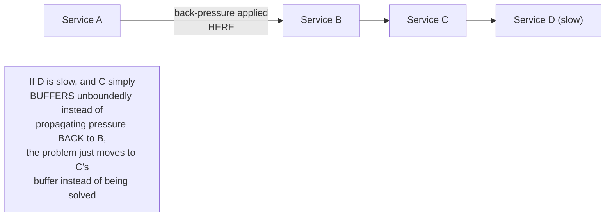
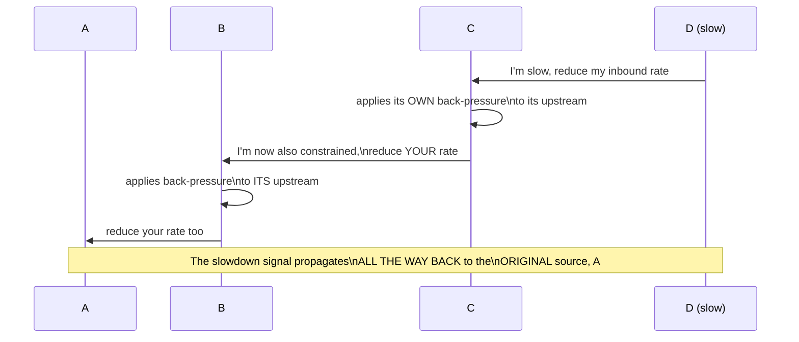

# Back-Pressure — Senior

<!-- level-focus -->
At senior level, focus on this question:

> How must back-pressure propagate across a chain of multiple services,
> not just one producer-consumer pair?

Prerequisite: [`middle.md`](middle.md).

---

## A back-pressure signal that stops at the first hop is incomplete

If Service D (at the end of a chain) is the actual bottleneck, but Service
C absorbs the slowdown with its own unbounded internal buffer instead of
signaling back to B that it needs to slow down, the back-pressure "stops"
at C — B and A keep producing at full speed, and C's buffer just grows
instead of D's, delaying (not solving) the exact problem from `junior.md`,
just one hop further back.

## True end-to-end back-pressure: every hop propagates the signal

For back-pressure to genuinely solve (not just relocate) the problem,
**every** intermediate service in the chain must propagate the slowdown
signal to **its own** upstream, rather than absorbing it locally with an
ever-growing buffer — this requires every hop in the chain to implement
the same credit/pull-based discipline from `middle.md`, consistently,
end to end.

> 🎯 **Senior takeaway:** back-pressure is only as effective as its
> **weakest propagating hop** — a single service in a multi-hop chain that
> absorbs pressure locally (buffers unboundedly instead of signaling
> upstream) breaks the entire chain's end-to-end back-pressure guarantee,
> even if every other hop implements it correctly. This is analogous to
> the "one accidentally shared component defeats isolation" lesson from
> the Deployment Stamps professional page, applied to flow control instead
> of failure domains.

## Test yourself

1. Why does a single non-propagating hop in a multi-hop chain undermine
   the entire chain's back-pressure guarantee, even if every other hop
   handles it correctly?
2. Trace through a 4-hop chain (A→B→C→D) where D becomes slow, and
   explain what "true end-to-end back-pressure" would look like at each
   hop.
3. Why is this problem structurally similar to the retry-amplification
   discussion from the Retries & Idempotency professional page, even
   though the direction of the signal (downstream vs. upstream) is
   opposite?

Continue to [`professional.md`](professional.md) to see how TCP and
Reactive Streams formalize back-pressure at the protocol level.
