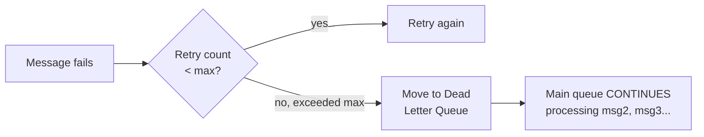

# Dead Letter Queues — Junior

<!-- level-focus -->
At junior level, focus on this question:

> Why can't a message that keeps failing just be retried indefinitely?

---

## The poison message problem

```mermaid
flowchart LR
    Queue["Queue: [poison][msg2][msg3][msg4]"] --> Handler["Consumer processes\npoison message"]
    Handler -->|"fails, requeued"| Handler
    Handler -.-.-> Blocked["msg2, msg3, msg4 NEVER\nget a chance to be\nprocessed - stuck behind\na message that will NEVER\nsucceed"]
```

If a message has a permanent problem (malformed data, a bug triggered
only by this specific payload), retrying it forever accomplishes nothing —
it will never succeed, no matter how many times it's retried. Worse, in a
queue with ordering guarantees (per the Event-Driven Background Jobs
topic), this one message blocks **every** message behind it from ever
being processed, since the consumer can't move past it.

## The fix: quarantine after N attempts



After a configured maximum number of failed attempts, the message is
moved **out** of the main queue into a separate **dead letter queue**
(DLQ) — the main queue's flow continues unblocked, and the problematic
message waits in a dedicated place for someone to investigate separately.

> 🎓 **Takeaway:** a DLQ's job is to **unblock the main pipeline**, not to
> "fix" the failing message — it trades "this message will retry forever
> and block everything" for "this message is quarantined, and everything
> else keeps flowing."

## Test yourself

1. Why does one permanently-failing message block every message behind
   it in an ordered queue, but not in an unordered one?
2. Why is "retry forever" not actually a safety mechanism for a message
   with a permanent, unfixable-by-retrying problem?
3. What should NOT happen to a message once it's moved to the DLQ (in
   terms of automatic behavior)?

Continue to [`middle.md`](middle.md).
