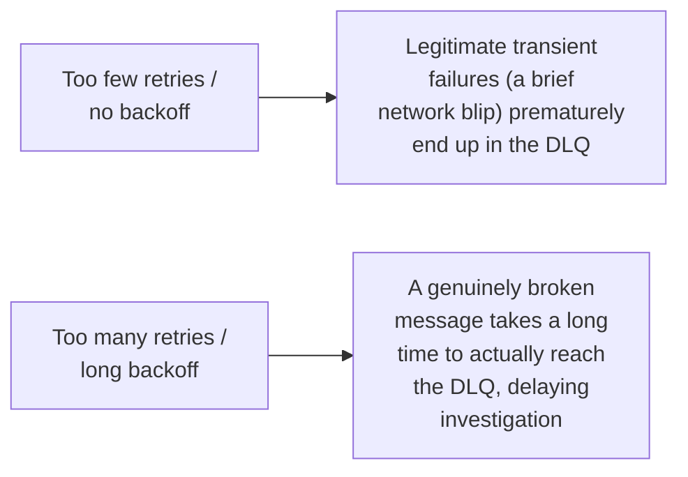

# Dead Letter Queues — Middle

<!-- level-focus -->
At middle level, focus on this question:

> How do you actually configure retry-count-based DLQ routing?

Prerequisite: [`junior.md`](junior.md).

---

## Redelivery count and routing

```python
# AWS SQS-style configuration
{
    "RedrivePolicy": {
        "deadLetterTargetArn": "arn:aws:sqs:...:my-dlq",
        "maxReceiveCount": 5
    }
}
```


Most managed queue services (SQS, and similar features in RabbitMQ,
Kafka's dead-letter topic pattern) let you declare `maxReceiveCount` (or
equivalent) and a target DLQ — the broker itself handles counting
delivery attempts and rerouting once the threshold is exceeded, with no
custom application code required for the mechanism itself.

## Choosing the retry count and backoff before DLQ



The retry count and backoff schedule **before** a message reaches the DLQ
should reflect the same transient-vs-permanent fault classification from
the Retry reliability pattern — enough retries with appropriate backoff to
let a genuinely transient failure (a brief downstream outage) succeed on
its own, but not so many that a genuinely broken message takes an
excessive time to reach the DLQ for investigation.

> 🎓 **Takeaway:** DLQ routing configuration (retry count + backoff) is the
> same fault-classification exercise as general retry policy design — you're
> tuning "how confident are we this failure is transient" against "how
> long can we delay quarantining a genuinely broken message."

## Test yourself

1. Why does a retry count that's too low risk sending legitimately
   transient failures to the DLQ unnecessarily?
2. Why does a retry count that's too high delay investigation of a
   genuinely broken message?
3. Design the retry count and backoff schedule for a message type where
   downstream failures are typically resolved within 2 minutes.

Continue to [`senior.md`](senior.md).
