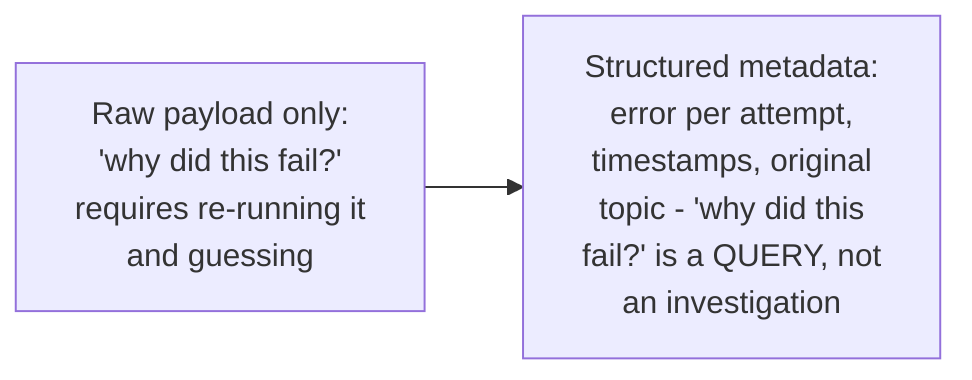
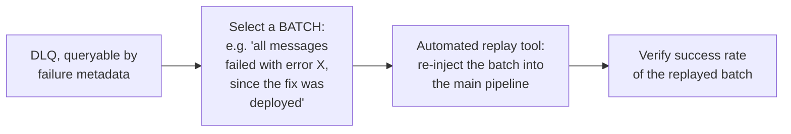

# Dead Letter Queues — Professional

<!-- level-focus -->
At professional level, focus on this question:

> What does structured failure metadata and automated replay tooling
> actually look like for a DLQ operated at real production scale, across
> many message types and failure modes?

Prerequisite: [`senior.md`](senior.md).

---

## Structured failure metadata: turning "why did this fail" into a query, not archaeology

A production-grade DLQ attaches structured context to every quarantined
message, not just the raw payload:

```json
{
  "original_topic": "orders.process",
  "original_payload": "...",
  "failure_count": 5,
  "failure_history": [
    {"attempt": 1, "error": "ConnectionTimeout", "timestamp": "..."},
    {"attempt": 5, "error": "ValidationError: missing field 'sku'", "timestamp": "..."}
  ],
  "first_failed_at": "2024-01-15T02:00:00Z",
  "last_failed_at": "2024-01-15T02:05:00Z"
}
```



This turns triage from "manually reproduce the failure to understand it"
into "query the DLQ for all messages with `error LIKE 'ValidationError%'`"
— letting an on-call engineer immediately see, for example, that 500 of
600 DLQ'd messages share the exact same root cause (a single upstream
schema change), rather than treating each one as an individual mystery.

## Automated replay tooling: batch, not manual, remediation



Once a root cause is fixed (a bug deploy, a schema correction), production
DLQ tooling should support **batch replay**: select messages by failure
signature/time range, re-inject them into the main processing pipeline
(often via the same CDC/event-replay mechanisms covered in the Event
Replay & Reprojection topic), and track the replayed batch's success rate
separately — manually re-publishing individual messages one at a time
does not scale past a handful of incidents, and is a common bottleneck
during incident recovery at real production DLQ volumes.

## Per-message-type DLQ segregation

At scale, a single organization-wide DLQ mixing every message type from
every service becomes hard to triage and alert on meaningfully — the
professional-level pattern is typically **one DLQ per topic/queue** (or
per logical message type), each with its **own** depth/age alerting
thresholds and ownership, rather than one monolithic DLQ where a spike
from one team's messages drowns out visibility into another team's
genuinely-concerning DLQ growth.

## Production checklist (staff-level)

1. **Attach structured failure metadata (error, attempt history,
   timestamps) to every DLQ'd message**, not just the raw payload — this
   is the difference between fast, query-driven triage and slow,
   per-message archaeology.
2. **Build or adopt automated batch-replay tooling** before you need it at
   scale — manual re-publishing does not scale past a handful of
   incidents and becomes the actual bottleneck during recovery.
3. **Segregate DLQs per message type/topic**, each with its own ownership
   and alerting thresholds (`senior.md`), rather than one shared,
   monolithic DLQ that dilutes signal across unrelated teams' failures.
4. **Track replayed-batch success rate as its own metric** after a fix
   deploy — a batch replay that still partially fails indicates the fix
   was incomplete, and this should be visible immediately, not discovered
   from a re-growing DLQ later.
5. **In a platform review for messaging infrastructure, require DLQ
   structured metadata, alerting thresholds, and replay tooling as
   standard, non-optional features** of any shared queue/task-processing
   platform — treat this with the same priority as the shared retry
   library from the Retry professional page.

## Cheat Sheet

```text
+------------------------------------------------------------------+
|            DEAD LETTER QUEUES — INTERNALS & SCALE                   |
+------------------------------------------------------------------+
| Structured failure metadata (error per attempt, timestamps, origin    |
| topic) attached to every DLQ'd message -> "why did this fail" becomes |
| a QUERY across the DLQ, not per-message archaeology                   |
+------------------------------------------------------------------+
| Automated BATCH replay tooling: select by failure signature/time      |
| range, re-inject into the main pipeline, track replayed-batch          |
| success rate separately - manual re-publishing doesn't scale past a   |
| handful of incidents                                                  |
+------------------------------------------------------------------+
| SEGREGATE DLQs per message type/topic, each with its own ownership    |
| and alerting thresholds - a shared monolithic DLQ dilutes signal       |
| across unrelated teams' failures                                      |
+------------------------------------------------------------------+
```

## Test yourself

1. Why does structured failure metadata turn DLQ triage into "a query"
   rather than "an investigation"?
2. Why does manual, one-at-a-time message replay become the actual
   bottleneck during a real large-scale incident recovery?
3. Design the structured metadata schema and a batch-replay query for a
   DLQ containing messages that failed due to three different distinct
   root causes over the past week.

## Further Reading

- AWS documentation — "Amazon SQS dead-letter queues" (RedrivePolicy,
  maxReceiveCount, and the SQS DLQ redrive/replay feature).
- See also: [Event-Driven Background Jobs — professional](../../../distributed-system/17-background-jobs/01-event-driven/professional.md),
  [Event Replay and Reprojection](../../events/03-event-replay-and-reprojection/README.md).
