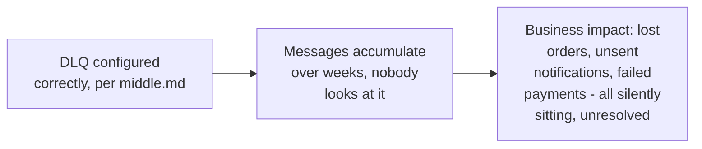
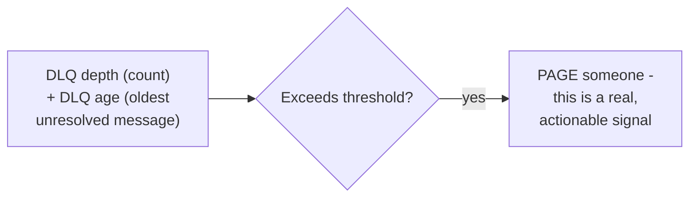

# Dead Letter Queues — Senior

<!-- level-focus -->
At senior level, focus on this question:

> Why is an unmonitored, ever-growing DLQ itself a production risk, not
> just a safe holding pen?

Prerequisite: [`middle.md`](middle.md).

---

## The silent-graveyard failure mode

A DLQ correctly configured (per `middle.md`) but **never monitored** just
becomes a quiet place where real business failures accumulate invisibly —
"the message was quarantined instead of blocking the queue" (a real
technical success) can mask "nobody knows a customer's order silently
failed to process" (a real business failure), if nothing surfaces the
DLQ's growth to a human.

## DLQ depth and age as first-class alerting metrics

Treat DLQ depth and the age of the oldest unresolved message as
**first-class SLI/alerting metrics** — a growing DLQ (arrival rate
exceeding resolution rate) or an aging DLQ (messages sitting unresolved
for an extended period) are both leading indicators of either an ongoing
production problem or a broken operational process (nobody owns
triaging the DLQ), and both deserve the same monitoring rigor as any
other production health signal, not an afterthought checked only during
an unrelated investigation.

## A DLQ needs an owner and a runbook, not just a queue name

> 🎯 **Senior takeaway:** the technical mechanism (route failing messages
> to a separate queue) is the easy part; the **operational** half — who
> is paged when it grows, what runbook they follow to diagnose and
> replay/discard messages, and what SLA exists for resolving DLQ'd
> messages — is what actually makes a DLQ a safety net instead of a slow-
> motion, invisible data-loss incident. A DLQ without an explicit owner
> and process is, in practice, silent data loss with extra steps.

## Test yourself

1. Why can a "correctly configured" DLQ (per `middle.md`) still represent
   a real, unnoticed production failure?
2. What two metrics would you alert on for DLQ health, and why does age
   matter in addition to depth?
3. Design the on-call runbook outline for "the DLQ depth alert fired" —
   what should the responding engineer check and do first?

Continue to [`professional.md`](professional.md) to design structured
metadata and automated replay tooling for production DLQs at scale.
