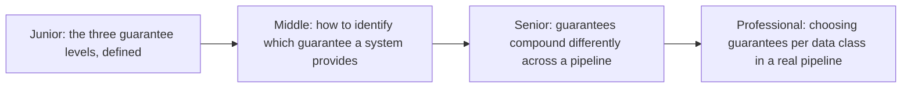
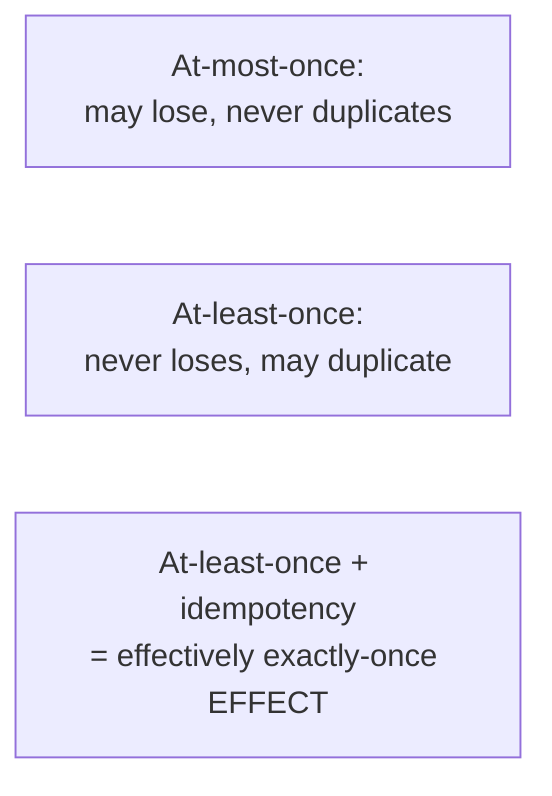

# Delivery Guarantees

> Every messaging system makes a specific promise about what happens to a
> message under failure: at-most-once, at-least-once, or the effectively-
> exactly-once combination covered in depth elsewhere in this tree. This
> page is the survey — knowing which guarantee a given system actually
> provides, and how to verify it.

## Choose a level

| Level | Guide | You are done when |
|---|---|---|
| Junior | [The three guarantee levels](junior.md) | You can define at-most-once, at-least-once, and exactly-once-effect precisely. |
| Middle | [Identifying a system's actual guarantee](middle.md) | You can determine, from a system's documentation, which guarantee it actually provides. |
| Senior | [Compounding across a pipeline](senior.md) | You can explain why a pipeline's overall guarantee is only as strong as its weakest stage. |
| Professional | [Choosing guarantees per data class](professional.md) | You can design a mixed-guarantee pipeline where different data types get different treatment deliberately. |

## Practice rule

Before trusting any system's "delivery guarantee" claim, ask: "what
specifically happens if the consumer crashes right after processing but
before acknowledging?" The answer to that one question reveals the real
guarantee, regardless of the marketing language used.

## Related

- [Exactly-Once Semantics](../../../distributed-system/coordination/03-exactly-once-semantics/README.md)
- [Message Queues — senior](../01-message-queues/senior.md)
