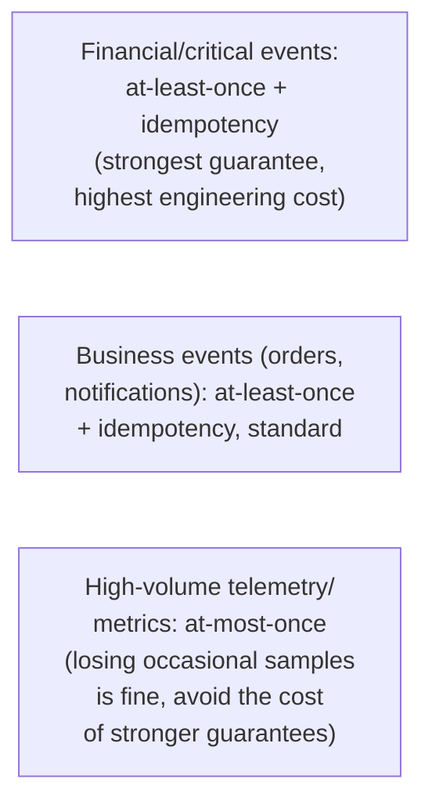
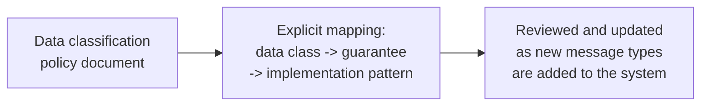

# Delivery Guarantees — Professional

<!-- level-focus -->
At professional level, focus on this question:

> How do you deliberately design a mixed-guarantee pipeline, where
> different data classes get different, explicitly-chosen delivery
> guarantees rather than a single blanket policy?

Prerequisite: [`senior.md`](senior.md).

---

## Not every message deserves the same guarantee

Applying at-least-once (with all its idempotency-handling overhead, per
[Exactly-Once Semantics](../../../distributed-system/18-concurrency-coordination/03-exactly-once-semantics/README.md))
uniformly to **every** message type in a system — including high-volume,
individually-low-value telemetry — is often an over-engineered, costly
default. A professional-level pipeline design deliberately classifies
data and assigns guarantees per class:



| Data class | Recommended guarantee | Justification |
|---|---|---|
| Financial transactions, orders | At-least-once + strict idempotency | Loss or duplication has direct business/legal consequences |
| User notifications | At-least-once + idempotency (dedup on notification ID) | Losing a notification is bad UX; duplicating one is annoying but tolerable if deduped |
| High-volume metrics/telemetry | At-most-once acceptable | Individual sample loss is statistically insignificant at volume; the cost of stronger guarantees isn't justified |
| Debug/trace logs | At-most-once, often explicitly "best effort" | Losing occasional debug data has essentially zero business cost |

## Explicit, documented guarantee choice as an architectural artifact



The professional-level practice: maintain an explicit, documented mapping
from data class to required guarantee to implementation pattern (which
queue configuration, whether idempotency keys are required, what DLQ
policy applies) — new message types added to the system should be
**classified** against this policy before implementation, rather than
inheriting whatever default configuration the team happens to reach for,
which is exactly how `senior.md`'s "one weak, unaudited hop" scenario
accumulates over time across a growing system.

## Production checklist (staff-level)

1. **Classify every message/event type by business criticality** before
   choosing its delivery guarantee and implementation pattern — avoid a
   single blanket policy applied uniformly regardless of actual cost of
   loss/duplication.
2. **Reserve the full at-least-once + idempotency engineering cost for
   data where loss or duplication has real business consequences** — don't
   pay this cost uniformly for high-volume, individually-low-value
   telemetry where at-most-once is genuinely acceptable.
3. **Maintain an explicit, documented data-classification-to-guarantee
   mapping** as a living architectural artifact, reviewed whenever new
   message types are introduced — this directly prevents the accumulation
   of unaudited weak hops from `senior.md`.
4. **Periodically re-audit the mapping against actual implementation**,
   not just at design time — configuration drift (someone changes a queue
   setting without updating the documented guarantee) is a real,
   recurring risk.
5. **In an architecture review for a new message type, require an
   explicit answer for "which data class is this, and what guarantee does
   that require"** before approving the implementation — this is the
   practical enforcement mechanism for the whole classification policy.

## Cheat Sheet

```text
+------------------------------------------------------------------+
|             DELIVERY GUARANTEES — INTERNALS & SCALE                 |
+------------------------------------------------------------------+
| Not every message needs the same guarantee - classify by business     |
| criticality, don't apply a blanket at-least-once+idempotency policy    |
| uniformly (real, often unnecessary engineering cost)                   |
+------------------------------------------------------------------+
| Financial/critical events   -> at-least-once + strict idempotency     |
| Business events (orders)     -> at-least-once + idempotency            |
| High-volume telemetry         -> at-most-once often acceptable         |
| Debug/trace logs               -> at-most-once, "best effort"          |
+------------------------------------------------------------------+
| Maintain an EXPLICIT, DOCUMENTED data-class -> guarantee -> pattern    |
| mapping as a living artifact - review it for every new message type   |
| to prevent senior.md's "one weak, unaudited hop" from accumulating    |
+------------------------------------------------------------------+
```

## Test yourself

1. Why is applying at-least-once + strict idempotency uniformly to every
   message type, including high-volume telemetry, often an
   over-engineered, unnecessarily costly default?
2. Design the data-classification policy document outline for a new
   e-commerce platform's event types.
3. Why does periodic re-auditing of the guarantee mapping against actual
   implementation matter, beyond just having the policy documented once?

## Further Reading

- Confluent documentation — "Kafka Consumer Configurations"
  (`enable.auto.commit` and its guarantee implications).
- See also: [Exactly-Once Semantics — professional](../../../distributed-system/18-concurrency-coordination/03-exactly-once-semantics/professional.md),
  [Retries & Idempotency — professional](../../../distributed-system/17-background-jobs/04-retries-and-idempotency/professional.md).
