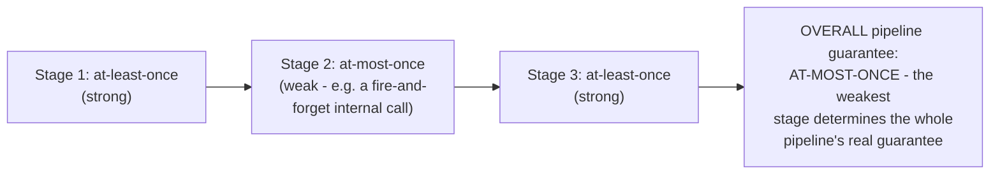
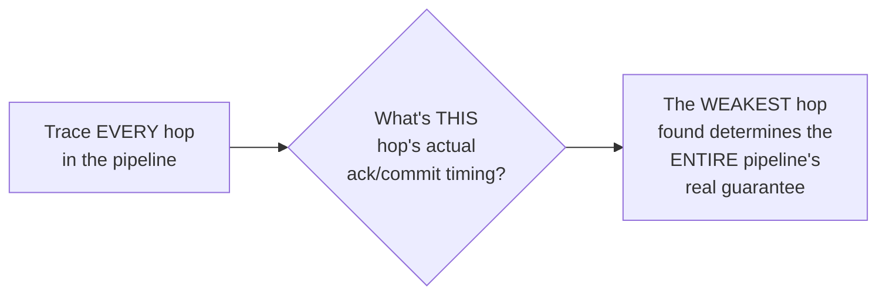

# Delivery Guarantees — Senior

<!-- level-focus -->
At senior level, focus on this question:

> Why is a multi-stage pipeline's overall delivery guarantee only as
> strong as its weakest individual stage?

Prerequisite: [`middle.md`](middle.md).

---

## Guarantees don't average — they compound to the weakest link

If a pipeline has 3 stages, and Stage 2 (in the middle) uses a
fire-and-forget internal call with no acknowledgment, the **entire
pipeline's** effective guarantee degrades to at-most-once — even though
Stages 1 and 3 individually provide at-least-once. This is analogous to a
chain being only as strong as its weakest link: strong guarantees on both
sides of one weak stage don't average out to something in between; the
weak stage's possible loss propagates to become the whole pipeline's
possible loss.

## Auditing an existing pipeline for its true end-to-end guarantee

A senior-level audit of "what's our actual delivery guarantee for this
business-critical pipeline" requires tracing **every single hop** — every
queue, every internal service call, every database write — and applying
`middle.md`'s diagnostic question at each one. It's common to discover
that a pipeline assumed to be "at-least-once end to end" actually has one
weak internal hop (a synchronous, un-retried internal call between two
services, or a fire-and-forget metrics/logging call incorrectly placed in
the critical path) silently downgrading the whole thing.

> 🎯 **Senior takeaway:** delivery guarantees compound like a chain, not
> an average — the pipeline's real, end-to-end guarantee is exactly the
> guarantee of its weakest individual hop. This makes a full, hop-by-hop
> audit (not a single "we use Kafka, so we're at-least-once" assumption)
> the only reliable way to know your actual guarantee for a business-
> critical, multi-stage pipeline.

## Test yourself

1. Why don't delivery guarantees "average out" across a pipeline's
   stages — why does the weakest single stage determine the whole
   pipeline's effective guarantee?
2. Design an audit checklist you'd use to trace a 5-stage pipeline's
   actual end-to-end delivery guarantee.
3. Give an example of a hop that's easy to overlook during such an audit
   (a place where a weak guarantee might sneak into an otherwise strong
   pipeline).

Continue to [`professional.md`](professional.md) to design a pipeline
with deliberately different guarantees per data class.
